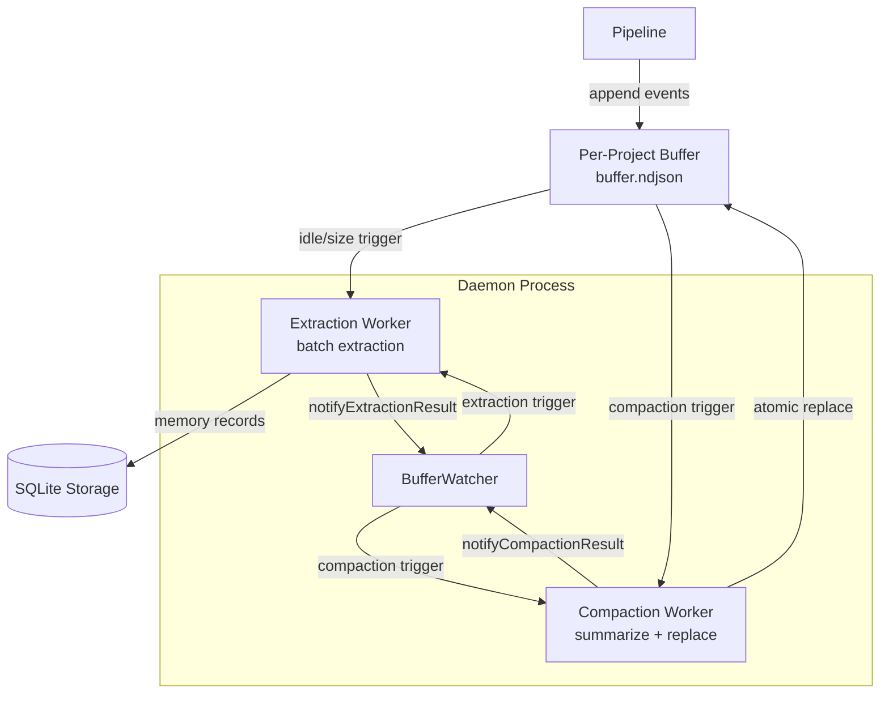
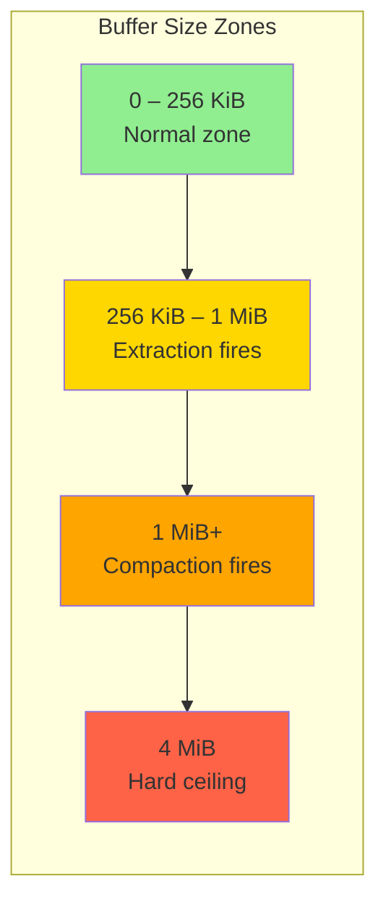
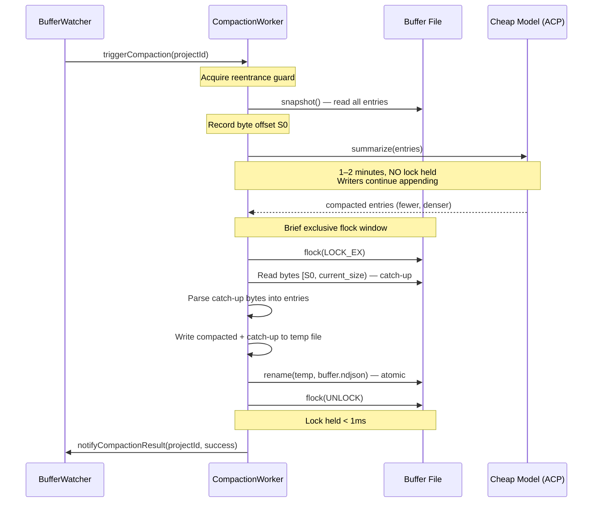
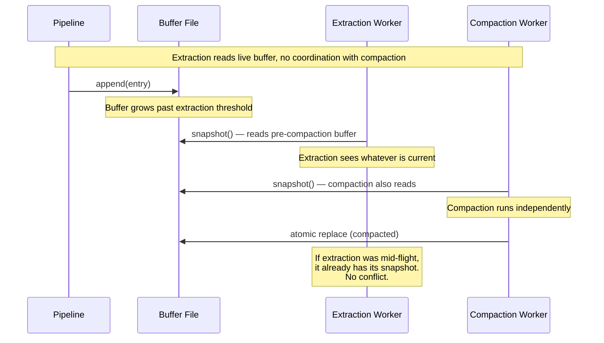

# Design Document: Buffer Compaction Worker

## Overview

The buffer compaction worker adds a background process that summarizes oversized per-project NDJSON buffer files, reducing their size while preserving semantic content. This was explicitly deferred from the workspace-buffer-pipeline spec (Decision 6, 7, 8 in the original design summary) and is now being implemented as a standalone feature.

The compaction worker is triggered when a buffer crosses a compaction size threshold (separate from and larger than the extraction threshold — e.g., 1 MiB vs 256 KiB). It reads a snapshot of the buffer, sends the observations to a cheap/fast model for summarization, and atomically replaces the buffer contents with fewer, denser summary entries. The key concurrency insight is that compaction holds no lock during the model call (which takes 1–2 minutes). It records the byte offset at snapshot time (S0), runs the model without any lock, then acquires an exclusive flock only for the brief catch-up-and-rename step — replaying bytes appended since S0 and atomically swapping the file.

Compaction is serial across projects (one global worker, reentrance guard per workspace), off by default for non-local model configurations, and falls back to deterministic eviction if model-based compaction fails repeatedly.

## Architecture

### System Context



### Compaction vs Extraction Thresholds



### Compaction Sequence (Lock-Free Model Call)



### Interaction with Extraction



## Components and Interfaces

### Component 1: CompactionWorker (New)

**Purpose**: Background worker that summarizes oversized buffers via a cheap model call, atomically replacing buffer contents with fewer, denser entries. Serial across projects with per-project reentrance guard.

**Location**: `src/collector/buffer/compaction.ts`

**Interface**:
```typescript
interface CompactionWorker {
  /**
   * Run compaction for a project buffer.
   * Reads snapshot, calls model for summarization, atomically replaces buffer.
   * Returns result with metrics. Acquires reentrance guard — concurrent
   * calls for the same project are rejected immediately.
   */
  compact(projectId: string): Promise<CompactionResult>;

  /** Wait for any in-flight compaction to complete (with timeout). */
  drain(timeoutMs: number): Promise<void>;

  /** Whether a compaction is currently in-flight (any project). */
  readonly active: boolean;
}

interface CompactionResult {
  projectId: string;
  /** Number of entries in the original buffer snapshot. */
  entriesBefore: number;
  /** Number of entries after compaction (compacted + catch-up). */
  entriesAfter: number;
  /** Bytes saved by compaction. */
  bytesSaved: number;
  /** Duration of the model call in milliseconds. */
  modelDurationMs: number;
  /** Duration of the catch-up-and-rename step in milliseconds. */
  replaceDurationMs: number;
  /** Whether deterministic eviction was used instead of model compaction. */
  usedFallback: boolean;
}

interface CompactionWorkerConfig {
  /** Per-compaction timeout for the model call in milliseconds. Default 120_000 (2 min). */
  modelTimeoutMs: number;
  /** Maximum retry attempts for model-based compaction before falling back. Default 2. */
  maxModelRetries: number;
  /** Consecutive model failures before switching to deterministic eviction. Default 3. */
  maxConsecutiveModelFailures: number;
  /** Whether compaction is enabled. Default false (off for non-local models). */
  enabled: boolean;
}
```

**Responsibilities**:
- Read buffer snapshot and record byte offset S0
- Send entries to a cheap/fast model via ACP for summarization
- Acquire exclusive flock, read catch-up bytes [S0, current_size), write compacted + catch-up to temp file, atomic rename
- Serial execution: one global compaction at a time, reentrance guard per project
- Deterministic eviction fallback when model fails repeatedly
- Report results to BufferWatcher via `notifyCompactionResult`

### Component 2: BufferStore (Modified — `replace` method added)

**Purpose**: The existing `BufferStore` gains a `replace()` method that atomically replaces buffer contents with exclusive flock + catch-up replay.

**Location**: `src/collector/buffer/store.ts` (existing file, new method)

**New method on existing interface**:
```typescript
interface BufferStore {
  // ... existing methods unchanged ...

  /**
   * Atomically replace buffer contents.
   *
   * 1. Acquire exclusive flock on the buffer file
   * 2. Read any bytes appended since `sinceOffset` (catch-up window)
   * 3. Parse catch-up bytes into BufferEntry objects
   * 4. Write `newEntries` + catch-up entries to a temp file
   * 5. Rename temp file to buffer file (atomic on POSIX)
   * 6. Release exclusive flock
   *
   * Returns the catch-up entries that were replayed.
   */
  replace(
    projectId: string,
    newEntries: readonly BufferEntry[],
    sinceOffset: number,
  ): Promise<ReplaceResult>;

  /**
   * Read the current byte size of the buffer file synchronously.
   * Used by CompactionWorker to record S0 at snapshot time.
   * Returns 0 if file does not exist.
   */
  sizeSync(projectId: string): number;
}

interface ReplaceResult {
  /** Entries from the catch-up window that were replayed. */
  catchUpEntries: BufferEntry[];
  /** Total bytes of the new buffer file. */
  newSizeBytes: number;
}
```

### Component 3: BufferWatcher (Modified — compaction threshold + handler)

**Purpose**: The existing `BufferWatcher` gains compaction threshold tracking and an `onCompaction` handler registration.

**Location**: `src/collector/buffer/watcher.ts` (existing file, extended)

**New fields/methods on existing interface**:
```typescript
interface BufferWatcherConfig {
  // ... existing fields unchanged ...

  /** Buffer byte-size threshold for compaction trigger. Default 1_048_576 (1 MiB). */
  compactionSizeThreshold: number;
}

interface BufferWatcher {
  // ... existing methods unchanged ...

  /** Register a listener for compaction triggers. */
  onCompaction(handler: (projectId: string) => void): void;

  /**
   * Report the result of a compaction attempt.
   * On success: updates byte counter to reflect compacted size.
   * On failure: increments compaction failure counter.
   */
  notifyCompactionResult(projectId: string, success: boolean, newSizeBytes?: number): void;
}
```

### Component 4: CollectorConfig (Modified — compaction config fields)

**Purpose**: The existing `CollectorConfig` gains compaction-related configuration fields.

**Location**: `src/collector/index.ts` (existing file, extended)

**New fields**:
```typescript
interface CollectorConfig {
  // ... existing fields unchanged ...

  /** Whether buffer compaction is enabled. Default false. */
  compactionEnabled?: boolean;
  /** Buffer byte-size threshold for compaction trigger. Default 1_048_576 (1 MiB). */
  compactionSizeThreshold?: number;
  /** Per-compaction model call timeout (ms). Default 120_000. */
  compactionModelTimeoutMs?: number;
  /** Max model retries per compaction attempt. Default 2. */
  compactionMaxModelRetries?: number;
  /** Consecutive model failures before deterministic eviction fallback. Default 3. */
  compactionMaxConsecutiveModelFailures?: number;
}
```

## Data Models

### Model 1: CompactedBufferEntry

Compacted entries reuse the existing `BufferEntry` interface. The model produces summary entries that look like regular buffer entries but with:
- A synthetic `event_id` (new ULID, prefixed with `compact_` for traceability)
- `kind` set to `'session_summary'` (the closest semantic match for a compacted summary)
- `body` of type `text` containing the summarized content
- `timestamp` set to the latest timestamp from the compacted entries
- `surface` preserved from the original entries
- `namespace` preserved from the original entries

No new type is needed — compacted entries are valid `BufferEntry` objects that flow through the existing extraction pipeline unchanged.

### Model 2: CompactionWorkerState (In-Memory)

```typescript
interface CompactionWorkerState {
  /** Whether a compaction is currently in-flight (any project). */
  inFlight: boolean;
  /** Project ID of the current compaction, if any. */
  currentProjectId: string | null;
  /** Per-project consecutive model failure counter. */
  modelFailures: Map<string, number>;
}
```

### Model 3: ProjectBufferState (Extended)

The existing `ProjectBufferState` in the watcher gains compaction-related fields:

```typescript
interface ProjectBufferState {
  // ... existing fields unchanged ...

  /** Whether compaction is currently in-flight for this project. */
  compactionInFlight: boolean;
  /** Consecutive compaction model failures. Reset on success. */
  compactionModelFailures: number;
}
```

## Algorithmic Pseudocode

### Main Compaction Algorithm


```typescript
async function compact(projectId: string): Promise<CompactionResult> {
  // Precondition: compaction is not already in-flight for any project
  // Precondition: projectId is a valid, safe filesystem token
  // Postcondition: buffer file contains compacted entries + catch-up entries
  // Postcondition: no entries are lost (catch-up window replayed)

  // 1. Acquire reentrance guard
  if (state.inFlight) {
    throw new Error('compaction already in-flight');
  }
  state.inFlight = true;
  state.currentProjectId = projectId;

  try {
    // 2. Read snapshot and record byte offset S0
    const entries = await bufferStore.snapshot(projectId);
    const s0 = bufferStore.sizeSync(projectId);

    if (entries.length === 0) {
      return { projectId, entriesBefore: 0, entriesAfter: 0,
               bytesSaved: 0, modelDurationMs: 0, replaceDurationMs: 0,
               usedFallback: false };
    }

    // 3. Attempt model-based compaction
    let compactedEntries: BufferEntry[];
    let usedFallback = false;
    const modelStart = Date.now();

    const failures = state.modelFailures.get(projectId) ?? 0;
    if (failures >= config.maxConsecutiveModelFailures) {
      // Circuit breaker tripped — use deterministic eviction
      compactedEntries = deterministicEviction(entries);
      usedFallback = true;
    } else {
      try {
        compactedEntries = await modelCompaction(entries, config);
      } catch {
        // Model failed — try deterministic eviction
        state.modelFailures.set(projectId, failures + 1);
        compactedEntries = deterministicEviction(entries);
        usedFallback = true;
      }
    }
    const modelDurationMs = Date.now() - modelStart;

    // 4. Atomic replace with catch-up
    const replaceStart = Date.now();
    const result = await bufferStore.replace(
      projectId, compactedEntries, s0
    );
    const replaceDurationMs = Date.now() - replaceStart;

    // 5. Reset model failure counter on success (if model was used)
    if (!usedFallback) {
      state.modelFailures.set(projectId, 0);
    }

    const entriesAfter = compactedEntries.length + result.catchUpEntries.length;
    const bytesSaved = s0 - result.newSizeBytes;

    return {
      projectId,
      entriesBefore: entries.length,
      entriesAfter,
      bytesSaved: Math.max(0, bytesSaved),
      modelDurationMs,
      replaceDurationMs,
      usedFallback,
    };
  } finally {
    state.inFlight = false;
    state.currentProjectId = null;
  }
}
```

### Model-Based Compaction Algorithm

```typescript
/**
 * Send buffer entries to a cheap/fast model for summarization.
 *
 * Precondition: entries is non-empty
 * Postcondition: returned entries are fewer than input entries
 * Postcondition: returned entries are valid BufferEntry objects
 * Postcondition: namespace is preserved from original entries
 *
 * The model receives the entries framed as XML (reusing frameBatch)
 * with a compaction-specific system prompt that instructs it to produce
 * fewer, denser summary entries.
 */
async function modelCompaction(
  entries: readonly BufferEntry[],
  config: CompactionWorkerConfig,
): Promise<BufferEntry[]> {
  const namespace = entries[0]!.namespace;
  const surface = entries[0]!.surface;
  const latestTimestamp = entries.reduce(
    (latest, e) => (e.timestamp > latest ? e.timestamp : latest),
    entries[0]!.timestamp,
  );

  // Frame entries as XML for the compaction prompt
  const xmlPayload = frameBatch(entries as BufferEntry[]);
  const prompt = buildCompactionPrompt(xmlPayload);

  // Retry loop
  for (let attempt = 0; attempt < config.maxModelRetries; attempt++) {
    let session: AcpSession | null = null;
    try {
      session = await createAcpSession({
        agentName: 'kiro-learn-compactor',
        timeoutMs: config.modelTimeoutMs,
      });

      const responseText = await session.sendPrompt(prompt);

      // Parse response — expect <compacted_entry> blocks
      const compacted = parseCompactionResponse(responseText);

      if (compacted.length === 0) {
        throw new Error('model returned no compacted entries');
      }

      // Convert parsed summaries to BufferEntry objects
      return compacted.map((summary, i) => ({
        event_id: `compact_${ulid()}`,
        namespace,
        kind: 'session_summary' as const,
        body: { type: 'text' as const, content: summary },
        timestamp: latestTimestamp,
        surface,
      }));
    } catch (error) {
      if (attempt === config.maxModelRetries - 1) throw error;
    } finally {
      session?.destroy();
    }
  }

  throw new Error('model compaction failed after all retries');
}
```

### Deterministic Eviction Fallback Algorithm

```typescript
/**
 * Deterministic eviction: keep the N most recent entries by timestamp,
 * dropping the oldest. No model call needed.
 *
 * Precondition: entries is non-empty
 * Postcondition: returned entries.length <= ceil(entries.length / 2)
 * Postcondition: returned entries are the most recent by timestamp
 * Postcondition: entry ordering is stable (preserves relative order)
 *
 * Loop invariant: at each step, sorted[0..i] contains the i+1 oldest
 * entries in timestamp order.
 */
function deterministicEviction(entries: readonly BufferEntry[]): BufferEntry[] {
  // Keep the most recent half (rounded up)
  const keepCount = Math.ceil(entries.length / 2);

  // Sort by timestamp descending, take the top keepCount
  const sorted = [...entries].sort((a, b) =>
    b.timestamp.localeCompare(a.timestamp)
  );

  return sorted.slice(0, keepCount);
}
```

### Atomic Replace Algorithm (BufferStore.replace)

```typescript
/**
 * Atomically replace buffer contents with catch-up replay.
 *
 * Precondition: sinceOffset >= 0
 * Precondition: newEntries are valid BufferEntry objects
 * Postcondition: buffer file contains exactly newEntries + catch-up entries
 * Postcondition: no entries appended after sinceOffset are lost
 * Postcondition: operation is atomic (rename is atomic on POSIX)
 *
 * Lock contention window: sub-millisecond (only held for read + write + rename)
 */
async function replace(
  projectId: string,
  newEntries: readonly BufferEntry[],
  sinceOffset: number,
): Promise<ReplaceResult> {
  const filePath = bufferPath(projectId);
  const dir = path.dirname(filePath);
  const tempPath = path.join(dir, `buffer.ndjson.${Date.now()}.tmp`);

  // Open the buffer file for exclusive lock
  const fd = fs.openSync(filePath, 'r');

  try {
    // 1. Acquire exclusive flock
    flockSync(fd, 'ex');

    try {
      // 2. Read catch-up bytes [sinceOffset, current_size)
      const stat = fs.fstatSync(fd);
      const catchUpBytes = stat.size - sinceOffset;
      const catchUpEntries: BufferEntry[] = [];

      if (catchUpBytes > 0) {
        const catchUpBuffer = Buffer.alloc(catchUpBytes);
        fs.readSync(fd, catchUpBuffer, 0, catchUpBytes, sinceOffset);
        const catchUpText = catchUpBuffer.toString('utf-8');

        // Parse catch-up lines
        for (const line of catchUpText.split('\n')) {
          const trimmed = line.trim();
          if (trimmed.length === 0) continue;
          try {
            catchUpEntries.push(JSON.parse(trimmed) as BufferEntry);
          } catch {
            // Skip corrupt catch-up lines (same as snapshot)
          }
        }
      }

      // 3. Write compacted + catch-up to temp file
      let totalBytes = 0;
      const lines: string[] = [];
      for (const entry of newEntries) {
        const line = JSON.stringify(entry) + '\n';
        lines.push(line);
        totalBytes += Buffer.byteLength(line, 'utf-8');
      }
      for (const entry of catchUpEntries) {
        const line = JSON.stringify(entry) + '\n';
        lines.push(line);
        totalBytes += Buffer.byteLength(line, 'utf-8');
      }

      fs.writeFileSync(tempPath, lines.join(''), 'utf-8');

      // 4. Atomic rename
      fs.renameSync(tempPath, filePath);

      return { catchUpEntries, newSizeBytes: totalBytes };
    } finally {
      // 5. Release exclusive flock
      flockSync(fd, 'un');
    }
  } finally {
    fs.closeSync(fd);
    // Clean up temp file if rename failed
    try { fs.unlinkSync(tempPath); } catch { /* already renamed or doesn't exist */ }
  }
}
```

## Key Functions with Formal Specifications

### Function 1: `CompactionWorker.compact(projectId)`

```typescript
function compact(projectId: string): Promise<CompactionResult>
```

**Preconditions:**
- `projectId` is a non-empty string that passes `bufferPath()` validation
- No compaction is currently in-flight (reentrance guard)
- Buffer file exists and has entries

**Postconditions:**
- Buffer file contains compacted entries + any entries appended during the model call
- No entries are lost — catch-up window [S0, current_size) is replayed
- `CompactionResult.entriesAfter <= CompactionResult.entriesBefore + catch-up count`
- If model compaction succeeds: `CompactionResult.usedFallback === false`
- If model fails and fallback used: `CompactionResult.usedFallback === true`
- Reentrance guard is released (even on error)

**Loop Invariants:** N/A (no loops in the top-level function)

### Function 2: `BufferStore.replace(projectId, newEntries, sinceOffset)`

```typescript
function replace(
  projectId: string,
  newEntries: readonly BufferEntry[],
  sinceOffset: number,
): Promise<ReplaceResult>
```

**Preconditions:**
- `projectId` passes `bufferPath()` validation
- `sinceOffset >= 0` and `sinceOffset <= current file size`
- `newEntries` are valid `BufferEntry` objects
- Buffer file exists at `bufferPath(projectId)`

**Postconditions:**
- Buffer file contains exactly `newEntries.length + catchUpEntries.length` entries
- All entries appended after `sinceOffset` are preserved in `catchUpEntries`
- The replace is atomic (POSIX rename guarantees)
- Exclusive flock is released (even on error)
- Temp file is cleaned up (even on error)
- `result.newSizeBytes` equals the byte size of the new buffer file

**Loop Invariants:**
- For catch-up parsing: all previously parsed lines are valid `BufferEntry` objects
- For temp file writing: all previously written lines are valid NDJSON

### Function 3: `deterministicEviction(entries)`

```typescript
function deterministicEviction(entries: readonly BufferEntry[]): BufferEntry[]
```

**Preconditions:**
- `entries` is non-empty
- Each entry has a valid ISO 8601 `timestamp`

**Postconditions:**
- `result.length === Math.ceil(entries.length / 2)`
- `result` contains the `keepCount` entries with the most recent timestamps
- No entries are duplicated or fabricated
- Original entries are not mutated

**Loop Invariants:** N/A (uses sort + slice, no explicit loop)

### Function 4: `modelCompaction(entries, config)`

```typescript
function modelCompaction(
  entries: readonly BufferEntry[],
  config: CompactionWorkerConfig,
): Promise<BufferEntry[]>
```

**Preconditions:**
- `entries` is non-empty
- `config.modelTimeoutMs > 0`
- `config.maxModelRetries > 0`
- ACP agent `kiro-learn-compactor` is available

**Postconditions:**
- Returns non-empty array of `BufferEntry` objects
- Each returned entry has `kind === 'session_summary'`
- Each returned entry has `event_id` prefixed with `compact_`
- `namespace` and `surface` are preserved from input entries
- `timestamp` is the latest timestamp from input entries
- On failure after all retries: throws (caller falls back to deterministic eviction)

**Loop Invariants:**
- For retry loop: `attempt < config.maxModelRetries`
- Each attempt creates and destroys its own ACP session (no leaked sessions)

### Function 5: `parseCompactionResponse(responseText)`

```typescript
function parseCompactionResponse(responseText: string): string[]
```

**Preconditions:**
- `responseText` is a string (may be empty)

**Postconditions:**
- Returns array of summary strings extracted from `<compacted_entry>` XML blocks
- Empty/whitespace-only input returns empty array
- XML entities are unescaped in returned strings
- Entries with empty content after trimming are skipped

**Loop Invariants:**
- For regex match loop: all previously extracted entries are non-empty trimmed strings

## Example Usage

```typescript
// Example 1: Creating and wiring the compaction worker
import { createCompactionWorker } from './buffer/compaction.js';
import type { CompactionWorkerConfig } from './buffer/compaction.js';

const compactionWorker = createCompactionWorker({
  bufferStore,
  watcher: bufferWatcher,
  config: {
    modelTimeoutMs: 120_000,
    maxModelRetries: 2,
    maxConsecutiveModelFailures: 3,
    enabled: true,
  },
});

// Wire watcher compaction trigger to worker
bufferWatcher.onCompaction((projectId) => {
  compactionWorker.compact(projectId).catch((err: unknown) => {
    const message = err instanceof Error ? err.message : String(err);
    process.stderr.write(
      `[kiro-learn] compaction error for project ${projectId}: ${message}\n`,
    );
  });
});

// Example 2: Manual compaction (for testing/debugging)
const result = await compactionWorker.compact('a1b2c3d4...');
console.log(`Compacted ${result.entriesBefore} → ${result.entriesAfter} entries`);
console.log(`Saved ${result.bytesSaved} bytes`);
console.log(`Model took ${result.modelDurationMs}ms`);
console.log(`Replace took ${result.replaceDurationMs}ms`);
console.log(`Used fallback: ${result.usedFallback}`);

// Example 3: BufferStore.replace with catch-up
const entries = await bufferStore.snapshot(projectId);
const s0 = bufferStore.sizeSync(projectId);

// ... model call happens here, writers continue appending ...

const compacted = await modelCompaction(entries, config);
const replaceResult = await bufferStore.replace(projectId, compacted, s0);
console.log(`Caught up ${replaceResult.catchUpEntries.length} entries`);
console.log(`New buffer size: ${replaceResult.newSizeBytes} bytes`);

// Example 4: Deterministic eviction fallback
const evicted = deterministicEviction(entries);
// evicted.length === Math.ceil(entries.length / 2)
// evicted contains the most recent entries by timestamp

// Example 5: Shutdown sequence
await compactionWorker.drain(5_000);
bufferWatcher.close();
```

## Correctness Properties

### Property 1: Catch-up completeness

*For any* compaction operation where writers append N entries during the model call (between snapshot at S0 and the exclusive lock acquisition), the resulting buffer file SHALL contain all N catch-up entries in addition to the compacted entries. No entries appended after S0 are lost.

**Validates: Requirements 1.1, 6.2, 6.4**

### Property 2: Replace atomicity

*For any* `BufferStore.replace()` call, the buffer file SHALL transition atomically from the old contents to the new contents. At no point SHALL a reader (via `snapshot()`) observe a partially-written buffer. This is guaranteed by writing to a temp file and using POSIX `rename()`.

**Validates: Requirements 6.1, 6.5**

### Property 3: Deterministic eviction correctness

*For any* non-empty array of `BufferEntry` objects, `deterministicEviction(entries)` SHALL return exactly `Math.ceil(entries.length / 2)` entries, all of which are the entries with the most recent timestamps from the input. No entries are fabricated or duplicated.

**Validates: Requirements 4.2, 4.3**

### Property 4: Reentrance guard serialization

*For any* sequence of `compact()` calls, at most one compaction SHALL be in-flight at any time. Concurrent calls SHALL be rejected immediately with an error. The reentrance guard SHALL be released even if the compaction fails.

**Validates: Requirements 2.1, 2.2**

### Property 5: Model failure circuit breaker

*For any* sequence of compaction attempts on the same project, after `maxConsecutiveModelFailures` consecutive model failures, subsequent compaction attempts SHALL use deterministic eviction instead of calling the model. A successful model compaction SHALL reset the failure counter to 0.

**Validates: Requirements 5.1, 5.2, 5.3**

### Property 6: Compaction threshold independence

*For any* buffer that crosses the compaction size threshold, the compaction trigger SHALL fire independently of the extraction trigger. Compaction and extraction operate on separate thresholds and do not block each other.

**Validates: Requirements 8.1, 8.2**

### Property 7: Byte offset tracking fidelity

*For any* compaction operation, the byte offset S0 recorded at snapshot time SHALL accurately represent the file position up to which the snapshot was read. The catch-up window [S0, current_size) SHALL contain exactly the bytes appended after the snapshot, with no overlap or gap.

**Validates: Requirements 1.1, 6.2**

### Property 8: Compacted entry validity

*For any* successful model compaction, every returned `BufferEntry` SHALL have a valid `event_id` (prefixed with `compact_`), the same `namespace` as the input entries, `kind` of `'session_summary'`, a `body` of type `'text'`, and a `timestamp` equal to the latest timestamp from the input entries.

**Validates: Requirements 3.4, 18.1, 18.2, 18.3, 18.4, 18.5, 18.6**

### Property 9: Replace temp file cleanup

*For any* `BufferStore.replace()` call, whether successful or failed, the temp file SHALL be cleaned up. No orphaned temp files SHALL remain on disk after the operation completes.

**Validates: Requirements 6.7, 14.2, 14.3**

### Property 10: Watcher byte counter consistency after compaction

*For any* successful compaction, the `BufferWatcher` SHALL update the project's `currentBytes` to reflect the new buffer size. The updated byte count SHALL equal `CompactionResult.entriesAfter` serialized size, ensuring subsequent threshold checks use accurate data.

**Validates: Requirement 9.1**

### Property 11: parseCompactionResponse round-trip

*For any* non-empty string that does not contain the substring `</compacted_entry>`, wrapping it in `<compacted_entry>...</compacted_entry>` XML and passing the result to `parseCompactionResponse` SHALL return an array containing that original string (after XML entity unescaping). For any concatenation of multiple such wrapped blocks, the parser SHALL return all of them in order.

**Validates: Requirements 10.1, 10.2**

## Error Handling

### Error Scenario 1: Model Call Failure

**Condition**: The ACP session for the compaction model fails (timeout, garbage response, connection error).
**Response**: CompactionWorker retries up to `maxModelRetries` times. If all retries fail, increments the per-project model failure counter and falls back to deterministic eviction for this attempt.
**Recovery**: The buffer is still compacted (via eviction fallback). After `maxConsecutiveModelFailures` consecutive failures, future compaction attempts skip the model entirely and use deterministic eviction directly. A successful model compaction resets the counter.

### Error Scenario 2: Exclusive Lock Acquisition Failure

**Condition**: `flock(LOCK_EX)` fails during the replace step (e.g., file deleted between snapshot and replace).
**Response**: CompactionWorker logs a warning to stderr. The buffer file is unchanged (no partial writes). Temp file is cleaned up.
**Recovery**: The buffer remains in its pre-compaction state. The next compaction trigger will retry. No data is lost.

### Error Scenario 3: Catch-Up Parsing Failure

**Condition**: Bytes in the catch-up window [S0, current_size) contain corrupt NDJSON lines (e.g., partial write from a crash during the model call).
**Response**: Corrupt lines in the catch-up window are skipped with a stderr warning, same as `snapshot()` behavior. Valid catch-up entries are preserved.
**Recovery**: At most one entry is lost (the partially-written one). All other catch-up entries are preserved. The compacted entries are unaffected.

### Error Scenario 4: Temp File Write Failure

**Condition**: Writing the temp file fails (disk full, permissions).
**Response**: CompactionWorker releases the exclusive lock, cleans up the temp file, and throws. The original buffer file is unchanged.
**Recovery**: The buffer remains in its pre-compaction state. The compaction can be retried when disk space is available.

### Error Scenario 5: Rename Failure

**Condition**: `fs.renameSync(tempPath, filePath)` fails (cross-device rename, permissions).
**Response**: CompactionWorker releases the exclusive lock, attempts to clean up the temp file, and throws. The original buffer file is unchanged.
**Recovery**: Same as Error Scenario 4. The atomic rename guarantee means the buffer is either fully replaced or fully unchanged.

### Error Scenario 6: Compaction During Extraction

**Condition**: Extraction is triggered while compaction is in-flight (or vice versa).
**Response**: Both proceed independently. Extraction reads whatever the current buffer is (pre-compaction snapshot). Compaction replaces the buffer atomically. There is no coordination or waiting.
**Recovery**: If extraction reads the pre-compaction buffer and succeeds, it clears the buffer. The compaction's replace will then operate on an empty or near-empty file (the catch-up window may contain entries appended after extraction cleared). This is safe — the compaction simply produces a smaller result. If compaction finishes first, extraction's next trigger will read the compacted buffer.

### Error Scenario 7: Daemon Restart During Compaction

**Condition**: Daemon dies while compaction model call is in-flight.
**Response**: The model call is lost. The buffer file is unchanged (no lock was held during the model call). Any temp file from a previous failed replace is orphaned.
**Recovery**: On restart, the watcher re-scans buffers and re-arms triggers. Compaction will re-trigger if the buffer still exceeds the threshold. Orphaned temp files (`buffer.ndjson.*.tmp`) should be cleaned up on startup.

## Testing Strategy

### Unit Testing Approach

- **CompactionWorker**: Test the full compact flow with mocked BufferStore and ACP session. Verify reentrance guard, model retry logic, deterministic eviction fallback, circuit breaker behavior, and result metrics.
- **BufferStore.replace**: Test atomic replace with catch-up entries. Verify exclusive lock semantics, catch-up parsing, temp file cleanup, and rename atomicity. Use temp directories for isolation.
- **deterministicEviction**: Test with various entry counts and timestamp distributions. Verify correct count, most-recent selection, and no mutation of input.
- **modelCompaction**: Test with mocked ACP session. Verify prompt construction, response parsing, entry construction, and retry logic. **CRITICAL: Mock the ACP session — unit tests must NEVER spawn real `kiro-cli` processes.**
- **parseCompactionResponse**: Test XML parsing of `<compacted_entry>` blocks. Verify entity unescaping, empty content handling, and malformed XML resilience.
- **BufferWatcher compaction integration**: Test compaction threshold trigger, `onCompaction` handler, `notifyCompactionResult` state updates, and interaction with existing extraction triggers.

### Property-Based Testing Approach

**Property Test Library**: fast-check (already in devDependencies)

- **Catch-up completeness** (Property 1): For any sequence of entries written during a simulated model call, `replace()` with the correct S0 offset produces a buffer containing all catch-up entries.
- **Deterministic eviction correctness** (Property 3): For any non-empty array of BufferEntry objects, eviction returns exactly `ceil(n/2)` entries, all from the input, with the most recent timestamps.
- **Reentrance guard** (Property 4): For any pair of concurrent `compact()` calls, exactly one succeeds and one is rejected.
- **Model failure circuit breaker** (Property 5): For any sequence of success/failure results, the failure counter behaves monotonically and the fallback engages at the correct threshold.
- **Byte offset tracking** (Property 7): For any sequence of appends followed by a replace, the catch-up window contains exactly the bytes appended after S0.
- **Compacted entry validity** (Property 8): For any model compaction output, all entries have the correct structure and preserved namespace/surface.

### Integration Testing Approach

- **End-to-end compaction flow**: Fill a buffer past the compaction threshold, verify compaction fires, buffer is replaced with fewer entries, and subsequent extraction produces valid memory records from the compacted buffer.
- **Compaction + extraction interaction**: Trigger both compaction and extraction concurrently, verify no data loss and both complete successfully.
- **Daemon restart recovery**: Fill buffer, kill daemon during compaction, restart, verify buffer is intact and compaction re-triggers.
- **Deterministic eviction under load**: Fill buffer with many entries, disable model (or mock failure), verify eviction produces correct subset.

## Performance Considerations

- **Model call duration**: The compaction model call takes 1–2 minutes. No lock is held during this time, so writers are unaffected. The pipeline's append latency is unchanged.
- **Lock contention window**: The exclusive flock is held only for the catch-up read + temp file write + rename. This is sub-millisecond for typical catch-up sizes (a few KiB of entries appended during the model call). Writers using shared flocks will block for < 1ms.
- **Serial execution**: Only one compaction runs at a time globally. This is intentional — compaction is a background optimization, not a latency-critical path. Serial execution avoids resource contention from multiple concurrent model calls.
- **Deterministic eviction cost**: O(n log n) for the sort, where n is the number of entries. For typical buffer sizes (< 4 MiB, ~1000 entries), this is negligible.
- **Temp file I/O**: Writing the temp file is sequential I/O. The temp file is in the same directory as the buffer file, so `rename()` is guaranteed to be atomic (same filesystem).
- **Memory footprint**: The compaction worker holds the full snapshot in memory during the model call. For a 1 MiB buffer, this is ~1 MiB of parsed JSON objects. Acceptable for a background worker.

## Security Considerations

- **No new HTTP surface**: Compaction is entirely internal to the collector daemon. No new HTTP endpoints are added.
- **Privacy scrubbing**: Compacted entries are derived from already-scrubbed buffer entries. The compaction model sees only scrubbed content. The `<private>` tag guarantee is maintained.
- **File permissions**: Temp files are created in the same directory as buffer files, inheriting the same permissions (user-owned, default umask).
- **Model cost control**: Compaction is off by default (`enabled: false`) to avoid surprise bills from non-local model configurations. Users must explicitly opt in.
- **No secrets in prompts**: The compaction prompt contains only scrubbed tool-use observations and prompts, not credentials or secrets.

## Dependencies

### New Modules

| Module | Location | Purpose |
|---|---|---|
| `buffer/compaction.ts` | `src/collector/buffer/` | CompactionWorker implementation |

### Modified Modules

| Module | Change |
|---|---|
| `src/collector/buffer/store.ts` | Add `replace()` and `sizeSync()` methods to `BufferStore` interface and implementation |
| `src/collector/buffer/watcher.ts` | Add `compactionSizeThreshold` to config, `onCompaction` handler, `notifyCompactionResult` method, `compactionInFlight` and `compactionModelFailures` to per-project state |
| `src/collector/buffer/index.ts` | Re-export `CompactionWorker`, `CompactionResult`, `CompactionWorkerConfig` types and `createCompactionWorker` factory |
| `src/collector/index.ts` | Add compaction config fields to `CollectorConfig`, wire `CompactionWorker` into daemon lifecycle, add compaction drain to shutdown sequence |

### Unchanged Modules

| Module | Why unchanged |
|---|---|
| `src/collector/buffer/types.ts` | `BufferEntry` interface is reused as-is for compacted entries |
| `src/collector/buffer/extraction.ts` | Extraction worker is unchanged — reads whatever the current buffer is |
| `src/collector/pipeline/index.ts` | Pipeline append path is unchanged |
| `src/collector/pipeline/xml-framer.ts` | `frameBatch` is reused for compaction prompt framing |
| `src/collector/pipeline/xml-parser.ts` | Reused for parsing model responses (compaction uses its own parser for `<compacted_entry>` blocks) |
| `src/collector/pipeline/acp-client.ts` | ACP client is reused for compaction model sessions |
| `src/shim/` | Shims are completely unchanged |
| `src/types/` | No new public types |

### External Dependencies

No new runtime dependencies. The implementation uses:
- `node:fs` — file operations, `flock` via `fs.flock` (Node 22+)
- `node:path` — temp file path construction
- `ulidx` — ULID generation for compacted entry IDs (already a dependency)
- `@agentclientprotocol/sdk` — ACP sessions for model compaction (already a dependency)

### Modularity Boundary Updates

Existing guard test rules apply unchanged:
- `src/collector/buffer/` must NOT import from `src/collector/storage/sqlite/`
- `src/collector/buffer/` must NOT contain the string `<private>`
- `src/shim/` must NOT import from `src/collector/buffer/`

### Compaction Agent Configuration

A new agent config `kiro-learn-compactor.json` is needed for the compaction model. This is a hand-authored config (like `kiro-learn-compressor.json`) with:
- Zero tools
- A system prompt instructing the model to summarize buffer entries into fewer, denser `<compacted_entry>` blocks
- Configured to use a cheap/fast model (e.g., Haiku or equivalent)

The compaction prompt format:

```xml
<compaction_request>
  <instructions>
    Summarize the following tool observations into fewer, denser entries.
    Preserve all important decisions, errors, patterns, and discoveries.
    Merge related observations. Drop redundant or low-value entries.
    Output each summary as a <compacted_entry> block.
  </instructions>
  <observations>
    <!-- frameBatch output here -->
  </observations>
</compaction_request>
```

Expected response format:

```xml
<compacted_entry>Summary of related observations about feature X...</compacted_entry>
<compacted_entry>Summary of error handling decisions...</compacted_entry>
```
