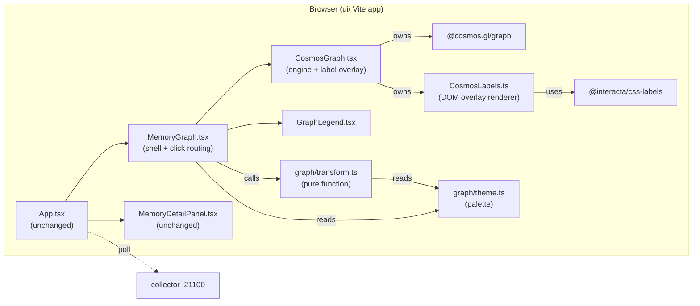
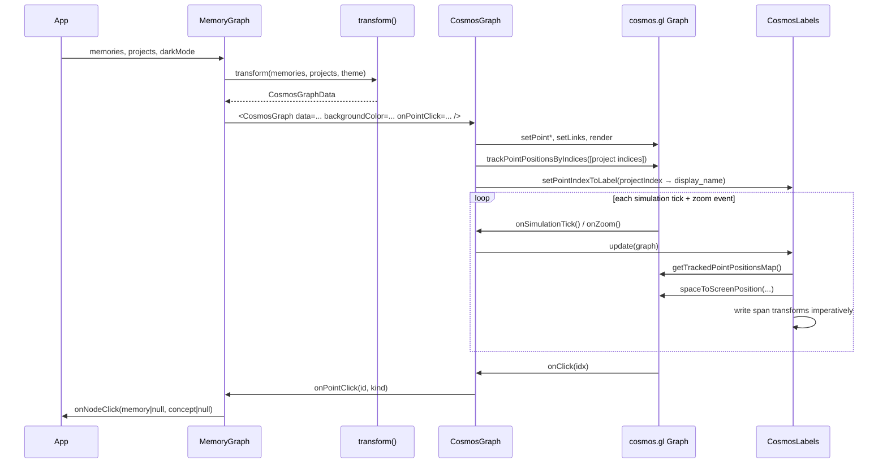

# Design Document: cosmos-gl-graph

> **Reverse spec.** This document describes the system as built, not as
> proposed. Every claim here is backed by code in `ui/src/` and tests in
> `test/unit/`.

## Overview

The kiro-learn viewer UI renders a GPU-accelerated force graph of projects,
memories, and concepts via [`@cosmos.gl/graph`](https://github.com/cosmosgl/graph)
(MIT, WebGL2). The visual target is the cosmos.gl storybook's
[`point-labels` demo](https://github.com/cosmosgl/graph/tree/main/src/stories/beginners/point-labels):
a dark canvas with hot-pink hubs and blue-purple leaves, muted blue-purple
edges, dark pills with white text floating above the hubs.

The implementation is six files in `ui/` totaling ~790 lines, with zero
backend changes. Visual stays close to engine defaults — simulation
parameters, point shapes, and `fitViewOnInit` all use cosmos.gl's shipped
defaults — so behavior is predictable and upgrades stay cheap.

### Design principles

1. **Lean on the engine.** Defer to cosmos.gl's defaults for everything that
   doesn't need to change. Override only what we can justify.
2. **Clean interfaces.** The pure transform knows nothing about React or
   cosmos.gl. The engine wrapper knows nothing about the collector or the
   data model beyond `CosmosGraphData`. The label overlay knows nothing
   about memories or projects.
3. **No speculative plumbing.** No filter checkboxes, no cluster force, no
   label sampling, no community detection. Every one of those was cut
   during implementation once the data showed it wasn't needed.

### Six-file architecture

| File | Lines | Responsibility |
|---|---|---|
| `ui/src/graph/transform.ts` | 240 | Pure: `(memories, projects, theme) → CosmosGraphData`. Types, id conventions, Float32Array packing, deterministic seeding. No React, no DOM, no cosmos.gl. |
| `ui/src/graph/theme.ts` | 53 | `getPackedTheme(darkMode)` returns the demo's palette in dark mode and a light-surface variant in light mode. `hexToRgba01` hex parser. |
| `ui/src/graph/GraphLegend.tsx` | 38 | Two-swatch legend: "Project" (pink) and "Memory / Concept" (blue-purple). |
| `ui/src/components/CosmosGraph.tsx` | 266 | Owns the `Graph` engine lifecycle. Uploads buffers on data change. Wires hover/click exploration. Manages a `CosmosLabels` instance in a sibling overlay. |
| `ui/src/components/CosmosLabels.ts` | 83 | Direct port of the demo's label class. Wraps `@interacta/css-labels`. Pulls tracked positions from the engine, projects to screen, writes spans. |
| `ui/src/components/MemoryGraph.tsx` | 103 | Outer shell. Theme derivation, data transformation, loading/error/empty states, click routing, the legend. |

Plus a 69-line dev harness (`scripts/dev-harness.mjs`) for visual iteration
via Playwright — never part of the test suite or production bundle.

---

## High-Level Design

### System Context



### Data Flow



### Visual Model

Two colors, two sizes, one labeled kind.

| Kind | Fill (dark) | Fill (light) | Size (sim units) | Labeled? |
|---|---|---|---|---|
| Project | `#ED69B4` (hot pink) | `#ED69B4` | 12 (3× default) | Yes, `display_name` |
| Memory  | `#4B5BBF` (blue-purple) | `#4B5BBF` | 4 (engine default) | No |
| Concept | `#4B5BBF` (blue-purple) | `#4B5BBF` | 4 (engine default) | No |

Memory and concept share a color because the demo has only two kinds
(theaters + performances). Mapping our three kinds onto two preserves the
demo's "hub vs leaf" read while avoiding a third hue that wouldn't come
from the reference palette.

| Other colors | Dark mode | Light mode |
|---|---|---|
| Edge  | `#5F74C2` | `#4B5BBF` (darkened for contrast) |
| Canvas background | `#2d313a` | `#f2f3f3` |
| Label pill | `#1e2428` (renderer default) | `#1e2428` |
| Label text | `white` (set per-label) | `white` |

Label pills stay dark in both modes — the renderer's default `#1e2428`
pill with white text reads well against either `#2d313a` or `#f2f3f3`.

### Layout Model

Zero overrides. Cosmos.gl's default force simulation runs with default
parameters (`simulationGravity: 0.25`, `simulationRepulsion: 1.0`,
`simulationLinkSpring: 1`, `simulationLinkDistance: 10`, etc.) and
`fitViewOnInit: true` auto-centers the camera.

No cluster force. No anchor positions. No `pointClusters` upload. No
`pointClusterStrength`. Link topology alone drives the layout: memories
pull toward their project via `memory→project` springs, concepts pull
toward memories they appear on via `memory→concept` springs, and
everything repels everything else. This is how the demo works.

The transform seeds initial positions in a ~0.5%-wide ring at the center
of the simulation space (`SPACE_CENTER = 2048` on `SPACE_SIZE = 4096`),
exactly matching the demo's `4096 * [0.495, 0.505]` seed pattern. Seed
positions are deterministic via FNV-1a hash of the node id, so layout
starts in the same state every reload.

### Emission Order (load-bearing)

`CosmosGraphData` emits nodes in **render-back-to-front order**: concepts
first, then memories, then projects. Cosmos.gl draws points in
buffer-index order — later indices paint over earlier ones — so emitting
projects last keeps them visible on top of the concept/memory swarm even
when the force simulation settles concepts near the project hub.

Within each kind, order is deterministic via stable sort of the input
(`record_id` for memories, `namespace` for projects). Concepts are sorted
by first-seen order when iterating the sorted memory list.

### Label Strategy

Only project points get labels. The transform populates `indexToLabel[i]`
with `display_name` for project indices and `null` for everything else.
`CosmosGraph` derives a `Map<pointIndex, string>` of project labels and
calls `graph.trackPointPositionsByIndices(projectIndices)` after
`graph.render()`.

On every simulation tick and zoom event, `CosmosLabels.update(graph)`
pulls the tracked positions from the engine, converts each to screen
space, offsets upward by the point's screen-space radius plus 2 pixels,
and hands a `LabelOptions[]` array to the `@interacta/css-labels`
renderer which writes absolutely-positioned divs inside a sibling overlay
div. React never reconciles during this loop.

### Interaction Model

| User action | Result |
|---|---|
| Hover point | Outline that point + its neighborhood; fade unrelated links via `linkGreyoutOpacity` (soft preview) |
| Click memory | Full highlight ring on the point, neighborhood stays bright, everything else greys out. `onPointClick('memory:<id>', 'memory')` |
| Click concept | Same visual treatment. `onPointClick('concept:<ns>:<concept>', 'concept')` |
| Click project | Same visual treatment. `onPointClick('project:<ns>', 'project')` — but `MemoryGraph` does not open the detail panel for projects |
| Click same point | Toggles exploration off. `onPointClick(null, null)` |
| Click background | Clears exploration. `onPointClick(null, null)` |

All visual dimming/highlighting uses cosmos.gl's native
`focusedPointIndex` / `highlightedPointIndices` / `outlinedPointIndices` /
`highlightedLinkIndices` config — no custom DOM manipulation, no React
re-renders on interaction.

### Dark Mode

The `backgroundColor` prop on `CosmosGraph` flips via
`setConfigPartial({ backgroundColor })` without restarting the simulation.
Point and edge colors are baked into the uploaded Float32Array buffers,
so they flip on the next data refresh (within the 10-second polling
cadence). Layout positions are preserved across the flip.

---

## Low-Level Design

### Type Contract (colocated in `transform.ts`)

```typescript
export type NodeKind = 'project' | 'memory' | 'concept';
export type NodeId = string;

export interface ProjectInfo {
  namespace: string;
  display_name: string;
}

export interface PackedTheme {
  readonly darkMode: boolean;
  readonly projectFill: readonly [number, number, number, number];
  readonly memoryFill:  readonly [number, number, number, number];
  readonly conceptFill: readonly [number, number, number, number];
  readonly edgeColor:   readonly [number, number, number, number];
  readonly backgroundColor: string;
}

export interface CosmosGraphData {
  readonly positions: Float32Array;  // 2 * pointCount
  readonly colors: Float32Array;     // 4 * pointCount (RGBA 0..1)
  readonly sizes: Float32Array;      // pointCount
  readonly links: Float32Array;      // 2 * linkCount
  readonly linkColors: Float32Array; // 4 * linkCount

  readonly indexToId: readonly NodeId[];
  readonly indexToKind: readonly NodeKind[];
  readonly indexToLabel: readonly (string | null)[];
  readonly idToIndex: ReadonlyMap<NodeId, number>;
  readonly memoryIndexByRecordId: ReadonlyMap<string, number>;
}
```

Seven Float32Array buffers and five bi-map structures. No cluster fields.
No filter flags. `indexToLabel[i]` is `display_name` for project indices,
`null` for everything else — future kinds can become labeled by changing
only this mapping.

### Node Id Convention

- Project: `project:<namespace>` (e.g. `project:/actor/alice/project/xyz/`)
- Memory:  `memory:<record_id>`
- Concept: `concept:<namespace>:<concept>` (concept scope is per-namespace)

Concept ids encode the namespace so two projects that share a concept
string (e.g. both contain `refactoring`) produce two distinct concept
points.

### Transform Algorithm

```pascal
FUNCTION transform(memories, projects, theme) → CosmosGraphData

// 1. Stable-sort inputs by primary key for layout stability across polls.
sortedProjects ← projects sorted by namespace
sortedMemories ← memories sorted by record_id
projectDisplayName ← Map of namespace → display_name

// 2. Emit nodes in render-back-to-front order so projects paint on top.
nodes ← []
seenConcept ← new Set()
FOR each m IN sortedMemories:
  FOR each c IN m.concepts:
    key ← `${m.namespace}:${c}`
    IF NOT seenConcept.has(key):
      seenConcept.add(key)
      nodes.push({ id: `concept:${key}`, kind: 'concept', namespace: m.namespace })
FOR each m IN sortedMemories:
  memoryIndexByRecordId.set(m.record_id, nodes.length)
  nodes.push({ id: `memory:${m.record_id}`, kind: 'memory', namespace: m.namespace })
FOR each p IN sortedProjects:
  nodes.push({ id: `project:${p.namespace}`, kind: 'project', namespace: p.namespace })

// 3. Build parallel bi-map arrays and label strings.
FOR i FROM 0 TO pointCount - 1:
  indexToId[i]    ← nodes[i].id
  indexToKind[i]  ← nodes[i].kind
  indexToLabel[i] ← nodes[i].kind === 'project'
                      ? projectDisplayName.get(nodes[i].namespace) ?? nodes[i].namespace
                      : null
  idToIndex.set(nodes[i].id, i)

// 4. Pack position + color + size in one buffer-filling loop.
FOR i FROM 0 TO pointCount - 1:
  n ← nodes[i]
  // Deterministic ring seed near SPACE_CENTER = 2048.
  angle  ← hashToUnit(n.id, 'a') * 2π
  radius ← hashToUnit(n.id, 'r') * (SPACE_SIZE * 0.005)
  positions[2i]   ← SPACE_CENTER + cos(angle) * radius
  positions[2i+1] ← SPACE_CENTER + sin(angle) * radius

  fill ← theme[`${n.kind}Fill`]
  colors[4i..4i+3] ← fill

  sizes[i] ← n.kind === 'project' ? 12 : 4

// 5. Emit links: memory→project and memory→concept. No project→concept.
FOR each m IN sortedMemories:
  memIdx ← idToIndex.get(`memory:${m.record_id}`)
  projIdx ← idToIndex.get(`project:${m.namespace}`)
  IF projIdx ≠ undefined THEN linkPairs.push(memIdx, projIdx)
  // `m.concepts` carries no uniqueness guarantee per its API type, so
  // dedupe per memory before emitting edges. Without this a memory that
  // repeats a concept in its array would produce duplicate
  // memory→concept edges to the same concept point.
  seenConcepts ← new Set()
  FOR each c IN m.concepts:
    IF seenConcepts.has(c) THEN continue
    seenConcepts.add(c)
    cIdx ← idToIndex.get(`concept:${m.namespace}:${c}`)
    IF cIdx ≠ undefined THEN linkPairs.push(memIdx, cIdx)

// 6. Pack link buffers.
FOR i FROM 0 TO linkCount - 1:
  links[2i]        ← linkPairs[2i]
  links[2i+1]      ← linkPairs[2i+1]
  linkColors[4i..] ← theme.edgeColor

RETURN { positions, colors, sizes, links, linkColors,
         indexToId, indexToKind, idToIndex, indexToLabel,
         memoryIndexByRecordId }
```

`hashToUnit` is a 6-line deterministic FNV-1a string hash returning a
float in `[0, 1)`. Same inputs → same outputs.

### CosmosGraph Component

Single functional component. Three effects:

**Mount effect** (empty deps, runs once):
- Constructs `new Graph(container, config)`.
- Constructs `new CosmosLabels(labelsContainer, new Map())`.
- Cleanup calls `labels.destroy()` then `graph.destroy()`.

**Data effect** (deps `[props.data]`):
- Diffs current vs previous `indexToId` to decide between an incremental
  upload (previously-existing points keep their simulation positions) or
  a full reset (new positions come from the seed).
- Calls in order: `setPointPositions`, `setPointColors`, `setPointSizes`,
  `setLinks`, `setLinkColors`, `render`, `trackPointPositionsByIndices`.
  The track call goes **after** `render` — calling it before leaves the
  tracker holding stale indices that get wiped by the upload pipeline.
- Computes project indices and builds a `Map<number, string>` for labels,
  then calls `labels.setPointIndexToLabel(...)`.
- On full reset: clears any click selection via `setConfigPartial`.

**Visual effect** (deps `[props.backgroundColor]`):
- Single `setConfigPartial({ backgroundColor })` call. No buffer re-upload.
  Keeps the running simulation's layout positions intact.

All engine callbacks (`onClick`, `onPointMouseOver`, `onPointMouseOut`,
`onSimulationTick`, `onZoom`) are defined in the mount effect and read
from `propsRef.current` at call time. This means new callback prop
identities don't rebuild the engine.

### CosmosLabels Class

Direct port of the `point-labels` demo's `CosmosLabels`. Three methods:

- **`constructor(container, pointIndexToLabel)`** — wraps a
  `LabelRenderer` instance with `pointerEvents: 'none'`.
- **`setPointIndexToLabel(map)`** — swaps the index→text map for the next
  `update()`.
- **`update(graph)`** — pulls `graph.getTrackedPointPositionsMap()`,
  projects each to screen space, offsets by the point's screen-space
  radius + 2px, and emits a `LabelOptions[]` to the renderer. Each label
  carries `color: 'white'` so pill text reads against the dark
  `#1e2428` background.
- **`destroy()`** — forwards to the renderer.

### Theme

```typescript
export function getPackedTheme(darkMode: boolean): PackedTheme {
  return {
    darkMode,
    projectFill: hexToRgba01('#ED69B4'),
    memoryFill:  hexToRgba01('#4B5BBF'),
    conceptFill: hexToRgba01('#4B5BBF'),
    edgeColor:   hexToRgba01(darkMode ? '#5F74C2' : '#4B5BBF'),
    backgroundColor: darkMode ? '#2d313a' : '#f2f3f3',
  };
}
```

Dark mode is the demo verbatim. Light mode is a surface swap — same
accent colors, light canvas, edge darkened slightly for contrast. No
palette branching beyond these two lines.

### MemoryGraph Component

Public prop shape `{ memories, projects, loading, error, darkMode,
onNodeClick }` unchanged from the previous implementation so `App.tsx`
needs no edits.

Memoized `theme = getPackedTheme(darkMode)` and `data = transform(...)`.
Renders loading / error / empty-memories placeholders in place of the
canvas. Otherwise renders `<GraphLegend>` above a fixed-height
`<CosmosGraph>` in a 500px container.

`handleClick` routes:
- `kind === 'memory'`: look up the `MemoryRecord` by parsing the id,
  invoke `onNodeClick(memory, null)`.
- `kind === 'concept'`: extract the concept string after the last `:`,
  invoke `onNodeClick(null, concept)`.
- `kind === 'project'`: no-op on `onNodeClick` (cosmos.gl handles the
  visual focus internally).
- `id === null`: invoke `onNodeClick(null, null)` (background click).

---

## Correctness Properties

Six properties under property-based testing (`fast-check`, 50 runs each):

| ID | Property | Test file |
|---|---|---|
| P1 | Buffer shapes: `positions.length = 2*pointCount`, `colors.length = 4*pointCount`, `sizes.length = pointCount`, `linkColors.length = 4*linkCount`, parallel bi-map arrays all have length `pointCount` | `cosmos-transform-shapes.property.test.ts` |
| P2 | Link validity: every `links[i]` is a non-negative integer less than `pointCount` | `cosmos-transform-bimap.property.test.ts` |
| P3 | Bi-map round-trip: `idToIndex.get(indexToId[i]) === i` for every `i` | `cosmos-transform-bimap.property.test.ts` |
| P4 | Color and size bounds: every color component is in `[0, 1]`; projects are strictly larger than leaves (size 12 vs 4) | `cosmos-transform-bounds.property.test.ts` |
| P5 | Label assignment: project indices carry a non-empty string; memory/concept indices carry `null` | `cosmos-transform-bimap.property.test.ts` |
| P6 | Determinism: two calls on structurally-equal inputs produce element-equal Float32Arrays and identical bi-map arrays | `cosmos-transform-determinism.property.test.ts` |

---

## Test Strategy

| File | Kind | Count | Subject |
|---|---|---|---|
| `cosmos-transform.test.ts` | example | 8 | Empty inputs, single memory, cross-namespace concept scoping, emission order, per-kind sizes, buffer shape, stable-sort across polling |
| `cosmos-transform-shapes.property.test.ts` | property | 1 | P1 |
| `cosmos-transform-bimap.property.test.ts` | property | 3 | P2, P3, P5 |
| `cosmos-transform-bounds.property.test.ts` | property | 2 | P4 |
| `cosmos-transform-determinism.property.test.ts` | property | 1 | P6 |
| `cosmos-graph.test.tsx` | component | 11 | Single Graph ctor, single LabelRenderer ctor, config shape, data-setter order, project-only tracking, visual-delta no-op, callback identity stability, click dispatch (3), unmount destroys both |
| `cosmos-labels.test.ts` | unit | 7 | Constructor, label emission, draw count, empty label fallback, map swap, trim-on-shrink, destroy |
| `theme-packed.test.ts` | unit | 5 | `hexToRgba01` correctness and malformed-input throws, dark-mode palette, light-mode palette, memory = concept color |
| `memory-graph-shell.test.tsx` | component | 9 | Canvas + legend render, prop shape, loading/error/empty states (3), click routing for memory/concept/project/background (4) |
| `no-react-in-transform.test.ts` | guard | 1 | `transform.ts` doesn't import `react`, `react-dom`, or `@cosmos.gl/graph` |

**57 tests total across 10 files.**

Engine and renderer are mocked at module boundaries (`vi.doMock('@cosmos.gl/graph')` and `vi.doMock('@interacta/css-labels')`) so no tests touch WebGL or real DOM measurement.

---

## Performance

Current scale: ~2 projects / ~500 memories / ~850 concepts / ~2000
links. Cosmos.gl handles this at 60fps on modest hardware.

Critical constraints:
- `onSimulationTick` allocates nothing in the hot path. `CosmosLabels.update`
  reuses its internal `labels` array and trims length at the end.
- `transform()` allocates fresh Float32Arrays on every call. At current
  data scale this is ~40KB per call on a 10-second polling cadence — well
  below any observable cost. Would switch to buffer reuse only if
  profiling showed cost.
- Label count equals project count (currently 1–2). The renderer's
  sweep-and-prune occlusion check is O(n log n) in label count, so scale
  is not a concern at this cardinality.

Per the scale target implied by the demo, this architecture should hold
to 10k nodes / 20k edges without structural changes.

---

## Security

No new surface. The UI talks to the same `127.0.0.1:21100` endpoints it
always did. `@cosmos.gl/graph` and `@interacta/css-labels` are
client-side-only libraries with no network calls. No IAM, auth, secrets,
encryption, or network-config changes.

---

## Dependencies

**Added:**
- `@cosmos.gl/graph` — WebGL2 force-graph engine (MIT)
- `@interacta/css-labels` — DOM-overlay label renderer used by the
  cosmos.gl demo (MIT)
- `@playwright/test` (devDependency) — for the dev harness
- `globals` (devDependency) — ESLint global env definitions for the
  mixed-context harness script

**Removed** (from the pre-migration sigma/graphology stack):
`sigma`, `@react-sigma/core`, `graphology`,
`graphology-layout-forceatlas2`, `graphology-types`.

---

## Dev Harness

`scripts/dev-harness.mjs` is a standalone Playwright script for visual
iteration. Not imported from `src/` or `ui/src/`, not part of
`npm run test`, not bundled into production.

Usage:
```bash
# Terminal 1
npm run dev:ui       # Vite on :5173

# Terminal 2
kiro-learn start     # collector on :21100

# Terminal 3
node scripts/dev-harness.mjs
```

The harness launches headless Chromium at `http://127.0.0.1:5173`
(override via `KIRO_DEV_URL`), waits for `[data-testid="cosmos-canvas"]`,
waits 16 seconds for the simulation to settle, screenshots to
`.kiro-dev/screenshot.png`, and prints a JSON report of canvas
dimensions, visible/total label counts, and any captured console errors.

---

## Non-Goals / Deliberately Cut

Several features from earlier drafts were built, tried, and cut during
implementation once the data showed they weren't needed. For the
record, this architecture does NOT include:

- **Filter checkboxes.** Removed after finding that "filter at data
  boundary then re-upload" and "filter via alpha=0 on the engine" both
  added complexity for questionable user value at this data scale.
  Re-add at the MemoryGraph shell level when needed.
- **Cluster force.** `pointClusters`, `clusterPositions`, and
  `pointClusterStrength` are not uploaded to the engine. Early
  experiments showed the engine's built-in link-topology layout is
  adequate and more predictable than a hand-tuned cluster force.
- **Label sampling at zoom.** The engine's `getSampledPoints()` is not
  wired up. Project labels are always on. If memories ever get labels,
  we'll revisit.
- **Community detection.** Concepts-per-project is the only grouping;
  no label propagation, no modularity optimization.
- **Light-mode per-kind color variants.** Same accents in both modes;
  only the canvas and edge flip.
- **Custom shapes.** Every point is a circle. No stars for projects, no
  size/shape gradients for memories.
- **Memory titles in the DOM.** Only project display names render. Memory
  titles live in the detail panel triggered by click.
- **Third-kind legend entry.** Legend collapses to two swatches because
  memory and concept share a color.

These cuts are the principal reason the implementation is 783 lines
instead of the 500-line budget in the original design draft — the cuts
balance the additional complexity of the label overlay (~150 lines the
original draft didn't plan for).

---

## Known Limitations

- **Light mode edge visibility.** On very light workspace backgrounds,
  the `#4B5BBF` light-mode edge color can look slightly faint. Tuning
  hook: `getPackedTheme`.
- **Project-count = 1 labels.** With a single project, the label sits
  dead-center in the fused cluster. No visual problem, but the "anchors
  spread clusters apart" pattern only starts paying off at 2+ projects.
- **Incremental upload assumes index stability.** The incremental-append
  path compares `indexToId` arrays element-wise. If the sort order ever
  produces a different ordering for the same data (e.g. a new
  tiebreaker), every poll triggers a full reset. Not a bug today, but
  load-bearing.
