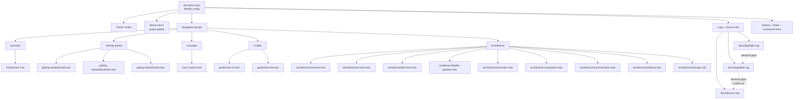
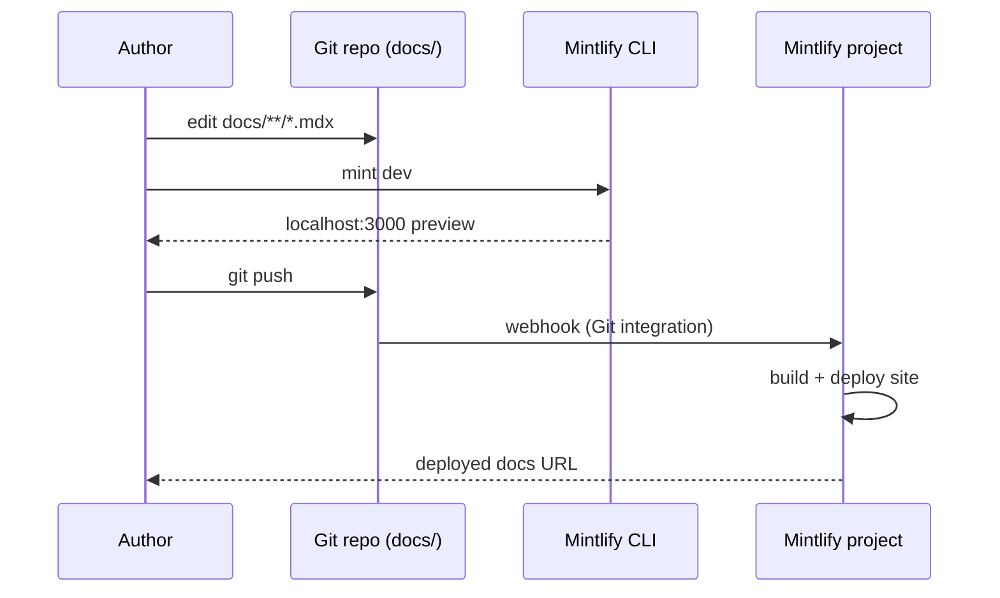
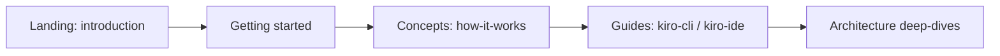

# Design Document: docs-skeleton

## Overview

`docs-skeleton` is the Mintlify-based documentation site scaffolding for kiro-learn. It lives entirely under the `docs/` directory and consists of three concerns: a Mintlify configuration (`docs.json`), a small brand system (one favicon plus light and dark logos, all built from the same purple-dot glyph), and a set of placeholder MDX pages organized along the reader journey Overview → Getting started → Concepts → Guides → Architecture.

The skeleton is intentionally thin. Every content page currently carries only frontmatter (`title`, `description`) and the body `_Coming soon._`. The value in this milestone is the shape — the navigation taxonomy, the brand, the deploy pipeline — not the prose. Pages fill in over subsequent specs that map 1:1 to the navigation groups.

Local authoring uses the Mintlify CLI (`mint dev`, localhost:3000). Deployment is Git-triggered through a Mintlify project connected to this repository; there is no build step kiro-learn owns for the docs site.

## Architecture

### Site structure



### Authoring and deploy flow



The deploy arrow is owned by the Mintlify project, not by this repo. kiro-learn does not run a site build in CI; pushing to the tracked branch is the deploy trigger.

### Reader journey



This ordering matches the navigation group order in `docs.json`. New readers land on Introduction, install through Getting started, build a mental model in Concepts, adopt via Guides, and go deep in Architecture. The Architecture group mirrors the five-layer architecture in `AGENTS.md` (shim → collector → buffer → extraction → storage), plus the cross-cutting flows (compaction, summarization, retrieval).

## Components and Interfaces

### Component 1: Mintlify configuration

**Purpose**: Single source of truth for site identity, navigation taxonomy, brand colors, asset paths, and chrome (navbar, footer, contextual menu).

**Contract**: A JSON document validated against `https://mintlify.com/docs.json` whose top-level shape is captured in the Low-Level Design section. The config is the only file in the skeleton that both the Mintlify CLI and the hosted build read directly; every other file is either referenced by it (MDX pages, SVG assets) or invisible to it (`.mintignore`).

**Responsibilities**:
- Declare the site name, theme, and brand color palette.
- Enumerate every navigable page, grouped into five sections, in display order.
- Point at the logo and favicon assets.
- Configure the navbar (GitHub link, Install CTA), contextual menu (`copy`, `view`, `chatgpt`, `claude`), and footer socials.

### Component 2: Brand assets

**Purpose**: Give kiro-learn a recognizable mark that reads at all sizes and on both light and dark backgrounds, without pulling in a runtime asset pipeline.

**Contract**: Three standalone SVGs. All three share one glyph — a triangle of three dots connected by thick strokes. The two logo files add a wordmark in the theme-appropriate text color. The favicon file is the glyph alone, scaled to fit a square icon canvas.

**Responsibilities**:
- `logo/light.svg` — glyph + `kiro-learn` wordmark in near-black (`#09090B`) for light backgrounds. ViewBox `0 0 124 23`.
- `logo/dark.svg` — glyph + `kiro-learn` wordmark in white (`#FFFFFF`) for dark backgrounds. ViewBox `0 0 124 23`.
- `favicon.svg` — glyph only, no wordmark. ViewBox `0 0 512 512`.

### Component 3: Content pages

**Purpose**: Placeholder MDX pages that reserve every route declared in `docs.json`. Every navigation entry resolves to a real file, so the site builds cleanly today and authors have a known landing spot to fill in.

**Contract**: Each page is an `.mdx` file with YAML frontmatter (`title`, `description`) and a body of `_Coming soon._`. The file path relative to `docs/` matches the page ID in `docs.json` (e.g. the page ID `getting-started/install` resolves to `docs/getting-started/install.mdx`).

**Responsibilities**:
- Keep referential integrity with `docs.json` — there are no orphan pages and no broken navigation entries.
- Hold the title and one-line description that Mintlify uses for page headers, sidebar labels, and search.

### Component 4: Ignore file

**Purpose**: Keep drafts out of the published site.

**Contract**: `docs/.mintignore` uses gitignore syntax. Mintlify already ignores `.git`, `.github`, `.claude`, `.agents`, `.idea`, `node_modules`, `README.md`, `LICENSE.md`, `CHANGELOG.md`, `CONTRIBUTING.md` by default. The file adds two project-specific rules: `drafts/` and `*.draft.mdx`.

## Data Models

### `docs.json` top-level shape

```pascal
STRUCTURE MintlifyConfig
  "$schema"   : String          // literal "https://mintlify.com/docs.json"
  theme       : String          // literal "linden"
  name        : String          // literal "kiro-learn"
  colors      : BrandColors
  favicon     : String          // "/favicon.svg"
  navigation  : Navigation
  logo        : LogoRefs
  navbar      : Navbar
  contextual  : Contextual
  footer      : Footer
END STRUCTURE

STRUCTURE BrandColors
  primary : String              // "#8D47FF"
  light   : String              // "#C7A0FF"
  dark    : String              // "#7D25E6"
END STRUCTURE

STRUCTURE Navigation
  groups : List<NavGroup>       // exactly 5, in display order
END STRUCTURE

STRUCTURE NavGroup
  group : String                // "Overview" | "Getting started" | "Concepts" | "Guides" | "Architecture"
  pages : List<String>          // page IDs; resolve to docs/<id>.mdx
END STRUCTURE

STRUCTURE LogoRefs
  light : String                // "/logo/light.svg"
  dark  : String                // "/logo/dark.svg"
END STRUCTURE

STRUCTURE Navbar
  links   : List<NavbarLink>    // [{ label: "GitHub", href: "https://github.com/brendangeck/kiro-learn" }]
  primary : NavbarButton        // { type: "button", label: "Install", href: "/getting-started/install" }
END STRUCTURE

STRUCTURE Contextual
  options : List<String>        // ["copy", "view", "chatgpt", "claude"]
END STRUCTURE

STRUCTURE Footer
  socials : Map<String, String> // { github: "https://github.com/brendangeck/kiro-learn" }
END STRUCTURE
```

**Validation rules**:
- `$schema` is `https://mintlify.com/docs.json`.
- `theme` is `linden`.
- `name` is `kiro-learn`.
- `colors.primary`, `colors.light`, `colors.dark` are the purple palette values above.
- `navigation.groups` has exactly five groups in this order: Overview, Getting started, Concepts, Guides, Architecture.
- Every entry in any `pages` array resolves to an existing `.mdx` file under `docs/`.
- `logo.light`, `logo.dark`, `favicon` all point at existing SVG files under `docs/`.
- `navbar.primary.href` (`/getting-started/install`) points at an existing page.

### Brand palette

| Role | Hex | Where it lives |
|---|---|---|
| Primary | `#8D47FF` | `docs.json.colors.primary`, glyph top dot and strokes in all three SVGs |
| Dark | `#7D25E6` | `docs.json.colors.dark`, glyph bottom-left dot |
| Light | `#C7A0FF` | `docs.json.colors.light`, glyph bottom-right dot |
| Near-black text | `#09090B` | `logo/light.svg` wordmark fill |
| White text | `#FFFFFF` | `logo/dark.svg` wordmark fill |

### Logo glyph geometry

The glyph is the same shape in all three SVGs; only the coordinate scale and the presence/absence of a wordmark differ.

```pascal
STRUCTURE Glyph
  // Triangle vertices (unit form: top, bottom-left, bottom-right)
  topVertex         : Point     // center of the top (primary) dot
  bottomLeftVertex  : Point     // center of the bottom-left (dark) dot
  bottomRightVertex : Point     // center of the bottom-right (light) dot

  // Three strokes forming the triangle edges
  strokes : List<Line>          // bottom edge, left edge, right edge
  strokeColor      : String     // "#8D47FF"
  strokeLinecap    : String     // "round"

  // Three filled dots at the vertices
  topDotFill        : String    // "#8D47FF"
  bottomLeftDotFill : String    // "#7D25E6"
  bottomRightDotFill: String    // "#C7A0FF"
END STRUCTURE
```

Concrete geometry per file:

| File | viewBox | Stroke width | Top vertex | Bottom-left vertex | Bottom-right vertex | Top dot radius | Bottom dot radius |
|---|---|---|---|---|---|---|---|
| `docs/logo/light.svg` | `0 0 124 23` | `2.4` | `(11.5, 5)` | `(5, 18)` | `(18, 18)` | `3.6` | `3` |
| `docs/logo/dark.svg` | `0 0 124 23` | `2.4` | `(11.5, 5)` | `(5, 18)` | `(18, 18)` | `3.6` | `3` |
| `docs/favicon.svg` | `0 0 512 512` | `44` | `(256, 128)` | `(128, 384)` | `(384, 384)` | `72` | `60` |

The logo and favicon glyphs are identical up to a uniform scale: every coordinate and every radius in the favicon is the corresponding logo value multiplied by the same factor (≈22.26 = 512/23). This is a design invariant, not an incidental detail — see Correctness Properties.

### Wordmark (logo files only)

| Attribute | Value |
|---|---|
| Text | `kiro-learn` |
| Position | `(28, 17)` |
| Font family | `Inter, ui-sans-serif, system-ui, -apple-system, 'Helvetica Neue', Arial, sans-serif` |
| Font size | `17` |
| Font weight | `700` |
| Letter spacing | `-0.02em` |
| Fill (light.svg) | `#09090B` |
| Fill (dark.svg) | `#FFFFFF` |

The font stack deliberately matches the default Mintlify text stack so the wordmark visually continues into the rendered page type on the site.

### Content page frontmatter

```pascal
STRUCTURE MdxPage
  frontmatter : Frontmatter
  body        : String          // "_Coming soon._"
END STRUCTURE

STRUCTURE Frontmatter
  title       : String          // 1..N chars, human-readable
  description : String          // 1..N chars, one-line
END STRUCTURE
```

**Validation rules**:
- Every file under `docs/` with extension `.mdx` has YAML frontmatter opening on line 1.
- Every frontmatter has non-empty `title` and `description` fields.
- Body content today is literally `_Coming soon._` (this is a skeleton invariant; it goes away as pages are filled in, so future specs will relax this).

## Key Functions with Formal Specifications

> This is a docs skeleton, not code, so there are no runtime functions. What stands in for them is the *build contract*: the set of checks a Mintlify build implicitly performs on these files. The specifications below describe those checks in the same preconditions/postconditions form, so downstream requirements and tests have something concrete to target.

### Function 1: `resolvePageId(id: string): string`

Mapping from a `docs.json` page ID to a file path on disk.

```pascal
function resolvePageId(pageId: String): String
```

**Preconditions**:
- `pageId` appears in some `navigation.groups[i].pages` array in `docs.json`.
- `pageId` contains only lowercase letters, digits, `-`, and `/`.

**Postconditions**:
- Returns `docs/${pageId}.mdx`.
- The returned path exists on disk and is a regular file.
- The file at the returned path parses as MDX with valid frontmatter.

### Function 2: `validateGlyph(svgPath: string): boolean`

Structural check that an SVG file contains the kiro-learn glyph in canonical form.

```pascal
function validateGlyph(svgPath: String): Boolean
```

**Preconditions**:
- `svgPath` is `docs/logo/light.svg`, `docs/logo/dark.svg`, or `docs/favicon.svg`.
- File exists and parses as well-formed XML.

**Postconditions**:
- Returns `true` if and only if:
  - The SVG contains exactly three `<line>` elements with stroke `#8D47FF`, `stroke-linecap="round"`, identical `stroke-width`, and endpoints forming a triangle whose top vertex is above the two bottom vertices and whose two bottom vertices share a y-coordinate.
  - The SVG contains exactly three `<circle>` elements, one centered at each triangle vertex, with fills `#8D47FF` (top), `#7D25E6` (bottom-left), `#C7A0FF` (bottom-right), top radius strictly greater than the two equal bottom radii.
  - After normalizing to the viewBox unit square, the vertex coordinates and radii match the canonical values in the glyph table above to within floating-point tolerance.

**Loop invariants**: N/A (non-iterative check).

### Function 3: `checkConfigConsistency(config: MintlifyConfig): Result`

The cross-file consistency check this skeleton is built to uphold.

```pascal
function checkConfigConsistency(config: MintlifyConfig): Result
```

**Preconditions**:
- `config` parses as JSON.
- `config` validates against `https://mintlify.com/docs.json`.

**Postconditions**:
- Returns `Success` if and only if all of the following hold:
  - For every page ID `p` in any navigation group, `docs/${p}.mdx` exists.
  - `config.favicon` points at an existing file under `docs/`.
  - `config.logo.light` and `config.logo.dark` point at existing files under `docs/`.
  - `config.navbar.primary.href` begins with `/` and its suffix resolves to a declared page ID.
  - `config.colors.primary`, `.light`, `.dark` match the palette used in the three SVG glyphs.
- Otherwise returns `Error(reason)` where `reason` names the first failing check.

## Algorithmic Pseudocode

### Consistency check (what a reviewer or linter would do)

```pascal
ALGORITHM verifyDocsSkeleton(docsDir)
INPUT:  docsDir — absolute path to the docs/ directory
OUTPUT: Result — Success or Error(reason)

BEGIN
  config ← parseJson(readFile(docsDir / "docs.json"))
  ASSERT matchesSchema(config, "https://mintlify.com/docs.json")

  // 1. Every declared page resolves to a real MDX file.
  FOR each group IN config.navigation.groups DO
    FOR each pageId IN group.pages DO
      mdxPath ← docsDir / (pageId + ".mdx")
      IF NOT fileExists(mdxPath) THEN
        RETURN Error("missing page file: " + mdxPath)
      END IF
      IF NOT hasFrontmatter(mdxPath, ["title", "description"]) THEN
        RETURN Error("bad frontmatter: " + mdxPath)
      END IF
    END FOR
  END FOR

  // 2. Assets referenced from config exist.
  FOR each assetRef IN [config.favicon, config.logo.light, config.logo.dark] DO
    IF NOT fileExists(docsDir / stripLeadingSlash(assetRef)) THEN
      RETURN Error("missing asset: " + assetRef)
    END IF
  END FOR

  // 3. Primary CTA points at a real page.
  ctaPageId ← stripLeadingSlash(config.navbar.primary.href)
  IF NOT declaredAsPage(ctaPageId, config.navigation) THEN
    RETURN Error("navbar CTA does not resolve to a declared page")
  END IF

  // 4. Palette-glyph consistency.
  FOR each svgPath IN [docsDir / "logo/light.svg",
                       docsDir / "logo/dark.svg",
                       docsDir / "favicon.svg"] DO
    colorsInSvg ← extractBrandColors(readFile(svgPath))
    IF colorsInSvg ≠ { config.colors.primary,
                       config.colors.dark,
                       config.colors.light } THEN
      RETURN Error("palette mismatch in " + svgPath)
    END IF
  END FOR

  // 5. Glyph identity across the three SVGs.
  lightGlyph   ← extractGlyph(readFile(docsDir / "logo/light.svg"))
  darkGlyph    ← extractGlyph(readFile(docsDir / "logo/dark.svg"))
  faviconGlyph ← extractGlyph(readFile(docsDir / "favicon.svg"))
  IF NOT geometryEqual(lightGlyph, darkGlyph) THEN
    RETURN Error("light and dark glyphs disagree")
  END IF
  IF NOT geometryEqualUpToUniformScale(darkGlyph, faviconGlyph) THEN
    RETURN Error("favicon glyph is not a uniform scale of the logo glyph")
  END IF

  RETURN Success
END
```

**Preconditions**:
- `docsDir` is a readable directory.
- `docsDir/docs.json` exists.

**Postconditions**:
- Returns `Success` only when every invariant in the Correctness Properties section holds.
- On `Error`, the reason identifies the first failing invariant.

**Loop invariants**:
- At the top of the outer page loop, every previously iterated page resolves to a valid MDX file.
- At the top of the asset loop, every previously checked asset reference resolves to a file on disk.
- At the top of the SVG palette loop, every previously checked SVG uses only colors from `config.colors`.

## Example Usage

### File tree

```text
docs/
├── .mintignore
├── docs.json
├── favicon.svg
├── introduction.mdx
├── how-it-works.mdx
├── getting-started/
│   ├── install.mdx
│   ├── quickstart.mdx
│   └── verify.mdx
├── guides/
│   ├── kiro-cli.mdx
│   └── kiro-ide.mdx
├── architecture/
│   ├── overview.mdx
│   ├── cli-shim.mdx
│   ├── ide-shim.mdx
│   ├── buffer-pipeline.mdx
│   ├── extraction.mdx
│   ├── compaction.mdx
│   ├── summarization.mdx
│   ├── retrieval.mdx
│   └── storage.mdx
└── logo/
    ├── dark.svg
    └── light.svg
```

### `docs/docs.json` (as shipped)

```json
{
  "$schema": "https://mintlify.com/docs.json",
  "theme": "linden",
  "name": "kiro-learn",
  "colors": {
    "primary": "#8D47FF",
    "light": "#C7A0FF",
    "dark": "#7D25E6"
  },
  "favicon": "/favicon.svg",
  "navigation": {
    "groups": [
      { "group": "Overview",        "pages": ["introduction"] },
      { "group": "Getting started", "pages": ["getting-started/install", "getting-started/quickstart", "getting-started/verify"] },
      { "group": "Concepts",        "pages": ["how-it-works"] },
      { "group": "Guides",          "pages": ["guides/kiro-cli", "guides/kiro-ide"] },
      { "group": "Architecture",    "pages": [
        "architecture/overview",
        "architecture/cli-shim",
        "architecture/ide-shim",
        "architecture/buffer-pipeline",
        "architecture/extraction",
        "architecture/compaction",
        "architecture/summarization",
        "architecture/retrieval",
        "architecture/storage"
      ] }
    ]
  },
  "logo": { "light": "/logo/light.svg", "dark": "/logo/dark.svg" },
  "navbar": {
    "links": [{ "label": "GitHub", "href": "https://github.com/brendangeck/kiro-learn" }],
    "primary": { "type": "button", "label": "Install", "href": "/getting-started/install" }
  },
  "contextual": { "options": ["copy", "view", "chatgpt", "claude"] },
  "footer": { "socials": { "github": "https://github.com/brendangeck/kiro-learn" } }
}
```

### `docs/logo/light.svg` (as shipped)

```xml
<svg width="124" height="23" viewBox="0 0 124 23" fill="none" xmlns="http://www.w3.org/2000/svg">
  <!-- kiro-learn glyph: 3 dots in a triangle, thick edges -->
  <g stroke="#8D47FF" stroke-width="2.4" stroke-linecap="round">
    <line x1="5" y1="18" x2="18" y2="18" />
    <line x1="5" y1="18" x2="11.5" y2="5" />
    <line x1="18" y1="18" x2="11.5" y2="5" />
  </g>
  <circle cx="11.5" cy="5" r="3.6" fill="#8D47FF" />
  <circle cx="5" cy="18" r="3" fill="#7D25E6" />
  <circle cx="18" cy="18" r="3" fill="#C7A0FF" />

  <!-- Wordmark -->
  <text x="28" y="17"
        font-family="Inter, ui-sans-serif, system-ui, -apple-system, 'Helvetica Neue', Arial, sans-serif"
        font-size="17"
        font-weight="700"
        fill="#09090B"
        letter-spacing="-0.02em">kiro-learn</text>
</svg>
```

`dark.svg` is identical except `fill="#FFFFFF"` on the wordmark. `favicon.svg` is the same glyph scaled to `viewBox="0 0 512 512"` (stroke-width `44`, top dot radius `72`, bottom dot radius `60`) with no wordmark.

### Content page (as shipped)

```mdx
---
title: "Introduction"
description: "Memory for Kiro agent sessions. Local, private, and built for AWS developers."
---

_Coming soon._
```

### Local authoring

```bash
cd docs
mint dev              # starts http://localhost:3000 with live reload
```

### `.mintignore` (as shipped)

```text
# Mintlify automatically ignores these files and directories:
# .git, .github, .claude, .agents, .idea, node_modules,
# README.md, LICENSE.md, CHANGELOG.md, CONTRIBUTING.md

# Draft content
drafts/
*.draft.mdx
```

## Correctness Properties

Structural and cross-file invariants. Each property has a stable name so requirements and tasks can reference it.

| # | Name | Statement |
|---|---|---|
| P1 | `nav-page-referential-integrity` | For every page ID `p` listed in any `navigation.groups[*].pages`, the file `docs/${p}.mdx` exists and is a regular file. |
| P2 | `no-orphan-mdx-pages` | Every `.mdx` file under `docs/` (excluding anything matched by `.mintignore`) is referenced by exactly one page ID in `docs.json`. |
| P3 | `frontmatter-present` | Every `.mdx` file under `docs/` opens with YAML frontmatter containing non-empty `title` and `description` string fields. |
| P4 | `asset-refs-resolve` | `config.favicon`, `config.logo.light`, and `config.logo.dark` each resolve, after stripping the leading `/`, to an existing file under `docs/`. |
| P5 | `cta-resolves-to-page` | `config.navbar.primary.href` starts with `/`, and its suffix equals one of the declared page IDs in `config.navigation`. |
| P6 | `palette-config-literal` | `config.colors` equals `{ primary: "#8D47FF", light: "#C7A0FF", dark: "#7D25E6" }` exactly. |
| P7 | `palette-svg-consistency` | The set of brand colors appearing as stroke or fill in each of `logo/light.svg`, `logo/dark.svg`, and `favicon.svg` is exactly `{ #8D47FF, #C7A0FF, #7D25E6 }` (plus the wordmark fill in the two logo files). No other colors appear. |
| P8 | `glyph-identity-logos` | The glyph (three strokes + three circles) in `logo/light.svg` is byte-for-byte identical to the glyph in `logo/dark.svg` up to whitespace. Only the wordmark fill differs between the two files. |
| P9 | `glyph-identity-favicon` | The glyph in `favicon.svg` is `logo/dark.svg`'s glyph scaled by a single uniform factor (`512/23`), rounded to integer coordinates for every vertex and radius. |
| P10 | `wordmark-font-stack` | The wordmark `<text>` element in both logo files uses the font-family `Inter, ui-sans-serif, system-ui, -apple-system, 'Helvetica Neue', Arial, sans-serif`. |
| P11 | `mintlify-schema-valid` | `docs.json` validates against `https://mintlify.com/docs.json`. |
| P12 | `nav-group-count-and-order` | `config.navigation.groups` has exactly five entries, with `group` names (in order): `Overview`, `Getting started`, `Concepts`, `Guides`, `Architecture`. |
| P13 | `contextual-menu-options` | `config.contextual.options` equals `["copy", "view", "chatgpt", "claude"]` exactly. |
| P14 | `github-url-consistency` | The `href` in `config.navbar.links[*]` whose `label === "GitHub"` equals `config.footer.socials.github`. |
| P15 | `nav-matches-architecture-layers` | The `Architecture` group contains exactly one page per 5-layer architecture concern plus the cross-cutting flows, in the fixed order: `overview`, `cli-shim`, `ide-shim`, `buffer-pipeline`, `extraction`, `compaction`, `summarization`, `retrieval`, `storage`. |

Each property is checkable statically from the files on disk; none requires a running server.

## Error Handling

> Error handling applies to the *docs build*, not to kiro-learn runtime. The build owner is Mintlify; we describe failure modes we would observe as authors.

### Scenario 1: Broken navigation reference

**Condition**: `docs.json` references a page ID that has no corresponding `.mdx` file (violates P1).
**Response**: Mintlify build fails (locally `mint dev` reports the missing file; the hosted build fails the deploy).
**Recovery**: Author either adds the missing `.mdx` (with frontmatter + `_Coming soon._` body to match the skeleton convention) or removes the offending entry from `docs.json`.

### Scenario 2: Missing asset reference

**Condition**: `config.favicon`, `config.logo.light`, or `config.logo.dark` points at a non-existent file (violates P4).
**Response**: Mintlify renders a broken image or fallback at runtime; the site still builds.
**Recovery**: Author adds the missing SVG at the referenced path or updates the path in `docs.json`.

### Scenario 3: Invalid JSON or schema violation in `docs.json`

**Condition**: `docs.json` is not valid JSON, or fails validation against the Mintlify schema (violates P11).
**Response**: Mintlify build fails with a schema error.
**Recovery**: Author fixes the JSON. Editors with JSON Schema support surface violations inline because of the `$schema` field.

### Scenario 4: Missing frontmatter

**Condition**: An `.mdx` file lacks a `title` or `description` frontmatter field (violates P3).
**Response**: Mintlify may render the page but the sidebar / search behavior is degraded (empty sidebar label, empty OpenGraph).
**Recovery**: Author adds the missing frontmatter fields.

### Scenario 5: Draft page leaking into the site

**Condition**: A `drafts/` directory or `*.draft.mdx` file is committed.
**Response**: `.mintignore` excludes it from the published site. The file stays in source control but does not ship.
**Recovery**: None needed by default; the ignore rule is the safety net.

## Testing Strategy

### Structural testing (what this skeleton invites)

A small Node script (conceptually, the `verifyDocsSkeleton` algorithm above) can execute P1–P15 against the files on disk. No Mintlify runtime needed. The invariants are static and file-system-local.

**Suggested shape** (not part of this milestone; called out for requirements derivation):
- A script in `scripts/` or a vitest file under `test/unit/` that reads `docs/docs.json`, walks the navigation tree, and asserts P1–P15.
- Runs as part of `npm run lint` or `npm run test`.

### Property-based testing

Low-value here because the skeleton is a small, fixed set of files. The checks are existential and structural, not universal. Example-based assertions cover the space.

### Visual / manual testing

- `mint dev` locally and click through every navigation entry to confirm titles and descriptions render.
- Verify logo renders correctly in both light and dark modes (Mintlify theme toggle).
- Verify favicon appears in browser tab.

### Integration testing

The Mintlify build itself is the integration test. A green deploy on the Mintlify project is the signal.

## Performance Considerations

Not applicable at this scale. The entire docs skeleton is under 50 KB on disk; Mintlify handles build and serve.

## Security Considerations

- The only outbound URLs hardcoded in the skeleton are the GitHub repo URL (`https://github.com/brendangeck/kiro-learn`) — used in the navbar link and footer socials — and the Mintlify schema URL. Both are public and static.
- No secrets, tokens, or user data appear anywhere in `docs/`.
- SVGs are hand-authored and do not contain `<script>` or external `xlink:href` references.
- The `contextual` menu exposes `chatgpt` and `claude` as "send page to" targets. These ship page content to third-party services when a reader clicks them; no kiro-learn data leaves the machine unless a reader explicitly invokes them.

## Dependencies

| Dependency | Role | Source |
|---|---|---|
| Mintlify platform | Site build and hosting | `docs.json` schema at `https://mintlify.com/docs.json`; `linden` theme |
| Mintlify CLI (`mint`) | Local dev server (`mint dev`) | Installed separately by the author; not a repo dependency |
| Git | Deploy trigger | Mintlify project connected to this repository |

There are **no runtime npm dependencies** introduced by this skeleton — Mintlify is an external service, not a package. `package.json` at the repo root is untouched by `docs-skeleton`.
