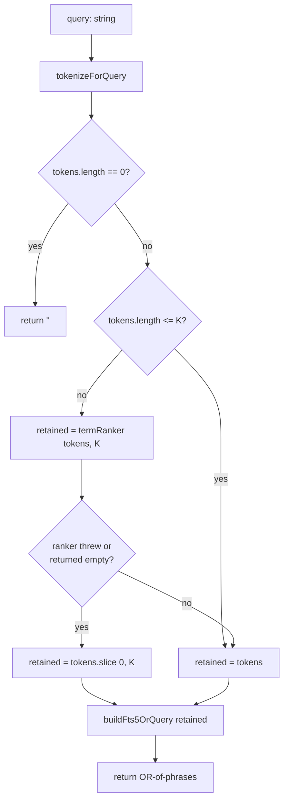
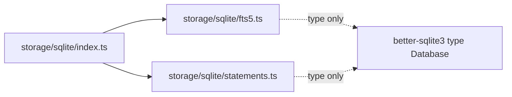

# Design Document

## Overview

Replace the single-phrase FTS5 sanitizer in `src/collector/storage/sqlite/fts5.ts` with a tokenized OR-of-quoted-phrases construction. The new sanitizer:

1. Splits the input on Unicode whitespace and deduplicates tokens while preserving first-occurrence order.
2. If the candidate count exceeds a cap `K` (default 32), ranks tokens by IDF computed against FTS5's `fts5vocab` shadow table and keeps the top `K`. Otherwise keeps every candidate.
3. Quotes each retained token as an FTS5 phrase (doubling interior `"`) and joins with the FTS5 `OR` operator.
4. On empty, whitespace-only, or post-dedupe-empty input, returns `""` — a sentinel the backend treats as "skip the MATCH query, return []".

The module surface stays `(string) => string`. A new handle-bound factory `createFts5Sanitizer(db, opts?)` produces a sanitizer closure that has access to the DB handle for `fts5vocab` lookups; the top-level `sanitizeForFts5` export is preserved as a DB-less fallback used only by the co-located PBT. The backend in `src/collector/storage/sqlite/index.ts` switches to calling the factory-produced closure.

All new code lives under `src/collector/storage/sqlite/`. The modularity guard tests keep passing without modification.

## Architecture

### Module layout

```
src/collector/storage/sqlite/
  fts5.ts              # public surface: sanitizeForFts5, escapeLikePattern, createFts5Sanitizer
                       # internal pure helpers: tokenizeForQuery, buildFts5OrQuery
                       # internal factory: createTermRanker
  statements.ts        # new prepared statements: selectFts5VocabDocFreq, selectFts5DocCount
  migrations/
    (no new migration — fts5vocab is declared lazily in openSqliteStorage)
  index.ts             # openSqliteStorage() wires createFts5Sanitizer(db) once; stores it on a
                       # closed-over variable the searchMemoryRecords method calls
```

**Single file vs split.** Everything goes in `fts5.ts`. The term-ranker and query-builder are 30–50 LOC each, all internal helpers, and they share the same concerns (FTS5 grammar, token handling). Splitting into `term-ranker.ts` would create an extra import-graph edge for no testability gain — the pure helpers are directly testable via named exports from the same file, and the term ranker is only testable against a real SQLite handle (so it lives with the backend either way). Keep it one file.

### Dataflow inside `createFts5Sanitizer(db)`



The ranker handles its own fallback internally (empty corpus, zero-row vocab lookup, SQLite error). From the sanitizer's perspective the ranker is total: it always returns an ordered token list of length ≤ K. The decision-tree in the diagram reflects that — the outer `try/catch` shown as H is belt-and-braces.

### Backend integration

`openSqliteStorage(opts)` currently imports `sanitizeForFts5` as a free function. After the change:

```
openSqliteStorage(opts)
  ├─ open db, run migrations, prepare statements
  ├─ lazily declare fts5vocab virtual table (see "fts5vocab declaration" below)
  ├─ const sanitize = createFts5Sanitizer(db)     ← bound to this handle
  └─ searchMemoryRecords uses sanitize(query)
```

`sanitize(query)` returning `""` short-circuits the search: the backend returns `[]` without executing any SQL. Otherwise the result is passed unchanged to `selectMemoryRecordsFtsMatch`, with the existing LIKE fallback wrapping the MATCH call.

### Module import graph



No new edges out of `storage/sqlite/`. `fts5.ts` takes a `better-sqlite3` `Database` instance as a constructor parameter but only imports the *type*, following the pattern already used by `statements.ts`.

## Components and Interfaces

### `tokenizeForQuery(query: string): readonly string[]`

Pure. Splits on Unicode whitespace (`/\s+/u`), drops empty strings, deduplicates preserving first-occurrence order. Casing and non-whitespace content are unchanged.

```ts
export function tokenizeForQuery(query: string): readonly string[] {
  const seen = new Set<string>();
  const out: string[] = [];
  for (const raw of query.split(/\s+/u)) {
    if (raw === '') continue;
    if (seen.has(raw)) continue;
    seen.add(raw);
    out.push(raw);
  }
  return out;
}
```

**Design notes.**
- `String.prototype.split(/\s+/u)` produces a leading `""` when the input starts with whitespace and a trailing `""` when it ends with whitespace. Filtering empties handles both without a separate `trim`.
- Deduplication is on the raw token — case-sensitive, no normalization. Per Requirement 7.3, case folding and stemming are the FTS5 tokenizer's responsibility at index/query time, not this module's.

### `buildFts5OrQuery(tokens: readonly string[]): string`

Pure. Quotes each token as an FTS5 phrase (doubling interior `"`) and joins with ` OR `. Callers must pass a non-empty list; the empty case is the sanitizer's responsibility.

```ts
export function buildFts5OrQuery(tokens: readonly string[]): string {
  return tokens.map((t) => `"${t.replace(/"/g, '""')}"`).join(' OR ');
}
```

**Grammar notes.**
- Inside a phrase, every FTS5 operator (`AND`, `OR`, `NOT`, `NEAR`, `*`, `(`, `)`, `:`, `^`) is inert. Doubling `"` is the only escape needed.
- ` OR ` with the capital-O keyword form is required — lowercase `or` is a literal term in FTS5, not an operator.

### `createTermRanker(db: Database)`

Factory returning `(tokens: readonly string[], k: number) => readonly string[]`. Handle-bound. Queries `fts5vocab` for document frequencies, computes IDF locally, returns the top `k` tokens by descending IDF. Total — no error escapes.

```ts
interface TermRanker {
  (tokens: readonly string[], k: number): readonly string[];
}
export function createTermRanker(db: Database): TermRanker;
```

**Behaviour.**
1. If `tokens.length <= k`, return tokens unchanged (invariant: the sanitizer already short-circuits this, so this is belt-and-braces).
2. Query `SELECT COUNT(*) FROM memory_records` → `N`. If `N === 0`, return `tokens.slice(0, k)` in original order.
3. Build a variable-arity `IN (?, ?, …)` query against `memory_records_fts_vocab` with one `?` per input token. Run it.
4. Map each input token to its `df` (default `1` for missing tokens → maximum IDF).
5. Compute `idf = Math.log(N / Math.max(df, 1))`.
6. Stable-sort descending by IDF, keeping original-order ties (important for determinism — see Req 7.1).
7. Return the first `k` sorted tokens.

On any thrown error in steps 2–6, catch and return `tokens.slice(0, k)`. The catch is the single fallback surface — the sanitizer does not need to know about it.

### `createFts5Sanitizer(db: Database, opts?: { termCap?: number })`

Factory returning `(query: string) => string`. Composes the tokenizer, ranker, and query builder. Default `termCap` is 32.

```ts
interface SanitizerOpts {
  termCap?: number;
}
export function createFts5Sanitizer(
  db: Database,
  opts?: SanitizerOpts,
): (query: string) => string;
```

**Behaviour.** Exactly the dataflow diagram above. The closure captures the ranker and K by value, so no allocation happens on each call beyond the token array itself.

### `sanitizeForFts5(query: string): string` (existing export, preserved)

Shim over the DB-less path: tokenize → first-K → build. Used only by callers without a DB handle, which in practice means the co-located PBT at `test/unit/sqlite-fts5-sanitize.property.test.ts` (the PBT originally written for the event-schema-and-storage spec's Task 6.6).

```ts
export function sanitizeForFts5(query: string, termCap: number = 32): string {
  const tokens = tokenizeForQuery(query);
  if (tokens.length === 0) return '';
  const retained = tokens.slice(0, termCap);
  return buildFts5OrQuery(retained);
}
```

**Why keep the standalone export.** The existing PBT imports it directly and runs fast-check over it. Moving every test through the factory would force each iteration to open a SQLite handle and declare fts5vocab, which is an order-of-magnitude slower with no added coverage (the factory's DB-specific branches are tested separately). The shim's behaviour is equivalent to the factory's "no IDF, first-K" fallback branch, so it is not a second behaviour to reason about.

Callers in the backend switch exclusively to the factory. The shim stays but is effectively test-only.

### `escapeLikePattern` (unchanged)

Signature and body preserved per Req 10.4.

## Data Models

### fts5vocab declaration

FTS5's `fts5vocab` is a shadow virtual table: declaring `memory_records_fts` does *not* implicitly create a vocab table. We must declare it separately. Two options:

**Option A — migration 0005.**
```sql
CREATE VIRTUAL TABLE memory_records_fts_vocab
  USING fts5vocab(memory_records_fts, 'row');
```
Pros: explicit in the schema history; visible in `PRAGMA table_list`; no first-open race.
Cons: adds a migration file, requires incrementing `MIGRATIONS` in `migrations/index.ts`; vocab tables are stateless views — re-creating them on a corrupted DB costs nothing.

**Option B — lazy CREATE in `openSqliteStorage`.**
```ts
db.exec(`CREATE VIRTUAL TABLE IF NOT EXISTS memory_records_fts_vocab
         USING fts5vocab(memory_records_fts, 'row');`);
```
Pros: no new migration; vocab table is purely derived from the FTS5 table (zero rows of its own), so there is no upgrade hazard; schema additions of this kind are the canonical use case for `IF NOT EXISTS`.
Cons: not in the migration history, so `PRAGMA user_version` does not reflect it.

**Recommendation: Option B.** `fts5vocab` is a stateless view over `memory_records_fts`; dropping and recreating it in a single statement has no data-loss risk and no dependency on prior migrations. The migration stack exists to track *data-shape* changes that require ordered application, and a zero-state derived view is not that. Adding a migration for it would set a precedent for tracking every derived DDL in the history, which is more friction than it is worth. The statement runs once per process on `openSqliteStorage` after `runMigrations` and before `prepareStatements`.

The `'row'` argument to `fts5vocab` selects the schema variant that exposes one row per `(term)` with a `doc` column giving document frequency. The other variants (`'col'`, `'instance'`) are finer-grained than we need.

### Row shape and prepared statement

`memory_records_fts_vocab` columns (`'row'` variant):
- `term TEXT` — the tokenized term as the FTS5 tokenizer emitted it.
- `doc INTEGER` — number of documents containing the term.
- `cnt INTEGER` — total occurrence count across the corpus.

We need only `term` and `doc`. The prepared-statement contract for `better-sqlite3` requires the parameter arity to be known at `prepare()` time, which clashes with the variable-length `IN (?, ?, …)` for a per-call token list. Two viable shapes:

1. **Prepare per call** with an arity-dependent SQL string, cached by token-count in a `Map<number, Statement>`. `better-sqlite3` supports this — `db.prepare` is idempotent-enough that re-preparing the same SQL is cheap.
2. **One prepared statement per token** (`SELECT doc FROM … WHERE term = ?`) invoked in a loop. Simple, but O(K) SQLite calls per sanitizer call.

**Recommendation: shape 1.** K is capped at 32 by default, so the statement cache is bounded. The batch query avoids 32 JS→SQLite round trips per sanitizer call, which matters because retrieval runs inline on the ingest hot path (10.3/11.x retrieval-latency requirements from earlier specs). The cache lives on the closure returned by `createTermRanker`, so it is per-handle and garbage-collected with the handle.

The declared prepared-statement helpers in `statements.ts`:

```ts
// One fixed-arity prepared statement — the corpus doc count.
selectFts5DocCount: Statement<[], { total: number }>;

// A factory, not a prepared statement — returns an arity-specific
// prepared statement from an internal cache.
prepareSelectFts5VocabDocFreq: (arity: number) => Statement<string[], { term: string; doc: number }>;
```

The factory is exposed via `prepareStatements` return type as a function the backend can call at sanitizer construction time. The `Statement` generic's first type parameter becomes `string[]` (variadic) rather than a fixed tuple for this one entry, which `better-sqlite3`'s `.all(...args)` accepts.

### IDF calculation

Given `N` from `selectFts5DocCount` and a `Map<string, number>` of `term → doc` from the batch lookup:

```ts
const idf = (token: string): number => {
  const df = docFreq.get(token) ?? 1;   // unseen → maximum IDF (Req 4.5)
  return Math.log(N / Math.max(df, 1));
};
```

The `max(df, 1)` guard is defensive: `fts5vocab` only returns rows for seen terms so in practice `df >= 1` always, but a corrupted vocab row with `doc = 0` would otherwise produce `Infinity` or NaN.

### Token casing for fts5vocab lookup

FTS5's `porter unicode61 remove_diacritics 2` tokenizer emits lowercased, diacritic-folded, Porter-stemmed terms. The `fts5vocab('row')` view exposes those normalized terms. Our input tokens come from the user unchanged (Req 7.3).

Mismatch: querying `fts5vocab` with `"JSON"` when the stored term is `"json"` returns zero rows, which the ranker treats as `df = 1` (unseen → maximum IDF). That is a *valid* outcome per Req 4.5 — the system assumes unseen terms are high-value. But it is also wasteful: every user token with uppercase letters or diacritics would bypass IDF ranking entirely, defeating the cap's purpose when the user pastes code full of CamelCase identifiers.

**Recommendation: lowercase before the fts5vocab lookup, preserve original casing in the output.**

```ts
const normalized = tokens.map((t) => t.toLowerCase());
// … lookup against normalized
// … build docFreq on normalized
const idfFor = (i: number) => idfOf(normalized[i]);
// …
// sort original tokens by IDF of their normalized form
```

This matches the tokenizer's own first step (`unicode61` lowercases) without trying to replicate its full pipeline (Porter stemming, diacritic folding). The cost of an imperfect match — stemmed forms not collapsing — is the same as today's casing mismatch: unseen-term fallback to maximum IDF. So we get most of the benefit with a single `toLowerCase()` call per token and no dependency on a stemmer.

We do *not* lowercase in the final MATCH expression. The FTS5 tokenizer runs again at query time against the phrase content and does the same normalization, so `"JSON" OR "Parse"` and `"json" OR "parse"` match identically. Preserving original casing in the output keeps the behaviour one step closer to what the user typed, which matters for debuggability if someone reads a failing test's counterexample.

### Corpus-size threshold

Requirement 5.1 bypasses IDF on an empty corpus. Should we also bypass on a *small* corpus (e.g. N < 10)?

**Recommendation: no additional threshold beyond N = 0.** IDF's `log(N/df)` is well-defined and monotonic for any `N >= 1`; with `N = 1` and `df = 1`, `log(1/1) = 0` — every seen term has IDF 0 and only unseen terms (IDF `log(N)` = 0 as well) rank. That degenerates the ranking to "all terms tied", which the stable sort resolves by first-occurrence order — the same outcome as the small-corpus fallback. So the extra threshold would add code for no behavioural difference.

At `N = 2` and two terms with `df = 1, 2`, the IDF values are `log(2) ≈ 0.69` and `0` respectively — a meaningful ranking. At that point IDF is already doing useful work. There is no principled threshold between "useless" and "useful" except `N = 0`, which is already handled.

## Correctness Properties

*A property is a characteristic or behavior that should hold true across all valid executions of a system — essentially, a formal statement about what the software should do. Properties serve as the bridge between human-readable specifications and machine-verifiable correctness guarantees.*

The prework analysis classified each acceptance criterion and consolidated overlapping properties. The final list below is 10 properties, each providing unique validation value. Properties omitted from the prework (static guard tests, compile-time checks, and existing covered behaviour) are handled as SMOKE or EXAMPLE tests in the Testing Strategy section.

### Property 1: Tokenizer round-trip

*For any* Unicode input string `s`, let `ts = tokenizeForQuery(s)`. Then:
- every element of `ts` is non-empty, contains no Unicode whitespace character, and appears exactly once in `ts`; and
- `tokenizeForQuery(ts.join(' '))` equals `ts`.

**Validates: Requirements 1.1, 1.2, 1.3, 7.2, 11.1**

### Property 2: Tokens are substrings of the input

*For any* Unicode input string `s` and every element `t ∈ tokenizeForQuery(s)`, `t` appears as a contiguous substring of `s` with its original character sequence and casing preserved.

**Validates: Requirements 7.3**

### Property 3: Query builder round-trips every token as an escaped phrase

*For any* non-empty deduplicated token list `ts`, `buildFts5OrQuery(ts)` consists of exactly `ts.length` quoted phrases separated by exactly `ts.length - 1` occurrences of the literal ` OR `, where the `i`-th phrase decodes (by stripping the surrounding `"` and replacing `""` with `"`) to `ts[i]` — and no other quoted phrases appear in the output.

**Validates: Requirements 1.4, 1.5, 3.2, 3.3, 3.4, 6.2, 6.3, 11.2**

### Property 4: Sanitizer output is always valid FTS5 or empty

*For any* Unicode input string `s` and any positive integer `k ≤ 32`, `sanitizeForFts5(s, k)` is either `""` or a string that the `selectMemoryRecordsFtsMatch` prepared statement accepts without throwing when executed against a prepared in-memory SQLite handle.

**Validates: Requirements 1.6, 3.1, 11.3**

### Property 5: Empty sanitizer output iff empty tokenization, and the backend skips SQL in that case

*For any* input string `s`, `sanitizeForFts5(s) === ''` if and only if `tokenizeForQuery(s).length === 0`. When the sanitizer returns `''`, `backend.searchMemoryRecords({ namespace, query: s, limit })` returns `[]` without invoking either `selectMemoryRecordsFtsMatch` or `selectMemoryRecordsLike`.

**Validates: Requirements 2.1, 2.2, 2.3, 13.3**

### Property 6: Term cap is honoured exactly

*For any* input string `s` and any positive integer `k`, the sanitizer's output contains exactly `min(tokenizeForQuery(s).length, k)` quoted phrases, every one of which decodes to a distinct token from `tokenizeForQuery(s)`.

**Validates: Requirements 6.1, 12.1, 12.2, 12.3**

### Property 7: Term ranker returns a sub-sequence of its input of length min(|input|, k)

*For any* deduplicated token list `ts` and positive integer `k`, `termRanker(ts, k)` returns a list `rs` of length `min(ts.length, k)` in which every element is drawn from `ts`, every element is distinct, and the ranker holds this invariant across corpus states (empty, populated, vocab-table-missing).

**Validates: Requirements 4.4, 4.6, 5.1, 5.2, 6.2, 6.3**

### Property 8: Term ranker orders by document frequency

*For any* populated corpus where every token `t` has a known document frequency `df(t)` (with unseen tokens assigned `df = 1`), and any deduplicated token list `ts` with `|ts| > k`, every retained token `r ∈ termRanker(ts, k)` satisfies `df(r) <= df(d)` for every dropped token `d ∈ ts \ rs`.

**Validates: Requirements 4.2, 4.3, 4.5**

### Property 9: Term ranker is total under vocab-table failure

*For any* deduplicated token list `ts` and positive integer `k`, if the `fts5vocab` prepared statement throws (simulated by dropping `memory_records_fts_vocab` after sanitizer construction), `termRanker(ts, k)` equals `ts.slice(0, k)` and does not throw.

**Validates: Requirements 5.3**

### Property 10: Any memory record sharing a tokenizer-emitted term with the query is retrieved

*For any* memory record `m` inserted into the FTS5 index in namespace `ns`, and any input query `s` such that the FTS5 tokenizer's emitted term set for `tokenizeForQuery(s)` intersects the tokenizer's emitted term set for `m.title ∪ m.summary ∪ m.facts`, `backend.searchMemoryRecords({ namespace: ns, query: s, limit: 10 })` includes a row with `record_id === m.record_id`. Conversely, if the intersection is empty, the result does not include `m` and the LIKE fallback is not invoked.

**Validates: Requirements 13.1, 13.2**

## Error Handling

### Sanitizer errors (none)

`createFts5Sanitizer` returns a total function. Every internal failure path has a fallback:

- `tokenizeForQuery` can't throw on a string input (split is total).
- `buildFts5OrQuery` can't throw on a non-empty string array (map + join).
- `createTermRanker`'s closure wraps the fts5vocab lookup and doc-count query in a single `try/catch` that falls back to `tokens.slice(0, k)`.

The sanitizer itself never throws. That is the interface contract `searchMemoryRecords` relies on — it expects `sanitize(query)` to always return a string.

### Backend-level errors (unchanged)

The existing `try { selectMemoryRecordsFtsMatch } catch { selectMemoryRecordsLike }` structure in `searchMemoryRecords` is preserved. Per Requirement 8.1, the LIKE fallback remains the last line of defence. The new sanitizer is intended to always produce valid FTS5, but a currently-unknown FTS5 quirk should still degrade to LIKE rather than surface a 500 to the caller.

The backend adds one new branch above the try/catch: if `sanitize(query)` returns `""`, return `[]` immediately without touching either prepared statement (Req 2.3, 13.3). The original unsanitised query string is no longer passed to LIKE in this branch — per Req 13.3, empty/whitespace queries return no results period.

### Ranker-level error paths

| Condition | Action |
|---|---|
| `N = 0` (empty corpus) | Return `tokens.slice(0, k)` in original order. |
| `fts5vocab` lookup throws | Return `tokens.slice(0, k)` in original order. |
| `fts5vocab` lookup returns zero rows for every token | Every token's `df` defaults to 1 → every token has identical IDF `log(N/1)` → stable sort preserves first-occurrence order → result equals `tokens.slice(0, k)`. The explicit "every row missing" fallback in Req 5.2 is covered by the generic IDF computation without a special case. |

## Testing Strategy

### Unit tests (example-based)

Co-located at `test/unit/sqlite-fts5-sanitize.test.ts` (existing, extended).

**Pure helpers — direct-import tests.**
- `tokenizeForQuery`: fixed examples covering leading/trailing/interior whitespace, duplicate tokens, casing preservation, Unicode whitespace (e.g. `\u00A0` non-breaking space).
- `buildFts5OrQuery`: fixed examples for single token, multi-token, tokens with embedded `"`, tokens consisting entirely of FTS5 operators (`AND`, `*`, `:`).
- `sanitizeForFts5` shim: end-to-end combining the above.

**Factory + DB — in-memory SQLite tests.**
- `createFts5Sanitizer(db)` with an empty corpus → any input produces first-K output.
- `createFts5Sanitizer(db)` with a populated corpus where `the` has high df and `syzygy` has df=1 → `"the syzygy the the"` yields retained tokens ordered `[syzygy, the]` (one each, unique-after-dedup).
- Ranker correctly lowercases for lookup but preserves original-case tokens in the output.
- Detaching `memory_records_fts_vocab` and invoking the sanitizer returns the first-K fallback without throwing.

**Backend integration — co-located at `test/unit/sqlite-backend.test.ts` (existing).**
- Two memory records whose indexed text share no common substring beyond a single token; a query containing that token returns the record. (Previously impossible with the single-phrase sanitizer.)
- An empty query returns `[]` and does not invoke either prepared statement (verified via stub/spy on the prepared statement objects).
- An existing test case that asserted "multi-word query returns empty" is expected to *change* direction — it will now return the record.

### Property-based tests

Co-located at `test/unit/sqlite-fts5-sanitize.property.test.ts` (existing, extended). Each uses `fast-check` with ≥ 100 iterations.

- **P1, P2, P5, P6, P7** — pure, no DB, use `fast-check` arbitraries for Unicode strings (`fc.fullUnicodeString`) and small positive integers for `k`.
- **P3** — pure, use `fc.array(fc.fullUnicodeString(), { minLength: 1, maxLength: 32 })` filtered to deduplicated non-empty tokens.
- **P4, P9, P10** — require an in-memory SQLite instance. Create it once per test in `beforeEach`, seed with `fc.sample` of MemoryRecord arbitraries from `test/helpers/arbitrary.ts`, run the property. The in-memory DB's `:memory:` path avoids disk I/O so 100 iterations run in < 1s.
- **P8** — requires the ability to force a vocab-table error. Done by `db.exec('DROP TABLE memory_records_fts_vocab')` after sanitizer construction, then invoking the sanitizer.

### Test harness conventions followed

- Existing `test/unit/sqlite-backend.test.ts` pattern: `openSqliteStorage({ dbPath: ':memory:' })` in `beforeEach`, close in `afterEach`.
- Existing `test/helpers/arbitrary.ts` `memoryRecordArb()` generator reused without modification.
- Property test tag comment on each `fc.assert`:
  ```ts
  // Feature: fts5-query-tokenization, Property N: <property text>
  ```

### Tests that must change

The following existing tests in `test/unit/sqlite-backend.test.ts` need review:

- Any test that seeds records whose title/summary contain tokens present in the query but asserts an empty result set is expected to now return the seeded record. These were arguably miswritten against the old single-phrase behaviour; update the expectation to match the new tokenized OR semantics.
- Any test that passes a multi-word query expecting an exact-phrase match must either narrow the query to a single token or update the expectation.

Per the requirements document's Req 13.1, a query sharing any single token with an indexed record's text must return that record; the existing "multi-word query returns empty" tests are directly at odds with that.

## Migration Concerns

No SQLite data migration. `fts5vocab` is a stateless view over `memory_records_fts` and is declared at `openSqliteStorage` time with `CREATE VIRTUAL TABLE IF NOT EXISTS`. The migration stack (`MIGRATIONS` in `migrations/index.ts`) is unchanged at four entries.

On an upgrade from a kiro-learn version that did not declare `memory_records_fts_vocab`, the first `openSqliteStorage` call on the existing DB creates it; subsequent opens are no-ops. On a downgrade, the vocab table remains in the file but is unused — SQLite has no issue with unreferenced virtual tables.

## Backward Compatibility

**Unchanged.**
- `sanitizeForFts5` export, signature, and "no-DB" behaviour (now equivalent to the `first-K` fallback branch, which is a superset of the old "single phrase" behaviour for inputs of length ≤ K — see below for the one case this differs).
- `escapeLikePattern` signature and body.
- `StorageBackend` interface and `searchMemoryRecords` signature.
- FTS5 table DDL, tokenizer configuration, prepared-statement shapes (except for the two new fts5vocab-related entries).
- Migration stack.
- Public HTTP API, MCP tool signatures.

**Observable behaviour changes.**
- A query containing *any* token present in an indexed record's text now returns that record. Previously, only queries that were verbatim substrings of an indexed record returned it.
- Ranking uses FTS5 BM25 over multiple terms, not single-phrase occurrence. This means results are ordered by relevance, not by record boundaries that happen to contain the full prompt.
- Empty and whitespace-only queries now return `[]` without invoking the LIKE fallback. Previously they invoked FTS5 MATCH with `""` which produced a parse error and dropped through to LIKE — which returned `[]` on the old pattern but incurred one spurious prepared-statement call per empty query.

**Tests that must update.** See "Tests that must change" above.

**No schema migration, no data rewrite, no wire-protocol change.** The change is local to `src/collector/storage/sqlite/` and is safe to roll out without coordination with the UI, MCP server, or shim.
