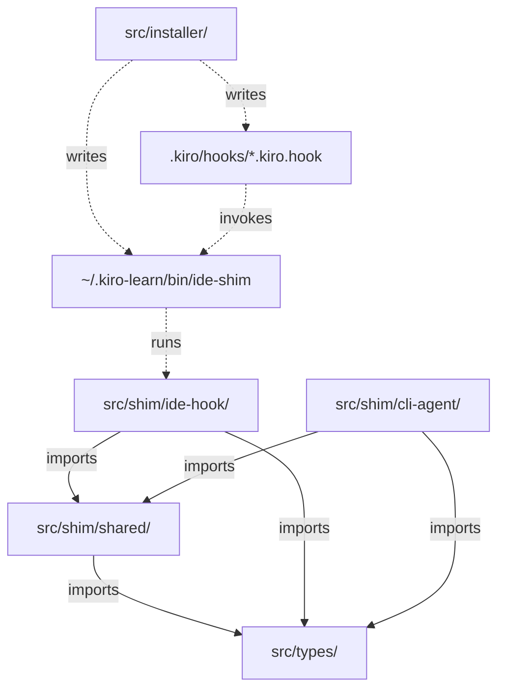

# Design: Kiro IDE Hook Shim

## Overview

The Kiro IDE hook shim bridges Kiro IDE's `.kiro/hooks/*.kiro.hook` mechanism to the kiro-learn collector daemon. It achieves the same goals as the existing CLI agent shim (`src/shim/cli-agent/`) — capturing events, posting them to the collector, and injecting retrieval context — but through the IDE's hook execution model instead of kiro-cli's stdin-JSON model.

The key differences from the CLI shim:

- **Input source**: `USER_PROMPT` environment variable (not stdin)
- **Dispatch mechanism**: CLI argument (`ide-shim promptSubmit`) instead of a `hook_event_name` field in JSON
- **Payload format**: plain text for `promptSubmit`/`agentStop`, camelCase JSON for `postToolUse` (vs. snake_case JSON for all CLI hooks)
- **No spawn event**: the IDE has no `agentSpawn` lifecycle event; sessions are created implicitly via `readSession`'s fallback behavior
- **Source surface**: `source.surface: 'kiro-ide'` instead of `'kiro-cli'`

The shim reuses `src/shim/shared/` for configuration, session management, event building, body truncation, and HTTP transport. The only new code is the IDE-specific input parsing and dispatch logic at `src/shim/ide-hook/index.ts`, plus installer integration to deploy `.kiro/hooks/*.kiro.hook` files and the `~/.kiro-learn/bin/ide-shim` wrapper.

## Architecture

```text
Kiro IDE hook trigger
  │
  ├─ sets USER_PROMPT env var (payload)
  ├─ sets PWD to project root
  │
  └─ executes: "~/.kiro-learn/bin/ide-shim" <eventType> || true
       │
       ▼
  src/shim/ide-hook/index.ts
       │
       ├─ reads process.argv[2] → event type dispatch
       ├─ reads process.env.USER_PROMPT → payload
       ├─ reads process.cwd() → working directory
       │
       ├─ imports from src/shim/shared/
       │    ├─ loadConfig()
       │    ├─ readSession(cwd)
       │    ├─ buildEvent({ ..., surface: 'kiro-ide' })
       │    ├─ truncateBody(body, maxBytes)
       │    └─ postEvent(event, opts, config)
       │
       ├─ promptSubmit → kind: 'prompt', retrieve=true, stdout=context
       ├─ postToolUse  → kind: 'tool_use', retrieve=false, no stdout
       ├─ agentStop    → kind: 'session_summary', retrieve=false, no stdout
       │
       └─ exit 0 (always)
```

### Dependency Graph



Modularity boundaries (enforced by guard tests):

| Module | May import from | Must NOT import from |
|---|---|---|
| `src/shim/ide-hook/` | `src/shim/shared/`, `src/types/` | `src/shim/cli-agent/`, `src/collector/`, `src/installer/` |
| `src/shim/shared/` | `src/types/` | `src/shim/ide-hook/`, `src/shim/cli-agent/`, `src/collector/`, `src/installer/` |
| `src/shim/cli-agent/` | `src/shim/shared/`, `src/types/` | `src/shim/ide-hook/`, `src/collector/`, `src/installer/` |

## Components and Interfaces

### 1. IDE Shim Module (`src/shim/ide-hook/index.ts`)

The IDE shim is a single-file module exporting a `main()` function. It follows the same structural pattern as the CLI shim but with IDE-specific input parsing.

#### Exported Functions

```typescript
/**
 * Main entry point for the IDE hook shim.
 *
 * Reads the hook event type from process.argv[2], the payload from
 * process.env.USER_PROMPT, and the working directory from process.cwd().
 * Dispatches to the appropriate handler. Always exits 0.
 */
export async function main(): Promise<void>;
```

#### Internal Handler Functions

```typescript
/**
 * Handle the `promptSubmit` hook.
 * - Reads USER_PROMPT as plain text
 * - Builds a 'prompt' event with text body
 * - POSTs with retrieve=true
 * - Writes retrieval context to stdout if available
 */
async function handlePrompt(userPrompt: string, cwd: string): Promise<void>;

/**
 * Handle the `postToolUse` hook.
 * - Parses USER_PROMPT as camelCase JSON
 * - Maps camelCase fields to snake_case convention
 * - Builds a 'tool_use' event with json body
 * - POSTs with retrieve=false
 * - No stdout output
 */
async function handleToolUse(userPrompt: string, cwd: string): Promise<void>;

/**
 * Handle the `agentStop` hook.
 * - Reads USER_PROMPT as plain text (summary)
 * - Builds a 'session_summary' event with text body
 * - POSTs with retrieve=false
 * - No stdout output
 */
async function handleStop(userPrompt: string, cwd: string): Promise<void>;
```

#### IDE postToolUse Payload Shape

The IDE delivers `postToolUse` payloads in camelCase JSON via `USER_PROMPT`:

```typescript
/** Shape of the IDE's postToolUse payload in USER_PROMPT. */
interface IdeToolUsePayload {
  toolName?: string;
  toolArgs?: Record<string, unknown>;
  toolResult?: string;
  toolSuccess?: boolean;
}
```

The shim maps this to the kiro-learn snake_case convention used by the CLI shim:

| IDE field (camelCase) | kiro-learn field (snake_case) |
|---|---|
| `toolName` | `tool_name` |
| `toolArgs` | `tool_input` |
| `toolResult` | `tool_response.result` |
| `toolSuccess` | `tool_response.success` |

### 2. Shared Shim Change: `buildEvent` Surface Parameter

The `buildEvent` function in `src/shim/shared/index.ts` currently hardcodes `source.surface: 'kiro-cli'`. It needs a new optional `surface` parameter so the IDE shim can specify `'kiro-ide'`.

```typescript
export interface EventBuildParams {
  kind: KiroMemEvent['kind'];
  body: KiroMemEvent['body'];
  sessionId: string;
  cwd: string;
  parentEventId?: string;
  /** Source surface identifier. Defaults to 'kiro-cli' for backward compatibility. */
  surface?: 'kiro-cli' | 'kiro-ide';
}
```

The change is backward-compatible: the CLI shim continues to omit the parameter and gets the default `'kiro-cli'` behavior. The IDE shim passes `surface: 'kiro-ide'`.

### 3. IDE Hook File Format

Each `.kiro.hook` file is a JSON object with this structure:

```json
{
  "enabled": true,
  "name": "kiro-learn-prompt",
  "description": "kiro-learn: capture user prompts for memory",
  "version": "1",
  "when": {
    "type": "promptSubmit"
  },
  "then": {
    "type": "runCommand",
    "command": "\"~/.kiro-learn/bin/ide-shim\" promptSubmit || true"
  }
}
```

Three hook files are generated:

| File | `when.type` | Event kind | Extra `when` fields |
|---|---|---|---|
| `kiro-learn-prompt.kiro.hook` | `promptSubmit` | `prompt` | — |
| `kiro-learn-stop.kiro.hook` | `agentStop` | `session_summary` | — |
| `kiro-learn-tool.kiro.hook` | `postToolUse` | `tool_use` | `toolTypes: ["*"]` |

The `then.command` field quotes the shim path to handle home directories with spaces. The `|| true` suffix ensures exit 0 even if the shim process itself fails to start.

### 4. Installer Integration

#### Hook File Generation

A new function `writeIdeHookFiles(projectRoot: string)` in `src/installer/index.ts`:

- Creates `<projectRoot>/.kiro/hooks/` if it doesn't exist
- Writes the three `.kiro.hook` files with `JSON.stringify(obj, null, 2) + '\n'`
- Called from `cmdInit` when `scope.projectRoot` is defined and `--global-only` is not set

#### IDE Shim Bin Wrapper

A new wrapper at `~/.kiro-learn/bin/ide-shim`:

```javascript
#!/usr/bin/env node
import { main } from "../lib/shim/ide-hook/index.js";
main().catch(() => {});
```

Written by `writeBinWrappers()` alongside the existing `shim`, `collector`, and `kiro-learn` wrappers.

#### Uninstall Cleanup

`cmdUninstall` is extended to remove the three kiro-learn `.kiro.hook` files from `<projectRoot>/.kiro/hooks/` when a project scope is detected. Non-kiro-learn hook files and the `.kiro/hooks/` directory itself are preserved.

### 5. Main Dispatch Flow

```typescript
export async function main(): Promise<void> {
  try {
    const eventType = process.argv[2];
    const userPrompt = process.env['USER_PROMPT'] ?? '';
    const cwd = process.cwd();

    switch (eventType) {
      case 'promptSubmit':
        await handlePrompt(userPrompt, cwd);
        break;
      case 'postToolUse':
        await handleToolUse(userPrompt, cwd);
        break;
      case 'agentStop':
        await handleStop(userPrompt, cwd);
        break;
      default:
        if (eventType !== undefined) {
          process.stderr.write(
            `[kiro-learn] unrecognized IDE hook event: ${eventType}\n`
          );
        } else {
          process.stderr.write(
            '[kiro-learn] missing IDE hook event type argument\n'
          );
        }
        break;
    }
  } catch (err: unknown) {
    const message = err instanceof Error ? err.message : String(err);
    process.stderr.write(`[kiro-learn] unexpected error: ${message}\n`);
  }
  // Always exits 0 — no process.exit() call, no throw escapes
}
```

## Data Models

### Event Wire Format

IDE shim events use the same `KiroMemEvent` schema as CLI shim events. The only difference is `source.surface`:

```typescript
// IDE shim event
{
  event_id: "01HXYZ...",           // ULID
  session_id: "uuid-v4",           // from readSession(cwd)
  actor_id: "username",            // from os.userInfo()
  namespace: "/actor/username/project/<sha256>/",
  schema_version: 1,
  kind: "prompt",                  // or "tool_use" or "session_summary"
  body: { type: "text", content: "user prompt text" },
  valid_time: "2024-01-01T00:00:00.000Z",
  source: {
    surface: "kiro-ide",           // ← the distinguishing field
    version: "0.x.y",
    client_id: "hostname",
    project_path: "/absolute/path/to/project"
  }
}
```

### Hook File Schema

```typescript
interface KiroHookFile {
  enabled: boolean;
  name: string;
  description: string;
  version: string;
  when: {
    type: string;
    toolTypes?: string[];
  };
  then: {
    type: string;
    command: string;
  };
}
```

### postToolUse Field Mapping

```
IDE (USER_PROMPT JSON)          →  kiro-learn event body (json.data)
─────────────────────────────      ──────────────────────────────────
{ toolName: "readFile" }        →  { tool_name: "readFile" }
{ toolArgs: { path: "x" } }    →  { tool_input: { path: "x" } }
{ toolResult: "contents..." }   →  { tool_response: { result: "contents..." } }
{ toolSuccess: true }           →  { tool_response: { success: true } }
```

When fields are missing from the IDE payload, defaults are applied:

| Missing field | Default value |
|---|---|
| `toolName` | `"unknown"` |
| `toolArgs` | `{}` |
| `toolResult` | (omitted from `tool_response`) |
| `toolSuccess` | (omitted from `tool_response`) |

## Correctness Properties

*A property is a characteristic or behavior that should hold true across all valid executions of a system — essentially, a formal statement about what the system should do. Properties serve as the bridge between human-readable specifications and machine-verifiable correctness guarantees.*

### Property 1: Event Schema Conformance

*For any* input combination (event type from `{promptSubmit, postToolUse, agentStop}` and any `USER_PROMPT` string), the event produced by the IDE shim SHALL pass `parseEvent()` validation (the Zod `EventSchema`). This ensures IDE-originated events are wire-compatible with CLI-originated events.

**Validates: Requirements 7.1, 7.2, 7.3, 5.4**

### Property 2: Surface Identification Invariant

*For any* event produced by the IDE shim, `event.source.surface` SHALL equal `'kiro-ide'`. The IDE shim never produces events with `source.surface: 'kiro-cli'`.

**Validates: Requirements 5.1**

### Property 3: Tool-Use Field Mapping Completeness

*For any* valid camelCase `postToolUse` JSON payload in `USER_PROMPT`, the IDE shim SHALL produce an event body containing `tool_name`, `tool_input`, and `tool_response` fields with values correctly mapped from the IDE's `toolName`, `toolArgs`, `toolResult`, and `toolSuccess` fields respectively. No IDE payload field SHALL be silently dropped.

**Validates: Requirements 7.2, 4.7**

### Property 4: Graceful Degradation on Malformed Input

*For any* non-JSON string provided as `USER_PROMPT` when the event type is `postToolUse`, the IDE shim SHALL produce a valid event with default values (`tool_name: "unknown"`, `tool_input: {}`, `tool_response: {}`) and SHALL NOT throw or exit non-zero.

**Validates: Requirements 4.9, 7.5, 11.1**

### Property 5: Exit Code Safety

*For any* possible input (valid event types, unrecognized event types, missing arguments, empty `USER_PROMPT`, malformed JSON, oversized payloads) and *for any* collector state (healthy, connection refused, timeout, non-2xx response), the IDE shim SHALL exit with code 0.

**Validates: Requirements 11.1, 11.2**

### Property 6: Hook File Round-Trip

*For any* hook file object generated by the installer's hook file generation function, `JSON.parse(JSON.stringify(hookFile, null, 2))` SHALL produce a deeply equal object.

**Validates: Requirements 13.2**

### Property 7: Hook Command Format

*For any* shim executable path (including paths with spaces, special characters, and varying home directory locations), the `then.command` field in every generated hook file SHALL contain the quoted shim path, the hook event type as an argument, and end with ` || true`.

**Validates: Requirements 1.8, 13.4**

### Property 8: Output Channel Discipline

*For any* `postToolUse` or `agentStop` event, and *for any* error condition during `promptSubmit` processing, the IDE shim SHALL write nothing to stdout. All diagnostic output SHALL go to stderr with a `[kiro-learn]` prefix.

**Validates: Requirements 8.4, 11.4, 11.5**

## Error Handling

### Error Hierarchy

All errors are handled within the shim — nothing propagates to the IDE. The error handling follows a defense-in-depth strategy:

1. **Layer 1: Per-operation error handling** — Transport errors (connection refused, timeout, non-2xx) are caught inside `postEvent` in `src/shim/shared/index.ts`, which returns `null` and logs to stderr. JSON parse failures in `handleToolUse` are caught by a local try/catch that falls back to defaults.
2. **Layer 2: Top-level try/catch** — The `main()` function wraps the entire dispatch in a try/catch. Any uncaught exception is logged to stderr and swallowed.
3. **Layer 3: `|| true` suffix** — The hook file command includes `|| true` so even a Node.js crash (segfault, OOM) doesn't propagate a non-zero exit to the IDE.

### Specific Error Scenarios

| Scenario | Behavior |
|---|---|
| `USER_PROMPT` unset/empty | Proceed with empty string defaults |
| `USER_PROMPT` is invalid JSON for `postToolUse` | Log `[kiro-learn] failed to parse USER_PROMPT JSON`, use defaults |
| Missing/unrecognized argv[2] | Log `[kiro-learn] unrecognized IDE hook event: <value>` or `[kiro-learn] missing IDE hook event type argument`, exit 0 |
| Collector connection refused | Logged by `postEvent` in shared module, returns null, shim exits 0 |
| Collector timeout | Logged by `postEvent` in shared module (2s timeout), returns null, shim exits 0 |
| Collector non-2xx response | Logged by `postEvent` in shared module, returns null, shim exits 0 |
| `process.cwd()` throws | Caught by top-level try/catch, logged, exit 0 |
| Any unexpected exception | Caught by top-level try/catch, logged as `[kiro-learn] unexpected error: <message>`, exit 0 |

### Stderr Format

All diagnostic output uses the `[kiro-learn]` prefix:

```
[kiro-learn] failed to parse USER_PROMPT JSON
[kiro-learn] unrecognized IDE hook event: someUnknownType
[kiro-learn] missing IDE hook event type argument
[kiro-learn] unexpected error: <message>
```

No event body content or `USER_PROMPT` values are logged to stderr (security: may contain sensitive data).

## Testing Strategy

### Property-Based Tests (fast-check)

Property-based tests use `fast-check` with a minimum of 100 iterations per property. Each test references its design document property.

| Property | Test file | What it generates |
|---|---|---|
| P1: Event schema conformance | `ide-hook-schema-conformance.property.test.ts` | Random event types × random USER_PROMPT strings |
| P2: Surface identification | Combined with P1 (same generated events, additional assertion) | — |
| P3: Tool-use field mapping | `ide-hook-field-mapping.property.test.ts` | Random camelCase tool-use payloads |
| P4: Graceful degradation | `ide-hook-graceful-degradation.property.test.ts` | Random non-JSON strings as USER_PROMPT |
| P5: Exit code safety | `ide-hook-exit-safety.property.test.ts` | Random inputs × simulated collector failures |
| P6: Hook file round-trip | `ide-hook-file-roundtrip.property.test.ts` | Random shim paths → hook file objects |
| P7: Hook command format | Combined with P6 (same generated hook files, additional assertions) | — |
| P8: Output channel discipline | `ide-hook-output-discipline.property.test.ts` | Random inputs for non-prompt events |

Tag format: `Feature: kiro-ide-hook-shim, Property {N}: {title}`

### Test Generators

New generators in `test/helpers/arbitrary.ts`:

```typescript
/** Arbitrary camelCase IDE postToolUse payload. */
export function ideToolUsePayloadArb(): fc.Arbitrary<IdeToolUsePayload>;

/** Arbitrary IDE hook file object. */
export function ideHookFileArb(): fc.Arbitrary<KiroHookFile>;

/** Arbitrary shim executable path (including paths with spaces). */
export function shimPathArb(): fc.Arbitrary<string>;
```

### Unit Tests (Example-Based)

| Test file | What it covers |
|---|---|
| `ide-hook-dispatch.test.ts` | Event type dispatch: promptSubmit, postToolUse, agentStop, unknown, missing |
| `ide-hook-prompt.test.ts` | Prompt handling: text passthrough, empty USER_PROMPT, retrieval context output |
| `ide-hook-tool-use.test.ts` | Tool-use handling: field mapping, partial payloads, JSON parse failure |
| `ide-hook-stop.test.ts` | Stop handling: text passthrough, empty USER_PROMPT |
| `ide-hook-session.test.ts` | Session management: readSession used (not createSession), shared session files |
| `ide-hook-installer.test.ts` | Hook file generation, bin wrapper, uninstall cleanup |
| `ide-hook-surface.test.ts` | buildEvent surface parameter, backward compatibility |

### Guard Tests

| Test file | What it enforces |
|---|---|
| `no-collector-in-shim.test.ts` (existing, extended) | `src/shim/ide-hook/` does not import from `src/collector/` or `src/installer/` |
| `no-cli-agent-in-ide-hook.test.ts` (new) | `src/shim/ide-hook/` does not import from `src/shim/cli-agent/` |
| `no-ide-hook-in-shared.test.ts` (new) | `src/shim/shared/` does not import from `src/shim/ide-hook/` |

### Test Approach for Shared Shim Change

The `buildEvent` surface parameter change is tested by:

1. **Backward compatibility**: Existing CLI shim tests continue to pass without modification (surface defaults to `'kiro-cli'`).
2. **New surface**: IDE shim tests verify `source.surface === 'kiro-ide'` on all generated events.
3. **Property test**: P2 (surface identification invariant) verifies the surface is always `'kiro-ide'` across 100+ random inputs.

### Mocking Strategy

Tests mock the shared shim's `postEvent` function to avoid real HTTP calls. The mock captures the event object for assertion and returns configurable responses (success with retrieval, success without retrieval, null for failures).

`process.cwd()` is mocked to return a controlled temp directory. `process.env.USER_PROMPT` is set/unset per test case. `process.argv` is manipulated to simulate different event type arguments.
