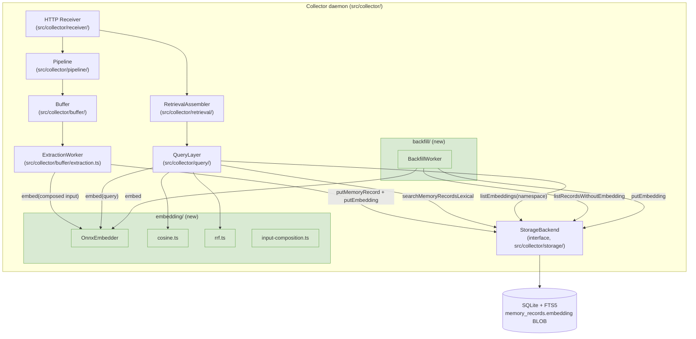
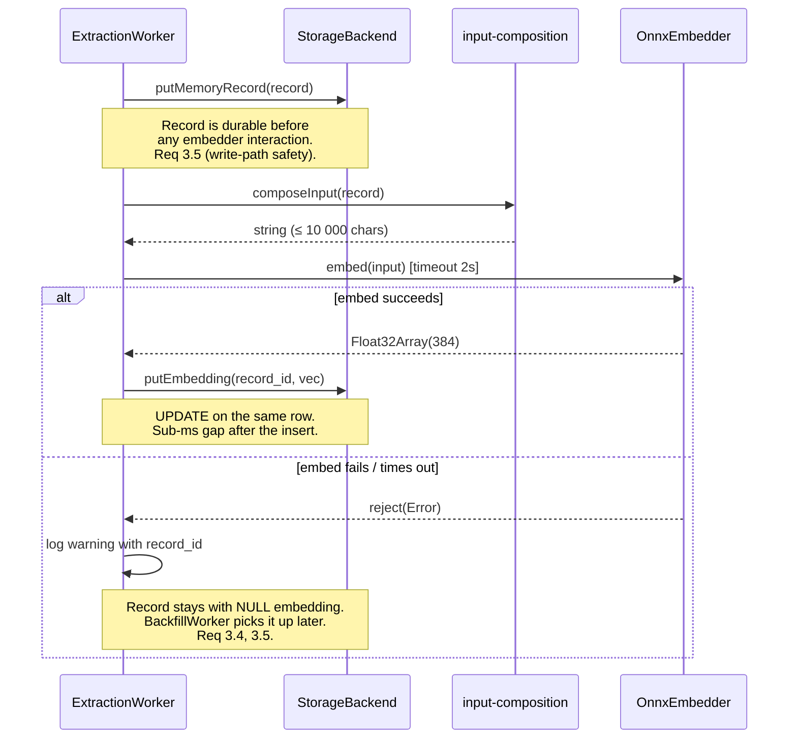
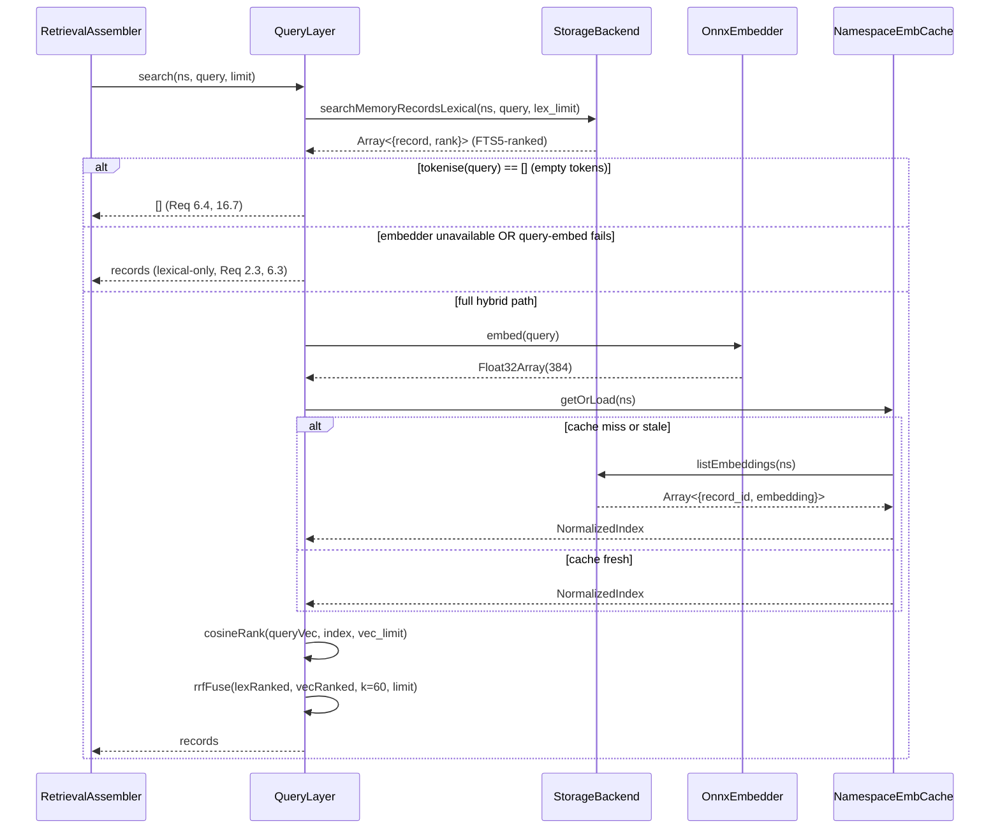
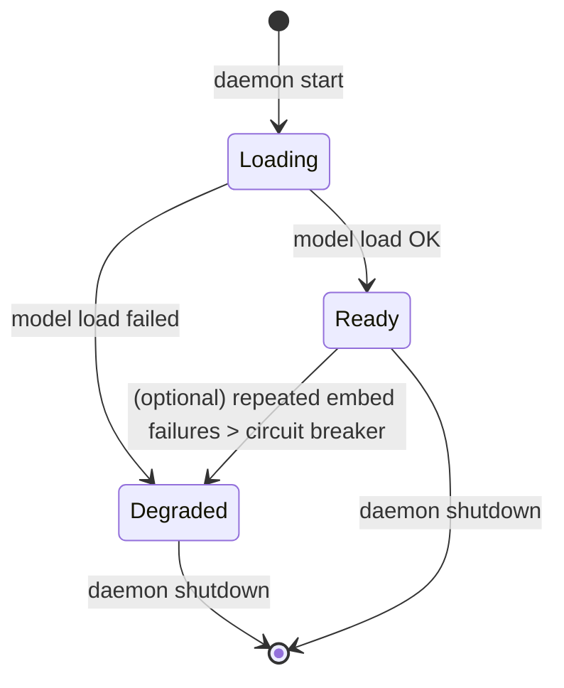

# Design Document

## Overview

This design adds local semantic embeddings and hybrid (lexical + vector) retrieval to kiro-learn while preserving every architectural boundary the project already enforces. It is scoped to a single, self-contained increment:

1. A new `src/collector/embedding/` module that turns a string into a 384-dimensional `Float32Array` using the `all-MiniLM-L6-v2` ONNX model, running fully on CPU with no per-call network I/O.
2. A new embedding column on `memory_records`, added by SQLite migration `0005_memory_record_embedding`, persisted as a 1536-byte little-endian `BLOB`.
3. A transparent upgrade of `QueryLayer.search` to a hybrid path that combines the existing FTS5 lexical ranking with vector cosine similarity under Reciprocal Rank Fusion. The public `QueryLayer` signature does not change.
4. A new `src/collector/backfill/` worker that embeds pre-existing records in the background, resumable across restarts, never blocking reads or writes.

The design preserves kiro-learn's non-negotiable constraints:

- **Modularity.** `src/collector/query/`, `buffer/`, and the new `embedding/` and `backfill/` modules never import from `src/collector/storage/sqlite/`. Only `src/collector/index.ts` wires concrete implementations together.
- **Wire contract.** `MemoryRecordSchema` and `KiroMemEvent` are unchanged. The embedding is purely a storage implementation detail, not a wire field. The schema version stays at `1`.
- **Write path isolation.** Embedding runs only inside the async `ExtractionWorker`, never on the HTTP-receiver hot path.
- **Degraded-mode safety.** Every embedding failure mode (model load, per-call embed, query embed, BLOB decode) falls back to FTS5-only retrieval without dropping or blocking work.

### Key design decisions

| Decision | Choice | Rationale |
|---|---|---|
| ONNX wrapper library | `@huggingface/transformers` (v3, the successor to `@xenova/transformers`) | Bundles tokenizer + ONNX runtime + model-download in one dependency. Matches the "local-first, offline after first run" requirement with the smallest integration surface. The alternative — `onnxruntime-node` directly — would require us to ship a separate tokenizer and model-download path, duplicating functionality that `@huggingface/transformers` already stabilises. |
| Model | `Xenova/all-MiniLM-L6-v2` via HuggingFace | Fixed by requirements (Req 1.7). 22 MB model, 384-dim output, ~5–20 ms/embed on modern CPU. |
| Model download | Lazy, on daemon startup, to `~/.kiro-learn/models/` | Configurable via `CollectorConfig.modelCacheDir`. First run hits HuggingFace CDN once; subsequent runs are fully offline. The HF transformers library handles the download, caching, integrity, and resume logic — we do not reimplement that. |
| Storage | `BLOB` column on `memory_records`, 1536 bytes LE IEEE-754 | Fixed by requirements (Req 4). Brute-force cosine over per-namespace `Float32Array` is acceptable for the scale target (≤ 50 000 records/ns). No `sqlite-vec`. |
| Wire-schema exposure | Embeddings are NOT added to `MemoryRecordSchema` | Callers (retrieval assembler, MCP, viewer) never need the raw vector. Keeping it internal preserves the clean separation and avoids bloating the wire type. |
| Backfill mechanism | Lightweight `BackfillWorker` spawned on daemon startup, batches of 32 | Follows the existing worker pattern (ExtractionWorker, CompactionWorker). Resumable because it always queries for `embedding IS NULL`. Idle priority — never blocks ingestion or search. |
| Hybrid algorithm | Reciprocal Rank Fusion, `k = 60`, no score normalisation | Fixed by requirements. RRF works without having to reconcile FTS5's BM25 scale with cosine similarity's `[-1, 1]` scale. |
| Embedder input composition | Deterministic join: `title + "\n\n" + summary + "\n\n" + facts.join("\n") + "\n\n" + concepts.join(", ")`, truncated to 10 000 chars | Requirements 1.1 and 3.2. Tokenizer will further truncate at ~512 tokens; we cap defensively for safety. |

### Scope boundary

Out of scope for this spec, noted here so the next spec can pick them up cleanly:

- Embedding raw events, buffer entries, or concept strings. Only `MemoryRecord` is embedded.
- Cross-namespace semantic search.
- Reranking with recency.
- Reconciliation / merge of near-duplicate memory records (deferred to Spec 2).
- Replacing the in-memory brute-force index with `sqlite-vec` or HNSW.

## Architecture

### System diagram



Green boxes are new modules introduced by this spec. Every other component either gains a new dependency (injected at wiring time in `src/collector/index.ts`) or is unchanged.

### Module ownership

| Module | Responsibility | Import rules |
|---|---|---|
| `src/collector/embedding/` | Pure embedding computation, cosine similarity, RRF fusion, input composition | MUST NOT import from `src/collector/storage/sqlite/`, `src/shim/`, `src/installer/`, or `src/mcp/`. MAY import from `src/types/` only. |
| `src/collector/backfill/` | Batch scan for `NULL`-embedding records, embed, write back | MUST NOT import from `src/collector/storage/sqlite/`. MAY import from `src/types/`, the `embedding/` module, and accept a `StorageBackend` via DI. |
| `src/collector/storage/sqlite/` | Owns the new migration `0005` and the BLOB encode/decode. | Unchanged import rules. Gains new prepared statements and new methods on the `StorageBackend` it returns. |
| `src/collector/query/` | Hybrid search orchestration. Gets the `Embedder` and new storage surfaces injected. | Unchanged — still forbidden from importing `storage/sqlite/`. |
| `src/collector/buffer/extraction.ts` | Persists the record via `putMemoryRecord` first, then calls the embedder and persists the vector via `putEmbedding`. Embed-failure leaves the record stored without an embedding. | Unchanged — still forbidden from importing `storage/sqlite/`. Gets `Embedder` via DI. |
| `src/collector/index.ts` | The only module that instantiates concrete `OnnxEmbedder`, `openSqliteStorage`, and `BackfillWorker`, and wires them into everything else. | Unchanged. |

New guard tests (see Testing Strategy) pin these rules in CI.

### Sequence: embedding on write



The two-step write (`putMemoryRecord` then `putEmbedding`) is deliberate. Requirement 3.3 calls for same-row persistence of record + embedding. We satisfy it by implementing `putEmbedding` as an `UPDATE` on the existing row — the row and its embedding end up in the same physical row, and the window in which the row exists without its embedding is sub-millisecond and equivalent, from the reader's perspective, to any record that predates this spec. Reads that catch the gap fall back to lexical-only for that record (Req 8.1), which is indistinguishable from normal degraded behaviour. Wrapping the two calls in a SQLite transaction is viable but requires plumbing transactions across the `StorageBackend` interface; we defer that refactor. Putting the insert strictly before the embed call is what makes Req 3.5 ("failure SHALL NOT block, drop, or delay the record insert") a property of the control flow and not just a guideline — Property 15 pins this ordering down against arbitrary embedder latency.

### Sequence: hybrid search on read



`lex_limit` and `vec_limit` are each at least `limit × C` for a small constant `C` (we choose `C = 4`, see "Fetch-depth constant" below). Each side retrieves enough candidates that the fused top-`limit` can legitimately change based on the other side.

### Fetch-depth constant

RRF fuses the top-`n` from each retriever. If we only ask each retriever for `limit` results, a record that ranked `limit+1` lexically but `1` vectorially never enters the fusion pool and the result loses recall compared to an oracle. We therefore fetch `limit × C` candidates from each side and fuse them.

`C = 4` by default. For the default `limit = 10` this is 40 candidates per side, which comfortably fits within the 100 ms p95 budget at 1 000 records (cosine is O(N·d) over already-normalised vectors) and the 500 ms budget at 50 000 records. `C` is exposed as `CollectorConfig.hybridFetchDepthMultiplier` for tuning.

### Degraded-mode state machine

The collector exposes a single boolean — `embedder.isReady()` — that every component consults. The state machine:



In `Degraded` state:
- `ExtractionWorker` skips the embed step and writes the record with a `NULL` embedding.
- `QueryLayer.search` takes the lexical-only branch.
- `BackfillWorker` does not start (it only starts if the embedder is `Ready`).
- Warnings are emitted on each affected operation (Req 14.3).

Recovery from `Degraded` → `Ready` is not supported in this spec. A daemon restart is required. This keeps the state machine one-way and avoids subtle races around cache invalidation.

### Feature flag

`CollectorConfig.embeddingEnabled: boolean`, default `true`.

When `false`:
- The model is NOT loaded at startup (Req 12.5).
- `ExtractionWorker` behaves as if the embedder were permanently degraded.
- `QueryLayer.search` is identical to its pre-spec FTS5-only behaviour.
- `BackfillWorker` does not start.

This is the clean, testable disable path for operators who do not want the feature at all.

## Components and Interfaces

### `src/collector/embedding/` — new module

```text
src/collector/embedding/
  index.ts               # barrel: re-exports Embedder, createOnnxEmbedder, cosine, rrfFuse, composeEmbeddingInput, encodeEmbeddingBlob, decodeEmbeddingBlob
  onnx-embedder.ts       # concrete OnnxEmbedder factory
  input-composition.ts   # pure function: MemoryRecord fields → embedder input string
  cosine.ts              # pure cosine similarity + vector normalisation helpers
  rrf.ts                 # pure Reciprocal Rank Fusion
  blob.ts                # pure Float32Array ↔ Uint8Array (Buffer) encode/decode
```

#### `Embedder` interface

```typescript
/**
 * The local embedding surface. Pure function from string to 384-dim vector
 * once initialised.
 *
 * @see Requirements 1, 2, 17
 */
export interface Embedder {
  /** Resolve when the underlying model is ready. Idempotent. */
  ready(): Promise<void>;

  /** True once `ready()` has resolved successfully. */
  isReady(): boolean;

  /**
   * Return the 384-dim embedding of `input`.
   *
   * - Input is truncated internally to the model's max sequence length.
   * - Returns a fresh `Float32Array(384)`.
   * - Rejects on model failure or if the per-call timeout expires.
   *
   * @see Requirements 1.1, 1.2, 1.3, 17.1, 17.2, 17.3, 17.4
   */
  embed(input: string): Promise<Float32Array>;

  /** Output dimensionality. Constant 384 for MiniLM-L6-v2. */
  readonly dim: 384;
}

export interface EmbedderConfig {
  modelName: 'Xenova/all-MiniLM-L6-v2';
  modelCacheDir: string;            // default: `~/.kiro-learn/models/`
  perCallTimeoutMs: number;         // default: 2000 (Req 10.3)
  maxInputChars: number;            // default: 10_000 (Req 1.1)
}

export function createOnnxEmbedder(cfg: Partial<EmbedderConfig>): Embedder;
```

`createOnnxEmbedder` returns immediately. The first `embed()` call awaits `ready()` internally, and `ready()` kicks off a single model load (memoised in a cached promise). `startCollector` explicitly `await embedder.ready()` during bootstrap so the HTTP listener only binds once the model is loaded — or after catching the load failure and flipping to degraded mode (Req 2.1, 2.2).

#### `composeEmbeddingInput(record: MemoryRecord): string`

Pure, deterministic. Matches Req 3.2:

```text
title + "\n\n" + summary + "\n\n" + facts.join("\n") + "\n\n" + concepts.join(", ")
```

Truncated to `maxInputChars` (10 000 by default). Unit- and property-tested in isolation.

#### `cosine(a: Float32Array, b: Float32Array): number`

Pure. Assumes `a.length === b.length === 384`.

- If `||a|| === 0` or `||b|| === 0`, returns `0` (Req 7.6, 17.4 explicit zero-norm guard).
- Otherwise returns `dot(a,b) / (||a|| * ||b||)`.

A companion `normalize(a: Float32Array): Float32Array` pre-normalises a vector so later cosine calls collapse to a dot product. The `QueryLayer`'s per-namespace embedding cache stores vectors already normalised, turning hot-path cosine into a single dot product per record.

#### `rrfFuse(lexical, vector, k, limit)` — pure RRF

```typescript
/**
 * A ranked entry: the record id plus its 1-based rank in its source ranking.
 */
export interface Ranked {
  record_id: string;
  rank: number;       // 1-based. Absence from a ranking means rank = +∞.
}

/**
 * Fused result.
 */
export interface Fused {
  record_id: string;
  fused_score: number;
  lex_rank: number | null;   // null = absent from lexical ranking
  vec_rank: number | null;   // null = absent from vector ranking
}

/**
 * Reciprocal Rank Fusion.
 *
 * score(d) = Σ_i 1 / (k + rank_i(d))
 *
 * where rank_i(d) is the 1-based rank of d in ranking i, and
 * `absence → infinity → contribution 0`.
 *
 * Result is ordered by (fused_score DESC, record_id ASC) for determinism.
 * The caller provides tie-break metadata (created_at) if a stronger ordering
 * is needed at the caller level.
 *
 * @see Requirements 5.2, 5.3, 5.4, 5.8, 16.*, 18.*
 */
export function rrfFuse(
  lexical: readonly Ranked[],
  vector: readonly Ranked[],
  k: number,
  limit: number,
): readonly Fused[];
```

Pseudocode:

```text
rrfFuse(L, V, k, limit):
  score : Map<record_id, {fused: number, lex: number|null, vec: number|null}> := {}
  for (r in L):  score[r.record_id].lex   := r.rank
                 score[r.record_id].fused += 1 / (k + r.rank)
  for (r in V):  score[r.record_id].vec   := r.rank
                 score[r.record_id].fused += 1 / (k + r.rank)
  all := sort(score.entries(),
              by fused DESC,
              then record_id ASC)        # deterministic stable tie-break
  return all[0..limit]
```

The caller (`QueryLayer`) applies the richer tie-break (Req 5.8: `created_at DESC, record_id ASC`) after fusion, using the memory-record metadata it already has in hand.

#### `encodeEmbeddingBlob / decodeEmbeddingBlob`

```typescript
/**
 * Encode a 384-dim Float32Array as a 1536-byte little-endian BLOB.
 *
 * @see Requirements 4.2, 15
 */
export function encodeEmbeddingBlob(vec: Float32Array): Buffer;

/**
 * Decode a 1536-byte little-endian BLOB back into a 384-dim Float32Array.
 *
 * @throws If `blob.length !== 1536` — includes the offending length in the
 *         error message to ease identification. The storage layer further
 *         annotates the error with the `record_id`.
 *
 * @see Requirements 4.2, 4.4, 15
 */
export function decodeEmbeddingBlob(blob: Buffer): Float32Array;
```

Implementation note: Node is little-endian on all supported platforms (x86_64, arm64 macOS/Linux); we still encode explicitly via `DataView.setFloat32(offset, value, /* littleEndian */ true)` and decode via `DataView.getFloat32` so we are not implicitly trusting the host. The round-trip preserves all IEEE-754 bit patterns (NaN, ±Infinity, ±0) bit-for-bit (Req 15.1).

### `src/collector/backfill/` — new module

```text
src/collector/backfill/
  index.ts               # barrel: re-exports BackfillWorker, createBackfillWorker
  worker.ts              # BackfillWorker implementation
```

#### `BackfillWorker` interface

```typescript
export interface BackfillWorkerConfig {
  batchSize: number;          // default 32
  idleMs: number;             // default 1000 — gap between batches
  circuitBreakerFailures: number; // default 5 — consecutive embed failures before pausing
  circuitBreakerPauseMs: number;  // default 60_000
}

export interface BackfillWorker {
  /** Start running. Returns immediately; work continues in the background. */
  start(): void;

  /**
   * Signal shutdown and wait for the current batch to finish (bounded).
   */
  stop(timeoutMs: number): Promise<void>;

  /** Inspect progress for logs/stats. */
  status(): {
    state: 'idle' | 'running' | 'paused' | 'stopped';
    processed: number;
    lastError: string | null;
  };
}

export interface BackfillWorkerDeps {
  storage: StorageBackend;
  embedder: Embedder;
  config?: Partial<BackfillWorkerConfig>;
}

export function createBackfillWorker(deps: BackfillWorkerDeps): BackfillWorker;
```

#### Backfill loop (pseudocode)

```text
BackfillWorker.run():
  while not stopped:
    if not embedder.isReady(): stop; return      # degraded-mode guard
    batch := storage.listRecordsWithoutEmbedding(ns=null, limit=batchSize)
    if batch.empty: return                       # done — no work left
    for record in batch:
      if stopped: break
      try:
        input := composeEmbeddingInput(record)
        vec   := await embedder.embed(input)
        await storage.putEmbedding(record.record_id, vec)
        consecutiveFailures := 0
        processed += 1
      catch err:
        consecutiveFailures += 1
        log warning record_id=record.record_id err=err
        if consecutiveFailures >= circuitBreakerFailures:
          state := paused
          sleep(circuitBreakerPauseMs)
          consecutiveFailures := 0
          state := running
    await sleep(idleMs)                          # yield before next batch
```

The loop is resumable (Req 19.3, Req 8.6): because every iteration re-queries for `embedding IS NULL`, a crash mid-batch leaves the already-embedded rows intact and picks up from the next unembedded row on restart. A `BackfillWorker` re-run on a fully-embedded corpus returns on the first iteration (empty batch), satisfying idempotence (Req 19.1) and no-redundant-work (Req 19.2).

The BackfillWorker shares the singleton `Embedder` instance with the ExtractionWorker (Req 2.4). Concurrent `embed` calls from ExtractionWorker, BackfillWorker, and QueryLayer.search are serialised explicitly inside `OnnxEmbedder` by a promise-chain gate (`tail`): every call awaits the previous one before invoking the pipeline, so the underlying ONNX Runtime session sees exactly one inference in flight at a time regardless of caller concurrency. Retrieval's 500 ms budget in `RetrievalAssembler.assemble` covers the worst case where a query embed is queued behind an in-flight extraction embed. The 1-second idle gap between backfill batches keeps backfill from monopolising the gate under active ingestion load.

### Storage backend — modified

#### New migration: `0005_memory_record_embedding`

Adds one nullable column to `memory_records`. Unlike migration 0004, this is an additive column — SQLite supports adding a nullable column without a table rebuild.

```sql
ALTER TABLE memory_records
  ADD COLUMN embedding BLOB DEFAULT NULL;
```

No indexes are added (cosine similarity is computed in JS, not SQL). No FTS5 row changes (the FTS5 companion table does not carry the embedding). No existing row is rewritten — they all get `NULL`, which is exactly what Req 4.6 / 8.3 demand.

#### `StorageBackend` — new methods

Added to the interface in `src/types/index.ts`:

```typescript
export interface StorageBackend {
  // ── existing methods unchanged ──

  /**
   * Write the embedding for an existing memory record. Idempotent: repeated
   * writes overwrite. Called by ExtractionWorker immediately after
   * `putMemoryRecord` and by BackfillWorker for pre-existing records.
   *
   * If `record_id` does not exist, this is a no-op (the UPDATE matches zero
   * rows). Returns `void` in either case.
   *
   * @see Requirements 3.3, 4.1, 4.2, 8.6, 19.2
   */
  putEmbedding(recordId: string, embedding: Float32Array): Promise<void>;

  /**
   * Read a single embedding. Returns null if the record has no embedding or
   * does not exist. Exposed for tests and future reconciliation flows;
   * hybrid search uses `listEmbeddings` for bulk access.
   *
   * @throws If the stored blob is not exactly 1536 bytes — includes the
   *         offending record_id. @see Requirements 15.3
   */
  getEmbedding(recordId: string): Promise<Float32Array | null>;

  /**
   * Bulk-load all non-null embeddings for records whose namespace equals
   * the given namespace. Used by the per-namespace vector index.
   *
   * Returns embeddings as raw Float32Array; normalisation and cosine math
   * live in the embedding module, not here.
   *
   * @see Requirements 4.7, 7.1
   */
  listEmbeddings(namespace: string): Promise<Array<{
    record_id: string;
    embedding: Float32Array;
    created_at: string; // needed for tie-breaking in hybrid fusion (Req 5.8)
  }>>;

  /**
   * Return up to `limit` memory records whose embedding is NULL, optionally
   * scoped to a namespace. Used by BackfillWorker.
   *
   * Order: created_at ASC (oldest records first, so backfill progresses
   * deterministically).
   *
   * @see Requirements 8.4, 8.5, 8.6, 19.*
   */
  listRecordsWithoutEmbedding(
    namespace: string | null,
    limit: number,
  ): Promise<MemoryRecord[]>;

  /**
   * New lexical-only search surface for the hybrid layer. Returns FTS5-
   * ranked records paired with their 1-based rank so the fusion layer does
   * not have to reconstruct rank from ordering.
   *
   * Behaviour identical to `searchMemoryRecords` for non-rank-aware callers.
   * The existing `searchMemoryRecords` method stays for backward compat and
   * is now a thin wrapper: `records.map(({record}) => record)`.
   *
   * @see Requirements 5.1, 8.1, 8.2
   */
  searchMemoryRecordsLexical(params: SearchParams): Promise<Array<{
    record: MemoryRecord;
    rank: number;
  }>>;

  /**
   * Extended stats — adds embedding coverage to the existing getStats
   * response. Implemented additively on StatsResult.
   *
   * @see Requirements 14.4
   */
  getStats(namespace?: string): Promise<StatsResult>; // unchanged signature
}
```

`StatsResult` gains two optional fields (additive, no wire break):

```typescript
export interface StatsResult {
  // ── existing fields unchanged ──
  embeddings_present?: number;   // count of memory_records where embedding IS NOT NULL
  embeddings_missing?: number;   // count of memory_records where embedding IS NULL
}
```

UI and MCP consumers see additional optional fields and keep working. The viewer surfaces the coverage gauge in a follow-up docs/UI task but that is out of scope for this spec.

#### Prepared statements added to `statements.ts`

```typescript
interface Statements {
  // ── existing statements unchanged ──

  /** UPDATE memory_records SET embedding = ? WHERE record_id = ? */
  updateMemoryRecordEmbedding: Statement<[blob: Buffer, recordId: string]>;

  /** SELECT embedding FROM memory_records WHERE record_id = ? */
  selectMemoryRecordEmbedding: Statement<[recordId: string], { embedding: Buffer | null }>;

  /**
   * SELECT record_id, embedding, created_at FROM memory_records
   * WHERE namespace = ? AND embedding IS NOT NULL
   * ORDER BY created_at DESC
   */
  selectEmbeddingsByNamespace: Statement<[namespace: string], {
    record_id: string;
    embedding: Buffer;
    created_at: string;
  }>;

  /**
   * SELECT <memory_record cols> FROM memory_records
   * WHERE embedding IS NULL AND (? IS NULL OR namespace = ?)
   * ORDER BY created_at ASC
   * LIMIT ?
   *
   * The `? IS NULL OR namespace = ?` pattern keeps one statement for both
   * the global and namespace-scoped cases. The namespace parameter is
   * bound twice.
   */
  selectMemoryRecordsWithoutEmbedding: Statement<
    [namespaceOrNull: string | null, namespaceOrNull2: string | null, limit: number],
    MemoryRecordRow
  >;

  /**
   * FTS5-MATCH variant that returns FTS5 rank alongside the record. Rank
   * is 1-based, computed from ROW_NUMBER() over the ORDER BY fts.rank
   * ordering. Same namespace-prefix filter as selectMemoryRecordsFtsMatch.
   */
  selectMemoryRecordsFtsMatchRanked: Statement<
    SelectMemoryRecordsFtsMatchParams,
    MemoryRecordRow & { rank: number }
  >;

  /**
   * SELECT COUNT(*) FROM memory_records WHERE embedding IS {NOT NULL | NULL}
   * (two separate statements, or one with a CASE aggregate). Used by
   * getStats.
   */
  selectEmbeddingStatsGlobal: Statement<[], { present: number; missing: number }>;
  selectEmbeddingStatsScoped: Statement<
    [namespace: string],
    { present: number; missing: number }
  >;
}
```

All writes remain positionally bound — the project's no-string-interpolation SQL rule (see `statements.ts` module doc) is preserved.

### `QueryLayer` — modified

```typescript
export interface QueryLayer {
  search(namespace: string, query: string, limit: number): Promise<MemoryRecord[]>;
}

export interface QueryLayerDeps {
  storage: StorageBackend;
  embedder: Embedder | null;      // null = feature flag off; lexical-only forever.
  config?: {
    rrfK?: number;                // default 60 (Req 5.3, 12.1)
    fetchDepthMultiplier?: number;// default 4
  };
}

export function createQueryLayer(deps: QueryLayerDeps): QueryLayer;
```

Internally:

```typescript
async search(namespace, query, limit): Promise<MemoryRecord[]> {
  // 1. Always run lexical, always with the ranked surface.
  const fetchDepth = limit * (config.fetchDepthMultiplier ?? 4);
  const lexRankedRaw = await storage.searchMemoryRecordsLexical({
    namespace, query, limit: fetchDepth,
  });

  // 2. Empty-query short-circuit (Req 6.4, 16.7). If lexical found
  //    nothing AND tokens are empty, we're done without invoking the embedder.
  if (lexRankedRaw.length === 0 && tokenizeForQuery(query).length === 0) {
    return [];
  }

  // 3. If the embedder is absent or not ready, return lexical-only.
  if (embedder === null || !embedder.isReady()) {
    return lexRankedRaw.slice(0, limit).map(r => r.record);
  }

  // 4. Compute the query embedding. On any failure, fall back.
  let queryVec: Float32Array;
  try {
    queryVec = await embedder.embed(query);
  } catch (err) {
    logWarn(`hybrid falling back to lexical: ${err}`);  // Req 6.3, 14.2
    return lexRankedRaw.slice(0, limit).map(r => r.record);
  }

  // 5. Load / refresh the per-namespace vector index.
  const index = await namespaceEmbeddingCache.getOrLoad(namespace);

  // 6. Cosine-rank against the index. Index vectors are pre-normalised, so
  //    this reduces to a dot product per record.
  const vecRanked = topKByCosine(queryVec, index, fetchDepth);

  // 7. RRF-fuse and apply the richer tie-break.
  const fused = rrfFuse(
    lexRankedRaw.map(r => ({ record_id: r.record.record_id, rank: r.rank })),
    vecRanked.map((v, i) => ({ record_id: v.record_id, rank: i + 1 })),
    config.rrfK ?? 60,
    limit * 2,                                  // over-fetch for tie-break
  );

  // 8. Join back to full MemoryRecord; apply final tie-break.
  //    `byId` is seeded from BOTH the lexical results (authoritative,
  //    reflect the latest putMemoryRecord) AND the cached vector
  //    index's `{record_id, vec_normalised, record}` triples, so
  //    vector-only hits are preserved without a second DB round trip.
  const byId = new Map<string, MemoryRecord>();
  for (const r of lexRankedRaw) byId.set(r.record.record_id, r.record);
  for (const entry of index.entries) {
    if (!byId.has(entry.record_id)) byId.set(entry.record_id, entry.record);
  }
  const fusedWithRecords = fused.flatMap(f => {
    const rec = byId.get(f.record_id);
    return rec ? [{ ...f, record: rec }] : [];
    // A fused id missing from both maps would require a race with a
    // record deletion (not a supported flow in v1). Silently dropped.
  });

  fusedWithRecords.sort(finalTieBreak);          // (fused_score DESC, created_at DESC, record_id ASC)
  return fusedWithRecords.slice(0, limit).map(x => x.record);
}
```

Implementation note on the lex/vec disjoint-set case: a record that appears in the vector top-N but not the lexical top-`fetchDepth` is a legitimate semantic-only hit and must not be dropped. The pseudocode above resolves those records by also seeding `byId` from `index.entries`, which is the per-namespace `NamespaceVectorCache` snapshot built from a single `listEmbeddings` + `listMemoryRecords` call (see "Vector index cache shape" below). An alternative — issuing a batched `getMemoryRecordsByIds` call to storage for the missing ids — would cost one round trip per hybrid search; the cache-backed path avoids that by paying the metadata cost once per cache epoch.

#### Vector index cache shape

```typescript
/** Per-namespace snapshot of the vector corpus. */
interface NamespaceVectorIndex {
  namespace: string;
  epoch: number;                            // bumps on every mutation
  entries: ReadonlyArray<{
    record_id: string;
    record: MemoryRecord;                   // for join-back and tie-break
    vec_normalised: Float32Array;
  }>;
}

interface NamespaceVectorCache {
  /** Get or rebuild the index for `ns`. */
  getOrLoad(ns: string): Promise<NamespaceVectorIndex>;
  /** Invalidate `ns`'s index. Callers: ExtractionWorker, BackfillWorker. */
  invalidate(ns: string): void;
}
```

Cache invalidation protocol (Req 7.5):

- Every successful `putMemoryRecord` or `putEmbedding` in `ExtractionWorker`, and every successful `putEmbedding` in `BackfillWorker`, bumps the epoch for that namespace and triggers `invalidate(ns)`.
- Because the write path and the read path both run inside the same daemon process, this is in-memory coordination — no DB-level locks are needed.
- The first `search` after an invalidation pays the rebuild cost (one `listEmbeddings(ns)` + one `listMemoryRecords({namespace: ns})` for the metadata). Subsequent searches hit the cache.

**Single-daemon-per-install invariant.** The epoch-based in-memory coordination described above is valid only when exactly one collector process attaches to a given SQLite DB at a time. The installer (`src/installer/index.ts`) enforces this with a `collector.pid` file under `~/.kiro-learn/`: `startDaemon` writes the child PID on spawn, `getDaemonPid` probes liveness with `process.kill(pid, 0)` and cleans up stale files, and `stopDaemon` removes the PID file on shutdown. A second daemon cannot be started against the same install without first stopping the first. If this invariant is ever relaxed — e.g. a future multi-daemon deployment sharing a SQL backend — the in-memory epoch scheme does not propagate across processes, so caches in the sibling daemon would go stale until restart or explicit invalidation; the mitigation at that point would be a DB-backed epoch/version table or a centralised invalidation channel, implemented around this `invalidate(ns)` contract. That work is out of scope for this spec; the single-daemon assumption is the contract readers and implementers should rely on today.

Invalidation is wired with an explicit callback that `startCollector` threads through dependency injection. `ExtractionWorker` and `BackfillWorker` each accept an optional `onNamespaceChanged: (namespace: string) => void` in their deps and invoke it after every successful `putMemoryRecord` / `putEmbedding`. The collector wires both workers to the same target:

```typescript
// src/collector/index.ts — inside startCollector after the QueryLayer is built.
const queryLayer = createQueryLayer({ storage, embedder, config: { ... } });

extractionWorker = createExtractionWorker({
  bufferStore, watcher: bufferWatcher, storage, embedder,
  onNamespaceChanged: (ns: string) => {
    queryLayer.invalidateNamespace(ns);
  },
  // ...
});

if (embedder !== null && embedder.isReady()) {
  backfillWorker = createBackfillWorker({
    storage, embedder,
    onNamespaceChanged: (ns: string) => {
      queryLayer.invalidateNamespace(ns);
    },
    // ...
  });
  backfillWorker.start();
}
```

`QueryLayer.invalidateNamespace(ns)` delegates to the `NamespaceVectorCache.invalidate(ns)` call described above. This keeps `StorageBackend` entirely free of cache concerns — the storage layer never knows the cache exists, and the workers only know they have a callback to fire.

Both workers guard the callback invocation with a local try/catch so a throw from a misbehaving cache consumer cannot abort extraction mid-batch (which would leave the buffer uncleared) or convert a successful backfill write into a counted failure (which would pressure the circuit breaker).

Earlier drafts considered a `StorageBackend.onEmbeddingChanged?(handler)` hook that the concrete sqlite backend would fire after every write. That path was rejected because it leaks cache concerns into the storage layer and would require every backend implementation (including future non-SQLite ones) to re-implement the hook; the explicit worker-level callback shipped because it keeps the boundary clean and the direction of dependency correct: the collector wires workers to the query layer, not the storage layer.

For a fully cold cache of 50 000 records at 1536 bytes each, the bulk load transfers ~75 MB and the normalisation pass costs O(N·d) ≈ 50k × 384 ≈ 20M ops. Benchmarks on commodity hardware put this under 200 ms, leaving >300 ms of headroom inside the 500 ms p95 budget for the actual search work (Req 9.1). The cache amortises this cost across all subsequent searches in the namespace until the next write.

### `ExtractionWorker` — modified

The worker gains one dependency and one call site change.

```typescript
export interface ExtractionWorkerDeps {
  bufferStore: BufferStore;
  watcher: BufferWatcher;
  storage: StorageBackend;
  embedder: Embedder | null;              // NEW — null means feature disabled.
  config?: Partial<ExtractionWorkerConfig>;
}
```

Inside the record-processing loop, after building `record` via `parseMemoryRecord(enriched)`:

```typescript
await storage.putMemoryRecord(record);        // existing

if (embedder !== null && embedder.isReady()) {
  try {
    const input = composeEmbeddingInput(record);
    const vec   = await embedder.embed(input);
    await storage.putEmbedding(record.record_id, vec);
  } catch (err) {
    logWarn(
      `embedding failed for record ${record.record_id}: ${String(err)}`,
    );                                        // Req 3.4, 3.5, 14.1
    // Do NOT re-throw. The record is already stored.
  }
}
```

Requirement 3.5 ("failure SHALL NOT block, drop, or delay the record insert") is met because the embed call only runs AFTER the insert. The pre-existing batch commit semantics of the extraction worker — all rows, then clear buffer — are preserved.

### `src/collector/index.ts` — wiring changes

```typescript
// Near the top of startCollector, after opening storage:
const embedder: Embedder | null = cfg.embeddingEnabled === false
  ? null
  : createOnnxEmbedder({
      modelCacheDir: expandTilde(cfg.modelCacheDir),
      perCallTimeoutMs: cfg.embeddingTimeoutMs,
      // modelName and maxInputChars are fixed per the requirements.
    });

if (embedder !== null) {
  try {
    await embedder.ready();                    // Req 2.1
  } catch (err) {
    logError(`embedder failed to load; entering degraded mode: ${err}`);
    // embedder stays in not-ready state; isReady() returns false forever.
    // Components consult isReady() before invoking embed().
  }
}

// Extraction worker now gets the embedder:
extractionWorker = createExtractionWorker({
  bufferStore, watcher: bufferWatcher, storage,
  embedder,                                    // NEW
  config: { ... },
});

// Query layer now gets the embedder:
const queryLayer = createQueryLayer({
  storage,
  embedder,
  config: { rrfK: cfg.rrfK, fetchDepthMultiplier: cfg.hybridFetchDepthMultiplier },
});

// Backfill worker starts only if embedder is Ready (and the flag allows it):
let backfillWorker: BackfillWorker | null = null;
if (embedder !== null && embedder.isReady()) {
  backfillWorker = createBackfillWorker({ storage, embedder });
  backfillWorker.start();
}

// handle.close():
//   ... existing teardown ...
//   await backfillWorker?.stop(5000);
//   await embedder?.dispose?.();   // if the ONNX session needs closing
//   await storage.close();
```

New `CollectorConfig` fields (all optional; additive):

```typescript
interface CollectorConfig {
  // ── existing fields unchanged ──

  /** Whether embedding on write + hybrid search is enabled. Default true. @see Req 12.4 */
  embeddingEnabled?: boolean;

  /** Path to the local ONNX model cache. Default `~/.kiro-learn/models/`. @see Req 12.3 */
  modelCacheDir?: string;

  /** Per-call embed timeout in ms. Default 2000. @see Req 12.2 */
  embeddingTimeoutMs?: number;

  /** RRF constant k. Default 60. @see Req 12.1 */
  rrfK?: number;

  /** How many candidates to over-fetch from each retriever before fusion. Default 4. */
  hybridFetchDepthMultiplier?: number;

  /** Batch size for the backfill worker. Default 32. */
  backfillBatchSize?: number;
}
```

Environment variable fallback: `KIRO_LEARN_MODEL_DIR` overrides `modelCacheDir` if the config field is unset. Matches the existing shim pattern of respecting env vars.

### `RetrievalAssembler` — unchanged

`RetrievalAssembler` calls `QueryLayer.search(namespace, query, limit)` and formats the returned `MemoryRecord[]` into a context string. Because `QueryLayer.search`'s public signature does not change, the assembler is not touched.

## Data Models

### SQLite schema diff

Before (migration 0004):

```sql
CREATE TABLE memory_records (
  record_id          TEXT PRIMARY KEY NOT NULL,
  namespace          TEXT NOT NULL,
  strategy           TEXT NOT NULL,
  title              TEXT NOT NULL,
  summary            TEXT NOT NULL,
  facts_json         TEXT NOT NULL DEFAULT '[]',
  source_event_ids_json TEXT NOT NULL,
  created_at         TEXT NOT NULL,
  concepts_json      TEXT NOT NULL DEFAULT '[]',
  files_touched_json TEXT NOT NULL DEFAULT '[]',
  observation_type   TEXT NOT NULL DEFAULT 'tool_use'
    CHECK (observation_type IN ('tool_use','decision','error','discovery','pattern','session_summary'))
) STRICT;
```

After migration 0005:

```sql
ALTER TABLE memory_records
  ADD COLUMN embedding BLOB DEFAULT NULL;
```

Post-migration shape, for reference:

```sql
CREATE TABLE memory_records (
  record_id          TEXT PRIMARY KEY NOT NULL,
  ...                                              -- unchanged columns
  observation_type   TEXT NOT NULL DEFAULT 'tool_use' CHECK (...),
  embedding          BLOB DEFAULT NULL             -- new in 0005
) STRICT;
```

Notes:

- `STRICT` tables allow nullable `BLOB` columns — no schema change beyond the `ADD COLUMN`.
- `ALTER TABLE ... ADD COLUMN` in SQLite does not rewrite existing rows; pre-existing rows take the default `NULL` virtually (Req 8.3, 4.6).
- No new indexes. Cosine similarity is computed in JS.
- No FTS5 rebuild. The FTS5 companion table (`memory_records_fts`) does not carry the embedding.

### BLOB encoding format

- **Length.** Always exactly 1536 bytes. 384 `float32` values × 4 bytes/value = 1536 bytes. (Req 4.2, 11.1, 15.2.)
- **Byte order.** Little-endian IEEE-754 single-precision. We encode explicitly via `DataView.setFloat32(..., true)` rather than `Buffer.from(float32.buffer)`; the explicit endian flag is a defensive measure even though all supported platforms are LE.
- **No framing.** No version byte, no length prefix, no checksum. Dimension is implicit in the column contract and validated on decode (Req 15.3).
- **Null representation.** Absence is SQL `NULL`, never a zero-filled BLOB. The read path uses `IS NOT NULL` to distinguish "no embedding" from "all-zero embedding" (Req 4.3, 7.6). An all-zero embedding is a valid non-null vector that the cosine layer treats specially (Req 7.6).

The encode/decode helpers live in `src/collector/embedding/blob.ts` and are exercised by a dedicated round-trip property test (Req 15.1).

### In-memory vector index shape

```typescript
interface NamespaceVectorIndex {
  namespace: string;
  epoch: number;
  entries: ReadonlyArray<{
    record_id: string;
    record: MemoryRecord;
    vec_normalised: Float32Array;   // L2-normalised; ||v|| = 1 (or 0 if degenerate)
  }>;
}
```

Per-namespace storage budget:

| Records | Vector bytes | MemoryRecord (est.) | Total per namespace |
|---|---|---|---|
| 1 000 | 1.5 MB | 1–2 MB | ~3–4 MB |
| 10 000 | 15 MB | 10–20 MB | ~30–35 MB |
| 50 000 | 75 MB | 50–100 MB | ~150 MB |

The 50 000 case sits inside a modest daemon RSS and remains well within the spec target. A Node warn is emitted if total cached index memory crosses `500 MB`, which is telemetry we add in this spec; dropping the oldest cache in response is out of scope.

### Wire contract — no change

`MemoryRecordSchema` in `src/types/schemas.ts` is unchanged. `KiroMemEvent` is unchanged. `schema_version` stays at `1`. Every MCP tool, every shim, every UI consumer sees the same response shapes as before this spec.

The `embedding` BLOB is visible only to storage-layer code. `rowToMemoryRecord` in the sqlite backend explicitly does not read the `embedding` column — it is kept out of the `SELECT` list on the existing `selectMemoryRecordsByNamespace` etc. statements, which match the row shape in `MemoryRecordRow`.


## Correctness Properties

*A property is a characteristic or behavior that should hold true across all valid executions of a system — essentially, a formal statement about what the system should do. Properties serve as the bridge between human-readable specifications and machine-verifiable correctness guarantees.*

This feature is a strong fit for property-based testing: the core algorithms (BLOB encoding, cosine similarity, RRF fusion, embedder wrapper, backfill loop) are pure or near-pure and have universal invariants over inputs. The properties below are organised from purely synthetic (no storage needed) to integration-level (small in-memory SQLite fixtures).

### Pure-function properties

These test pure functions in isolation and should be exercised with 200+ generated inputs.

### Property 1: BLOB round-trip preserves every bit

*For any* `Float32Array` of length 384, `decodeEmbeddingBlob(encodeEmbeddingBlob(v))` produces a `Float32Array` whose contents are bitwise-equal to `v`, including for values that are `NaN`, `+Infinity`, `-Infinity`, `+0`, `-0`, and subnormals.

**Validates: Requirements 4.2, 4.4, 11.1, 15.1, 15.2**

### Property 2: `composeEmbeddingInput` is deterministic and content-preserving

*For any* `MemoryRecord` `r`, `composeEmbeddingInput(r)` is a pure function of `r` (repeated calls return the identical string), and its output contains `r.title`, `r.summary`, every element of `r.facts`, and every element of `r.concepts` — except for any suffix removed by the 10 000-character truncation cap.

**Validates: Requirements 3.2**

### Property 3: Cosine similarity is well-defined and bounded

*For any* two `Float32Array` values `a` and `b` of equal length, `cosine(a, b)` satisfies:

- If `||a|| === 0` or `||b|| === 0`, the result is exactly `0`.
- Otherwise the result lies in the closed interval `[-1, 1]` up to floating-point tolerance.
- `cosine(a, a) === 1` up to floating-point tolerance for any non-zero `a`.

**Validates: Requirements 7.6, 17.4**

### Property 4: Embedder output shape is invariant

*For any* non-empty input string `s` of length 1 to 10 000 characters, `embedder.embed(s)` returns a `Float32Array` of length exactly 384 whose elements are all finite numbers (`Number.isFinite` is true for every element) and whose L2 norm is strictly greater than zero.

**Validates: Requirements 1.1, 1.2, 17.1, 17.2, 17.4**

### Property 5: Embedder is deterministic within a process

*For any* input string `s`, two sequential calls `embedder.embed(s)` within the same process produce `Float32Array` values whose contents are bitwise-equal.

**Validates: Requirements 1.3, 17.3**

### Property 6: RRF fusion satisfies its algebraic contract

*For any* pair of ranked lists `L` (lexical) and `V` (vector) over a shared document set, any positive RRF constant `k`, and any positive `limit`, `rrfFuse(L, V, k, limit)` satisfies every clause below:

- **Size.** `result.length ≤ min(limit, |L ∪ V|)`.
- **Score formula.** For every `d` in the result, `d.fused_score === 1 / (k + rank_L(d)) + 1 / (k + rank_V(d))`, treating absence from a list as contributing `0`.
- **Ordering.** `result` is monotonically non-increasing by `fused_score`.
- **Rank monotonicity.** If two documents share `rank_L` but one has a strictly worse `rank_V`, its fused score is strictly smaller.
- **Agreement preservation.** When `L` and `V` are identical permutations, the fused result is that same permutation up to `limit`.
- **Lexical-only fallback.** When `V = []`, the fused result equals `L` truncated to `limit` (order preserved).
- **Vector-only fallback.** When `L = []`, the fused result equals `V` truncated to `limit` (order preserved).

**Validates: Requirements 5.2, 5.4, 16.5, 16.6, 18.1, 18.2, 18.3, 18.4, 18.5, 18.6**

### Property 7: Cosine ranking is sorted and excludes missing embeddings

*For any* query `Float32Array` `q` and any vector index `I` that contains a mix of records with and without embeddings, `topKByCosine(q, I, k)`:

- Returns at most `k` entries.
- Returns entries sorted by descending `cosine(q, entry.vec)`.
- Returns no entry whose underlying record has a `NULL` embedding.

**Validates: Requirements 7.1, 7.2, 7.3**

### Integration-level properties

These properties exercise `QueryLayer.search` end-to-end against a real SQLite fixture. They run fewer iterations (50–100) because each iteration opens an in-memory DB and populates it.

### Property 8: Hybrid degrades cleanly to lexical

*For any* corpus and any query, if the embedder is unavailable for any reason — feature flag off, embedder in degraded mode, `embed(query)` throws, or every record in the namespace has a `NULL` embedding — then `QueryLayer.search(ns, q, limit)` returns a record list that is exactly equal (in order and content) to the result of pure FTS5 retrieval with the same `(ns, q, limit)`.

**Validates: Requirements 2.3, 6.3, 8.1, 8.2, 12.4, 16.3**

### Property 9: Hybrid preserves namespace isolation and size invariant

*For any* multi-namespace corpus, query, and limit, `QueryLayer.search(ns, q, limit)` returns a list whose length is at most `limit` and each of whose records has `record.namespace === ns`.

**Validates: Requirements 5.4, 5.5, 16.1, 16.4**

### Property 10: Hybrid is deterministic

*For any* corpus, query, and limit, two sequential calls to `QueryLayer.search(ns, q, limit)` against the same corpus produce identical ordered result lists (including the tie-break by `created_at DESC, record_id ASC`).

**Validates: Requirements 5.8, 16.2**

### Property 11: Empty-query short-circuit skips the embedder

*For any* query string that tokenises to zero FTS5 tokens (the empty string or a string of only whitespace characters), `QueryLayer.search(ns, q, limit)` returns the empty array without invoking `embedder.embed`.

**Validates: Requirements 6.4, 16.7**

### Property 12: Writes in a namespace are visible to the next search in that namespace

*For any* initial corpus, namespace `ns`, and additional record `r` whose `namespace = ns`: after `storage.putMemoryRecord(r)` followed by `storage.putEmbedding(r.record_id, v)` for a valid embedding `v`, the next call to `QueryLayer.search(ns, q, limit)` where `q` is a query that lexically matches `r` includes `r` in its results.

**Validates: Requirements 7.5**

### Backfill properties

### Property 13: Backfill is idempotent and does no redundant work

*For any* corpus of memory records (some with embeddings, some without), running `BackfillWorker.run()` to completion once produces the same set of stored embeddings as running it to completion twice. In the second run, `embedder.embed` is invoked zero times.

**Validates: Requirements 19.1, 19.2, 8.6**

### Property 14: Backfill is crash-safe

*For any* corpus and any interrupt point `i` (measured in number of `putEmbedding` calls completed), stopping the worker at `i`, reopening the database, and inspecting the state yields: records whose backfill completed before `i` have their correct embedding stored; all other records have `NULL` embedding. Resuming the worker on the partial state eventually reaches the same terminal state as running the worker to completion once.

**Validates: Requirements 19.3, 8.6**

### Property 15: Write-path safety

*For any* memory record, if the embedder is slow or failing, the `storage.putMemoryRecord(record)` call in the extraction worker completes without waiting on the embedder. Formally: in a trace of worker operations for a record, the `putMemoryRecord` completion event precedes any dependency on the `embed` result.

**Validates: Requirements 3.4, 3.5**

## Error Handling

Every failure mode is designed to degrade, never to drop. The policy below is exhaustive.

### Embedder load failure (startup)

- **Trigger.** `embedder.ready()` rejects during `startCollector`.
- **Response.** Log an error including the underlying cause. The collector starts in degraded mode: the embedder handle is retained, but `isReady()` returns `false` permanently.
- **Downstream.** `ExtractionWorker` writes records with `NULL` embedding and emits a warning per record. `QueryLayer.search` falls back to lexical. `BackfillWorker` does not start.
- **Requirement trace.** 2.2, 2.3, 14.3.

### Per-record embed failure (write path)

- **Trigger.** `embedder.embed(input)` throws or times out (default 2 s).
- **Response.** The extraction worker catches the error, logs a warning containing `record_id` and the error message, and proceeds. The memory record is already stored; no further action is taken.
- **Reader behavior.** Subsequent searches see the record with `NULL` embedding and treat it as lexical-only (Property 8).
- **Retry.** The record can be re-embedded later by the `BackfillWorker` (which always picks up `NULL` rows).
- **Requirement trace.** 3.4, 3.5, 10.4, 14.1.

### Query embed failure (read path)

- **Trigger.** `embedder.embed(query)` throws or times out during `QueryLayer.search`.
- **Response.** Log a warning. Return FTS5-only results (the lexical candidates are already in hand from the first step).
- **Requirement trace.** 6.3, 14.2.

### Corrupt BLOB on read

- **Trigger.** A BLOB whose byte length is not 1536 is retrieved by `decodeEmbeddingBlob`.
- **Response.** Throw an error that identifies the offending `record_id` and the actual length. The storage layer surfaces this error with context; the higher-level call site (`listEmbeddings`) logs and skips the row so one corrupt record does not poison the entire index build.
- **Requirement trace.** 15.3.

### Storage write failure on `putEmbedding`

- **Trigger.** The UPDATE fails (disk full, DB locked, etc.).
- **Response.** Log a warning and proceed. The record remains stored with `NULL` embedding. No record is dropped.
- **Retry.** Same as per-record embed failure — the `BackfillWorker` will pick the record up later.
- **Requirement trace.** 3.4, 3.5.

### Backfill worker repeated failure

- **Trigger.** The worker hits its `circuitBreakerFailures` threshold (default 5 consecutive embed failures).
- **Response.** Enter `paused` state for `circuitBreakerPauseMs` (default 60 s). Log one warning on entry, one on resume. Reset the counter on resume. Processing continues; no records are dropped.
- **Requirement trace.** Implementation detail of 8.4, 8.5, 8.6.

### Cache memory pressure

- **Trigger.** Total cached vector-index memory exceeds 500 MB.
- **Response.** Emit a single warning (no crash, no eviction in this spec). Future specs may introduce LRU eviction; keeping the heuristic explicit here means the telemetry is in place when that work lands.

### No-op error paths

- `storage.putEmbedding(recordId, v)` for a non-existent `record_id` is a silent no-op (the UPDATE matches zero rows). This is the correct behavior for the extraction worker's "record insert already happened, just add an embedding" flow — if the record was deleted between the two calls, the embedding is harmlessly dropped.
- `storage.getEmbedding` returns `null` for both "record has no embedding" and "record does not exist", same as `storage.getEventById`. Callers do not need to disambiguate.

### Never-degrade guarantee

A core invariant of this design: no failure mode of the embedding subsystem makes search results worse than the pre-spec FTS5 baseline. Every failure converts hybrid into "FTS5-only for this query" or "FTS5-only for this record". This is verifiable via Property 8.

## Testing Strategy

This feature maps almost entirely onto property-based testing, with small example tests for integration wiring and startup flows. The test inventory below lists the concrete files to create; each property above maps to at least one test.

### Test framework

Matches the existing project stack. Tests use `vitest` with `fast-check` for property generation. Generators for `MemoryRecord`, namespaces, and events already exist under `test/helpers/arbitrary.ts`; this spec adds generators for `Float32Array(384)`, `Ranked` lists, and mixed-embedding corpora.

### Unit test files (property-based)

Each file uses `fast-check`'s `assert(property, { numRuns: 200 })` unless otherwise noted.

| File | Properties tested | Iterations |
|---|---|---|
| `test/unit/embedding-blob-roundtrip.property.test.ts` | Property 1 | 500 (cheap) |
| `test/unit/embedding-input-composition.property.test.ts` | Property 2 | 200 |
| `test/unit/embedding-cosine.property.test.ts` | Property 3 | 500 |
| `test/unit/embedding-embedder-shape.property.test.ts` | Property 4 | 100 (each embed is ~5–20 ms; 100 × 20 ms = 2 s) |
| `test/unit/embedding-embedder-determinism.property.test.ts` | Property 5 | 50 |
| `test/unit/embedding-rrf-fusion.property.test.ts` | Property 6 (all seven clauses) | 500 |
| `test/unit/embedding-cosine-rank.property.test.ts` | Property 7 | 200 |
| `test/unit/embedding-hybrid-lexical-equivalence.property.test.ts` | Property 8 | 50 |
| `test/unit/embedding-hybrid-namespace-isolation.property.test.ts` | Property 9 | 50 |
| `test/unit/embedding-hybrid-determinism.property.test.ts` | Property 10 | 50 |
| `test/unit/embedding-hybrid-empty-query.property.test.ts` | Property 11 | 100 |
| `test/unit/embedding-hybrid-cache-invalidation.property.test.ts` | Property 12 | 50 |
| `test/unit/embedding-backfill-idempotence.property.test.ts` | Property 13 | 50 |
| `test/unit/embedding-backfill-crash-safety.property.test.ts` | Property 14 | 50 |
| `test/unit/embedding-write-path-safety.property.test.ts` | Property 15 | 30 (each test uses a fake slow embedder with a real 500 ms delay; keeps total bounded) |

Each test tags its properties with the feature name and property number per the workflow convention:

```typescript
// Feature: local-embeddings-and-hybrid-search, Property 1: BLOB round-trip preserves every bit
it('round-trips every Float32Array(384) bitwise', () => {
  fc.assert(
    fc.property(arbitraryFloat32Array(384), (vec) => {
      const decoded = decodeEmbeddingBlob(encodeEmbeddingBlob(vec));
      // Use getUint32 views on both sides to assert bitwise equality
      // including NaN patterns (which JS `===` would reject).
      expect(bytesOf(decoded)).toEqual(bytesOf(vec));
    }),
    { numRuns: 500 },
  );
});
```

### Example / integration tests

Small, targeted. No property generation.

| File | What it tests |
|---|---|
| `test/unit/embedding-onnx-embedder.test.ts` | Embedder lifecycle: `ready()` idempotence, `isReady()` transitions, per-call timeout honoured. Uses a stub `@huggingface/transformers` pipeline. |
| `test/unit/embedding-extraction-worker.test.ts` | Worker calls `embed()` after `putMemoryRecord`, handles throw/timeout gracefully, stores record without embedding on failure (Property 15 complement). |
| `test/unit/embedding-backfill-worker.test.ts` | Worker lifecycle (`start`/`stop`), circuit breaker, degraded-mode guard. |
| `test/unit/embedding-query-layer.test.ts` | End-to-end wiring with a small corpus: spy on embedder, spy on storage, assert call counts and fusion. |
| `test/unit/embedding-migration-0005.test.ts` | Migration adds column, doesn't rewrite rows, pre-existing rows read back with `embedding: null`. |
| `test/unit/embedding-storage-methods.test.ts` | `putEmbedding` updates the row, `getEmbedding` round-trips, `listEmbeddings` filters by namespace and excludes NULL, `listRecordsWithoutEmbedding` returns correct ordering. |
| `test/unit/embedding-stats.test.ts` | `getStats` surfaces `embeddings_present` and `embeddings_missing` correctly at both global and namespace scope. |
| `test/unit/embedding-degraded-mode.test.ts` | Startup with a failing embedder: `ExtractionWorker` and `QueryLayer` operate in lexical-only mode, warning logs present. |
| `test/unit/embedding-feature-flag.test.ts` | `embeddingEnabled: false`: embedder is never loaded, extractions store `NULL`, searches are pure lexical. |

### Guard tests (new)

| File | What it asserts |
|---|---|
| `test/unit/no-storage-sqlite-in-embedding.test.ts` | `src/collector/embedding/**` must not import from `src/collector/storage/sqlite/**`. |
| `test/unit/no-storage-sqlite-in-backfill.test.ts` | `src/collector/backfill/**` must not import from `src/collector/storage/sqlite/**`. |
| `test/unit/no-embedding-in-shim.test.ts` | `src/shim/**` must not import from `src/collector/embedding/**` or `src/collector/backfill/**`. |
| `test/unit/no-embedding-in-receiver.test.ts` | `src/collector/receiver/**` must not invoke `embedder.embed` (asserted via a spy in a wiring test — embed lives only in worker and query layer). |

### Generators

New fast-check arbitraries added to `test/helpers/arbitrary.ts`:

```typescript
/** A finite Float32Array of the given length. */
export const arbitraryFloat32Array = (len: number): fc.Arbitrary<Float32Array> =>
  fc.array(fc.float({ noNaN: false, noDefaultInfinity: false }), { minLength: len, maxLength: len })
    .map((arr) => Float32Array.from(arr));

/** A ranked list of the given length with 1-based ranks. */
export const arbitraryRankedList = (ids: string[]): fc.Arbitrary<Ranked[]> =>
  fc.shuffledSubarray(ids).map((subset) =>
    subset.map((record_id, i) => ({ record_id, rank: i + 1 })),
  );

/** A corpus of MemoryRecords, half with embeddings, half without. */
export const arbitraryMixedCorpus = (namespace: string): fc.Arbitrary<Array<{
  record: MemoryRecord;
  embedding: Float32Array | null;
}>> => ...;
```

### Unit vs property test balance

Per workflow guidance: unit tests cover specific examples, edge cases, error conditions, and wiring. Property tests cover universal invariants with randomised input. The inventory above has 15 property files (the invariant core) and ~9 example/integration files (the wiring and error paths). This is the right split for a feature whose correctness is primarily algorithmic.

### Performance benchmarks (CI-friendly)

Two benchmark tests that assert upper-bound latency on a representative corpus. These live in `test/integ/` (not `test/unit/`) so they do not slow the main suite.

| File | Budget | Scenario |
|---|---|---|
| `test/integ/embedding-hybrid-latency-1k.test.ts` | 100 ms p95 | 1 000-record namespace, 100 queries |
| `test/integ/embedding-hybrid-latency-50k.test.ts` | 500 ms p95 | 50 000-record namespace, 20 queries |
| `test/integ/embedding-embed-latency.test.ts` | 100 ms p95 | 4 000-char input, 100 embeds |

These back Requirements 9.1, 9.3, 10.1. They use the real ONNX model and a pre-populated in-memory DB.

## Migration and Rollout

### Migration

Migration `0005_memory_record_embedding` is additive. It adds one nullable column, rewrites no rows, and is reversible by dropping the column (we do not ship a `down` path — the project has forward-only migrations — but nothing in the v5 DDL prevents a hand-written revert).

Migration registration in `src/collector/storage/sqlite/migrations/index.ts`:

```typescript
import { migration0005 } from './0005_memory_record_embedding.js';

export const MIGRATIONS: readonly Migration[] = [
  migration0001,
  migration0002,
  migration0003,
  migration0004,
  migration0005,  // new
];
```

The migration's body:

```typescript
export const DDL = `
ALTER TABLE memory_records
  ADD COLUMN embedding BLOB DEFAULT NULL;
`;

export const migration0005: Migration = {
  version: 5,
  name: '0005_memory_record_embedding',
  up: (db) => db.exec(DDL),
};
```

### Rollout sequence

1. **Ship the migration + schema change with the feature flag defaulted ON.** Existing installs upgrade the schema on first daemon start after the update (5–50 ms pause). Records produced from that moment get embeddings.
2. **Backfill runs automatically on first start after upgrade.** The `BackfillWorker` starts idle-priority and processes NULL-embedding rows in batches. Typical corpus size today is ≤ a few thousand records; backfill completes in minutes on first start. Users experience no degradation during backfill because hybrid search already handles the mixed state (Property 8 / Req 8.1).
3. **No downtime.** The collector does not restart itself. The only interruption is the brief model-load window at startup (targeting < 5 s to stay inside `kiro-learn start`'s installer budget, Req 2.5).

### Operator overrides

Operators who do not want the feature yet set `embeddingEnabled: false` in their collector config. In that mode:

- The model is not downloaded or loaded.
- No disk or RAM budget is consumed beyond the pre-spec baseline.
- Hybrid search falls back to lexical-only with zero behavioral change from the pre-spec baseline.

### Documentation deliverables (Req 20)

In the same commit as the implementation lands:

- `docs/architecture/retrieval.mdx` — explain hybrid search, RRF, lexical-only fallback.
- `docs/architecture/database.mdx` — document the new `embedding` column and the migration.
- `AGENTS.md` — update the North Star progress list: mark "Hybrid search with local embeddings" as delivered, replace "Titan Text Embeddings V2 + sqlite-vec" with "MiniLM-L6-v2 (local ONNX) + BLOB + RRF".
- `docs/concepts/event-types.mdx` — no change required (embeddings are not a wire field), noted here for auditability.

## Requirements Traceability

Each requirement from `requirements.md` maps to one or more components. Used during CR review to confirm coverage.

| Req | Component(s) | Verification |
|---|---|---|
| 1.1–1.3, 1.7 | `OnnxEmbedder` | Property 4, 5; example `embedding-onnx-embedder.test.ts` |
| 1.4 | `OnnxEmbedder` (model cache) | Example test with network stub |
| 1.5–1.6 | `OnnxEmbedder`, `@huggingface/transformers` cache dir | Integration: first-run + cached-run example tests |
| 2.1 | `startCollector` | Example `embedding-startup.test.ts` |
| 2.2 | `startCollector` degraded path | Example `embedding-degraded-mode.test.ts` |
| 2.3 | `QueryLayer`, `ExtractionWorker` | Property 8 |
| 2.4 | `startCollector` DI wiring | Example test with reference identity assertion |
| 2.5 | `OnnxEmbedder.ready()` performance | Benchmark `embedding-embed-latency.test.ts` |
| 3.1 | `ExtractionWorker` | Example `embedding-extraction-worker.test.ts` |
| 3.2 | `composeEmbeddingInput` | Property 2 |
| 3.3 | `StorageBackend.putEmbedding` + `putMemoryRecord` | Example + Property 14 (crash safety subsumes) |
| 3.4–3.5 | `ExtractionWorker` error path | Property 15; example |
| 3.6 | Pipeline / worker shape | Example: spy on embedder in event pipeline |
| 4.1 | `memory_records.embedding` column | Migration test |
| 4.2 | `encodeEmbeddingBlob` | Property 1 |
| 4.3 | `putMemoryRecord` default | Migration + storage test |
| 4.4 | `decodeEmbeddingBlob` | Property 1 |
| 4.5 | Migration 0005 file | Migration test |
| 4.6 | Migration DDL | Migration test |
| 4.7 | `StorageBackend.listEmbeddings` | `embedding-storage-methods.test.ts` |
| 5.1 | `QueryLayer.search` | Example wiring test + Property 6 (RRF) |
| 5.2 | `rrfFuse` | Property 6 |
| 5.3 | `QueryLayer` config default | Config test |
| 5.4 | `rrfFuse` + `QueryLayer` | Property 6, Property 9 |
| 5.5 | `QueryLayer` + storage filter | Property 9 |
| 5.6 | `QueryLayer` + storage | Covered by empty-corpus case in Property 8/9 generators |
| 5.7 | Type signature | Typecheck + example |
| 5.8 | `QueryLayer` tie-break | Property 10 |
| 6.1 | `QueryLayer` | Example wiring test |
| 6.2 | `QueryLayer` | Property 11 (count = 0 case) + wiring assertion |
| 6.3 | `QueryLayer` catch block | Property 8 |
| 6.4 | `QueryLayer` short-circuit | Property 11 |
| 7.1 | `topKByCosine` | Example wiring |
| 7.2 | `topKByCosine` | Property 7 |
| 7.3 | `topKByCosine` filter | Property 7 |
| 7.4 | `NamespaceVectorCache` | Example test |
| 7.5 | `NamespaceVectorCache.invalidate` | Property 12 |
| 7.6 | `cosine` | Property 3 |
| 8.1 | `QueryLayer` | Property 8 (mixed-NULL subset) |
| 8.2 | `QueryLayer` | Property 8 (all-NULL case) |
| 8.3 | Migration 0005 | Migration test |
| 8.4 | `BackfillWorker` | Example + Property 13 |
| 8.5 | Concurrent read during backfill | Example integration test |
| 8.6 | `BackfillWorker` resumable query | Property 13, 14 |
| 9.1, 9.3 | `QueryLayer` perf | Benchmark tests |
| 9.2 | `RetrievalAssembler` (unchanged) | Existing coverage |
| 9.4 | Storage concurrency | Example test |
| 10.1 | `OnnxEmbedder` perf | Benchmark |
| 10.2 | Code structure | Guard test |
| 10.3–10.4 | `OnnxEmbedder` timeout | Example with hanging stub |
| 11.1 | BLOB length | Property 1 |
| 11.2–11.3 | Schema | Schema assertion |
| 12.1–12.5 | `CollectorConfig` | Config example tests; Property 8 (flag off case) |
| 13.1–13.6 | Module imports | Guard tests |
| 14.1–14.4 | Logging + stats surface | Example tests with log spy; `embedding-stats.test.ts` |
| 15.1–15.2 | BLOB codec | Property 1 |
| 15.3 | `decodeEmbeddingBlob` guard | Example (malformed row) |
| 16.1–16.7 | `QueryLayer` composite | Properties 6, 8, 9, 10, 11 |
| 17.1–17.4 | `OnnxEmbedder` output | Properties 4, 5 |
| 18.1–18.6 | `rrfFuse` | Property 6 |
| 19.1–19.3 | `BackfillWorker` | Properties 13, 14 |
| 20.1–20.4 | Docs | Human review |

Every acceptance criterion is assigned to a concrete component and verification approach. No requirement is orphaned.
