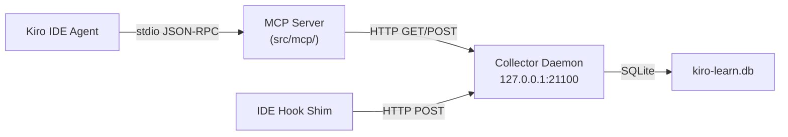
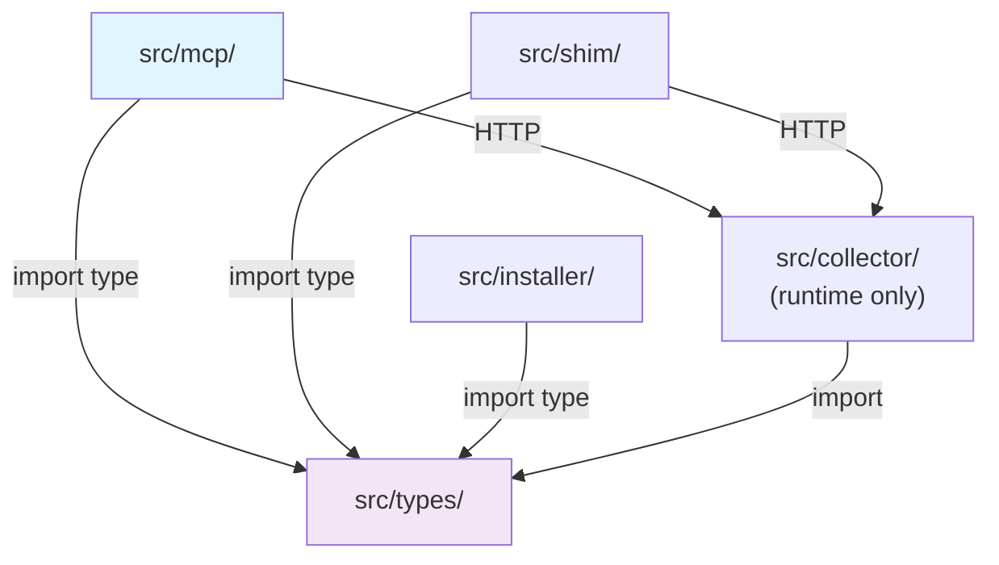
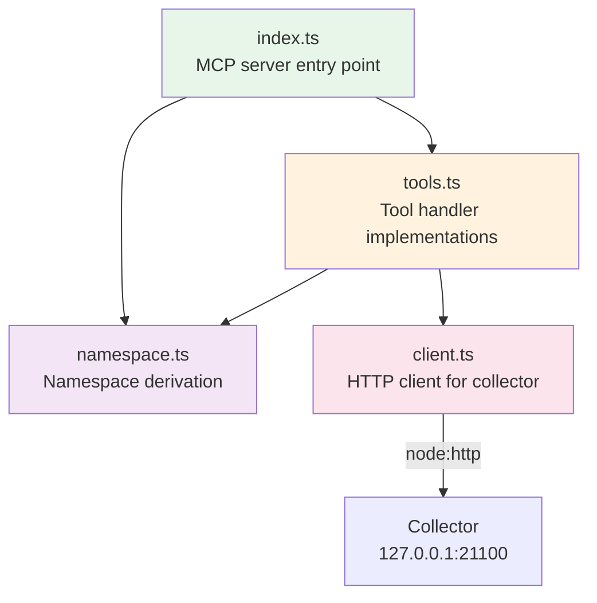
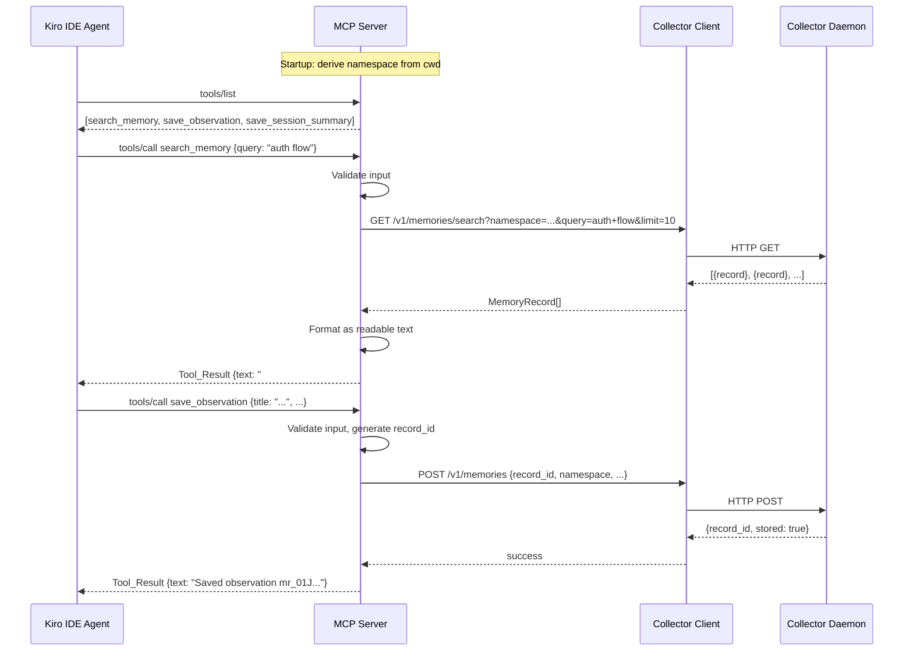

# Design: MCP Memory Server

## Overview

The MCP Memory Server is a stdio-based JSON-RPC process that exposes kiro-learn's memory capabilities as [Model Context Protocol](https://modelcontextprotocol.io/) tools. It enables agents to actively search memory and store observations/session summaries by translating MCP tool calls into HTTP requests against the already-running collector daemon.

Architecturally, the MCP server is a fourth top-level module (`src/mcp/`) alongside `src/collector/`, `src/shim/`, and `src/installer/`. Like the shim, it is a pure HTTP client of the collector — it shares types via `import type` from `src/types/` but has no code-level dependency on any other module. The `@modelcontextprotocol/sdk` TypeScript SDK handles protocol correctness, JSON-RPC framing, and stdio transport.

### Key Design Decisions

1. **HTTP client, not direct DB access.** The MCP server communicates with the collector via HTTP, preserving the single-writer architecture. The collector owns the SQLite database; the MCP server is just another client.

2. **Namespace derived from cwd.** The MCP server derives its namespace from `process.cwd()` using the same SHA-256 algorithm as the shim. This means memory operations are automatically scoped to the project the agent is working in.

3. **`session_summary` observation type.** The `save_session_summary` tool needs a new `session_summary` value in the `OBSERVATION_TYPES` enum. This is an additive schema change — existing records are unaffected.

4. **Self-contained module.** The `src/mcp/` module duplicates small amounts of logic (config loading, namespace derivation) rather than importing from `src/shim/`. This follows the same pattern as the shim's duplication of `PROJECT_MARKERS` from the installer — modularity boundaries are more valuable than DRY at this layer.

5. **Two new collector endpoints.** `POST /v1/memories` and `GET /v1/memories/search` are added to the existing receiver. These follow the same patterns as `POST /v1/events` and `GET /v1/memories`.

## Architecture

### System Context



### Module Dependency Graph



The `src/mcp/` module:
- **MAY** import from `src/types/` (type-only via `import type`)
- **MUST NOT** import from `src/collector/`, `src/shim/`, or `src/installer/`
- **MAY** import from `node:` built-in modules
- **MAY** import from `@modelcontextprotocol/sdk`
- **MAY** import from `ulidx` (for record ID generation)

### Internal Module Structure



### Request Flow



## Components and Interfaces

### File Structure

```
src/mcp/
  index.ts          — MCP server entry point, tool registration, stdio transport
  client.ts         — HTTP client for collector API (GET/POST requests)
  tools.ts          — Tool handler implementations (search, save_observation, save_session_summary)
  namespace.ts      — Namespace derivation from cwd (shared algorithm)
```

### `src/mcp/index.ts` — Server Entry Point

Creates the MCP `Server` instance, registers the three tools with their JSON schemas, connects via `StdioServerTransport`, and handles lifecycle.

```typescript
import { Server } from '@modelcontextprotocol/sdk/server/index.js';
import { StdioServerTransport } from '@modelcontextprotocol/sdk/server/stdio.js';

// Tool registration via server.setRequestHandler(ListToolsRequestSchema, ...)
// Tool dispatch via server.setRequestHandler(CallToolRequestSchema, ...)
```

**Responsibilities:**
- Create `Server` instance with name `'kiro-learn-memory'` and version from package.json
- Register `ListToolsRequestSchema` handler returning the three tool definitions
- Register `CallToolRequestSchema` handler dispatching to tool implementations
- Connect via `StdioServerTransport` (stdin/stdout)
- Log errors to stderr only (never pollute stdout with non-JSON-RPC content)
- Derive namespace once at startup via `deriveNamespace(process.cwd())`

### `src/mcp/client.ts` — Collector HTTP Client

A self-contained HTTP client using `node:http` that communicates with the collector daemon. Follows the same config-loading pattern as the shim's `loadConfig()`.

```typescript
export interface CollectorClientConfig {
  host: string;
  port: number;
  timeoutMs: number;
}

export const DEFAULT_CLIENT_CONFIG: CollectorClientConfig = {
  host: '127.0.0.1',
  port: 21100,
  timeoutMs: 5000,
};

/** Load collector host/port from ~/.kiro-learn/settings.json, with defaults. */
export function loadCollectorConfig(): CollectorClientConfig;

/** POST /v1/memories — store a memory record. */
export function postMemory(
  record: MemoryRecordPayload,
  config: CollectorClientConfig,
): Promise<PostMemoryResult>;

/** GET /v1/memories/search — search memory records. */
export function searchMemories(
  params: SearchMemoriesParams,
  config: CollectorClientConfig,
): Promise<SearchMemoriesResult>;
```

**Key types:**

```typescript
export interface MemoryRecordPayload {
  record_id: string;
  namespace: string;
  strategy: string;
  title: string;
  summary: string;
  facts: string[];
  source_event_ids: string[];
  created_at: string;
  concepts: string[];
  files_touched: string[];
  observation_type: string;
}

export interface PostMemoryResult {
  record_id: string;
  stored: boolean;
}

export interface SearchMemoriesParams {
  namespace: string;
  query: string;
  limit: number;
}

export type SearchMemoriesResult = MemoryRecordPayload[];

export interface CollectorError {
  type: 'connection_refused' | 'timeout' | 'http_error' | 'parse_error';
  message: string;
  statusCode?: number;
}
```

**Error handling:** Every HTTP call returns a discriminated result. Connection refused, timeout, non-2xx status, and JSON parse errors are all captured as typed errors — never thrown as unhandled exceptions.

### `src/mcp/tools.ts` — Tool Implementations

Contains the handler functions for each MCP tool. Each handler validates input, calls the collector client, and returns a formatted `Tool_Result`.

```typescript
import type { MemoryRecord } from '../../types/index.js';

export interface ToolContext {
  namespace: string;
  config: CollectorClientConfig;
}

/** Handle search_memory tool call. */
export async function handleSearchMemory(
  args: Record<string, unknown>,
  ctx: ToolContext,
): Promise<ToolResult>;

/** Handle save_observation tool call. */
export async function handleSaveObservation(
  args: Record<string, unknown>,
  ctx: ToolContext,
): Promise<ToolResult>;

/** Handle save_session_summary tool call. */
export async function handleSaveSessionSummary(
  args: Record<string, unknown>,
  ctx: ToolContext,
): Promise<ToolResult>;

/** Format memory records as human-readable text. */
export function formatSearchResults(records: MemoryRecordPayload[]): string;

/** Validate and extract search_memory arguments. */
export function validateSearchArgs(args: Record<string, unknown>): SearchArgs | ValidationError;

/** Validate and extract save_observation arguments. */
export function validateObservationArgs(args: Record<string, unknown>): ObservationArgs | ValidationError;

/** Validate and extract save_session_summary arguments. */
export function validateSessionSummaryArgs(args: Record<string, unknown>): SessionSummaryArgs | ValidationError;
```

**Tool result format:**

```typescript
interface ToolResult {
  content: Array<{ type: 'text'; text: string }>;
  isError?: boolean;
}
```

### `src/mcp/namespace.ts` — Namespace Derivation

Derives the namespace from the working directory using the same algorithm as the shim. This is a deliberate duplication — the MCP module cannot import from `src/shim/`.

```typescript
/**
 * Derive the namespace for memory operations from the working directory.
 *
 * Algorithm (identical to shim):
 *   project_id = SHA-256 hex of fs.realpathSync(cwd)
 *   actor_id   = os.userInfo().username (with fallback chain)
 *   namespace  = /actor/<actor_id>/project/<project_id>/
 */
export function deriveNamespace(cwd: string): string;

/**
 * Get the actor ID from the OS, with fallback chain:
 *   os.userInfo().username → process.env.USER → process.env.USERNAME → 'unknown'
 */
export function getActorId(): string;
```

### Collector Endpoint Extensions

Two new endpoints are added to `src/collector/receiver/index.ts`:

#### `POST /v1/memories`

```
POST /v1/memories
Content-Type: application/json

{
  "record_id": "mr_01JXYZ...",
  "namespace": "/actor/alice/project/abc123.../",
  "strategy": "mcp_observation",
  "title": "Auth flow uses JWT tokens",
  "summary": "The authentication flow...",
  "facts": ["JWT tokens expire after 1 hour"],
  "source_event_ids": ["01JXYZ..."],
  "created_at": "2025-01-15T10:30:00.000Z",
  "concepts": ["authentication", "JWT"],
  "files_touched": ["src/auth/index.ts"],
  "observation_type": "discovery"
}
```

Response (200):
```json
{ "record_id": "mr_01JXYZ...", "stored": true }
```

Response (400):
```json
{ "error": "validation failed", "details": [...] }
```

**Implementation:** Reuses the existing `readBody` helper, validates via `parseMemoryRecord` from `src/types/`, stores via `storage.putMemoryRecord()`. Follows the same pattern as `POST /v1/events`.

#### `GET /v1/memories/search`

```
GET /v1/memories/search?namespace=/actor/alice/project/abc123.../&query=auth+flow&limit=10
```

Response (200):
```json
[
  { "record_id": "mr_01JXYZ...", "title": "Auth flow uses JWT tokens", ... },
  ...
]
```

Response (400):
```json
{ "error": "query parameter is required" }
```

**Implementation:** Validates `namespace` against `NAMESPACE_RE`, validates `query` is non-empty, clamps `limit` to [1, 100], delegates to `storage.searchMemoryRecords()`.

### Schema Extension

The `OBSERVATION_TYPES` array in `src/types/schemas.ts` is extended:

```typescript
export const OBSERVATION_TYPES = [
  'tool_use',
  'decision',
  'error',
  'discovery',
  'pattern',
  'session_summary',  // NEW — added for MCP save_session_summary tool
] as const;
```

This is additive — existing records with the five original types remain valid. The Zod `z.enum(OBSERVATION_TYPES)` automatically picks up the new value.

### Installer Integration

#### New bin wrapper: `~/.kiro-learn/bin/mcp-server`

Added to `writeBinWrappers()` in `src/installer/index.ts`:

```javascript
#!/usr/bin/env node
import { main } from "../lib/mcp/index.js";
main().catch((err) => { process.stderr.write(String(err) + '\n'); process.exit(1); });
```

#### New function: `writeMcpConfig(projectRoot: string)`

Writes `.kiro/settings/mcp.json` in the project root:

```json
{
  "mcpServers": {
    "kiro-learn-memory": {
      "command": "/Users/alice/.kiro-learn/bin/mcp-server",
      "args": []
    }
  }
}
```

Called by `cmdInit` when project scope is detected. Removed by `cmdUninstall`.

### MCP Tool Schemas

#### `search_memory`

```json
{
  "name": "search_memory",
  "description": "Search kiro-learn memory records for the current project. Returns relevant prior observations, decisions, and patterns.",
  "inputSchema": {
    "type": "object",
    "properties": {
      "query": {
        "type": "string",
        "description": "Natural language search query"
      },
      "limit": {
        "type": "number",
        "description": "Maximum number of results to return (default: 10, max: 100)"
      }
    },
    "required": ["query"]
  }
}
```

#### `save_observation`

```json
{
  "name": "save_observation",
  "description": "Store a structured observation as a memory record for future sessions.",
  "inputSchema": {
    "type": "object",
    "properties": {
      "title": {
        "type": "string",
        "description": "Short title for the observation (max 200 chars)"
      },
      "summary": {
        "type": "string",
        "description": "Detailed description of the observation (max 4000 chars)"
      },
      "observation_type": {
        "type": "string",
        "enum": ["tool_use", "decision", "error", "discovery", "pattern"],
        "description": "Classification of the observation"
      },
      "concepts": {
        "type": "array",
        "items": { "type": "string" },
        "description": "Key concepts or topics related to this observation"
      },
      "files_touched": {
        "type": "array",
        "items": { "type": "string" },
        "description": "File paths relevant to this observation"
      },
      "facts": {
        "type": "array",
        "items": { "type": "string" },
        "description": "Specific factual statements extracted from this observation"
      }
    },
    "required": ["title", "summary", "observation_type", "concepts", "files_touched", "facts"]
  }
}
```

#### `save_session_summary`

```json
{
  "name": "save_session_summary",
  "description": "Store a structured session summary capturing what was accomplished in this session.",
  "inputSchema": {
    "type": "object",
    "properties": {
      "request": {
        "type": "string",
        "description": "What the user asked for"
      },
      "investigated": {
        "type": "string",
        "description": "What was investigated or explored"
      },
      "learned": {
        "type": "string",
        "description": "Key learnings or discoveries"
      },
      "completed": {
        "type": "string",
        "description": "What was completed or delivered"
      },
      "next_steps": {
        "type": "string",
        "description": "Suggested next steps or follow-ups"
      },
      "files_read": {
        "type": "array",
        "items": { "type": "string" },
        "description": "Files that were read during the session"
      },
      "files_modified": {
        "type": "array",
        "items": { "type": "string" },
        "description": "Files that were modified during the session"
      }
    },
    "required": ["request", "investigated", "learned", "completed", "next_steps", "files_read", "files_modified"]
  }
}
```

## Data Models

### Memory Record Construction

#### `save_observation` → `MemoryRecord`

| MemoryRecord field | Source |
|---|---|
| `record_id` | Generated: `mr_` + ULID via `ulidx` |
| `namespace` | Derived from `process.cwd()` at startup |
| `strategy` | Literal `'mcp_observation'` |
| `title` | From tool arg `title` (validated ≤ 200 chars) |
| `summary` | From tool arg `summary` (validated ≤ 4000 chars) |
| `facts` | From tool arg `facts` |
| `source_event_ids` | Single-element array with a generated ULID (synthetic — no real event) |
| `created_at` | `new Date().toISOString()` |
| `concepts` | From tool arg `concepts` |
| `files_touched` | From tool arg `files_touched` |
| `observation_type` | From tool arg `observation_type` |

#### `save_session_summary` → `MemoryRecord`

| MemoryRecord field | Source |
|---|---|
| `record_id` | Generated: `mr_` + ULID via `ulidx` |
| `namespace` | Derived from `process.cwd()` at startup |
| `strategy` | Literal `'mcp_session_summary'` |
| `title` | From `request`, truncated to 200 chars |
| `summary` | Formatted concatenation (see below), truncated to 4000 chars |
| `facts` | Empty array `[]` |
| `source_event_ids` | Single-element array with a generated ULID (synthetic) |
| `created_at` | `new Date().toISOString()` |
| `concepts` | Empty array `[]` |
| `files_touched` | Union of `files_read` and `files_modified` (deduplicated) |
| `observation_type` | Literal `'session_summary'` |

**Summary formatting:**

```
## What was investigated
{investigated}

## What was learned
{learned}

## What was completed
{completed}

## Next steps
{next_steps}
```

If the formatted summary exceeds 4000 characters, sections are truncated from the bottom (next_steps first, then completed, etc.) with a `[truncated]` marker.

### Search Result Formatting

Each memory record is formatted as a text block:

```
### {title}

{summary}

Concepts: {concepts joined by ", "}

Files:
  {file1}
  {file2}
  ...
```

Multiple records are separated by a blank line. When zero records match, the result is:

```
No matching memories found for the current project.
```

### Settings.json Schema (read by client.ts)

The MCP client reads the same `~/.kiro-learn/settings.json` as the shim:

```json
{
  "collector": {
    "host": "127.0.0.1",
    "port": 21100
  }
}
```

Only `collector.host` and `collector.port` are read. The `shim` section is ignored.

### MCP Config Schema

Written to `.kiro/settings/mcp.json` by the installer:

```json
{
  "mcpServers": {
    "kiro-learn-memory": {
      "command": "<INSTALL_DIR>/bin/mcp-server",
      "args": []
    }
  }
}
```


## Correctness Properties

*A property is a characteristic or behavior that should hold true across all valid executions of a system — essentially, a formal statement about what the system should do. Properties serve as the bridge between human-readable specifications and machine-verifiable correctness guarantees.*

### Property 1: Search result formatting contains all required fields

*For any* non-empty array of memory records, the formatted text output of `formatSearchResults` SHALL contain each record's `title`, `summary`, every entry in `concepts` (comma-separated), and every entry in `files_touched`.

**Validates: Requirements 3.2, 13.1**

### Property 2: Multiple search results are separated by blank lines

*For any* array of 2 or more memory records, the formatted text output of `formatSearchResults` SHALL contain at least N-1 blank-line separators (where N is the number of records), and each record's title SHALL appear in the output in the same order as the input array.

**Validates: Requirements 13.2**

### Property 3: Invalid observation types are rejected

*For any* string that is not one of the valid `OBSERVATION_TYPES` values, `validateObservationArgs` SHALL return a validation error indicating the invalid observation type.

**Validates: Requirements 4.3**

### Property 4: Over-limit fields are rejected by validation

*For any* tool input where a size-constrained field exceeds its limit — `title` > 200 chars, `summary` > 4000 chars, `query` > 1000 chars, `concepts` array > 50 entries, `files_touched` array > 100 entries, or `facts` array > 50 entries — the corresponding validation function SHALL return a validation error.

**Validates: Requirements 4.4, 4.5, 11.1, 11.2, 11.3, 11.4**

### Property 5: Structurally malformed tool inputs produce error results

*For any* tool call arguments object that is missing a required field or has a field of the wrong type (e.g., `query` is a number instead of a string, `concepts` is a string instead of an array), the validation function SHALL return a validation error rather than passing the input through.

**Validates: Requirements 7.3**

### Property 6: Session summary construction respects size limits and includes all fields

*For any* valid `save_session_summary` input fields (`request`, `investigated`, `learned`, `completed`, `next_steps`), the constructed memory record SHALL have a `title` of length ≤ 200 characters, a `summary` of length ≤ 4000 characters, and the `summary` SHALL contain substrings from each of the four body fields (`investigated`, `learned`, `completed`, `next_steps`) when the total length permits.

**Validates: Requirements 5.3, 5.4**

### Property 7: Config loading returns valid host/port or defaults

*For any* `settings.json` content (valid JSON with collector section, valid JSON without collector section, invalid JSON, or missing file), `loadCollectorConfig` SHALL return a config object where `host` is a non-empty string and `port` is a positive integer. When the file is missing or malformed, the returned values SHALL equal the defaults (`'127.0.0.1'` and `21100`).

**Validates: Requirements 6.2**

### Property 8: Private tags pass through unchanged

*For any* string containing `<private>...</private>` tags passed as a tool argument field (`title`, `summary`, `query`, or any array element in `concepts`, `files_touched`, `facts`), the MCP server's validation and construction logic SHALL preserve the string byte-for-byte — no scrubbing, no modification.

**Validates: Requirements 11.5**

### Property 9: Namespace derivation produces a valid namespace

*For any* absolute directory path and any actor ID string, `deriveNamespace` SHALL produce a string matching the pattern `/actor/<actor_id>/project/<64-hex-chars>/` where the 64 hex characters are the SHA-256 digest of the resolved path.

**Validates: Requirements 12.1**

## Error Handling

### Error Categories

| Error | Source | Handling |
|---|---|---|
| Connection refused | Collector not running | Return error `Tool_Result`: "The kiro-learn collector is not running. Start it with `kiro-learn start`." Server continues. |
| Request timeout | Collector slow/hung | Return error `Tool_Result`: "Request to collector timed out after 5 seconds." Server continues. |
| HTTP 400 | Collector validation failure | Return error `Tool_Result` with collector's error message. Server continues. |
| HTTP 4xx/5xx | Collector error | Return error `Tool_Result`: "Collector returned HTTP {status}: {body}". Server continues. |
| Invalid tool args | Malformed MCP call | Return error `Tool_Result` with validation message. Server continues. |
| JSON parse error | Collector returns non-JSON | Return error `Tool_Result`: "Unexpected response from collector." Server continues. |
| Startup failure | Config/namespace error | Log to stderr, exit with non-zero code. |

### Error Result Format

All tool errors use the MCP SDK's error result format:

```typescript
{
  content: [{ type: 'text', text: 'Error: <descriptive message>' }],
  isError: true,
}
```

### Resilience Principles

1. **Never crash on tool call failure.** Every tool handler wraps its logic in try/catch and returns an error `Tool_Result` on any exception.
2. **Never pollute stdout.** All diagnostic output goes to stderr. The MCP SDK handles JSON-RPC framing on stdout.
3. **Timeout all HTTP requests.** The 5-second timeout prevents the MCP server from hanging when the collector is unresponsive.
4. **Validate before sending.** Input validation catches malformed data before it reaches the HTTP client, providing faster and more descriptive error messages.

### Collector Unavailability

When the collector daemon is not running, every tool call returns an error `Tool_Result`. The MCP server does NOT crash or exit — it remains ready to handle subsequent calls. When the collector becomes available again, tool calls resume working normally. No reconnection logic is needed because each HTTP request is independent.

## Testing Strategy

### Property-Based Tests (fast-check)

Property-based tests use `fast-check` (already a dev dependency). Each property test runs a minimum of 100 iterations. Tests are tagged with the design property they validate.

| Test File | Properties Covered | What It Tests |
|---|---|---|
| `test/unit/mcp-format.property.test.ts` | P1, P2 | `formatSearchResults` output contains all fields, blank-line separation |
| `test/unit/mcp-validation.property.test.ts` | P3, P4, P5 | Input validation: invalid observation types, over-limit fields, malformed inputs |
| `test/unit/mcp-session-summary.property.test.ts` | P6 | Session summary construction: title/summary size limits, field inclusion |
| `test/unit/mcp-config.property.test.ts` | P7 | Config loading: valid results for any settings.json content |
| `test/unit/mcp-passthrough.property.test.ts` | P8 | Private tag passthrough: content preserved unchanged |
| `test/unit/mcp-namespace.property.test.ts` | P9 | Namespace derivation: pattern match, SHA-256 correctness |

**Generator extensions** in `test/helpers/arbitrary.ts`:
- `arbitrarySearchMemoryArgs()` — valid `search_memory` tool arguments
- `arbitraryObservationArgs()` — valid `save_observation` tool arguments
- `arbitrarySessionSummaryArgs()` — valid `save_session_summary` tool arguments
- `arbitraryMalformedToolArgs()` — structurally invalid tool arguments (missing fields, wrong types)
- `arbitraryOverLimitObservationArgs()` — observation args with at least one field exceeding its limit

### Example-Based Unit Tests

| Test File | What It Tests |
|---|---|
| `test/unit/mcp-tools.test.ts` | Tool handler happy paths, error responses, tool registration |
| `test/unit/mcp-client.test.ts` | HTTP client: request construction, response parsing, error handling |
| `test/unit/mcp-namespace.test.ts` | Namespace derivation: actor_id fallback chain, edge cases |
| `test/unit/mcp-installer.test.ts` | `writeMcpConfig`, `writeBinWrappers` mcp-server entry, uninstall cleanup |
| `test/unit/mcp-receiver-endpoints.test.ts` | `POST /v1/memories` and `GET /v1/memories/search` collector endpoints |

### Guard Tests

| Test File | What It Guards |
|---|---|
| `test/unit/no-collector-in-mcp.test.ts` | `src/mcp/` does not import from `src/collector/` |
| `test/unit/no-shim-in-mcp.test.ts` | `src/mcp/` does not import from `src/shim/` |
| `test/unit/no-installer-in-mcp.test.ts` | `src/mcp/` does not import from `src/installer/` |

These follow the exact same pattern as the existing `test/unit/no-collector-in-shim.test.ts` — scan all `.ts` files under `src/mcp/`, strip comments, and assert no import paths reference the forbidden modules.

Note: The three guard tests can be combined into a single file `test/unit/no-forbidden-imports-in-mcp.test.ts` with three `it()` blocks, following the pattern of `no-collector-in-shim.test.ts` which combines multiple boundary checks.

### Test Configuration

- Property tests: minimum 100 iterations per property (`{ numRuns: 100 }`)
- Each property test tagged: `// Feature: mcp-memory-server, Property N: <property text>`
- HTTP client tests use a local `node:http` mock server (same pattern as existing receiver tests)
- No real collector needed for unit tests — all HTTP interactions are mocked

### New Runtime Dependency

The `@modelcontextprotocol/sdk` package must be added to `package.json` dependencies. Use an exact pinned version (same convention as `@agentclientprotocol/sdk`):

```json
"@modelcontextprotocol/sdk": "1.12.1"
```

The installer's `writePackageJson()` must also include this dependency in the runtime `package.json` written to `~/.kiro-learn/`.
