# Design Document: Project Path Capture

## Overview

Today the kiro-learn shim hashes `realpath(cwd)` to derive `project_id`. That was good enough for a bare-bones v0 — it gave every event a stable namespace — but it fragments memory at the exact boundary where continuity matters. Running `kiro-cli` in `~/code/myrepo`, `~/code/myrepo/src`, and `~/code/myrepo/test` produces three different `project_id`s, three different namespaces, and three disjoint retrieval corpora for what is obviously one project. The fragmentation is a correctness bug in the namespace layer, not a UX issue: the retrieval path works exactly as designed, it just searches the wrong bucket.

Tomorrow, after this spec, the shim hashes `realpath(project_root)`. Project root is whichever nearest ancestor of cwd contains one of the fifteen markers the installer already uses in [`detectScope`](../../../src/installer/index.ts) (`.kiro`, `.git`, `package.json`, …). The walk ceiling is `realpath($HOME)` — the walk never inspects `$HOME` or anything above it, matching the installer's existing behaviour. When no marker is found before the walk reaches `$HOME`, the event falls back to a **global sentinel** identity: `project_id = SHA-256($HOME)`, so every non-project event from one user collapses into a single namespace per user instead of fragmenting per directory.

The spec also makes the identity's preimage observable. `EventSource` gains an optional `project_path: string` (1–2048 chars). The shim sets it to the same path it just hashed. Storage gains a nullable `project_path` column via migration `0003_project_path` and binds the shim-supplied value into it on insert. Read-path round-trip integrity still flows through `source_json` — the new column is a denormalised projection that exists for indexed aggregation (grouping events by project for future list APIs), not as an alternate source of truth. The write path extracts `source.project_path` into the column; the read path ignores the column entirely and reconstitutes `source` from `source_json` the way it does today.

Everything else about the wire contract stays put. `schema_version` stays at `1`. Adding an optional field is additive by design. Old events without `project_path` remain valid, old shims that do not emit the field remain accepted, and old rows with NULL in the new column round-trip cleanly because the read path doesn't look at the column in the first place. The privacy scrub still operates on `body`, not `source`, so the pipeline gains no new behaviour. Dedup still keys on `event_id`.

Scope is narrow on purpose. No read API, no display-name formatting, no environment-variable overrides, no backfill of old rows, no refactor of the installer's scope-detection logic into a shared utility. The shim and the installer will ship identical fifteen-element marker lists for one release. When the second duplicate bites — and it will — we consolidate then.

This spec implements Requirements 1 through 12 plus N1–N13. Every section below links back to the specific requirements it addresses.

## Architecture

### Component context

This spec touches four modules and adds a fifth. The narrative is: the shim now resolves a project root, persists its path on the event, and storage persists it into a new column. Nothing else in the system changes.

```mermaid
graph LR
    CWD[cwd from hook input] --> DPR[detectProjectRoot<br/>NEW — src/shim/shared/]
    DPR -->|projectRoot + projectPath + isGlobal| BE[buildEvent<br/>MODIFIED]
    BE -->|KiroMemEvent with<br/>source.project_path| POST[postEvent → collector]

    POST --> REC[receiver<br/>parseEvent]
    REC --> PIPE[pipeline<br/>dedup → scrub → storage<br/>UNCHANGED]
    PIPE --> STOR[putEvent<br/>MODIFIED: binds project_path column]
    STOR --> DB[(events table<br/>+ project_path TEXT NULL<br/>+ idx_events_namespace_project_path)]

    DB --> GET[getEventById<br/>UNCHANGED: reads source_json only]

    style DPR fill:#cfd,stroke:#0a0
    style BE fill:#cfd,stroke:#0a0
    style STOR fill:#cfd,stroke:#0a0
    style DB fill:#cfd,stroke:#0a0
    style PIPE fill:#eee
    style GET fill:#eee
```



### End-to-end sequence (project event)

```text
Kiro CLI hook          detectProjectRoot          buildEvent         collector         storage
     │                        │                        │                 │                 │
     │──cwd─────────────────▶ │                        │                 │                 │
     │                        │──realpath(cwd)────┐    │                 │                 │
     │                        │──realpath($HOME)──┘    │                 │                 │
     │                        │──walk upward,          │                 │                 │
     │                        │  ceiling=$HOME ──┐     │                 │                 │
     │                        │  marker found ───┘     │                 │                 │
     │                        │                        │                 │                 │
     │                        │─projectRoot=R──────────▶                 │                 │
     │                        │ projectPath=R          │                 │                 │
     │                        │ isGlobal=false         │                 │                 │
     │                        │                        │──hash(R)───┐    │                 │
     │                        │                        │  set        │    │                 │
     │                        │                        │  source     │    │                 │
     │                        │                        │  .project_  │    │                 │
     │                        │                        │  path       │    │                 │
     │                        │                        ◀─────────────┘    │                 │
     │                        │                        │──KiroMemEvent───▶                  │
     │                        │                        │                 │──parseEvent──┐   │
     │                        │                        │                 │──dedup──┐    │   │
     │                        │                        │                 │──scrub──┘    │   │
     │                        │                        │                 │              │   │
     │                        │                        │                 │──putEvent────▶   │
     │                        │                        │                 │              │   │──INSERT with
     │                        │                        │                 │              │   │  project_path
     │                        │                        │                 │              │   │  column bound
     │                        │                        │                 │              ◀───│
     │                        │                        │                 ◀──────────────    │
```

### Sequence (global sentinel event — no project marker found)

```text
detectProjectRoot:
  resolvedCwd = realpath(cwd)        e.g. /Users/alice/scratch
  ceiling = realpath($HOME)          e.g. /Users/alice
  walk from resolvedCwd up, stopping before ceiling
  no marker found
  ⇒ projectRoot  = ceiling           /Users/alice
    projectPath  = ceiling           /Users/alice
    isGlobal     = true

buildEvent:
  project_id = SHA-256(ceiling)
  source.project_path = ceiling
  namespace  = /actor/<user>/project/<project_id>/
```

The namespace shape is unchanged — a global event looks structurally identical to a project event on the wire and in storage. The only difference is that all of alice's non-project events share one `project_id` (Requirement 3.2, 3.4).

### Module structure

```text
src/shim/shared/
  index.ts                         ← MODIFIED: buildEvent calls detectProjectRoot
  project-root.ts                  ← NEW: detectProjectRoot, PROJECT_MARKERS

src/types/
  schemas.ts                       ← MODIFIED: EventSourceSchema gains optional project_path

src/collector/storage/sqlite/
  statements.ts                    ← MODIFIED: insertEvent gains project_path param
  index.ts                         ← MODIFIED: putEvent binds source.project_path
  migrations/
    0003_project_path.ts           ← NEW
    index.ts                       ← MODIFIED: append migration0003 to MIGRATIONS
```

Dependency direction is preserved: `src/shim/shared/project-root.ts` imports only from `node:` standard library modules — no imports from `src/installer/`, `src/collector/`, or `src/shim/cli-agent/` (Requirement N9, N10). The existing modularity guard tests continue to pass unchanged.

## Components and Interfaces

### Component 1: `detectProjectRoot` (new, in `src/shim/shared/`)

**Purpose.** Given a working directory, return the resolved project root, its path (the preimage that will be hashed), and a flag indicating whether the result is the global sentinel fallback. This function encapsulates everything interesting about this spec on the shim side: the walk, the ceiling, the marker list, and all four fallback branches.

**Signature.**

```typescript
export interface ProjectRootResult {
  /** Resolved absolute path used as the hash input for project_id. */
  projectRoot: string;
  /** Value emitted on source.project_path. Always === projectRoot. */
  projectPath: string;
  /** True iff this is a global sentinel event (no marker found). */
  isGlobal: boolean;
}

export function detectProjectRoot(cwd: string): ProjectRootResult;
```

**Contract.**

- Pure function up to filesystem observation (`realpathSync`, `existsSync`).
- Never throws. Every failure mode in Requirement 7 falls back to a safe value.
- When a marker is found below `$HOME`, `projectRoot = projectPath = realpath(marker-directory)` and `isGlobal = false` (Requirements 1, 4).
- When no marker is found or cwd is at/above `$HOME`, `projectRoot = projectPath = realpath($HOME)` (when resolvable) and `isGlobal = true` (Requirements 2, 3).
- `projectRoot` and `projectPath` are always equal. The two names exist because downstream code calls them different things: the hash input is `projectRoot`, the emitted wire field is `source.project_path`. Requirement 6.1 guarantees they are the same value.

**Why it's colocated with `buildEvent`.** Requirement N9 fixes the location at `src/shim/shared/`. The shim cannot import from `src/installer/`, so the marker list is duplicated (see [Shim — Marker Walk and Fallback Logic](#shim--marker-walk-and-fallback-logic) for the explicit rationale on accepting this duplication).

### Component 2: `PROJECT_MARKERS` (new constant in shim)

**Purpose.** The 15-element ordered list of marker filenames the walk checks at every directory.

**Signature.**

```typescript
export const PROJECT_MARKERS: readonly string[] = [
  '.kiro',
  '.git',
  'package.json',
  'Cargo.toml',
  'pyproject.toml',
  'setup.py',
  'go.mod',
  'pom.xml',
  'build.gradle',
  'build.gradle.kts',
  'Gemfile',
  'composer.json',
  'mix.exs',
  'deno.json',
  'deno.jsonc',
] as const;
```

**Contract.** Byte-for-byte identical to the installer's `PROJECT_MARKERS` in `src/installer/index.ts`. Order matters for tie-break logging per Requirement 1.4 but not for the returned `projectRoot`: Requirement 1.5 is explicit that the marker identity is not persisted and not surfaced — only the containing directory matters.

### Component 3: `buildEvent` (modified, in `src/shim/shared/`)

**Purpose.** Today's `buildEvent` hashes `realpath(cwd)` directly. It becomes a thin composition of `detectProjectRoot` plus the same event assembly it does now.

**Signature.** Unchanged.

```typescript
export function buildEvent(params: EventBuildParams): KiroMemEvent;
```

**Diff.** The body changes from:

```typescript
const resolvedCwd = realpathSync(params.cwd);
const projectId = createHash('sha256').update(resolvedCwd).digest('hex');
// ...
source: { surface: 'kiro-cli', version: PACKAGE_VERSION, client_id: hostname() },
```

to:

```typescript
const { projectRoot, projectPath } = detectProjectRoot(params.cwd);
const projectId = createHash('sha256').update(projectRoot).digest('hex');
// ...
source: {
  surface: 'kiro-cli',
  version: PACKAGE_VERSION,
  client_id: hostname(),
  project_path: projectPath,   // NEW — always populated, 1–2048 chars
},
```

`source.project_path` is *always* populated by the updated shim (Requirement 6.1, 6.2). The field's optionality in the schema is purely for backward compatibility with older shims and older stored rows (Requirements 5.4, 11.1). See [Shim — `buildEvent` Changes](#shim--buildevent-changes) for details.

### Component 4: `EventSourceSchema` (modified, in `src/types/schemas.ts`)

**Purpose.** Validate the provenance block on every event the receiver accepts.

**Diff.**

```typescript
export const EventSourceSchema = z.object({
  surface: z.enum(['kiro-cli', 'kiro-ide']),
  version: z.string().min(1),
  client_id: z.string().min(1),
  project_path: z.string().min(1).max(2048).optional(),  // NEW
});
```

`schema_version` literal stays at `1` (Requirement 5.3, 11.5). The field is optional so the validator accepts both old events (without the field) and new events (with it). The 1–2048 char bound is from Requirement 5.2.

### Component 5: `insertEvent` prepared statement (modified, in `src/collector/storage/sqlite/statements.ts`)

**Purpose.** The positional-parameter insert statement for the `events` table.

**Diff.** Gains a 13th positional parameter, `project_path`, inserted at the logical end of the column list (after `content_hash`). See [Storage — Insert Path](#storage--insert-path) for the exact SQL.

### Component 6: Migration `0003_project_path` (new)

**Purpose.** Add the nullable `project_path TEXT` column to `events` and the supporting index.

**Signature.**

```typescript
export const migration0003: Migration = {
  version: 3,
  name: '0003_project_path',
  up: (db) => db.exec(DDL),
};
```

Registered by appending to `MIGRATIONS` in `src/collector/storage/sqlite/migrations/index.ts`. See [Storage — Migration 0003](#storage--migration-0003) for the full DDL.

## Shim — Marker Walk and Fallback Logic

Implements Requirements 1, 2, 3, 4, 6, 7, N9.

### The walk

The algorithm is the same one the installer uses in `detectScope`, with one structural difference: the shim never throws, whereas the installer deliberately throws when cwd is outside `$HOME` (an install precondition violation). For the shim, outside-`$HOME` is just another code path into the global sentinel (Requirement 2.5).

```pascal
ALGORITHM detectProjectRoot(cwd)
INPUT:  cwd ∈ string
OUTPUT: { projectRoot, projectPath, isGlobal }

BEGIN
  // ── Phase 1: resolve inputs with fallback ──────────────────────
  TRY
    ceiling ← realpathSync(homedir())
  CATCH
    LOG stderr "[kiro-learn] homedir/realpath failed"
    ceiling ← homedir()                       // Requirement 7.2
  END TRY

  TRY
    resolvedCwd ← realpathSync(cwd)
  CATCH
    LOG stderr "[kiro-learn] cwd realpath failed"  // Requirement 7.1, 7.5
    RETURN {
      projectRoot: cwd,                        // Requirement 7.1: hash raw cwd
      projectPath: cwd,
      isGlobal:    false                       // degenerate; caller cannot tell
    }
  END TRY

  // ── Phase 2: ceiling cases → global sentinel ──────────────────
  IF resolvedCwd = ceiling THEN                // Requirement 2.4
    RETURN { projectRoot: ceiling, projectPath: ceiling, isGlobal: true }
  END IF

  IF NOT isUnder(resolvedCwd, ceiling) THEN    // Requirement 2.5
    RETURN { projectRoot: ceiling, projectPath: ceiling, isGlobal: true }
  END IF

  // ── Phase 3: upward walk ──────────────────────────────────────
  TRY
    current ← resolvedCwd
    WHILE current ≠ ceiling AND current ≠ dirname(current) DO
      // Requirement 2.2, 2.3: never inspect ceiling itself
      FOR each marker IN PROJECT_MARKERS DO    // Requirement 1.4
        TRY
          IF existsSync(current + '/' + marker) THEN
            RETURN {
              projectRoot: current,             // Requirement 1.3, 3, 5
              projectPath: current,
              isGlobal:    false
            }
          END IF
        CATCH
          // Requirement 7.3: silent on per-dir check failures.
          // Treat as "marker not present" and continue.
        END TRY
      END FOR
      current ← dirname(current)
    END WHILE
  CATCH
    LOG stderr "[kiro-learn] walk error"      // Requirement 7.4, 7.5
    RETURN {
      projectRoot: resolvedCwd,                // Requirement 7.4: fall back to today's behaviour
      projectPath: resolvedCwd,
      isGlobal:    false
    }
  END TRY

  // ── Phase 4: walk completed, no marker found ──────────────────
  RETURN {                                     // Requirement 3.1, 3.2, 3.3
    projectRoot: ceiling,
    projectPath: ceiling,
    isGlobal:    true
  }
END

FUNCTION isUnder(path, parent)
  RETURN path = parent OR path.startsWith(parent + sep)
END FUNCTION
```

### The four failure modes of Requirement 7

The walk has four distinct failure branches, each with its own fallback, its own logging contract, and its own preservation of the "exits 0 always" guarantee:

1. **`realpath(cwd)` fails** (Requirement 7.1). cwd was deleted between process start and the walk, or points at an unreadable symlink. Fall back to hashing the raw `cwd` string; set `source.project_path` to the raw `cwd`. Log a stderr warning. The `isGlobal` flag returned in this case is `false` because we have no reliable way to detect whether the unresolved path is under `$HOME` — the caller (`buildEvent`) doesn't care; it just uses the values.

2. **`realpath(homedir())` fails** (Requirement 7.2). Exceptionally rare — `$HOME` should always resolve. Fall back to the unresolved `homedir()` value as the ceiling. Log a stderr warning. The walk still happens with the unresolved ceiling.

3. **Per-directory marker check fails** (Requirement 7.3). `existsSync` on a parent directory fails (permission denied, transient I/O). Treat the directory as containing no marker and continue upward. **Silent** — no stderr log. A missing marker at a parent directory is an expected outcome of every walk, so logging every permission denied we hit would be noise.

4. **Walk throws something unexpected** (Requirement 7.4). Defensive catch around the outer loop. Fall back to hashing `realpath(cwd)` — today's behaviour, which we know works. Log a stderr warning.

None of these logs include the path value itself (Requirement N6) — the format is `[kiro-learn] cwd realpath failed` or `[kiro-learn] walk error`, not `[kiro-learn] walk error at /Users/alice/...`. Path values are not secrets, but the existing shim observability convention avoids putting them in stderr, and this spec honours that.

None of these branches throw out of `detectProjectRoot`, which is the load-bearing invariant: Requirement 7.6 requires that `buildEvent` never fails as a result of project-root detection, and `buildEvent` achieves that by delegating to this total function (Property 5 in the shim design stays intact — [shim/design.md § Property 5](../shim/design.md)).

### Why we duplicate the installer's marker list

Requirement N9 says the shim must not import from `src/installer/`. The installer's `PROJECT_MARKERS` constant is on the wrong side of that boundary. Options considered:

- **Move `PROJECT_MARKERS` to a shared utility module.** Clean, but pulls in `detectScope` too (the installer's walk uses the same list), which means shaping a new public utility now, while we're still learning whether the two walks need to stay identical long-term. Punt.
- **Read the list at runtime from a config file.** Over-engineered for v0.
- **Duplicate the literal.** One-release cost, zero runtime cost, reviewable in a single PR. Take it.

The two lists will stay in sync through code review, not through a test (a test comparing them would require importing the installer's constant into a shim-adjacent test, which adds coupling we don't want). When a third consumer needs the same list — or when the installer and shim walks diverge in subtle ways — we refactor. Tracked under Non-functional N9: "a shared utility can be introduced in a later refactor spec."

## Shim — `buildEvent` Changes

Implements Requirements 4, 6.

### Signature

Unchanged. `EventBuildParams` and the returned `KiroMemEvent` shape are the same — the only difference is that the returned event's `source` now always contains a `project_path` field.

### Code sketch

Focus on the diff, not the full function:

```typescript
// src/shim/shared/index.ts

import { detectProjectRoot } from './project-root.js';

export function buildEvent(params: EventBuildParams): KiroMemEvent {
  // Was: const resolvedCwd = realpathSync(params.cwd);
  //      const projectId = createHash('sha256').update(resolvedCwd).digest('hex');
  const { projectRoot, projectPath } = detectProjectRoot(params.cwd);
  const projectId = createHash('sha256').update(projectRoot).digest('hex');

  let actorId: string;
  try {
    actorId = userInfo().username;
  } catch {
    actorId = process.env['USER'] ?? process.env['USERNAME'] ?? 'unknown';
  }

  const namespace = `/actor/${actorId}/project/${projectId}/`;

  const event: KiroMemEvent = {
    event_id: ulid(),
    session_id: params.sessionId,
    actor_id: actorId,
    namespace,
    schema_version: 1,
    kind: params.kind,
    body: params.body,
    valid_time: new Date().toISOString(),
    source: {
      surface: 'kiro-cli',
      version: PACKAGE_VERSION,
      client_id: hostname(),
      project_path: projectPath,    // NEW — always set
    },
  };

  if (params.parentEventId !== undefined) {
    return { ...event, parent_event_id: params.parentEventId };
  }
  return event;
}
```

### Behaviour notes

- `projectRoot` and `projectPath` are always the same string. The two names exist for clarity at the caller: the shim hashes `projectRoot` and emits `projectPath`. The invariant that they are equal is guaranteed by `detectProjectRoot` (Requirement 6.1).
- The returned event always carries `source.project_path`. The field's schema-level optionality is a pure backward-compat concession (Requirements 5.4, 11.1). Current shims emit it; older shims in the wild don't.
- Under `exactOptionalPropertyTypes` the key is written directly into the object literal, not conditionally spread — it is never `undefined`. The only conditional spread remains `parent_event_id`, which is genuinely optional at the shim's call site.
- `detectProjectRoot` does all the error handling (Requirement 7.6). `buildEvent` itself gains no new try/catch blocks for project-root detection.

## Schema — `EventSource` Extension

Implements Requirements 5, 11.

### The change

```typescript
// src/types/schemas.ts

export const EventSourceSchema = z.object({
  surface: z.enum(['kiro-cli', 'kiro-ide']),
  version: z.string().min(1),
  client_id: z.string().min(1),
  project_path: z.string().min(1).max(2048).optional(),  // NEW
});
```

### Why optional

Two classes of events need to remain valid after this spec lands:

1. **Events already in storage.** Written by pre-spec shims, they have no `project_path`. `getEventById` reconstitutes them by parsing `source_json`; under `EventSource` today that yields `{ surface, version, client_id }`. After this spec, `parseEvent` must still accept that shape (Requirement 5.4, 11.3). Optional gets us that.

2. **Pre-spec shims still on disk.** A user who upgrades the collector but not the shim (or who has a long-running shim process) will POST events without the field. The receiver must accept them and persist them with `events.project_path = NULL` (Requirement 11.2). Optional gets us that too.

The field is optional in the *validator* but the new shim always populates it. The two statements are compatible because "optional" in Zod means "the validator accepts absence"; it says nothing about who is actually emitting absence.

### Why `schema_version` stays at `1`

The wire contract's versioning rule is: additive changes do not bump the version; breaking changes do. Adding an optional field is the canonical additive change. Every v1 consumer (old shims, old collectors, old stored rows) remains valid after this spec (Requirement 11.5). Bumping the version would break every v1 consumer for no benefit.

### Why no structural constraint on the value

Requirement 5.6 is explicit: no regex for absolute paths, no enforcement of `$HOME` prefix. The field is a carrier, not a constraint. If a pre-spec shim-variant someone wrote emits something weird, the collector should persist what it received, not reject. The 1–2048 char bound is a denial-of-service guard (paths longer than 2048 chars are extraordinarily rare in practice), not a correctness check.

## Storage — Migration 0003

Implements Requirements 8, N5.

### DDL

The migration adds one nullable column and one compound index. It is transactional by virtue of the migration runner wrapping `up` in `db.transaction(...)` (see [runner.ts](../../../src/collector/storage/sqlite/migrations/runner.ts)). If either statement fails, the transaction rolls back and the DB stays at schema version 2.

```typescript
// src/collector/storage/sqlite/migrations/0003_project_path.ts

/**
 * Migration 0003 — project path capture.
 *
 * Adds `events.project_path TEXT` (nullable, no DEFAULT) plus a compound
 * index on `(namespace, project_path)` for namespace-grouped aggregation.
 *
 * No backfill. Rows inserted under schema versions 1 and 2 keep NULL.
 * getEventById reads source.project_path from the source_json column, not
 * from this column, so existing rows remain round-trip equal under the
 * updated EventSourceSchema.
 *
 * Validates: Requirements 8.1, 8.2, 8.3, 8.4, 8.5, 9, 10, N5
 */

import type { Migration } from './types.js';

export const DDL = `
ALTER TABLE events
  ADD COLUMN project_path TEXT;

CREATE INDEX IF NOT EXISTS idx_events_namespace_project_path
  ON events (namespace, project_path);
`;

export const migration0003: Migration = {
  version: 3,
  name: '0003_project_path',
  up: (db) => db.exec(DDL),
};
```

### Why nullable, no DEFAULT

Migration 0002 added columns with `NOT NULL DEFAULT '[]'` because every `MemoryRecord` must have those fields and the defaults are what the application would insert for legacy rows. Migration 0003 is different: the `project_path` column is genuinely absent for rows written before this spec. Giving it a `DEFAULT ''` (or any placeholder) would misrepresent those rows. NULL is the truthful value (Requirement 8.2, 8.5).

### Registration

Appended to `MIGRATIONS` in `src/collector/storage/sqlite/migrations/index.ts`:

```typescript
import { migration0001 } from './0001_init.js';
import { migration0002 } from './0002_xml_extraction_fields.js';
import { migration0003 } from './0003_project_path.js';  // NEW

export const MIGRATIONS: readonly Migration[] = [
  migration0001,
  migration0002,
  migration0003,  // NEW
];
```

The runner's strict-ascending check (see [runner.ts line 78](../../../src/collector/storage/sqlite/migrations/runner.ts)) is satisfied: 1 < 2 < 3.

### Idempotency and drift

The migration runner's existing idempotency contract (`event-schema-and-storage` Requirement 9.2) applies unchanged: running `runMigrations` twice against a DB at version 3 is a no-op — the second run observes `_migrations` already contains `(3, '0003_project_path')` and skips the body (Requirement 8.6). Drift detection is also inherited: if someone renames the migration file or its `.name` field, the next startup raises `MigrationDriftError` (Requirement 8.7). No new runner logic is required.

### Performance

`ALTER TABLE ... ADD COLUMN` on SQLite is an O(1) metadata operation — SQLite stores the default-for-absent-rows (NULL in this case) in the schema and synthesises it for reads of old rows. The index creation scans the existing `events` table once. On commodity hardware with a v0 database (a few tens of thousands of rows at most), both steps complete in well under a second. Large-corpus behaviour is not a concern for v1 (Requirement N5; acknowledged in [Risks and Open Questions](#risks-and-open-questions)).

## Storage — Insert Path

Implements Requirement 9.

### Column and parameter order

The existing `insertEvent` statement binds 12 positional parameters. After this spec it binds 13. The new parameter goes at the logical end of the column list — after `content_hash` — so the historical order is preserved and the diff is minimal. This matches the convention migration 0002 established (new columns go at the end).

```typescript
// src/collector/storage/sqlite/statements.ts

type InsertEventParams = [
  eventId: string,
  parentEventId: string | null,
  sessionId: string,
  actorId: string,
  namespace: string,
  schemaVersion: number,
  kind: string,
  bodyJson: string,
  validTime: string,
  transactionTime: string,
  sourceJson: string,
  contentHash: string | null,
  projectPath: string | null,     // NEW — position 13
];

const insertEvent = db.prepare<InsertEventParams>(
  `INSERT OR IGNORE INTO events (
     event_id, parent_event_id, session_id, actor_id,
     namespace, schema_version, kind, body_json,
     valid_time, transaction_time, source_json, content_hash,
     project_path
   ) VALUES (?, ?, ?, ?, ?, ?, ?, ?, ?, ?, ?, ?, ?)`,
);
```

### Call site in `putEvent`

```typescript
// src/collector/storage/sqlite/index.ts (inside putEvent)

stmts.insertEvent.run(
  event.event_id,
  event.parent_event_id ?? null,
  event.session_id,
  event.actor_id,
  event.namespace,
  event.schema_version,
  event.kind,
  JSON.stringify(event.body),
  event.valid_time,
  transactionTime,
  JSON.stringify(event.source),       // ← still contains project_path
  event.content_hash ?? null,
  event.source.project_path ?? null,  // NEW — Requirement 9.2, 9.3
);
```

Two extraction points, one field. The full `source` object (including `project_path` when present) still goes into `source_json`. The extracted scalar goes into its own column.

### Why both

The `source_json` column is the round-trip source of truth. Every optional field in `EventSource` lives there and comes back through `getEventById` by JSON-parsing that column (Requirement 9.4). The `project_path` column is a denormalised projection that exists so a future query like

```sql
SELECT DISTINCT namespace, project_path
FROM events
WHERE namespace LIKE '/actor/alice/%'
```

is O(namespace-rows) via the `idx_events_namespace_project_path` index, not O(all-events × JSON-parse-cost). The denormalisation is a write-time tax the future read path amortises across many reads.

### Idempotency

The existing `INSERT OR IGNORE` primitive continues to do the right thing. On a retry with the same `event_id`, the duplicate insert is silently dropped and the existing `project_path` column value (whether NULL or non-NULL) is untouched (Requirement 9.6). This is the same idempotency contract `event-schema-and-storage` Requirement 6 established.

### NULL handling

`event.source.project_path` is `string | undefined`. The coalesce (`?? null`) maps `undefined` to SQL NULL. Three cases:

| Shim state | `source.project_path` | Bound value | Column stores |
|---|---|---|---|
| New shim, detection succeeded | `"/Users/alice/code/proj"` | `"/Users/alice/code/proj"` | string |
| New shim, global sentinel | `"/Users/alice"` | `"/Users/alice"` | string |
| Old shim (pre-spec) | `undefined` | `null` | NULL |

The "old shim" row still deserialises correctly through `getEventById` — the absent `project_path` key stays absent under `exactOptionalPropertyTypes` (Requirement 11.3).

## Storage — Read Path

Implements Requirements 9.5, 10, 11.3.

### `getEventById` does NOT read the new column

The existing read path in `src/collector/storage/sqlite/index.ts`:

```typescript
const selectEventById = db.prepare<[eventId: string], EventRow>(
  `SELECT
     event_id, parent_event_id, session_id, actor_id,
     namespace, schema_version, kind, body_json,
     valid_time, transaction_time, source_json, content_hash
   FROM events
   WHERE event_id = ?`,
);
```

does **not** change. The column list stays at 12. `project_path` is never SELECTed. `rowToEvent` keeps reconstituting `source` from `JSON.parse(row.source_json)` — including the `project_path` field when it was present at insert time.

### Why

The round-trip contract in `event-schema-and-storage` Correctness Property P1 is that `getEventById(e.event_id)` deep-equals `e` for every valid event. If the read path mixed two sources for `source.project_path` — the JSON column for most fields, the denormalised column for this one — the fields could disagree for perverse inputs (a manually-crafted INSERT that wrote different values to the two places, for instance). Keeping the read path single-sourced from `source_json` is the most boring, most defensible choice (Requirement 9.5, 10.1, 10.2).

It also means that old rows with `project_path = NULL` in the column round-trip correctly: their `source_json` doesn't contain a `project_path` key, so the reconstituted `source` doesn't have the key either, which is exactly what Requirement 11.3 demands under `exactOptionalPropertyTypes`.

### The row-to-event reconstruction

No code change. The existing `rowToEvent` in `src/collector/storage/sqlite/index.ts`:

```typescript
function rowToEvent(row: EventRow): KiroMemEvent {
  const body = JSON.parse(row.body_json) as EventBody;
  const source = JSON.parse(row.source_json) as EventSource;
  // ... assemble rest of event
}
```

already does the right thing. `EventSource` picks up `project_path` from the JSON naturally — it's a plain object field. The cast `as EventSource` is safe because `parseEvent` validated the shape upstream of `putEvent`.

## Pipeline — Pass-Through Verification

Implements Requirement 12, N8.

This section is deliberately short because the pipeline gains **zero** new behaviour. The explicit callout exists so a future regression (say, someone adding a `source`-scrubbing stage) is reviewable against an explicit non-goal.

### What stays the same

- **Privacy scrub** (`src/collector/pipeline/index.ts`, `createPrivacyScrubStage`) operates on `event.body` only. Its `switch (body.type)` visits `text`, `message`, `json` — nowhere is `event.source` touched (Requirement 12.1, N8). The `<private>...</private>` semantics do not apply to `project_path`.
- **Dedup** keys exclusively on `event_id` (`src/collector/pipeline/index.ts`, `createDedupStage`). It does not hash, compare, or even inspect `source` (Requirement 12.2).
- **Receiver** validates the entire event via `parseEvent` and hands the result to `pipeline.process`. No `source`-specific handling (Requirement 12.3).
- **Body size check** in `EventSchema.refine` serialises `body`, not the whole event. `source.project_path` does not count against the 1 MiB cap (Requirement 12.5).

### What this means for the spec

The pass-through is load-bearing because Requirement 12.4 requires that "what the shim emits is what storage receives." If any pipeline stage truncated, rewrote, or stripped `project_path`, the round-trip property (Requirement 10.1) would break for events whose `project_path` happened to contain problematic characters. By never touching `source`, the pipeline preserves the invariant automatically.

The existing guard test `test/unit/no-private-scrub.test.ts` continues to enforce the storage-layer-cannot-scrub side of this boundary (Requirement N10). No new guard test is needed for the pipeline side — the existing scrub test in `test/unit/privacy-scrub.test.ts` already asserts that `source` is not visited, and the property test on clean events (`arbitraryCleanEvent`) provides property-level coverage.

## Backward Compatibility

Implements Requirement 11.

### The matrix

Four deployment states, four outcomes. All four must work.

| Shim | Collector | Behaviour | Requirements |
|---|---|---|---|
| **Old** (no `project_path`) | **Old** (no migration 0003, no schema change) | Unchanged. Events POSTed without `project_path`, stored as-is. | Baseline. |
| **Old** (no `project_path`) | **New** (has migration 0003, updated schema) | Event POST is accepted — `project_path` is optional in `EventSourceSchema`. `putEvent` binds NULL to the `project_path` column. `source_json` also has no `project_path` key. `getEventById` round-trips correctly. | 5.4, 11.1, 11.2, 11.3 |
| **New** (emits `project_path`) | **Old** (no migration 0003) | Collector rejects — `EventSourceSchema` on the old collector doesn't know the field. Zod's default is to strip unknown keys, so the event is accepted into the pipeline without `project_path`, then stored. `source_json` does not contain the field. The shim doesn't know the difference. This is Requirement 11.4's stretch guarantee: things degrade gracefully. | 11.4 (stretch) |
| **New** (emits `project_path`) | **New** (has migration 0003) | The happy path. Event carries `project_path`, validator accepts, pipeline passes it through, `putEvent` binds it to the column, `getEventById` reconstitutes it from `source_json`. | 4, 5, 6, 9, 10 |

### The third row — new shim, old collector

Zod's default behaviour on unknown fields is strip (`.strip()`, not `.strict()`), which is what `EventSourceSchema` uses implicitly. An old collector parsing a new shim's event sees `project_path` as an unknown field in `source`, strips it, and serialises the stripped object into `source_json`. The preimage is lost for that event, but no correctness violation: `project_id` is still derived from `realpath(project_root)`, the namespace is still correct, and the event is stored.

This is the "stretch" nature of Requirement 11.4. The intended deployment order is collector-first, then shim. If an operator reverses the order, the cost is limited to a temporary gap in `project_path` visibility, not data loss. The shim continues to exit 0. The collector continues to accept.

### The "events become orphans" caveat

Old events in a new database have the new hash scheme applied to *new* events going forward. The old events keep their old `project_id` (derived from `realpath(cwd)`, not `realpath(project_root)`). Retrieval for a project that used to see three fragmented `project_id`s now sees three fragmented `project_id`s plus one new unified `project_id` for events written after the upgrade. This is accepted cost — see [Risks and Open Questions](#risks-and-open-questions).

## Data Models

Implements Requirements 5, 8.

### `EventSource` (updated)

```typescript
export interface EventSource {
  surface: 'kiro-cli' | 'kiro-ide';
  version: string;
  client_id: string;
  project_path?: string;   // NEW — 1–2048 chars when present
}
```

Derived from `EventSourceSchema` via `z.infer`, as before. The optionality carries through the entire TypeScript type graph — including `KiroMemEvent['source']['project_path']`.

### `events` table (updated)

```sql
CREATE TABLE IF NOT EXISTS events (
  event_id         TEXT PRIMARY KEY,
  parent_event_id  TEXT,
  session_id       TEXT NOT NULL,
  actor_id         TEXT NOT NULL,
  namespace        TEXT NOT NULL,
  schema_version   INTEGER NOT NULL,
  kind             TEXT NOT NULL CHECK (kind IN ('prompt','tool_use','session_summary','note')),
  body_json        TEXT NOT NULL,
  valid_time       TEXT NOT NULL,
  transaction_time TEXT NOT NULL,
  source_json      TEXT NOT NULL,
  content_hash     TEXT,
  project_path     TEXT                       -- NEW (migration 0003)
) STRICT;

CREATE INDEX IF NOT EXISTS idx_events_namespace_valid
  ON events (namespace, valid_time);
CREATE INDEX IF NOT EXISTS idx_events_session
  ON events (session_id);
CREATE INDEX IF NOT EXISTS idx_events_parent
  ON events (parent_event_id);
CREATE INDEX IF NOT EXISTS idx_events_namespace_project_path
  ON events (namespace, project_path);        -- NEW (migration 0003)
```

Column 13 is nullable, no DEFAULT, TEXT. The compound index is on `(namespace, project_path)` — namespace leads because every realistic future query filters by namespace first.

### `EventRow` (updated)

```typescript
// src/collector/storage/sqlite/statements.ts

export interface EventRow {
  event_id: string;
  parent_event_id: string | null;
  session_id: string;
  actor_id: string;
  namespace: string;
  schema_version: number;
  kind: string;
  body_json: string;
  valid_time: string;
  transaction_time: string;
  source_json: string;
  content_hash: string | null;
  // NOTE: project_path column exists but is NOT in this row shape.
  //       getEventById's SELECT list does not include it — the value is
  //       round-tripped via source_json. See § Storage — Read Path.
}
```

Crucially, `EventRow` is *not* extended. The new column exists in the table but the read statement doesn't SELECT it, so the TypeScript row shape stays identical. This prevents accidental use of the denormalised column in the read path (Requirement 9.5, 10.1, 10.2).


## Correctness Properties

*A property is a characteristic or behavior that should hold true across all valid executions of a system — essentially, a formal statement about what the system should do. Properties serve as the bridge between human-readable specifications and machine-verifiable correctness guarantees.*

Property-based testing is a natural fit for this spec. The shim half is dominated by pure filesystem-observation logic over a well-defined input space (cwd strings). The schema half asserts generator-friendly bounds. The storage half extends an already-property-tested round-trip contract (`event-schema-and-storage` Correctness Property P1) with one new field. Every property below is either subsuming an existing property (extending the round-trip generator to cover `project_path`) or asserting a new invariant specific to this spec.

The eleven properties below were derived from the prework analysis in context. Five acceptance criteria were reclassified from `PROPERTY` to `EXAMPLE`/`EDGE_CASE`/`SMOKE` during prework — see the Testing Strategy section for the full classification and the example-based tests that cover them. The property list was then consolidated to eliminate redundancy (subdirectory-stability folded into the walk-correctness property; end-to-end round-trip subsuming column-level write verification; global-event project_id equality derived as a consequence of the sentinel fallback property).

### Property 1: Walk finds the nearest marker-bearing ancestor

*For any* marker-bearing directory `D` under the mocked `$HOME` ceiling and *any* cwd at or under `D` (with no marker-bearing directory strictly between cwd and `D`), `detectProjectRoot(cwd).projectRoot === D` and `detectProjectRoot(cwd).isGlobal === false`.

**Validates: Requirements 1.3, 1.5, 4.3**

### Property 2: Global sentinel fallback for marker-free walks

*For any* cwd under the mocked `$HOME` ceiling where no marker exists at or between cwd and the ceiling, `detectProjectRoot(cwd)` returns `{ projectRoot: ceiling, projectPath: ceiling, isGlobal: true }`. Consequently, *for any* two such cwds under the same ceiling, the `project_id` produced by `buildEvent` is equal and equals `SHA-256(ceiling)`.

**Validates: Requirements 2.2, 3.1, 3.2, 3.3**

### Property 3: Walk-ceiling containment

*For any* cwd resolvable to a path under the mocked `$HOME` ceiling, `detectProjectRoot(cwd).projectRoot` equals the ceiling or is a descendant of the ceiling. The walk never escapes above `$HOME`.

**Validates: Requirements 2.3, 2.6**

### Property 4: Idempotence

*For any* cwd and any fixed filesystem state, two invocations of `buildEvent` with the same `EventBuildParams` produce events with equal `namespace` fields (and therefore equal `project_id` segments).

**Validates: Requirement 4.4**

### Property 5: Hash-preimage coherence

*For any* event produced by `buildEvent`, the `project_id` hex segment of `event.namespace` equals the lowercase hex SHA-256 of `event.source.project_path`. *For any* such event, `event.source.project_path` starts with the platform path separator (i.e. is absolute).

**Validates: Requirements 6.1, 6.3, 6.4**

### Property 6: `buildEvent` safety

*For any* input `cwd` — including non-existent paths, adversarial strings, paths outside `$HOME`, and inputs that cause `realpathSync` to throw — `buildEvent(params)` does not throw. The returned event always carries a well-formed `namespace` and a `source.project_path` value within the 1–2048 character bound.

**Validates: Requirement 7.6**

### Property 7: `project_path` schema bounds

*For any* string of length 1 to 2048, `parseEvent` accepts an event whose `source.project_path` equals that string (holding all other fields valid). *For any* string of length 0 or greater than 2048, `parseEvent` rejects such an event with a `ZodError` whose path identifies `project_path`.

**Validates: Requirements 5.2, 5.5, 5.6**

### Property 8: Round-trip integrity with `project_path`

*For any* valid `KiroMemEvent` `e` (generated with or without `source.project_path`), after `putEvent(e)` and `getEventById(e.event_id)`, the returned event `stored` deep-equals `e`. In particular:
- When `e.source.project_path` is present, `stored.source.project_path === e.source.project_path`.
- When `e.source.project_path` is absent, the key `project_path` is absent from `stored.source` (not set to `undefined`).

This is a direct extension of `event-schema-and-storage` Correctness Property P1 to cover the new optional field.

**Validates: Requirements 9.5, 10.1, 10.2, 10.3, 11.3, 12.4**

### Property 9: `putEvent` idempotency preserves stored `project_path`

*For any* two events `e1` and `e2` with the same `event_id` but differing `source.project_path` values, after `putEvent(e1)` followed by `putEvent(e2)`, `getEventById(e1.event_id)` returns an event whose `source.project_path` equals `e1.source.project_path`. `INSERT OR IGNORE` protects the first-write wins semantics for the new column as it already does for every other column.

**Validates: Requirement 9.6**

### Property 10: Privacy scrub does not touch `source`

*For any* event whose `source.project_path` contains the literal substring `<private>...</private>` (constructed synthetically, bypassing `detectProjectRoot`), the privacy scrub stage's output has `source.project_path` byte-identical to the input.

**Validates: Requirements 12.1, N8**

### Property 11: Dedup ignores `source.project_path`

*For any* pair of events `(e1, e2)` with `e1.event_id === e2.event_id` but `e1.source.project_path !== e2.source.project_path`, after the dedup stage processes `e1` and then `e2` in sequence, the second call returns `{ action: 'halt', ... }`. The project_path value is not part of the dedup hash.

**Validates: Requirement 12.2**

## Error Handling

Implements Requirement 7.

### Error: `realpathSync(cwd)` throws

**Condition.** cwd is deleted, unreadable, or contains a broken symlink.
**Response.** `detectProjectRoot` catches, logs `[kiro-learn] cwd realpath failed` to stderr (no path value), and returns `{ projectRoot: cwd, projectPath: cwd, isGlobal: false }` — falling back to the raw unresolved input. `buildEvent` then hashes the raw cwd. The event is still produced and POSTed.
**Recovery.** None needed at this layer. The event carries the unresolved path forward for diagnostic value.

### Error: `realpathSync(homedir())` throws

**Condition.** Extraordinarily rare — `$HOME` should always resolve. Could happen in chrooted or container environments with broken filesystem views.
**Response.** Catch, log `[kiro-learn] homedir/realpath failed` to stderr, use the unresolved `homedir()` value as the ceiling. The walk proceeds with the unresolved ceiling.
**Recovery.** None. The event still produces a valid namespace.

### Error: Per-directory marker check throws

**Condition.** `existsSync(current + '/' + marker)` throws on a parent directory (permission denied, transient I/O, race with filesystem mutation).
**Response.** Treat that marker as absent at that directory and continue with the next marker or the next directory up. **No stderr log** — marker-check failures during an otherwise successful walk are expected and silent.
**Recovery.** None. The walk continues normally.

### Error: Walk itself throws

**Condition.** An unexpected error — `dirname` throws, a non-FS exception escapes, a bug in the loop body.
**Response.** Outer catch returns `{ projectRoot: realpath(cwd), projectPath: realpath(cwd), isGlobal: false }` — the current (pre-spec) behaviour, which we know works. Log `[kiro-learn] walk error` to stderr.
**Recovery.** None. Today's behaviour is restored for this one invocation.

### Error: Zod rejects `project_path` for length bounds

**Condition.** An event POSTed to the receiver has `source.project_path` of length 0 or > 2048.
**Response.** `parseEvent` throws `ZodError`. The receiver responds with HTTP 400 and the Zod issue list. No row is inserted.
**Recovery.** Client bug. The shim as specified never produces out-of-bounds values (absolute paths are > 0 chars by construction, and ≤ 2048 covers every realistic filesystem path).

### Error: Migration 0003 fails

**Condition.** The `ALTER TABLE` or `CREATE INDEX` raises an error — e.g. the database is in read-only mode or out of disk.
**Response.** The migration runner's transaction rolls back. `_migrations` is not updated. The error propagates out of `openSqliteStorage`, which in turn causes `startCollector` to fail. The daemon never begins accepting requests.
**Recovery.** Operator intervention. Same as today's migration failure story (`event-schema-and-storage` N5).

## Testing Strategy

Implements Requirements N11, N12, N13.

This feature is a strong PBT candidate. The shim half is pure filesystem-observation logic over a well-defined input space. The storage half extends the existing round-trip contract. The schema half asserts generator-friendly bounds. We use `fast-check` for properties and Vitest example tests for edge cases, migration semantics, and observability.

### Test classification summary

The prework analysis classified every acceptance criterion:

| Classification | Count | Requirements |
|---|---|---|
| PROPERTY (universal quantification, 100+ iterations useful) | 21 | 1.3, 1.5, 2.2, 2.6, 3.1, 3.2, 3.3, 3.4, 4.2, 4.3, 4.4, 5.2, 5.4–5.6, 6.1–6.4, 7.6, 9.2, 9.3, 9.5, 9.6, 10.1–10.3, 11.1–11.3, 12.1, 12.2, 12.4 |
| EXAMPLE (specific scenario / behaviour at a seam) | ~15 | 1.2, 1.4, 2.1, 4.1, 5.1, 5.3, 7.1–7.5, 8.1–8.5, 8.7, 9.1, 9.4, 11.5, 12.3, 12.5 |
| EDGE_CASE (handled in property generators) | 2 | 2.4, 2.5 |
| SMOKE (one-time check) | 3 | 4.5, 8.6, 11.4 |

The PROPERTY-classified criteria were consolidated from 21 raw statements into the 11 properties in the preceding section through the reflection process (notably: subdirectory-stability subsumed by the walk-correctness property, end-to-end round-trip subsuming write-layer verification of the new column).

### Property tests (`test/unit/*.property.test.ts`)

Each property listed in [Correctness Properties](#correctness-properties) becomes exactly one property-based test, with a single test body that runs ≥ 100 iterations (`fast-check` default). Each test is tagged with the format `Feature: project-path-capture, Property N: {title}` per the standard convention.

| # | Test file | Property |
|---|---|---|
| 1 | `shim-detect-project-root-walk.property.test.ts` | Property 1 — walk finds nearest marker ancestor |
| 2 | `shim-detect-project-root-sentinel.property.test.ts` | Property 2 — global sentinel for marker-free walks (incl. global project_id equality) |
| 3 | `shim-detect-project-root-ceiling.property.test.ts` | Property 3 — walk-ceiling containment |
| 4 | `shim-build-event-idempotence.property.test.ts` | Property 4 — idempotence |
| 5 | `shim-build-event-hash-coherence.property.test.ts` | Property 5 — `project_id` = SHA-256(`project_path`); absolute path |
| 6 | `shim-build-event-safety.property.test.ts` | Property 6 — `buildEvent` never throws |
| 7 | `schema-project-path-bounds.property.test.ts` | Property 7 — 1–2048 char bound |
| 8 | `sqlite-round-trip-project-path.property.test.ts` | Property 8 — round-trip with/without `project_path` |
| 9 | `sqlite-put-event-project-path-idempotency.property.test.ts` | Property 9 — retry preserves stored column value |
| 10 | `pipeline-scrub-ignores-source.property.test.ts` | Property 10 — scrub does not touch `source` |
| 11 | `pipeline-dedup-ignores-project-path.property.test.ts` | Property 11 — dedup ignores `project_path` |

### Test helper extensions (`test/helpers/arbitrary.ts`)

Per Requirement N13, `arbitraryEvent()` must produce events both with and without `project_path`. The change is a conditional spread that mirrors the existing pattern for `parent_event_id` and `content_hash`:

```typescript
// Extend arbitraryEvent: attach project_path conditionally so the key is
// only present when a value is generated (preserves exactOptionalPropertyTypes).
const projectPathArb = fc.string({ minLength: 1, maxLength: 2048 })
  .filter((s) => s.length > 0);

// After building the `source` object, apply:
fc.option(projectPathArb, { nil: undefined }).chain((pp) =>
  pp === undefined
    ? fc.constant(event)
    : fc.constant({ ...event, source: { ...event.source, project_path: pp } }),
);
```

Three new generators are added:

- `projectPathArb()` — any string of length 1–2048 (no structural constraint per Requirement 5.6).
- `arbitraryFsTreeWithMarker()` — a tree of directory segments with a marker planted at a random depth; emits `{ home, projectRoot, cwd, marker }` tuples and stubs `realpathSync`/`existsSync` on a temporary directory.
- `arbitraryFsTreeNoMarker()` — sibling generator producing trees with no markers anywhere for the global-sentinel property.

### Example tests

| Requirement | Test | What it verifies |
|---|---|---|
| 1.2 | `shim-detect-symlink-resolution.test.ts` | A symlinked cwd under a project resolves to the real project root. |
| 1.4 | `shim-project-markers-match-installer.test.ts` | Shim's `PROJECT_MARKERS` deep-equals installer's `PROJECT_MARKERS` as string arrays. |
| 2.1 | `shim-detect-ceiling-computed-once.test.ts` | Mocked `realpathSync` is called at most once with `homedir()` per invocation. |
| 2.4 | `shim-detect-cwd-equals-home.test.ts` | cwd === $HOME produces `isGlobal: true`, `projectRoot: $HOME`. |
| 2.5 | `shim-detect-cwd-outside-home.test.ts` | cwd outside $HOME produces `isGlobal: true`, `projectRoot: $HOME`. |
| 4.1 | `shim-project-id-hex-format.test.ts` | A known path's hash matches a pre-computed SHA-256 hex digest. |
| 7.1 | `shim-detect-realpath-cwd-throws.test.ts` | Mock `realpathSync` to throw on cwd; result uses raw cwd, one stderr warning. |
| 7.2 | `shim-detect-realpath-home-throws.test.ts` | Mock `realpathSync` to throw on homedir; walk proceeds with unresolved ceiling, one stderr warning. |
| 7.3 | `shim-detect-existssync-throws.test.ts` | Mock `existsSync` to throw mid-walk; walk continues silently to find marker above. |
| 7.4 | `shim-detect-walk-throws.test.ts` | Inject a fault into the walk; result falls back to `realpath(cwd)`, one stderr warning. |
| 7.5 | `shim-detect-stderr-observability.test.ts` | Consolidated test: each of 7.1/7.2/7.4 produces exactly one warning; 7.3 produces none. Warnings never contain path values. |
| 8.1–8.5, 8.7 | `migration-0003-project-path.test.ts` | Fresh DB apply: column + index present, correct nullability, no default. Seeded-at-v2 DB apply: existing rows retain NULL. Drift detection: `(3, 'wrong_name')` in `_migrations` raises `MigrationDriftError`. |
| 8.6 | `migration-0003-idempotent.test.ts` | Apply migration twice against the same DB; second run is a no-op, schema snapshot unchanged. |
| 9.1, 9.4 | `sqlite-insert-event-column-binding.test.ts` | After `putEvent` with `project_path` set, SELECT the `project_path` column (not via `getEventById`) and assert equality; parse `source_json` and assert it also contains the field. |
| 11.4 | Manual release check | New shim against unmigrated old collector remains non-fatal. Not automated. |
| 12.5 | `receiver-body-size-with-project-path.test.ts` | Construct an event with a near-1 MiB body and a 2 KiB `project_path`; `parseEvent` accepts (bound is on body only). |

### Guard tests (unchanged, continue to pass)

- `test/unit/no-collector-in-shim.test.ts` — `src/shim/` does not import from `src/collector/`.
- `test/unit/no-shim-in-installer.test.ts` — `src/installer/` does not import from `src/shim/`.
- `test/unit/no-private-scrub.test.ts` — `src/collector/storage/` does not contain `<private>`.
- Implicitly covered by grep: `src/shim/` does not import from `src/installer/`. No new guard test added — the existing `no-collector-in-shim.test.ts` is the pattern; an equivalent "no-installer-in-shim" guard is worth adding in a later cleanup but is out of scope here (Requirement N10 says existing guards are sufficient).

### Configuration

All property tests use `fast-check`'s default of 100 iterations. No test runs the real filesystem — `realpathSync` and `existsSync` are injected or mocked, and temporary directories are created with `mkdtempSync` when a real FS is required (symlink resolution example, migration tests). Integration tests in `test/integ/` are not extended; this spec is fully exercised by unit tests.

## Risks and Open Questions

### Risk 1: Code duplication with installer's `detectScope`

**Status:** Accepted for v1.

Shim's `PROJECT_MARKERS` is a byte-for-byte copy of the installer's. The two walks also share structural similarity — both check markers at each level, both stop at `$HOME`. If the installer evolves its walk (e.g. adds a new marker or changes the ordering) and the shim doesn't, subtle namespace mismatches could appear: the installer would decide "this is a project" in a directory where the shim decides "this is the global sentinel."

Mitigations:

- **Code review convention.** Any PR touching `PROJECT_MARKERS` in one file must touch it in the other. The spec's comments in both locations cross-reference each other.
- **Future consolidation spec.** A later refactor can extract both the list and the walk shape into a shared utility in `src/shared/` or a dedicated `src/project-root/` module. Non-functional Requirement N9 acknowledges this as a later refactor.

Not mitigating with a test because the test would require importing the installer's constant into shim-adjacent test code, which couples the two sides at test time — defeating the point of the modularity boundary that Requirement N9 exists to preserve.

### Risk 2: Hash-scheme change orphans existing events

**Status:** Accepted.

Events written by pre-spec shims used `SHA-256(realpath(cwd))` as the hash input. Events written by post-spec shims use `SHA-256(realpath(project_root))`. For a project where the old shim produced three fragmented `project_id`s (one for the repo root, one for `src/`, one for `test/`), the upgrade does not retroactively unify them. New events go into the unified namespace; old events stay fragmented forever.

v0 corpora are small — most developers will have tens to low hundreds of events total. A "fresh start" (delete the DB and let new events accumulate) is a reasonable operator response. Requirement 11 explicitly carves this out of scope: "hash-scheme migration or event-backfill tooling" is listed under "Out of Scope (explicit)."

A later spec could add a retroactive rehash tool, but it would need to solve: (a) the old rows don't have `source.project_path` so we cannot reconstruct the project root from storage alone; (b) the resolved project root for an old event may have changed (repo moved, parent dir renamed) since the event was written. (a) is fundamental — we accept the orphans and move on.

### Risk 3: Migration performance on very large `events` tables

**Status:** Expected to be fine; documented for completeness.

SQLite's `ALTER TABLE ... ADD COLUMN` is O(1) on metadata when:
- The column is nullable (it is).
- The column has no `DEFAULT` clause (or the default is `NULL` — it has none).
- No `STRICT` column-type revalidation is triggered (adding a TEXT column doesn't revalidate existing rows).

Our migration satisfies all three conditions. Adding the compound index `idx_events_namespace_project_path` does scan the table, but index creation on ~tens of thousands of rows completes in milliseconds. v0 kiro-learn corpora are small enough that even a full-table scan is imperceptible.

Operators running very old, very busy kiro-learn installations (not expected before v2+) might see a noticeable pause at daemon startup during the index build. If this becomes an operational issue, the migration can be split: ALTER TABLE in one release, CREATE INDEX as a separate 0004 migration that logs progress. Not doing that now because the data volume doesn't justify it.

### Open question 1: Should `project_path` be case-normalised on case-insensitive filesystems?

**Decision:** No.

macOS's default filesystem is case-insensitive (HFS+ and default APFS). A user running `kiro-cli` from `~/Code/MyRepo` one time and `~/code/myrepo` the next would get different `realpath` outputs on a case-sensitive inspection, hence different `project_id`s, even though the filesystem resolves them identically. In practice, `realpathSync` on macOS already normalises case — it returns the on-disk canonical casing — so this is a non-issue on the path a developer typically takes.

If a user mounts a case-sensitive volume under macOS and uses inconsistent casing, they get fragmented namespaces. Requirement 6.3 prohibits case-folding ("no case-folding"), so the spec chooses correctness-on-case-sensitive-FS over consistency-on-mixed-casing-workflow. Revisit if users complain.

### Open question 2: Should the walk cache project-root results across invocations?

**Decision:** No.

A cache would amortise the `existsSync` calls across same-session invocations. But:
- The walk is already fast (sub-millisecond per directory).
- The shim is a short-lived process — cache would need cross-process persistence to help.
- Filesystem state can change between invocations (user creates `.git`, cd's elsewhere) — cache invalidation is tricky.

Not worth it for v1. If N1 (< 5 ms walk target) turns out to be a problem in practice, revisit.

## Interfaces

This section lists every exported function, type, or constant this spec introduces or modifies, grouped by module.

### New

| Symbol | Module | Kind |
|---|---|---|
| `detectProjectRoot(cwd: string): ProjectRootResult` | `src/shim/shared/project-root.ts` | Function |
| `ProjectRootResult` | `src/shim/shared/project-root.ts` | Interface |
| `PROJECT_MARKERS: readonly string[]` | `src/shim/shared/project-root.ts` | Constant |
| `migration0003: Migration` | `src/collector/storage/sqlite/migrations/0003_project_path.ts` | Constant |
| `DDL: string` (migration body) | `src/collector/storage/sqlite/migrations/0003_project_path.ts` | Constant |

### Modified

| Symbol | Module | Change |
|---|---|---|
| `buildEvent` | `src/shim/shared/index.ts` | Body calls `detectProjectRoot`; populates `source.project_path`. Signature unchanged. |
| `EventSourceSchema` | `src/types/schemas.ts` | Adds optional `project_path: z.string().min(1).max(2048).optional()`. |
| `EventSource` (type alias) | `src/types/schemas.ts` (via `z.infer`) | Gains optional `project_path?: string` transitively. |
| `Statements.insertEvent` | `src/collector/storage/sqlite/statements.ts` | Prepared statement gains 13th positional parameter `project_path`; SQL column list extended. |
| `InsertEventParams` (type) | `src/collector/storage/sqlite/statements.ts` | Tuple gains trailing `` `projectPath: string \| null` ``. |
| `putEvent` (inside `openSqliteStorage`) | `src/collector/storage/sqlite/index.ts` | Passes `event.source.project_path ?? null` as the new 13th parameter. |
| `MIGRATIONS` | `src/collector/storage/sqlite/migrations/index.ts` | Appends `migration0003`. |

### Unchanged (called out to prevent accidental drift)

| Symbol | Module | Reason for callout |
|---|---|---|
| `selectEventById` | `src/collector/storage/sqlite/statements.ts` | Must NOT SELECT the new column (Requirement 9.5). |
| `EventRow` | `src/collector/storage/sqlite/statements.ts` | Must NOT gain a `project_path` field (enforces read-path invariant). |
| `rowToEvent` | `src/collector/storage/sqlite/index.ts` | Must continue to reconstruct `source` from `source_json` alone. |
| `createPrivacyScrubStage` | `src/collector/pipeline/index.ts` | Must continue to operate on `body` only (Requirement 12.1, N8). |
| `createDedupStage` | `src/collector/pipeline/index.ts` | Must continue to key on `event_id` alone (Requirement 12.2). |
| `schema_version` literal | `src/types/schemas.ts` | Stays at `1` (Requirement 5.3, 11.5). |

## Divergences from Requirements

None material. The requirements doc was detailed enough that design is a straightforward formalisation. Two minor clarifications worth noting:

1. **`detectProjectRoot` returns `isGlobal` as a tri-valued flag, not a boolean truthy indicator.** Specifically, under Requirement 7.1 (cwd `realpath` fails) the function returns `isGlobal: false` even though it has no way to determine whether the raw cwd is under `$HOME`. This is a deliberate choice: the caller (`buildEvent`) ignores `isGlobal`, and returning `false` here preserves the "global sentinel means a marker-free walk succeeded" semantics. No requirement constrains the flag's value in the `realpath` failure branch, so we pick the value that makes the caller's invariants easier to reason about.

2. **Shim stderr observability format.** Requirement 7.5 says warnings are logged for fallback cases 7.1/7.2/7.4. N6 says warnings must not include the path value. The design fixes the message format to `[kiro-learn] cwd realpath failed`, `[kiro-learn] homedir/realpath failed`, `[kiro-learn] walk error`. These are specific enough for operator diagnosis without leaking paths, but the requirements don't prescribe the exact wording — the design chooses one. Any future change to these strings is a documentation-only concern, not a requirement change.

Neither divergence changes the behaviour the requirements specify.
