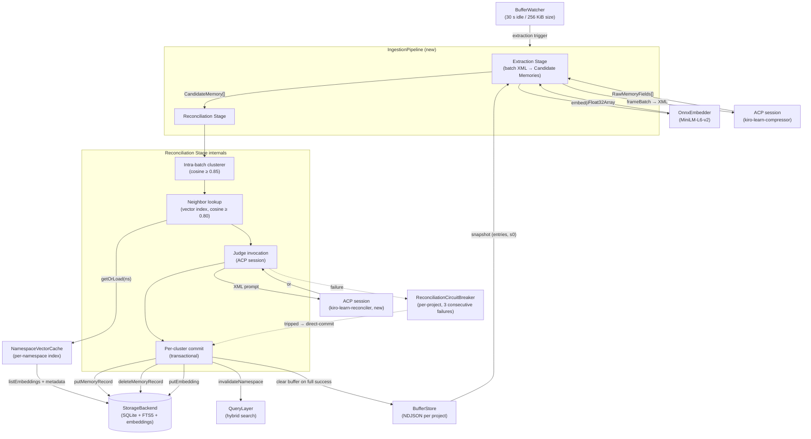
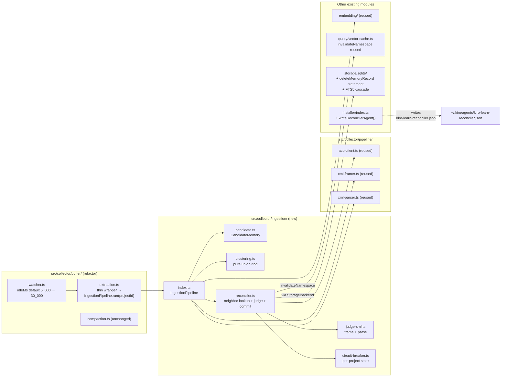
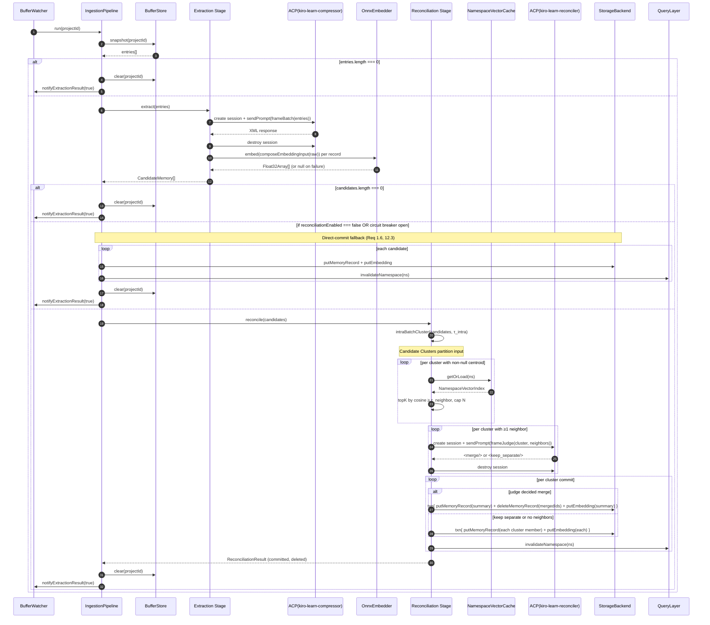

# Design Document

## Overview

The Reconciliation Engine replaces today's single-stage `ExtractionWorker` with a two-stage **Ingestion Pipeline**: an Extraction Stage that produces **Candidate Memories** (in-memory only, never written directly), followed by a Reconciliation Stage that clusters intra-batch duplicates, consults the per-namespace vector index for neighboring existing records, invokes a new **Judge Model** ACP agent (`kiro-learn-reconciler`) on the candidate + neighbors pool, and commits either a single merged **Summary Record** or the candidates as-is.

The design is strictly additive to the existing pipeline surface:

- Storage, retrieval, query, buffer, and MCP interfaces keep their current shapes. Merge decisions delete the merged rows outright in the same transaction as the summary insert. No schema migration is required for this; `memory_records` gains no columns.
- The buffer flush cadence moves from 5 s to 30 s (configurable 5–300 s). The 256 KiB size-triggered extraction threshold and the 1 MiB compaction threshold are unchanged.
- The compressor, compactor, and all existing workers keep their ACP-via-`kiro-cli` pattern. The reconciler agent is a third hand-authored config alongside `kiro-learn-compressor.json` and `kiro-learn-compactor.json`, installed by the same function that already writes those two.
- Whenever `reconciliationEnabled === false` or the per-project circuit breaker trips, the pipeline short-circuits to the pre-reconciliation behavior (every Candidate Memory is committed as a new `memory_record`, byte-for-byte identical to today's extraction write). This is the fallback path required by Requirement 1.6 and Requirement 12.3.

The core insight is that the existing `ExtractionWorker` already does 80% of the work the new Extraction Stage needs — it frames the buffer batch, calls the compressor via ACP, parses XML into `RawMemoryFields`, and enriches those into `MemoryRecord` shape. The refactor extracts the enrichment step into a new pure function `buildCandidates(...)` that returns `CandidateMemory[]` instead of writing, then hands those to an `IngestionPipeline` which owns both stages. The wrapper `ExtractionWorker` becomes a thin shim that delegates to `IngestionPipeline.run(projectId)` — its public interface (the method the `BufferWatcher.onExtraction` handler calls) is unchanged.

## Architecture

### Ingestion Pipeline Component Diagram



Read this diagram top-down: `BufferWatcher` triggers the `IngestionPipeline` exactly as it triggers today's `ExtractionWorker`. The pipeline runs Extraction Stage (producing `CandidateMemory[]`), then — if `reconciliationEnabled` and the circuit breaker is closed — runs Reconciliation Stage. On full success the buffer is cleared; on any failure path the buffer is left intact. The QueryLayer continues to read `memory_records` unchanged from today; the vector cache is invalidated per namespace whenever a commit changes that namespace's record set.

### Where the new code lives



The `ingestion/` folder is the only new source-code folder. Everything downstream of it (embedder, vector cache, storage, query, buffer watcher, receiver, MCP, installer) takes either a trivially additive patch or no patch at all.

### Ingestion pipeline sequence (happy path)



Every ACP session (compressor and reconciler) follows the single-use pattern from `createAcpSession(...)`: one `sendPrompt` per session, always `destroy()` before returning. No state leaks across judge invocations.

## Components and Interfaces

### `src/collector/ingestion/` — new folder

All files live under `src/collector/ingestion/`. The folder has no circular imports on its own files and imports only from `src/types/`, `src/collector/embedding/` (barrel), `src/collector/pipeline/` (ACP client, XML framer/parser), `src/collector/buffer/` (types and the `BufferStore`/`BufferWatcher` interfaces), and `src/collector/query/` (for the existing `QueryLayer.invalidateNamespace` hook type). **It must not import from `src/collector/storage/sqlite/`** — the StorageBackend interface is the only seam, enforced by a new guard test (see Testing Strategy).

#### `index.ts` — `IngestionPipeline`

```ts
export interface IngestionPipelineDeps {
  bufferStore: BufferStore;
  watcher: BufferWatcher;
  storage: StorageBackend;
  embedder: Embedder | null;
  query: QueryLayer;                   // for invalidateNamespace
  config: IngestionPipelineConfig;
}

export interface IngestionPipelineConfig {
  reconciliationEnabled: boolean;
  intraBatchSimilarityThreshold: number;   // default 0.85
  neighborSimilarityThreshold: number;     // default 0.80
  neighborPoolMaxSize: number;             // default 10
  judgeModelTimeoutMs: number;             // default 30_000
  extractionConcurrency: number;           // default 2 (shared semaphore, reused)
  extractionTimeoutMs: number;             // default 60_000
  extractionMaxRetries: number;            // default 3
  debug: boolean;                          // default false
}

export interface IngestionResult {
  projectId: string;
  eventsProcessed: number;
  candidatesProduced: number;
  clustersFormed: number;
  judgeInvocations: number;
  mergeDecisions: number;
  keepSeparateDecisions: number;
  summaryRecordsCommitted: number;
  recordsDeleted: number;
  directCommittedRecords: number;
  durationMs: number;
  phaseLatencyMs: {
    extraction: number;
    clustering: number;
    neighborLookup: number;
    judge: number;
    commit: number;
  };
}

export interface IngestionPipeline {
  run(projectId: string): Promise<IngestionResult>;
  drain(timeoutMs: number): Promise<void>;
  readonly active: number;
}

export function createIngestionPipeline(deps: IngestionPipelineDeps): IngestionPipeline;
```

`IngestionPipeline.run(projectId)` keeps the semaphore-based concurrency control from today's `ExtractionWorker` (default 2 slots). The whole pipeline — extraction + reconciliation — runs inside one slot, satisfying Requirement 1.5.

**Control flow inside `run(projectId)`:**

1. Acquire semaphore slot.
2. `bufferStore.snapshot(projectId)`. Empty → clear buffer, notify success, return zero-count result.
3. Call `extractCandidates(entries, config, deps)` (from `./candidate.ts`). This returns `CandidateMemory[]` and never writes. On extraction failure this throws and the outer catch marks the run failed (buffer untouched), matching today's behavior on extraction failure.
4. If `candidates.length === 0` → clear buffer, notify success.
5. If `!config.reconciliationEnabled` OR `circuitBreaker.isOpen(projectId)` → **direct-commit fallback**:
   - For each candidate call `storage.putMemoryRecord`, then `storage.putEmbedding` (guarded against `embedder === null`/`!isReady()` the same way `ExtractionWorker` does today), then `query.invalidateNamespace(ns)`. This path reuses the identical write sequence that `extraction.ts` performs today, so Requirement 1.6 ("byte-for-byte" equivalence) holds by construction.
6. Otherwise call `reconcile(candidates, ctx)` from `./reconciler.ts`, which returns a `ReconciliationResult`.
7. Clear buffer, notify watcher `success=true`, return the populated `IngestionResult`.

Failures:
- Extraction failure → `watcher.notifyExtractionResult(projectId, false)`, buffer untouched. Circuit breaker is NOT incremented on extraction failure (only reconciliation/judge failures feed it — Requirement 12.1, 12.3).
- Reconciliation failure (a cluster commit fails) → the pipeline continues past that cluster (Requirement 8.2). The buffer is only cleared when every cluster has been processed (Requirement 8.4). If no cluster committed successfully, the pipeline treats the run as "buffer retain" and calls `watcher.notifyExtractionResult(projectId, false)` — this is necessary so repeated judge failures eventually trip the watcher-level extraction circuit breaker and the downstream data backlog doesn't grow unboundedly.
- Judge failure (timeout or non-XML after retries) → feeds `ReconciliationCircuitBreaker`. On the 3rd consecutive judge failure, the next run takes the direct-commit path.

#### `candidate.ts` — Candidate Memory

```ts
export interface CandidateMemory {
  /** mr_<ULID> — freshly allocated by extraction, same scheme as today. */
  record_id: string;
  namespace: string;
  strategy: string;                   // 'llm-summary'
  title: string;
  summary: string;
  facts: string[];
  concepts: string[];
  files_touched: string[];
  observation_type: ObservationType;
  source_event_ids: string[];         // from the buffer snapshot
  /** Pre-computed by the Extraction Stage. null only on embed failure (Req 3.4). */
  embedding: Float32Array | null;
}

/** Produce Candidate Memories from a buffer snapshot. Never writes. */
export async function extractCandidates(
  entries: readonly BufferEntry[],
  config: IngestionPipelineConfig,
  deps: {
    storage: StorageBackend;    // unused at extraction time; reserved for future parity
    embedder: Embedder | null;
  },
): Promise<CandidateMemory[]>;

/** Convert a CandidateMemory to a committable MemoryRecord. Stamps created_at. */
export function toMemoryRecord(c: CandidateMemory): MemoryRecord;
```

`extractCandidates` reuses the existing `frameBatchXml`/`invokeBatchCompressor` functions (lifted verbatim from today's `extraction.ts` — renamed if helpful, but semantically unchanged). The embedder integration is exactly today's integration — `composeEmbeddingInput(record)` then `embedder.embed(input)` — except the resulting vector is attached to the `CandidateMemory` rather than written via `putEmbedding`. Embed failures still emit the same stderr warning but the candidate is emitted with `embedding: null` (Requirement 3.4); the reconciliation stage handles null-embedding candidates as singleton clusters with no judge invocation.

#### `clustering.ts` — pure intra-batch clustering

Pure function, no I/O. Uses a standard union-find (disjoint-set forest) over the candidate indices:

```ts
export interface Cluster {
  /** Indices into the original candidates array — a non-empty set. */
  members: readonly number[];
  /** L2-normalized mean of member embeddings; null if any member has null embedding OR the cluster has only null-embedding members. */
  centroid: Float32Array | null;
}

export function intraBatchCluster(
  candidates: readonly CandidateMemory[],
  threshold: number,
): readonly Cluster[];
```

Algorithm:

1. Allocate a union-find over `[0, candidates.length)`.
2. Every candidate whose `embedding` is `null` stays in its own singleton class — it is never `union`-ed with anyone (Requirement 4.4). This is enforced by skipping any pair where either endpoint has a null embedding.
3. For each non-null pair `(i, j)` with `i < j`, compute `cosine(candidates[i].embedding, candidates[j].embedding)`. If `≥ threshold`, `union(i, j)`.
4. Walk the union-find roots to produce `Cluster[]`, preserving the order of first appearance so the output is deterministic.
5. For each cluster, compute the centroid as `normalize(mean(member.embedding))` when every member has a non-null embedding. Null-embedding singletons get `centroid: null` (no neighbor lookup will be attempted — Requirement 5.5).

The function is O(n²) in batch size, which is fine because typical batches are single-digit candidates. `cosine` comes from `src/collector/embedding/cosine.ts` directly (via the barrel).

#### `reconciler.ts` — neighbor lookup, judge invocation, commit

```ts
export interface ReconciliationContext {
  storage: StorageBackend;
  query: QueryLayer;               // invalidateNamespace only
  config: IngestionPipelineConfig;
  circuitBreaker: ReconciliationCircuitBreaker;
  projectId: string;
  namespace: string;               // all candidates in a batch share this
}

export interface ReconciliationOutcome {
  summaryRecordsCommitted: number;
  recordsDeleted: number;
  keepSeparateCommitted: number;
  judgeInvocations: number;
  mergeDecisions: number;
  keepSeparateDecisions: number;
  clustersFailed: number;
}

export async function reconcile(
  candidates: readonly CandidateMemory[],
  ctx: ReconciliationContext,
): Promise<ReconciliationOutcome>;
```

**`reconcile` flow:**

1. `clusters = intraBatchCluster(candidates, config.intraBatchSimilarityThreshold)`.
2. For each cluster:
   a. If `cluster.centroid === null` → **no neighbor lookup, no judge**. Commit each cluster member as a new `memory_record` + embedding (null-embedding candidates are committed without `putEmbedding`). Backfill will fill the embedding later on the next daemon start (same as today — backfill is already namespace-scoped and `embedding IS NULL`-filtered).
   b. Neighbors come from `storage.listMemoryRecords({namespace})`, which only returns rows that still exist by construction. The `QueryLayer` owns the per-namespace cache; the reconciler uses read-only helpers on the `QueryLayer` interface: `getVectorIndex(namespace)` returning the same `NamespaceVectorIndex` shape already produced by `vector-cache.ts`, and a `lookupNeighbors(namespace, centroid, threshold, cap)` convenience that walks the cache and ranks by cosine. Because rows that are merged away are deleted outright, they never enter the cache.
   c. Rank entries by cosine to centroid, keep those with similarity `≥ config.neighborSimilarityThreshold`, truncate to `config.neighborPoolMaxSize`.
   d. If the neighbor pool is empty → commit the cluster members as new records (no judge).
   e. Otherwise, build the judge prompt (see `judge-xml.ts`), create an ACP session to `kiro-learn-reconciler`, send the prompt with `config.judgeModelTimeoutMs` timeout, parse the response.
   f. Apply retry (≤ 2 attempts) per Requirement 12.2 on non-XML responses. Timeout counts as a terminal failure and is not retried (it already burned the full budget; retrying would double it).
   g. Commit the cluster (see below).
3. Per-project commit error isolation: any thrown error inside cluster step 2b–2g is caught by the `reconcile` loop, logged with the cluster's member `record_id`s, the cluster is marked failed, and the loop continues with the next cluster (Requirement 8.2).
4. Every judge call result feeds `circuitBreaker.record(projectId, success|failure)`. On a clean run (≥ 1 judge invocation and zero judge failures) the breaker resets (Requirement 12.3).

**Commit (one transaction per cluster — Requirement 8.1):**

- **Merge decision** — one `putMemoryRecord(summaryRecord)` + `deleteMemoryRecord(mergedIds)` + `putEmbedding(summary.record_id, summaryEmbedding)` inside a single `StorageBackend` transaction. `deleteMemoryRecord` cascades to the embedding row and the FTS5 entry (see Data Models for the exact SQL). The summary's embedding is computed *after* the judge returns, using the same `composeEmbeddingInput` + `embedder.embed` path. `source_event_ids` is the deduped union of all merged records' `source_event_ids` (preserving first-seen order — Requirement 7.3). `strategy` is `llm-reconciled`. `observation_type` is the value returned by the judge or, if absent, the `observation_type` of the highest-similarity merged member (Requirement 7.6).
- **Keep-separate decision (or zero neighbors)** — one transaction that does `putMemoryRecord(member) + putEmbedding(member.record_id, member.embedding)` for each cluster member.
- After transaction commit, call `query.invalidateNamespace(namespace)`. This matches the existing extraction/backfill pattern and is required so the next search sees the new summary immediately and no longer sees the deleted rows.

Idempotency: `deleteMemoryRecord` on a nonexistent `record_id` is a no-op (Requirement 9.5), so a retried commit after a partial crash does not raise. We expose `StorageBackend.withTransaction(fn)` (see Data Models) so the reconciler never reaches into backend-specific transaction APIs.

#### `judge-xml.ts` — prompt framing and response parsing

Mirrors the `xml-framer.ts` / `xml-parser.ts` split so the reconciler follows the existing XML-pipeline style.

```ts
export interface JudgeRequest {
  cluster: {
    /** Cluster centroid (for debug logging only; not sent to the model). */
    centroid: Float32Array | null;
    members: ReadonlyArray<{
      record_id: string;
      title: string;
      summary: string;
      facts: string[];
      concepts: string[];
      files_touched: string[];
      observation_type: ObservationType;
    }>;
  };
  neighbors: ReadonlyArray<{
    record_id: string;
    title: string;
    summary: string;
    facts: string[];
    similarity: number;
  }>;
}

export interface JudgeResponse {
  kind: 'merge' | 'keep_separate';
  merge?: {
    merged_record_ids: string[];      // subset of cluster ∪ neighbors
    title: string;
    summary: string;
    facts: string[];
    concepts: string[];
    files_touched: string[];
    observation_type?: ObservationType; // optional; reconciler falls back per Req 7.6
  };
}

export function frameJudgePrompt(req: JudgeRequest): string;
export function parseJudgeResponse(xml: string): JudgeResponse | null;   // null = non-XML / garbage
```

Prompt shape (XML — consistent with `<tool_observation>` + `<memory_record>` conventions):

```xml
<reconciliation_request>
  <candidate_cluster>
    <candidate record_id="mr_...">
      <title>...</title>
      <summary>...</summary>
      <facts><fact>...</fact>...</facts>
      <concepts><concept>...</concept>...</concepts>
      <files><file>...</file>...</files>
      <observation_type>decision</observation_type>
    </candidate>
    <!-- one <candidate> per cluster member -->
  </candidate_cluster>
  <neighbor_pool>
    <neighbor record_id="mr_..." similarity="0.87">
      <title>...</title><summary>...</summary><facts>...</facts>
    </neighbor>
    <!-- one <neighbor> per pool member, top scoring first -->
  </neighbor_pool>
</reconciliation_request>
```

Response shape (what the reconciler asks the model for):

```xml
<!-- merge: -->
<merge>
  <merged_record_id>mr_...</merged_record_id>
  <merged_record_id>mr_...</merged_record_id>
  <title>Merged title</title>
  <summary>...</summary>
  <facts><fact>...</fact>...</facts>
  <concepts><concept>...</concept>...</concepts>
  <files><file>...</file>...</files>
  <observation_type>decision</observation_type>
</merge>

<!-- keep-separate: -->
<keep_separate/>
```

The framer reuses `escapeXml` from `src/collector/pipeline/xml-framer.ts`. The parser reuses `unescapeXml` from `src/collector/pipeline/xml-parser.ts`. Both are already exported from those files — no duplication. If the parser receives a non-XML response (`isGarbageResponse(xml)` returns true) or the response has neither `<merge>` nor `<keep_separate/>`, `parseJudgeResponse` returns `null`, which the reconciler treats as a judge failure and feeds into the retry loop.

#### `circuit-breaker.ts` — per-project reconciliation circuit breaker

```ts
export interface ReconciliationCircuitBreaker {
  /** true → direct-commit fallback for this run (Req 12.3). */
  isOpen(projectId: string): boolean;
  /** Record a judge outcome for this project's current run. */
  record(projectId: string, outcome: 'success' | 'failure'): void;
  /** Called by IngestionPipeline at end of each successful run. Resets if no judge failure happened (Req 12.3). */
  onRunComplete(projectId: string, anyJudgeFailure: boolean): void;
  _state(projectId: string): { consecutiveFailures: number; open: boolean };  // test-only
}

export function createReconciliationCircuitBreaker(maxConsecutiveFailures?: number): ReconciliationCircuitBreaker;
```

State transitions:

- Start closed (`consecutiveFailures = 0`).
- Each judge-call failure (timeout or non-XML after retries) increments `consecutiveFailures`.
- When `consecutiveFailures >= 3` (Requirement 12.3) the breaker opens — `isOpen()` returns true on the next `IngestionPipeline.run` for that project, and the direct-commit fallback is taken.
- When an ingestion run completes and no judge call failed during it (including trivially: the run had zero judge invocations — this counts as "no failures" per Requirement 12.3's "one subsequent ingestion-pipeline run completes without a Judge Model failure"), `consecutiveFailures` is reset to 0 and the breaker closes. This means a tripped breaker re-closes after the next clean run even though that clean run used direct-commit (the direct-commit path itself does not invoke the judge, so by definition it has zero judge failures).

Note: the breaker is completely independent of the existing buffer-watcher extraction circuit breaker. The watcher's breaker disables extraction entirely on consecutive *extraction* failures; this breaker only degrades *reconciliation* to direct-commit on consecutive *judge* failures. Extraction still runs normally and the buffer still clears on every successful extraction (Requirement 12.4).

### Refactors to existing modules

#### `src/collector/buffer/extraction.ts` — thin wrapper

The current 300-line `extraction.ts` is refactored into ~40 lines:

```ts
export interface ExtractionWorker {
  extract(projectId: string): Promise<ExtractionResult>;
  drain(timeoutMs: number): Promise<void>;
  readonly active: number;
}

export interface ExtractionWorkerDeps {
  pipeline: IngestionPipeline;
  watcher: BufferWatcher;
}

export function createExtractionWorker(deps: ExtractionWorkerDeps): ExtractionWorker {
  return {
    get active() { return deps.pipeline.active; },
    extract: async (projectId) => {
      const r = await deps.pipeline.run(projectId);
      return {
        projectId,
        eventsProcessed: r.eventsProcessed,
        memoriesCreated: r.summaryRecordsCommitted + r.keepSeparateCommitted + r.directCommittedRecords,
        durationMs: r.durationMs,
      };
    },
    drain: (ms) => deps.pipeline.drain(ms),
  };
}
```

`BufferWatcher.onExtraction((projectId) => extractionWorker.extract(projectId).catch(...))` is unchanged — the public `ExtractionWorker` interface that the watcher expects is preserved exactly. This limits blast radius to `src/collector/index.ts` (which now instantiates `createIngestionPipeline` and passes it into `createExtractionWorker`) and preserves every existing unit test that hits `ExtractionWorker` through its public interface. The integration tests `buffer-extraction-pipeline.test.ts` and `extraction-pipeline.test.ts` keep their existing assertions; the additions they need (see Testing Strategy) concern the new reconciliation outputs.

#### `src/collector/buffer/watcher.ts` — idle-flush default

Change one default: `idleMs: 5_000` → `idleMs: 30_000`. The config surface already exposes this via `BufferWatcherConfig.idleMs`, so the watcher code itself is untouched — only `DEFAULT_CONFIG` and the collector's default value in `DEFAULT_COLLECTOR_CONFIG` change (`bufferIdleMs: 5_000` → `bufferIdleMs: 30_000`). The 256 KiB extraction threshold (`extractionSizeThreshold`) and the 1 MiB compaction threshold (`compactionSizeThreshold`) are untouched (Requirement 2.3, 2.4).

#### `src/collector/query/index.ts` — tiny extension

Add two methods to the `QueryLayer` interface:

```ts
export interface QueryLayer {
  search(namespace: string, query: string, limit: number): Promise<MemoryRecord[]>;
  invalidateNamespace(namespace: string): void;                          // unchanged
  /** Reconciler-only: returns the same shape the cache produces. */
  getVectorIndex(namespace: string): Promise<NamespaceVectorIndex>;
  /** Reconciler-only: centroid neighbor lookup with cap + threshold. */
  lookupNeighbors(namespace: string, centroid: Float32Array, threshold: number, cap: number):
    Promise<Array<{ record: MemoryRecord; similarity: number }>>;
}
```

Both are thin wrappers over the existing vector-cache + cosine infrastructure. `lookupNeighbors` walks `getVectorIndex(namespace).entries`, scores each with `cosine(centroid, entry.vec_normalised)`, filters by `similarity >= threshold`, sorts descending, and truncates to `cap`. Standard namespace lookup returns the post-delete row set — merged rows are gone from `memory_records` by construction, so no extra filter is needed.

#### `src/collector/retrieval/index.ts` — no change

`formatContext` and `assemble` are unchanged. Retrieval calls `query.search(...)`, which reads `memory_records` exactly as it does today. The MCP `search_memory` tool continues to return the same `MemoryRecord[]` shape (Requirement 13.3).

#### `src/installer/index.ts` — `writeReconcilerAgent`

Add a third `writeXxxAgent` helper alongside `writeCompressorAgent` and `writeCompactorAgent`, called from `writeAgentConfigs` and `uninstall`. The prompt is a short XML-only contract identical in style to the compactor:

```ts
export function writeReconcilerAgent(agentsDir: string): void {
  const prompt =
    'You are a memory reconciliation agent for kiro-learn. You receive a <reconciliation_request> block containing a candidate cluster and a pool of neighbor memory records from the existing graph. You decide whether the candidate cluster and some subset of the neighbors describe the same underlying thing.\n' +
    '\n' +
    'Respond with ONLY XML — either <merge>...</merge> listing the record_ids that describe the same thing together with a new summary, or a single <keep_separate/> tag.\n' +
    ...
  const config = {
    name: 'kiro-learn-reconciler',
    description: 'Memory reconciliation judge for kiro-learn. Decides whether candidate memories describe the same thing as existing records.',
    prompt,
    tools: [],
    allowedTools: [],
  };
  writeFileSync(path.join(agentsDir, 'kiro-learn-reconciler.json'), JSON.stringify(config, null, 2) + '\n');
}
```

Idempotency: the write is unconditional file replace (same as the compressor/compactor — they do not merge). On every `init`/upgrade run the file is rewritten with the current source. `uninstall` adds `'kiro-learn-reconciler.json'` to its agent-cleanup list. Because the write is a pure overwrite with deterministic bytes, repeated installs converge (Requirement 10 idempotency).

### Collector wiring — `src/collector/index.ts`

`DEFAULT_COLLECTOR_CONFIG` gains six new fields:

```ts
reconciliationEnabled: true,
// bufferIdleMs: 5_000 → 30_000  (change default for Req 2.1)
bufferIdleMs: 30_000,
intraBatchSimilarityThreshold: 0.85,
neighborSimilarityThreshold: 0.80,
neighborPoolMaxSize: 10,
judgeModelTimeoutMs: 30_000,
```

Wiring order (extends today's sequence):

1. Open storage (unchanged).
2. Create embedder (unchanged).
3. Create QueryLayer (unchanged).
4. Create `ReconciliationCircuitBreaker`.
5. Create `IngestionPipeline({ bufferStore, watcher, storage, embedder, query, config, circuitBreaker })`.
6. Create `ExtractionWorker({ pipeline, watcher })` — now a shim.
7. Wire `bufferWatcher.onExtraction((pid) => extractionWorker.extract(pid).catch(logErr))` — unchanged.
8. Compaction wiring unchanged.
9. Startup re-arm + temp-file cleanup unchanged.
10. Shutdown drains the ingestion pipeline (which in turn drains extraction + any in-flight judge calls) and closes storage — replacing today's `extractionWorker.drain(DRAIN_TIMEOUT_MS)`.

Config validation (Requirement 10.7): add a `validateCollectorConfig(cfg): void` function called at the top of `startCollector`. It checks every new numeric range and throws a descriptive error that the CLI entry point writes to stderr and exits 1 on. The existing config currently has no explicit range validation; this change adds it for the six new fields only so we don't accidentally break existing deployments relying on the no-validation behavior for pre-existing knobs.

## Data Models

### Wire schema additions — `src/types/schemas.ts`

The `MemoryRecord` Zod schema is unchanged — no new fields. The two new types added for reconciliation are for the judge surface only and live in schemas because the ingestion folder cannot own wire types per the layering rule "New schema types must be Zod schemas in `src/types/schemas.ts` first":

```ts
export const CandidateMemorySchema = z.object({
  record_id: z.string().regex(RECORD_ID_RE),
  namespace: z.string().regex(NAMESPACE_RE),
  strategy: z.string().min(1),
  title: z.string().min(1).max(200),
  summary: z.string().min(1).max(4000),
  facts: z.array(z.string().min(1).max(500)),
  concepts: z.array(z.string().min(1).max(100)),
  files_touched: z.array(z.string().min(1).max(500)),
  observation_type: z.enum(OBSERVATION_TYPES),
  source_event_ids: z.array(z.string().regex(ULID_RE)).min(1),
  // embedding is transient (in-memory) — not on the Zod schema.
});
export type CandidateMemory = z.infer<typeof CandidateMemorySchema> & { embedding: Float32Array | null };

export const JudgeMergeResponseSchema = z.object({
  kind: z.literal('merge'),
  merged_record_ids: z.array(z.string().regex(RECORD_ID_RE)).min(1),
  title: z.string().min(1).max(200),
  summary: z.string().min(1).max(4000),
  facts: z.array(z.string().min(1).max(500)),
  concepts: z.array(z.string().min(1).max(100)),
  files_touched: z.array(z.string().min(1).max(500)),
  observation_type: z.enum(OBSERVATION_TYPES).optional(),
});
export const JudgeKeepSeparateResponseSchema = z.object({ kind: z.literal('keep_separate') });
export const JudgeResponseSchema = z.discriminatedUnion('kind', [JudgeMergeResponseSchema, JudgeKeepSeparateResponseSchema]);
export type JudgeResponse = z.infer<typeof JudgeResponseSchema>;
```

The `embedding` Float32Array is not part of the Zod schema because it's transient (never serialized over any wire). It lives on the TypeScript `CandidateMemory` type as an intersected property.

Generators (`test/helpers/arbitrary.ts`) gain `candidateMemoryArb` and `judgeResponseArb`. The existing `arbitraryMemoryRecord` generator is unchanged.

### No SQLite migration required

Reconciliation does not add any columns, indexes, tables, or triggers to `memory_records`. The `memory_records` schema from migration 0005 is the final schema for this feature. Deletions operate on the existing DDL.

### `StorageBackend` interface extensions

```ts
export interface StorageBackend {
  // ... existing members unchanged ...

  /**
   * Delete one or more memory records. Cascades to the `embeddings` table
   * and the `memory_records_fts` virtual table inside the same transaction.
   * Idempotent: unknown record_ids are silently skipped (Req 9.5).
   */
  deleteMemoryRecord(recordIds: readonly string[]): Promise<void>;

  /**
   * Execute `fn` inside a single storage transaction. `fn` receives a
   * restricted handle — a subset of StorageBackend — so it cannot accidentally
   * call `close` or begin a nested transaction. SQLite implementation uses
   * `db.transaction(...)`.
   */
  withTransaction<T>(fn: (tx: StorageTransaction) => Promise<T> | T): Promise<T>;
}

export interface StorageTransaction {
  putMemoryRecord(record: MemoryRecord): Promise<void>;
  putEmbedding(recordId: string, embedding: Float32Array): Promise<void>;
  deleteMemoryRecord(recordIds: readonly string[]): Promise<void>;
}
```

Read signatures (`getMemoryRecord`, `searchMemoryRecords`, `searchMemoryRecordsLexical`, `listMemoryRecords`, `listEmbeddings`) are unchanged from today. No new parameters, no new defaults — reads are semantically identical to the pre-reconciliation backend.

`better-sqlite3` is synchronous, so `withTransaction` wraps its body in `db.transaction(() => { ... })` and awaits the async callback via a small helper that resolves synchronously when the body is synchronous. This matches how `putMemoryRecord` is already structured in `src/collector/storage/sqlite/index.ts`.

### SQLite statement updates — `src/collector/storage/sqlite/statements.ts`

The existing FTS5 integration is explicit: migration 0001 creates `memory_records_fts` as a plain (non-content-linked) FTS5 virtual table, and the backend populates it via an explicit `insertMemoryRecordFts` prepared statement on `putMemoryRecord`. There are **no `CREATE TRIGGER` statements anywhere** in the migrations — the FTS5 table is maintained by application code, not by SQLite triggers. Therefore deletions must also be explicit.

New prepared statements:

```ts
deleteMemoryRecordById: Statement<[recordId: string]>;
//   DELETE FROM memory_records WHERE record_id = ?

deleteMemoryRecordFtsById: Statement<[recordId: string]>;
//   DELETE FROM memory_records_fts WHERE record_id = ?

deleteEmbeddingByRecordId: Statement<[recordId: string]>;
//   DELETE FROM embeddings WHERE record_id = ?
```

Implementation of `deleteMemoryRecord(recordIds)`:

```ts
deleteMemoryRecord: async (recordIds) => {
  const txn = db.transaction((ids: readonly string[]) => {
    for (const id of ids) {
      statements.deleteMemoryRecordFtsById.run(id);
      statements.deleteEmbeddingByRecordId.run(id);
      statements.deleteMemoryRecordById.run(id);
    }
  });
  txn(recordIds);
}
```

Order matters inside the `for` loop only insofar as it's deterministic — all three statements target a single `record_id` and run in the same `db.transaction`, so the whole operation is atomic. `DELETE` on a nonexistent row affects zero rows and does not raise, so idempotency (Requirement 9.5) is built in.

Read statements are untouched. Reads return whatever rows exist — if a row was merged away, it's gone.

### Per-namespace vector cache consistency

`NamespaceVectorCache.getOrLoad(ns)` builds its entries from `storage.listEmbeddings(ns)` joined with `storage.listMemoryRecords({ namespace: ns, limit, offset: 0 })`. After a merge commit, those reads return only the surviving rows — the merged ones have been deleted from both `memory_records` and `embeddings` in the same transaction — so the cache rebuilds from the post-delete row set.

On every commit the reconciler calls `query.invalidateNamespace(ns)`, bumping the cache epoch. The next search for that namespace rebuilds the cache from post-commit data — the new summary record is in, the deleted rows are gone. In-flight rebuilds that raced the invalidation return their result to the caller but don't install stale data (the race-safety mechanism is already in place — see `vector-cache.ts`).

Crash-left-behind embeddings are not possible because the embedding deletion lives in the same transaction as the `memory_records` deletion. If the transaction commits, both are gone; if it rolls back, both remain.

No new cache machinery is needed. The vector cache code in `src/collector/query/vector-cache.ts` is unchanged.

## Correctness Properties

*A property is a characteristic or behavior that should hold true across all valid executions of a system — essentially, a formal statement about what the system should do. Properties serve as the bridge between human-readable specifications and machine-verifiable correctness guarantees.*

Each property below is universally quantified, implementable as a `fast-check` property test, and cites the requirements it validates. Tests are tagged with `Feature: reconciliation-engine, Property N: <title>` per the repo's existing convention.

### Property 1: Pipeline stage composition

*For any* buffer snapshot, the list of Candidate Memories passed from the Extraction Stage into the Reconciliation Stage equals the list returned by the Extraction Stage — same elements, same order, no mutation between stages.

**Validates: Requirements 1.1, 3.1, 3.2**

### Property 2: Buffer-clear discipline

*For any* ingestion run, the buffer is cleared if and only if every Candidate Cluster reached a terminal state (committed OR explicitly dropped after judge fallback) AND the Extraction Stage succeeded. When extraction throws, or when every cluster failed to commit, the buffer is left intact. This subsumes the zero-candidate case (n = 0 clusters trivially satisfies "every cluster terminal").

**Validates: Requirements 1.2, 1.3, 1.4, 8.4**

### Property 3: Extraction never writes

*For any* buffer snapshot, the number of `StorageBackend.putMemoryRecord` plus `StorageBackend.putEmbedding` plus `StorageBackend.deleteMemoryRecord` calls made during `extractCandidates(...)` is zero. Candidates live only in memory until the Reconciliation Stage (or direct-commit fallback) commits them.

**Validates: Requirement 3.1**

### Property 4: Feature-flag-off byte equivalence

*For any* buffer snapshot and for any fixed seed of the `record_id` ULID generator, running the new `IngestionPipeline` with `reconciliationEnabled = false` produces exactly the same sequence of `StorageBackend` writes — same method, same argument shape, same order — as the legacy `ExtractionWorker` would produce for the identical input. This is the single property that guarantees the rollback path (Requirement 1.6) is implemented faithfully, and also covers the "circuit breaker open → direct-commit" path (Requirement 12.4).

**Validates: Requirements 1.6, 12.4**

### Property 5: Clustering partitions the input

*For any* array of Candidate Memories, the list of Candidate Clusters returned by `intraBatchCluster(candidates, τ)` satisfies: the union of all `cluster.members` equals `[0, candidates.length)`, and every index appears in exactly one cluster.

**Validates: Requirements 4.1, 4.3**

### Property 6: Clustering respects the similarity threshold (monotonic)

*For any* array of Candidate Memories with non-null embeddings and any two thresholds τ₁ ≤ τ₂, the number of Candidate Clusters at τ₁ is ≤ the number at τ₂, and any two candidates whose cosine similarity is ≥ τ end up in the same cluster at that threshold. Raising the threshold never merges clusters that weren't merged at a lower threshold.

**Validates: Requirements 4.2, 4.5**

### Property 7: Null-embedding candidates are singletons

*For any* Candidate Memory whose `embedding` field is `null`, that candidate's cluster has exactly one member (itself). No union-find merge ever touches a null-embedding candidate.

**Validates: Requirement 4.4**

### Property 8: Cluster centroid is a unit vector

*For any* Candidate Cluster whose members all have non-null embeddings, the cluster's `centroid` has L2 norm equal to 1.0 within floating-point tolerance (≤ 1e-5) and equals `normalize(mean(members.map(m => m.embedding)))`. For any cluster containing at least one null-embedding member, `centroid` is `null`.

**Validates: Requirement 4.6**

### Property 9: Neighbor lookup filters correctly

*For any* set of existing memory records and any centroid + threshold + cap, the output of `lookupNeighbors(ns, centroid, τ, cap)` satisfies all of: every returned record has `namespace === ns`, cosine similarity ≥ τ; the output length is ≤ cap; and the output is sorted by similarity descending.

**Validates: Requirements 5.1, 5.2, 5.3, 5.4**

### Property 10: Candidate embedding input parity

*For any* Candidate Memory emitted by the Extraction Stage, the argument passed to `embedder.embed(...)` during its construction equals `composeEmbeddingInput(toMemoryRecord(candidate))`. This guarantees candidate embeddings are directly comparable to the vectors that today's on-write embedding path produces for committed records.

**Validates: Requirement 3.3**

### Property 11: Null-embedding propagation on embedder failure

*For any* run of `extractCandidates` against an embedder that always throws (or whose `isReady()` returns false), every emitted Candidate Memory has `embedding === null` and the Extraction Stage still returns the full candidate list (embed failures never drop a candidate).

**Validates: Requirement 3.4**

### Property 12: Record ID format and uniqueness

*For any* ingestion run, every `record_id` on every emitted Candidate Memory and every committed Summary Record matches the regex `/^mr_[0-9A-HJKMNP-TV-Z]{26}$/`, and across a single run no two record_ids collide.

**Validates: Requirements 3.5, 7.2**

### Property 13: Judge XML round-trip preserves content

*For any* `JudgeRequest`, `parseJudgePrompt(frameJudgePrompt(req))` returns a value whose cluster record_ids, neighbor record_ids, title/summary/facts/concepts/files strings are equal to `req`'s after XML unescaping. Dually, for any `JudgeResponse`, `parseJudgeResponse(serializeJudgeResponse(resp))` returns a structurally-equal discriminated union (same `kind`; if `kind === 'merge'` the same `merged_record_ids` set, title, summary, facts, concepts, files, observation_type). This is the core parser-correctness property for the judge surface — directly analogous to the existing `parseMemoryXml` round-trip property.

**Validates: Requirements 6.2, 6.3**

### Property 14: Judge invocation gated on non-empty neighbor pool

*For any* ingestion run, the number of ACP sessions created to `kiro-learn-reconciler` equals the number of Candidate Clusters whose Neighbor Pool has at least one member. Clusters with an empty pool (including those with `centroid === null`) commit without invoking the judge.

**Validates: Requirements 5.5, 6.1**

### Property 15: Merge commit semantics

*For any* judge `<merge>` decision that lists record_ids `{r₁, …, rₖ}`, after the commit transaction completes: every `rᵢ` is absent from `storage.getMemoryRecord` and absent from `storage.listEmbeddings`; the summary record is readable by its own `record_id`; no row outside `{r₁, …, rₖ} ∪ {summary.record_id}` has been mutated or deleted.

**Validates: Requirements 6.4, 7.1, 7.4, 9.1, 9.2, 9.3, 9.4, 9.5, 13.4**

### Property 16: Keep-separate commit semantics

*For any* cluster that reached a `<keep_separate/>` decision — whether from a genuine judge response, from a garbage-after-retry-budget fallback, or from an empty neighbor pool — the commit transaction calls `storage.deleteMemoryRecord` zero times, and writes exactly one `memory_record` per cluster member.

**Validates: Requirements 6.5, 6.7**

### Property 17: `source_event_ids` is deduped first-seen union

*For any* Summary Record produced by a merge, `summary.source_event_ids` equals the first-seen deduplication of the concatenation `[...cluster members' source_event_ids, ...merged neighbors' source_event_ids]`. Every event id appears at most once, and the first occurrence's position determines its order in the output.

**Validates: Requirement 7.3**

### Property 18: Summary-commit atomicity

*For any* merge decision, a single `StorageBackend` transaction contains the summary's `putMemoryRecord`, the `deleteMemoryRecord(mergedIds)`, and the summary's `putEmbedding`. If a failure is injected at any point inside that transaction, none of the three operations is visible to readers afterward — the whole transaction rolls back (the summary is absent, the merged rows still exist, no embeddings have been deleted).

**Validates: Requirements 7.5, 8.1, 9.1, 9.2, 9.3**

### Property 19: Judge ACP session lifecycle

*For any* judge invocation, exactly one `createAcpSession` is called with `agentName === 'kiro-learn-reconciler'`, and its returned session's `destroy()` is called exactly once — after `sendPrompt` resolves or rejects, and before the reconciler returns control for that cluster.

**Validates: Requirement 6.8**

### Property 20: Per-cluster failure isolation

*For any* ingestion run, an injected failure on cluster N's commit transaction does not prevent clusters {1, …, N-1, N+1, …, K} from committing successfully. The set of successfully-committed clusters is exactly the set of clusters for which the scripted dependencies returned success.

**Validates: Requirement 8.2**

### Property 21: Configuration validation

*For any* `CollectorConfig` object, the daemon accepts it at startup if and only if every new reconciliation field lies within its documented range: `bufferIdleMs ∈ [5000, 300000]`, `intraBatchSimilarityThreshold ∈ [0, 1]`, `neighborSimilarityThreshold ∈ [0, 1]`, `neighborPoolMaxSize ∈ [1, 100]`, `judgeModelTimeoutMs ∈ [5000, 300000]`. Out-of-range values cause `startCollector` to reject with an error whose message names the offending field and the observed value.

**Validates: Requirements 10.1–10.6, 10.7**

### Property 22: Ingestion-run log structural conformance

*For any* ingestion run, exactly one JSON-Lines log record is written to stderr whose parsed object is a superset of `{ event: 'ingestion-pipeline-run', project_id, namespace, events_processed, candidates_produced, clusters_formed, judge_invocations, merge_decisions, keep_separate_decisions, summary_records_committed, records_deleted, direct_committed_records, duration_ms, phase_latency_ms: { extraction, clustering, neighbor_lookup, judge, commit } }`. Every listed numeric field is a non-negative integer; `duration_ms` ≥ sum of `phase_latency_ms` values (latency accounting is consistent).

**Validates: Requirements 11.1, 11.2**

### Property 23: No schema migration required for reconciliation merges

*For any* SQLite database populated before this feature ships, upgrading to the new code introduces no DDL changes to `memory_records` and the storage backend's public read behavior for any row that is not merged away is byte-for-byte identical to the pre-upgrade behavior. MCP response bodies gain no new top-level keys.

**Validates: Requirements 13.1, 13.2, 13.3**

### Property 24: Reconciliation circuit breaker state machine

*For any* sequence of judge outcomes on a given `projectId`, the `ReconciliationCircuitBreaker` transitions as follows: (a) it starts closed; (b) `isOpen(projectId)` becomes true after the 3rd consecutive judge failure; (c) it re-closes after the next ingestion run completes with zero judge failures (including the direct-commit-path case where the run invoked the judge zero times); (d) state is independent per `projectId` — interleaved success/failure on project A does not affect project B's breaker state.

**Validates: Requirements 12.1, 12.2, 12.3**

## Error Handling

### Extraction-stage failures (pre-existing behavior)

Identical to today's `ExtractionWorker` failure modes:

- ACP spawn / timeout / non-XML after retries → pipeline throws → `watcher.notifyExtractionResult(projectId, false)` → buffer retained → next trigger retries.
- Embedder not ready OR per-record embed failure → candidate emitted with `embedding: null` + stderr warning. This is a per-record soft failure — the pipeline proceeds.

No new failure modes in the Extraction Stage. The circuit-breaker on the watcher (3 consecutive extraction failures disables extraction) is unchanged.

### Judge-model failures

| Failure                                          | Action                                                                                                |
| ------------------------------------------------ | ----------------------------------------------------------------------------------------------------- |
| Timeout (`config.judgeModelTimeoutMs` exceeded)  | Destroy session, record failure on circuit breaker, fall back to keep-separate for this cluster.      |
| Non-XML response (`isGarbageResponse` true)      | Destroy session, retry with fresh session up to 2 total attempts (Req 12.2).                          |
| XML but neither `<merge>` nor `<keep_separate/>` | Treated as non-XML — same retry path.                                                                 |
| ACP spawn failure                                | Record failure on breaker, fall back to keep-separate for this cluster.                               |
| 3rd consecutive judge failure on same project    | Breaker opens. *Next* ingestion run for this project goes through direct-commit (Req 12.3).           |

A per-cluster judge failure never aborts sibling clusters in the same run — the reconciler keeps going. The buffer is cleared only when every cluster has been processed (committed or explicitly dropped). A run where every cluster failed to commit is reported to the watcher as `success=false` so the buffer is retained and the data isn't lost.

### Commit-transaction failures

Per-cluster transaction rollback semantics (Requirement 8.2):

- A failed `putMemoryRecord` for the summary record, or a failed `deleteMemoryRecord`, or a failed `putEmbedding` inside the transaction body → whole transaction rolls back, cluster is marked failed, loop continues.
- A committed cluster never partially applies: either the summary record + all merged-row deletions + the summary embedding land together, or none of them do. This is why `withTransaction` exists — the reconciler must never write these three pieces in separate transactions.
- A crash between the commit and `query.invalidateNamespace(ns)` is handled by the cache's race logic (the next `getOrLoad` reads storage fresh, which now contains the new summary and excludes the deleted rows). There's no persisted "dirty cache" — invalidation is in-memory only, and the cache is authoritative only for the in-process lifetime.

### Corruption / inconsistency

- **Circular references**: impossible because deletes are atomic with the summary insert — a merge writes the new summary and deletes its sources in one transaction, so there's no intermediate state for another concurrent merge to target. Once a row is deleted, no future merge can reference it (`deleteMemoryRecord` on a nonexistent id is a no-op).
- **Judge references a `record_id` that isn't in either the cluster or the neighbor pool**: the reconciler ignores unknown ids and logs a warning with the offending id. Merge proceeds for the known subset; if the known subset is empty (pathological model output) the reconciler falls back to keep-separate.

## Testing Strategy

### Test breakdown

- **Unit tests**: narrow property-based and example-based tests over each new module in `test/unit/`. New files (one per module, mirroring the existing naming conventions):
  - `test/unit/ingestion-candidate.property.test.ts` — `extractCandidates` never writes, candidate shape is a valid `CandidateMemory` (fuzzes buffer snapshots via existing generators).
  - `test/unit/ingestion-clustering.property.test.ts` — covers the partition / null-embedding singleton / symmetry properties (see Correctness Properties).
  - `test/unit/ingestion-clustering.test.ts` — example-based: known-similar pairs cluster, known-distinct pairs don't, threshold edge cases, empty input.
  - `test/unit/ingestion-neighbor-lookup.property.test.ts` — generated records + one candidate → only returns records with similarity ≥ threshold, capped at pool size, sorted descending.
  - `test/unit/ingestion-judge-xml.property.test.ts` — `parseJudgeResponse(frameJudgePrompt(...))` round-trip + garbage input yields `null`.
  - `test/unit/ingestion-judge-xml.test.ts` — example-based: known merge XML, keep-separate XML, XML-escaped titles with `<`/`&`/`"`.
  - `test/unit/ingestion-circuit-breaker.property.test.ts` — closed→open after 3 consecutive failures, reopen only after a clean run, independent per-projectId.
  - `test/unit/ingestion-reconciler.test.ts` — integration at the reconciler level with a fake `StorageBackend`, a scripted `Embedder`, and a scripted judge session.
  - `test/unit/ingestion-pipeline-direct-commit.property.test.ts` — `reconciliationEnabled=false` OR circuit-open → byte-for-byte same writes as today's `ExtractionWorker` (uses a record-matching harness against a shadow in-memory backend).
  - `test/unit/ingestion-observability.test.ts` — structured log fields are present and metric shape matches the spec.
  - `test/unit/ingestion-collector-wiring.test.ts` — mirrors `buffer-collector-wiring.test.ts`: `startCollector` instantiates and wires the new ingestion pipeline with the right config defaults.
  - `test/unit/ingestion-feature-flag-equivalence.property.test.ts` — dedicated test for Property: "flag-off writes exactly match today's extraction writes" (see Correctness Properties P4).

- **Extensions to existing unit tests**:
  - `test/unit/buffer-watcher.test.ts` — one-line change: assert the new default `idleMs === 30_000`.
  - `test/unit/sqlite-backend-delete-memory-record.test.ts` — `deleteMemoryRecord` happy path + `withTransaction` happy path + rollback on thrown body + idempotent on nonexistent ids.
  - `test/unit/sqlite-backend-delete-memory-record.property.test.ts` — merge commit semantics (rewritten P15) and summary-commit atomicity (rewritten P18).
  - `test/unit/embedding-query-layer.test.ts` — `lookupNeighbors` returns records above threshold, capped, sorted.
  - `test/unit/installer-write-agent-configs.test.ts` — asserts `kiro-learn-reconciler.json` is created at global scope with the expected name/description/tools.

- **New guard tests** (mirroring existing `no-*.test.ts` files — each is a literal regex scan over `.ts` files with comments stripped):
  - `test/unit/no-sqlite-in-ingestion.test.ts` — `src/collector/ingestion/**/*.ts` must not reference `storage/sqlite`.
  - `test/unit/no-private-in-ingestion.test.ts` — `src/collector/ingestion/**/*.ts` must not contain the literal `<private>`.
  - `test/unit/no-ingestion-in-xml-modules.test.ts` — `src/collector/pipeline/{acp-client,xml-framer,xml-parser}.ts` must not import from `src/collector/ingestion/` (the XML pipeline stays a leaf).

- **Integration tests** (`test/integ/`):
  - New `test/integ/reconciliation-pipeline.test.ts` — end-to-end with real `kiro-cli` + Bedrock: seed two near-duplicate buffer batches across two sessions, run the daemon, assert the second run collapses into one summary record, and that the first-batch near-duplicate row is absent from storage after the merge.
  - Extend `test/integ/buffer-extraction-pipeline.test.ts` — one test case that runs with `reconciliationEnabled: false` and asserts the old behavior still holds byte-for-byte: every candidate becomes a standalone `memory_record`, same call sequence as pre-reconciliation.
  - Extend `test/integ/extraction-pipeline.test.ts` — add a parallel `reconciliationEnabled: true` assertion that the first batch's candidates go straight through (no neighbors) and the second batch's identical-content candidates are merged into one summary, with `getMemoryRecord(firstBatchId)` returning undefined after the merge.
  - The latency tests (`embedding-hybrid-latency-*`) are unchanged — retrieval paths are semantically identical.

### Testing strategy details

Property tests use `fast-check` with `{ numRuns: 100 }` minimum per Requirement 11 of the existing testing doctrine (already standard in this repo). Property tests tag the design property they validate with a comment matching the existing convention `/** Feature: reconciliation-engine, Property N: <text> */`.

Integration tests inherit the existing `skipIfNoKiroCli` guard — they skip gracefully when `kiro-cli` or Bedrock credentials are unavailable.

Mocks for property tests:
- A `FakeEmbedder` that produces `Float32Array` values by hashing the input string (deterministic, reproducible, gives meaningful cosine separation).
- A `FakeStorageBackend` that holds records in a `Map<record_id, MemoryRecord>`, implements `deleteMemoryRecord`, `withTransaction`, and the vector surface on top of plain arrays. Already has a partial implementation for existing storage tests; extended in this spec.
- A `ScriptedJudgeSession` that plays back a pre-programmed sequence of `sendPrompt` results, enabling tests for timeout / garbage / merge / keep-separate without spawning `kiro-cli`.

### Backward compatibility validation

Two specific extensions to existing integration tests (Requirement 13.1, 13.2, 13.3):

1. `buffer-extraction-pipeline.test.ts` runs through a full buffer → extraction → retrieval flow. After the change it additionally asserts byte-equivalence when `reconciliationEnabled: false` — the write sequence matches the pre-reconciliation backend.
2. The MCP tool test `mcp-tools.test.ts` asserts that the JSON body returned from `search_memory` has exactly the same top-level keys it does today — the `MemoryRecord` Zod schema was never modified, so this holds by construction.

The viewer UI is unaffected: the Cloudscape dashboard calls the read API which reads `memory_records` unchanged. Merged-away rows are deleted rather than hidden, so the cosmos.gl graph reflects the current understanding without needing a filter.

## Observability

### Structured log (one line per ingestion run)

```json
{
  "event": "ingestion-pipeline-run",
  "project_id": "a1b2c3d4...",
  "namespace": "/actor/.../project/.../",
  "events_processed": 12,
  "candidates_produced": 4,
  "clusters_formed": 3,
  "judge_invocations": 2,
  "merge_decisions": 1,
  "keep_separate_decisions": 1,
  "summary_records_committed": 1,
  "records_deleted": 2,
  "direct_committed_records": 0,
  "circuit_breaker_open": false,
  "reconciliation_enabled": true,
  "duration_ms": 845,
  "phase_latency_ms": {
    "extraction": 412,
    "clustering": 3,
    "neighbor_lookup": 18,
    "judge": 380,
    "commit": 32
  }
}
```

Written via `process.stderr.write` in JSON Lines form, matching the existing ad-hoc telemetry style in `extraction.ts` and `compaction.ts`. A future migration to a real structured-logger library is out of scope; the fields are stable so the migration is a formatter change only. Property 22 is the structural-conformance test for this log line.

### Debug payload

When `config.debug === true` (driven by a `RECONCILER_DEBUG` env var in the CLI), each cluster additionally emits:

```json
{
  "event": "ingestion-cluster-debug",
  "project_id": "...",
  "cluster_members": ["mr_...", "mr_..."],
  "neighbor_pool": [
    { "record_id": "mr_...", "similarity": 0.873 }
  ],
  "judge_request_xml_sha256": "sha256:...",
  "judge_response_xml": "<merge>...</merge>"
}
```

The raw judge XML response is logged in full; the request is only logged as a SHA-256 hash to avoid accidental PII leakage of candidate content in shared environments. This matches the spirit of Requirement 11.4 without adding new privacy risks.

### Metrics

The existing daemon doesn't have a metrics surface beyond the viewer's `/v1/stats` endpoint; this design doesn't add one. The structured log line IS the metric — log aggregators (local `grep`, CloudWatch, etc.) can derive counters from `summary_records_committed` and `records_deleted` and gauges from `phase_latency_ms`. When we add a real metrics surface in a future spec, these same fields become the metric names (so names are stable now even though transport will change).

## Backward Compatibility

| Surface                                   | Change   | Why it's safe                                                                                                               |
| ----------------------------------------- | -------- | --------------------------------------------------------------------------------------------------------------------------- |
| `StorageBackend.deleteMemoryRecord`, `withTransaction` | Additive | New methods. Existing callers don't call them.                                                                      |
| `ExtractionWorker` public interface       | Unchanged | Still `{ extract, drain, active }`. Internals delegate to `IngestionPipeline`. Existing unit tests pass unchanged.          |
| `BufferWatcher` default `idleMs`          | Default change (5s → 30s) | Config surface unchanged; the override point was already there. Existing tests that pass explicit `idleMs` still work. |
| MCP tools (`search_memory`, `save_*`)     | Unchanged | Response shapes identical — the Zod schema was never modified.                                                              |
| Viewer UI                                 | Unchanged | Calls the read API which reads `memory_records` unchanged. Merged-away rows are deleted rather than hidden.                 |
| Retrieval context assembly                | Unchanged | `formatContext` gets the same shape of `MemoryRecord[]`.                                                                    |
| Existing integration tests                | Pass unchanged | Pre-reconciliation candidate paths are unchanged; reconciliation-on tests are new.                                    |
| Pre-reconciliation rows in storage        | Untouched unless explicitly merged away by a Judge Model merge decision. Merge is destructive: the row, its embedding, and its FTS5 entry are deleted in one transaction. |

If a user disables `reconciliationEnabled` in their `~/.kiro-learn/config.json` after rolling forward, the direct-commit path writes records byte-for-byte identically to today (Requirement 1.6). This is protected by a dedicated property-based test, P4.

## Docs Impact

- **New**: `docs/architecture/ingestion.mdx` — end-to-end walkthrough of the two-stage ingestion pipeline, the candidate-to-summary flow, the merge-deletion model, config surface, and the circuit breaker. Includes both diagrams from the Architecture section.
- **Updated**: `docs/architecture/extraction.mdx` — reframe as "Extraction Stage" of the Ingestion Pipeline. Emphasize it emits Candidate Memories into the pipeline, not records into storage. Cross-link to `ingestion.mdx`.
- **Updated**: `docs/architecture/compaction.mdx` — update the wording that currently references a 5-second extraction cadence to 30 seconds.
- **Updated**: `docs/architecture/database.mdx` — document `deleteMemoryRecord`, the in-transaction cascade of embedding and FTS5 entries, and that reconciliation merges are destructive (no undo).
- **Updated**: `docs/concepts/event-buffer.mdx` — update default flush interval to 30 s and rename the flush trigger from "extraction trigger" to "ingestion trigger".
- **Updated** (minor): `docs/architecture/retrieval.mdx` — note that retrieval reads `memory_records` unchanged; merged rows are deleted by reconciliation rather than hidden.

Every doc change ships in the same commit as the code change, per AGENTS.md's docs-are-part-of-the-contract rule.
