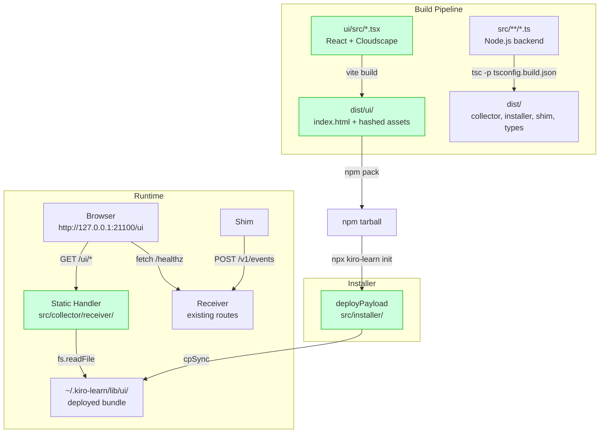
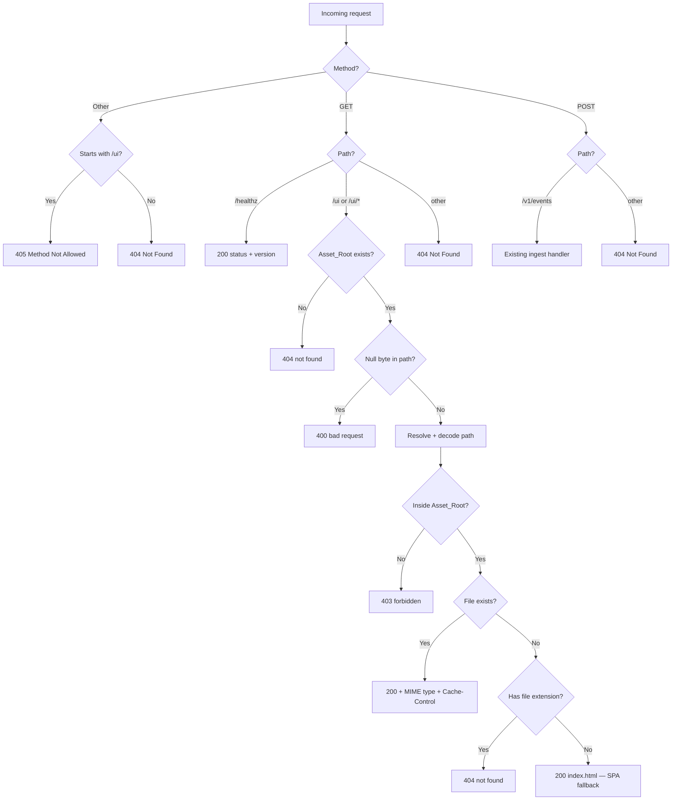

# Design Document: Visualizer Scaffold

## Overview

This spec stands up the full UI plumbing for kiro-learn's local visualizer: a React + Vite + Cloudscape build pipeline, a static-asset handler in the collector daemon, and a "coming soon" scaffold page that proves the chain works end-to-end. After this spec, `GET /ui` on the running daemon returns a Cloudscape-styled page that polls `/healthz` and displays the daemon version. Everything beyond that — read APIs, dashboard cards, the React Flow graph — is deferred to subsequent specs.

The architectural decision is a single-package embedded `ui/` directory. All UI dependencies live in the root `package.json` as devDependencies. No workspaces, no monorepo tooling, no separate `ui/package.json`. One `npm install`, one lockfile, one `node_modules/`. The `ui/` directory is a source directory with its own `tsconfig.json` and `vite.config.ts` — analogous to how a project might have a `docs/` or `scripts/` directory with different tooling. The root `tsconfig.build.json` continues to compile only `src/`; it ignores `ui/` entirely. Vite builds from `ui/` to `dist/ui/`, the installer deploys it alongside existing payload subdirectories, and the daemon serves it over HTTP on loopback.

The static handler is the most security-sensitive piece. It uses only `node:http`, `node:fs`, and `node:path` — no third-party static-serving library. Path traversal safety is the primary security boundary: every request path is resolved to an absolute path and verified to be inside the Asset_Root via a prefix check. This invariant is tested as a property across arbitrary malicious path strings.

**In scope:** UI toolchain setup (React, Vite, Cloudscape, TypeScript); `ui/` source directory with entry point; Vite build producing `dist/ui/`; root build script integration; daemon static-asset serving at `GET /ui` and `GET /ui/*`; `/healthz` version field extension; installer `deployPayload` update; scaffold page with Cloudscape layout, daemon health poll, and "coming soon" alert; Vite dev server with proxy; guard tests for `src/` ↔ `ui/` boundary; smoke test for `<App />` mount; property tests for path-traversal safety, MIME correctness, and SPA fallback determinism.

**Out of scope:** Real data endpoints, dashboard cards, React Flow graph, React Router, auth, HTTPS, i18n, Storybook, state management libraries, separate `ui/package.json`.

## Architecture

### Component context



Green = this spec. The static handler is colocated with the existing receiver in `src/collector/receiver/`. The UI source lives in `ui/` at the repository root. The build pipeline produces `dist/ui/` alongside the existing `dist/` backend output.

### Request routing (updated receiver)



### Module structure

```
ui/                                    ← NEW: UI source directory
  index.html                           ← Vite entry HTML
  vite.config.ts                       ← Vite + React plugin + proxy + outDir
  tsconfig.json                        ← Browser-targeted TS config
  src/
    main.tsx                           ← React entry: mounts <App /> into #root
    App.tsx                            ← Scaffold page: Cloudscape layout + health poll
    types/
      health.ts                        ← HealthzResponse interface (duplicated from backend)

src/collector/receiver/
  index.ts                             ← MODIFIED: adds static-handler routing
  static-handler.ts                    ← NEW: resolveAsset, serveAsset, MIME_TABLE

src/installer/
  index.ts                             ← MODIFIED: deployPayload adds 'ui' to subdirs

dist/ui/                               ← BUILD OUTPUT: vite build → ../dist/ui
  index.html
  assets/
    index-<hash>.js
    index-<hash>.css
```

Dependency direction is preserved: `ui/src/` imports only from `node_modules/` (React, Cloudscape). `src/collector/receiver/static-handler.ts` imports only from `node:` stdlib. Neither side imports the other. Guard tests enforce this (Requirement 14).

## Components and Interfaces

### Component 1: Static Handler (`src/collector/receiver/static-handler.ts`)

**Purpose.** Given a URL path under `/ui/`, resolve it to a file inside the Asset_Root and serve it, or reject it. This is the security-critical piece — every path must be validated before any filesystem read.

**Exported interface:**

```typescript
import type { ServerResponse } from 'node:http';

/** Static mapping from file extension to Content-Type. */
export const MIME_TABLE: Readonly<Record<string, string>>;

/** Result of resolving a URL path against the Asset_Root. */
export type AssetResolution =
  | { kind: 'serve'; absolutePath: string; mimeType: string; isHashed: boolean }
  | { kind: 'spa-fallback'; indexPath: string }
  | { kind: 'reject'; status: 400 | 403 | 404 };

/**
 * Resolve a URL path (the portion after `/ui`) to a filesystem path
 * inside assetRoot, or produce a rejection.
 *
 * Pure up to filesystem observation (existsSync). Never throws.
 */
export function resolveAsset(urlPath: string, assetRoot: string): AssetResolution;

/**
 * Serve a resolved asset to the response. Reads the file, sets headers
 * (Content-Type, Content-Length, Cache-Control), and ends the response.
 */
export function serveAsset(
  resolution: AssetResolution,
  res: ServerResponse,
): Promise<void>;
```

**`resolveAsset` algorithm (implements Requirements 6, 7, 8, 9):**

```
FUNCTION resolveAsset(urlPath, assetRoot)
  // Phase 1: null byte check (Req 7.4)
  IF urlPath contains '\x00' THEN
    RETURN { kind: 'reject', status: 400 }

  // Phase 2: decode + normalize (Req 7.3)
  TRY
    decoded ← decodeURIComponent(urlPath)
  CATCH
    RETURN { kind: 'reject', status: 400 }

  // Phase 3: resolve to absolute path (Req 7.1)
  resolved ← path.resolve(assetRoot, '.' + decoded)
    // prepend '.' so '/../../etc/passwd' becomes './../../etc/passwd'
    // which path.resolve normalizes against assetRoot

  // Phase 4: prefix check (Req 7.2)
  IF resolved !== assetRoot AND NOT resolved.startsWith(assetRoot + sep) THEN
    RETURN { kind: 'reject', status: 403 }

  // Phase 5: file existence
  IF file exists at resolved AND is regular file THEN
    ext ← path.extname(resolved)
    mime ← MIME_TABLE[ext] ?? 'application/octet-stream'
    isHashed ← filename contains a hash pattern (e.g. /assets/index-abc123.js)
    RETURN { kind: 'serve', absolutePath: resolved, mimeType: mime, isHashed }

  // Phase 6: SPA fallback vs 404 (Req 9)
  IF path.extname(decoded) is non-empty THEN
    RETURN { kind: 'reject', status: 404 }  // missing asset with extension
  ELSE
    indexPath ← path.join(assetRoot, 'index.html')
    IF file exists at indexPath THEN
      RETURN { kind: 'spa-fallback', indexPath }
    ELSE
      RETURN { kind: 'reject', status: 404 }
```

**`MIME_TABLE` (implements Requirement 8):**

```typescript
export const MIME_TABLE: Readonly<Record<string, string>> = {
  '.html': 'text/html; charset=utf-8',
  '.js':   'application/javascript',
  '.mjs':  'application/javascript',
  '.css':  'text/css',
  '.json': 'application/json',
  '.svg':  'image/svg+xml',
  '.png':  'image/png',
  '.ico':  'image/x-icon',
  '.woff': 'font/woff',
  '.woff2': 'font/woff2',
  '.map':  'application/json',
};
```

**`serveAsset` behaviour:**

- For `kind: 'serve'`: read file with `fs.promises.readFile`, set `Content-Type` from resolution, set `Content-Length`, set `Cache-Control` based on `isHashed` (hashed → `public, max-age=31536000, immutable`; non-hashed → `no-cache`). Write 200 response.
- For `kind: 'spa-fallback'`: read `index.html`, serve with `text/html; charset=utf-8`, `Cache-Control: no-cache`, status 200.
- For `kind: 'reject'`: write JSON error response with the appropriate status code and error message (`"bad request"`, `"forbidden"`, or `"not found"`).

### Component 2: Receiver Integration (`src/collector/receiver/index.ts`)

**Purpose.** Wire the static handler into the existing request router.

**Changes to `startReceiver`:**

1. Compute `assetRoot` once at startup: `path.resolve(path.dirname(fileURLToPath(import.meta.url)), '..', '..', 'ui')`. This resolves to `dist/ui/` relative to the compiled receiver at `dist/collector/receiver/index.js` (two `..` traversals: `receiver/` → `collector/` → `dist/`, then into `ui/`).
2. Check if `assetRoot` exists at startup. Store a boolean `uiBundleAvailable`.
3. In the request handler, add routing for `/ui` paths before the existing 404 fallback:

```typescript
// ── Static UI serving ─────────────────────────────────────────
if (pathname === '/ui' || pathname === '/ui/' || pathname.startsWith('/ui/')) {
  if (method !== 'GET') {
    res.setHeader('Allow', 'GET');
    jsonResponse(res, 405, { error: 'method not allowed' });
    return;
  }
  if (!uiBundleAvailable) {
    jsonResponse(res, 404, { error: 'not found' });
    return;
  }
  const urlPath = pathname === '/ui' || pathname === '/ui/'
    ? '/'
    : pathname.slice('/ui'.length);
  const resolution = resolveAsset(urlPath, assetRoot);
  await serveAsset(resolution, res);
  return;
}
```

4. Extend `/healthz` to include `version`:

```typescript
if (method === 'GET' && pathname === '/healthz') {
  jsonResponse(res, 200, { status: 'ok', version: daemonVersion });
  return;
}
```

Where `daemonVersion` is read once at module load from `package.json` (see Component 3).

**`ReceiverDeps` and `ReceiverOptions` are unchanged.** The static handler needs no injected dependencies — it reads files from disk. The `assetRoot` is computed from the module's own location, not from config.

### Component 3: Version Resolution

**Purpose.** Read the package version once at daemon startup for `/healthz`.

```typescript
// At the top of src/collector/receiver/index.ts or in a small helper

import { readFileSync } from 'node:fs';
import { fileURLToPath } from 'node:url';

function loadDaemonVersion(): string {
  try {
    const pkgPath = path.resolve(
      path.dirname(fileURLToPath(import.meta.url)),
      '..', '..', '..', 'package.json',
    );
    const raw = readFileSync(pkgPath, 'utf8');
    const pkg = JSON.parse(raw) as { version?: string };
    return typeof pkg.version === 'string' ? pkg.version : 'unknown';
  } catch {
    process.stderr.write('[kiro-learn] could not read package version\n');
    return 'unknown';
  }
}
```

Called once at module load. The result is captured in a module-level `const daemonVersion`. No re-reads on subsequent `/healthz` calls (Requirement 10.2). The compiled receiver lives at `dist/collector/receiver/index.js`, so three `..` traversals reach the root `package.json`.

### Component 4: Installer `deployPayload` Update

**Purpose.** Add `'ui'` to the list of subdirectories copied from `dist/` to `~/.kiro-learn/lib/`.

**Change:**

```typescript
// src/installer/index.ts — inside deployPayload()

// Required subdirectories — hard-fail if missing:
for (const subdir of ['shim', 'collector', 'installer', 'types']) {
  const src = path.join(distDir, subdir);
  const dst = path.join(libDir, subdir);
  if (!existsSync(src)) {
    throw new Error(`[kiro-learn] required payload directory missing: ${src}`);
  }
  cpSync(src, dst, { recursive: true });
}

// Optional subdirectories — skip gracefully if missing:
for (const subdir of ['ui']) {
  const src = path.join(distDir, subdir);
  const dst = path.join(libDir, subdir);
  if (!existsSync(src)) continue;  // graceful skip for pre-visualizer builds
  cpSync(src, dst, { recursive: true });
}
```

Required subdirectories (`shim`, `collector`, `installer`, `types`) throw if missing — they must always be present after a successful build. Only `ui/` is optional, allowing pre-visualizer builds to deploy without error (Requirement 5.3).

### Component 5: UI Source (`ui/`)

**Purpose.** The React + Cloudscape scaffold page.

**`ui/index.html`:**

```html
<!DOCTYPE html>
<html lang="en">
  <head>
    <meta charset="UTF-8" />
    <meta name="viewport" content="width=device-width, initial-scale=1.0" />
    <title>kiro-learn</title>
  </head>
  <body>
    <div id="root"></div>
    <script type="module" src="/src/main.tsx"></script>
  </body>
</html>
```

**`ui/src/main.tsx`:**

```tsx
import { StrictMode } from 'react';
import { createRoot } from 'react-dom/client';
import '@cloudscape-design/global-styles/index.css';
import App from './App.js';

createRoot(document.getElementById('root')!).render(
  <StrictMode>
    <App />
  </StrictMode>,
);
```

**`ui/src/App.tsx`:**

```tsx
import { useState, useEffect, useRef } from 'react';
import AppLayout from '@cloudscape-design/components/app-layout';
import TopNavigation from '@cloudscape-design/components/top-navigation';
import Container from '@cloudscape-design/components/container';
import Header from '@cloudscape-design/components/header';
import SpaceBetween from '@cloudscape-design/components/space-between';
import StatusIndicator from '@cloudscape-design/components/status-indicator';
import Box from '@cloudscape-design/components/box';
import ColumnLayout from '@cloudscape-design/components/column-layout';
import type { HealthzResponse } from './types/health.js';

const POLL_INTERVAL_MS = 10_000;

function MetricCard({ title, value }: { title: string; value: number }) {
  return (
    <Container header={<Header variant="h3">{title}</Header>}>
      <Box variant="awsui-key-label" fontSize="display-l" fontWeight="bold" textAlign="center">
        {value}
      </Box>
    </Container>
  );
}

export default function App() {
  const [health, setHealth] = useState<'loading' | 'ok' | 'error'>('loading');
  const [version, setVersion] = useState<string>('unknown');
  const intervalRef = useRef<ReturnType<typeof setInterval> | null>(null);

  const checkHealth = async () => {
    try {
      const res = await fetch('/healthz');
      if (!res.ok) { setHealth('error'); return; }
      const data: HealthzResponse = await res.json();
      if (data.status === 'ok') {
        setHealth('ok');
        setVersion(data.version ?? 'unknown');
      } else {
        setHealth('error');
      }
    } catch {
      setHealth('error');
    }
  };

  useEffect(() => {
    checkHealth();
    intervalRef.current = setInterval(checkHealth, POLL_INTERVAL_MS);
    return () => {
      if (intervalRef.current !== null) clearInterval(intervalRef.current);
    };
  }, []);

  return (
    <>
      <TopNavigation
        identity={{ href: '/ui', title: 'kiro-learn', logo: undefined }}
        utilities={[{ type: 'button', text: `v${version}`, disabled: true }]}
      />
      <AppLayout
        navigationHide
        toolsHide
        content={
          <SpaceBetween size="l">
            {/* Daemon health */}
            <StatusIndicator
              type={health === 'ok' ? 'success' : health === 'error' ? 'error' : 'loading'}
            >
              {health === 'ok' ? 'Daemon healthy' : health === 'error' ? 'Daemon unreachable' : 'Checking daemon...'}
            </StatusIndicator>

            {/* Metric cards row — placeholder values */}
            <ColumnLayout columns={4}>
              <MetricCard title="Total Memories" value={0} />
              <MetricCard title="Total Events" value={0} />
              <MetricCard title="Projects" value={0} />
              <MetricCard title="Concepts" value={0} />
            </ColumnLayout>

            {/* Graph placeholder */}
            <Container header={<Header variant="h2">Memory Graph</Header>}>
              <div style={{ minHeight: 400, display: 'flex', alignItems: 'center', justifyContent: 'center' }}>
                <SpaceBetween size="s" direction="vertical" alignItems="center">
                  <StatusIndicator type="pending">
                    Graph visualization coming soon
                  </StatusIndicator>
                </SpaceBetween>
              </div>
            </Container>
          </SpaceBetween>
        }
      />
    </>
  );
}
```

**`ui/src/types/health.ts`:**

```typescript
/** Wire shape of GET /healthz. Duplicated from backend — no cross-import. */
export interface HealthzResponse {
  status: 'ok';
  version: string;
}
```

**`ui/tsconfig.json`:**

```json
{
  "compilerOptions": {
    "target": "ES2023",
    "lib": ["ES2023", "DOM", "DOM.Iterable"],
    "module": "ESNext",
    "moduleResolution": "Bundler",
    "jsx": "react-jsx",
    "strict": true,
    "verbatimModuleSyntax": true,
    "isolatedModules": true,
    "noEmit": true,
    "skipLibCheck": true
  },
  "include": ["src"]
}
```

**`ui/vite.config.ts`:**

```typescript
import { defineConfig } from 'vite';
import react from '@vitejs/plugin-react';

export default defineConfig(({ command }) => ({
  plugins: [react()],
  base: command === 'serve' ? '/' : '/ui/',
  build: {
    outDir: '../dist/ui',
    emptyOutDir: true,
    sourcemap: false,
  },
  server: {
    port: 5173,
    host: '127.0.0.1',
    proxy: {
      '/healthz': 'http://127.0.0.1:21100',
      '/v1': 'http://127.0.0.1:21100',
    },
  },
}));
```

The `base` asymmetry (`'/'` in dev, `'/ui/'` in prod) is handled by checking `command === 'serve'`. In dev mode, the Vite dev server runs at the root, so assets resolve at `/`. In production, the daemon serves under `/ui/`, so assets must be prefixed accordingly (Requirement 13).

### Component 6: Build Script Changes

**Root `package.json` script updates:**

```json
{
  "scripts": {
    "build": "tsc -p tsconfig.build.json && npx vite build --config ui/vite.config.ts",
    "build:node": "tsc -p tsconfig.build.json",
    "build:ui": "npx vite build --config ui/vite.config.ts",
    "dev:ui": "npx vite --config ui/vite.config.ts",
    "typecheck": "tsc --noEmit -p tsconfig.build.json && tsc --noEmit -p ui/tsconfig.json"
  }
}
```

`build` runs tsc then vite sequentially. `build:node` and `build:ui` are convenience scripts for iterating on one side. `dev:ui` starts the Vite dev server. `typecheck` runs both tsconfigs sequentially.

## Backward Compatibility

| Scenario | Behaviour |
|---|---|
| Pre-visualizer build deployed (no `dist/ui/`) | `deployPayload` skips `ui/` gracefully. Daemon starts, `GET /ui` returns 404. All other routes work. |
| Post-visualizer build, daemon running | `GET /ui` serves scaffold page. All existing routes unchanged. |
| Old `/healthz` consumer | Reads `status` field, ignores `version`. Works unchanged. |
| New `/healthz` consumer | Reads both `status` and `version`. |

## Correctness Properties

### Property 1: Path-traversal containment

*For all* URL path strings `P` (including `..` segments, percent-encoded variants, null bytes, mixed separators, overlong paths, non-ASCII bytes), `resolveAsset(P, assetRoot)` either produces a `{ kind: 'serve', absolutePath }` where `absolutePath` is inside `assetRoot`, or produces `{ kind: 'spa-fallback' }`, or produces `{ kind: 'reject' }`. No accepted request resolves outside `assetRoot`.

**Validates: Requirement 7.5**

### Property 2: MIME correctness

*For all* file extensions `E` in `MIME_TABLE`, when a file with extension `E` exists in `assetRoot`, `resolveAsset('/filename' + E, assetRoot)` returns `{ kind: 'serve', mimeType: MIME_TABLE[E] }`.

**Validates: Requirement 8.3**

### Property 3: SPA fallback determinism

*For all* extensionless URL path strings `P` that pass traversal validation, `resolveAsset(P, assetRoot)` returns either `{ kind: 'serve' }` (file exists) or `{ kind: 'spa-fallback' }` (file doesn't exist). Never `{ kind: 'reject', status: 404 }`.

**Validates: Requirement 9.4**

## Testing Strategy

### Property tests

| # | File | Property |
|---|---|---|
| 1 | `test/unit/static-handler-traversal.property.test.ts` | Property 1 — path-traversal containment |
| 2 | `test/unit/static-handler-mime.property.test.ts` | Property 2 — MIME correctness |
| 3 | `test/unit/static-handler-spa-fallback.property.test.ts` | Property 3 — SPA fallback determinism |

### Example tests

| File | What it validates |
|---|---|
| `test/unit/static-handler.test.ts` | All branches of `resolveAsset`: serve file, 404 missing asset with ext, SPA fallback, 403 traversal, 400 null byte, 400 bad encoding, MIME entries, unknown ext → octet-stream, Cache-Control headers. |
| `test/unit/receiver-static-routes.test.ts` | Integration: start receiver with fixture `dist/ui/`, verify GET /ui, GET /ui/assets/test.js, SPA fallback, POST /ui → 405, absent Asset_Root → 404. |
| `test/unit/healthz-version.test.ts` | `/healthz` returns version, matches package.json, cached across calls. |
| `test/unit/no-ui-in-src.test.ts` | Guard: no `src/` file imports from `ui/`. |
| `test/unit/no-src-in-ui.test.ts` | Guard: no `ui/src/` file imports from `src/`. |
| `test/unit/ui-app-smoke.test.ts` | Mounts `<App />` in jsdom, mocks fetch, asserts "kiro-learn" text. |
| `test/unit/installer-deploy-ui.test.ts` | `deployPayload` copies `ui/` when present, skips when absent. |

### Test helper extensions

`test/helpers/arbitrary.ts` gains `arbitraryUrlPath()` for the path-traversal property test.

### Vitest configuration

Root `vitest.config.ts` updated to include `ui/src/**/*.test.tsx` and configure `jsdom` environment for UI test files.

## Risks and Open Questions

### Risk 1: Cloudscape bundle size

Cloudscape is large. Even with tree-shaking, the scaffold's 7 component imports may produce a bundle near the 2 MiB soft target. Mitigation: measure after first build; switch to individual component imports if needed.

### Risk 2: Vite module resolution with root-level deps

Vite expects React in `node_modules/` relative to the config. Since `ui/vite.config.ts` is one level down, Vite walks up to root `node_modules/`. This is standard Node resolution and should work. If not, add `resolve.alias` in vite config.

### Risk 3: TypeScript dual-target type-checking

Running `tsc --noEmit` against both Node and browser tsconfigs sequentially avoids conflicts. If editor support is inconsistent, consider VS Code multi-root or project references.

## Interfaces

### New

| Symbol | Module | Kind |
|---|---|---|
| `resolveAsset` | `src/collector/receiver/static-handler.ts` | Function |
| `serveAsset` | `src/collector/receiver/static-handler.ts` | Function |
| `AssetResolution` | `src/collector/receiver/static-handler.ts` | Type |
| `MIME_TABLE` | `src/collector/receiver/static-handler.ts` | Constant |
| `loadDaemonVersion` | `src/collector/receiver/index.ts` | Function (internal) |
| `App` | `ui/src/App.tsx` | React component |
| `HealthzResponse` | `ui/src/types/health.ts` | Interface |

### Modified

| Symbol | Module | Change |
|---|---|---|
| `startReceiver` | `src/collector/receiver/index.ts` | Adds `/ui` routing + `/healthz` version |
| `deployPayload` | `src/installer/index.ts` | Adds `'ui'` + `existsSync` guard |
| `package.json` scripts | root | `build`, `typecheck` updated; new `build:node`, `build:ui`, `dev:ui` |
| `package.json` devDeps | root | Adds React, Vite, Cloudscape, testing-library, jsdom |

### Unchanged

| Symbol | Module | Reason |
|---|---|---|
| `ReceiverDeps` | `src/collector/receiver/index.ts` | Static handler needs no injected deps |
| `ReceiverOptions` | `src/collector/receiver/index.ts` | No new config for static serving |
| `Pipeline` | `src/collector/pipeline/index.ts` | Untouched |
| `StorageBackend` | `src/types/index.ts` | Untouched |

## Divergences from Requirements

1. **Requirement 1.5** says root `tsconfig.json` should include `ui/` for type-checking. Design runs both tsconfigs sequentially via `typecheck` script instead of merging, because Node and browser `lib` settings conflict. Same observable outcome.

2. **Requirement 6.6** says 404 when Asset_Root absent. Design checks once at startup via boolean flag rather than per-request. Same observable behaviour, avoids repeated filesystem checks.
