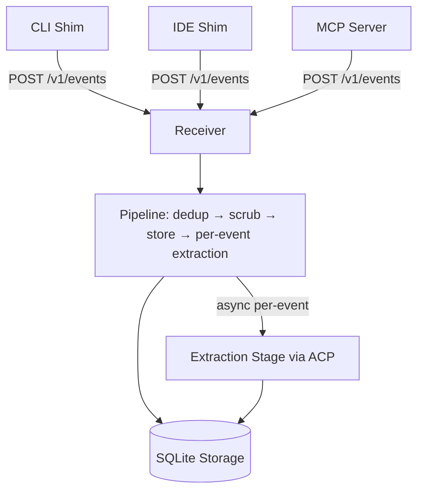
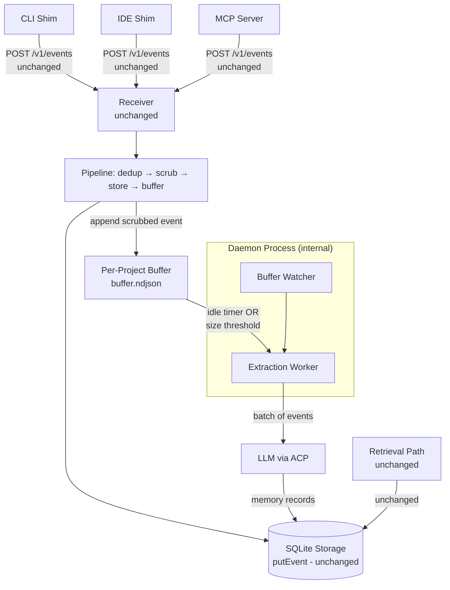
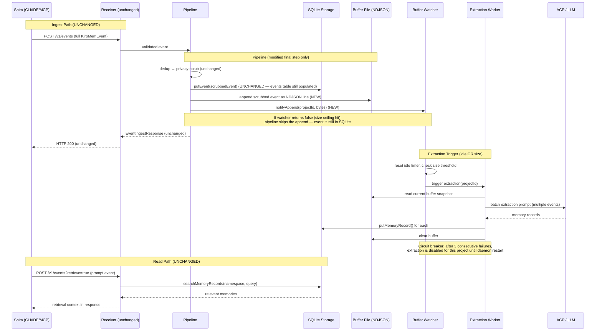

# Design Document: Workspace Buffer Pipeline

## Overview

The workspace buffer pipeline replaces the current per-event extraction model with project-scoped append-only buffers that live entirely inside the collector. Instead of firing an async LLM extraction for every event as it passes through the pipeline, the pipeline appends each scrubbed event to an internal per-project NDJSON buffer file. Extraction into memory records fires on two triggers: an idle timer (no buffer activity for a configurable period) or a size threshold (buffer crosses a byte limit).

This is a **transparent optimization of the extraction path**. From the outside — shims, HTTP API, retrieval — nothing changes. Shims continue to build full `KiroMemEvent` objects and POST them to `POST /v1/events` exactly as today. The receiver validates and passes events to the pipeline. The pipeline runs dedup → privacy scrub → **store in SQLite via `putEvent()`** (unchanged) → **append to buffer** (new). The `events` table continues to power `GET /v1/events`, the visualizer, and `listEvents()` exactly as before. The only change is in the extraction strategy: instead of enqueuing the scrubbed event for per-event async extraction, the pipeline also appends it to an internal buffer. A BufferWatcher inside the daemon monitors these buffers and triggers batch extraction when appropriate.

The result is higher-quality memories (the extractor sees richer context from multiple events), lower extraction cost (fewer model calls), and natural project-level scoping. Both CLI and IDE shims push to the same project buffer transparently, and parallel agents within a project share state without coordination.

The read path (query → FTS5 → format → inject) remains completely unchanged.

## Architecture

### Current Architecture (Before)



### New Architecture (After)



### Data Flow Sequence



## Components and Interfaces

### Component 1: BufferStore

**Purpose**: Manages per-project append-only NDJSON buffer files. Internal to the collector — not exposed via HTTP. Stores already-scrubbed events (privacy scrubbing happens in the pipeline before the event reaches the buffer). The buffer is truly append-only — entries are only removed when `clear()` is called after a successful extraction.

**Location**: `src/collector/buffer/store.ts`

**Interface**:
```typescript
interface BufferStore {
  /** Append a scrubbed event to the project buffer. Acquires shared flock. */
  append(projectId: string, event: BufferEntry): Promise<number>;

  /** Read all entries from the buffer as a snapshot. No lock required. */
  snapshot(projectId: string): Promise<BufferEntry[]>;

  /** Current byte size of the buffer file. Returns 0 if file does not exist. */
  size(projectId: string): Promise<number>;

  /** Resolve the filesystem path for a project buffer. */
  bufferPath(projectId: string): string;

  /** List all project IDs that have buffer files. */
  listProjects(): Promise<string[]>;

  /** Remove the buffer file for a project. Used after successful extraction drains it. */
  clear(projectId: string): Promise<void>;
}
```

**Responsibilities**:
- Derive buffer file path from project ID: `~/.kiro-learn/buffers/<project_id>/buffer.ndjson`
- Project ID is extracted from the event's `namespace` field using the existing `/actor/<actor_id>/project/<project_id>/` pattern — the same hex SHA-256 already computed by the shim
- Append with POSIX `flock(LOCK_SH)` — the pipeline is the only writer in practice, but shared lock is safe for future multi-process scenarios
- Snapshot reads the file without locking (reads are atomic at the NDJSON-line level)
- Create buffer directory on first append (mkdir -p equivalent)
- `append()` returns the number of bytes written (so the watcher can track size without re-statting)
- `clear()` removes the buffer file after successful extraction

### Component 2: BufferWatcher

**Purpose**: Monitors buffer activity per project and fires extraction triggers. Maintains idle timers and tracks size thresholds. Runs inside the daemon process. Purely internal — no HTTP surface.

**Location**: `src/collector/buffer/watcher.ts`

**Interface**:
```typescript
interface BufferWatcher {
  /**
   * Notify the watcher that the pipeline wants to append to a project buffer.
   * Resets idle timer, checks size thresholds.
   * Returns `true` if the append should proceed, `false` if the buffer has
   * hit the hard size ceiling and the append should be skipped.
   */
  notifyAppend(projectId: string, appendedBytes: number): boolean;

  /**
   * Report the result of an extraction attempt. Used by ExtractionWorker
   * to drive the circuit breaker: consecutive failures increment the
   * counter; a success resets it to 0.
   */
  notifyExtractionResult(projectId: string, success: boolean): void;

  /** Register a listener for extraction triggers. */
  onExtraction(handler: (projectId: string) => void): void;

  /** Shut down all timers and pending triggers. */
  close(): void;
}

interface BufferWatcherConfig {
  /** Idle period before extraction fires (ms). Default 5000. */
  idleMs: number;
  /** Buffer byte-size threshold for extraction trigger. Default 256 KiB. */
  extractionSizeThreshold: number;
  /** Hard ceiling on buffer size (bytes). Appends are refused above this. Default 4 MiB. */
  bufferMaxBytes: number;
  /** Consecutive extraction failures before circuit breaker trips. Default 3. */
  maxConsecutiveFailures: number;
}
```

**Responsibilities**:
- Per-project idle timer: starts/resets on each `notifyAppend`. Fires extraction when timer expires.
- Size tracking: accumulates appended bytes per project. Fires extraction when `extractionSizeThreshold` crossed.
- `stop` events from shims flow through the normal pipeline and trigger `notifyAppend`. The watcher sees no further activity → idle timer fires.
- Deduplicates triggers: if extraction is already in-flight for a project, does not re-trigger.
- **Circuit breaker**: tracks consecutive extraction failures per project. After `maxConsecutiveFailures` (default 3) consecutive failures on the same buffer, marks that project's buffer as extraction-disabled and stops scheduling extraction triggers for it. The `notifyExtractionResult(projectId, success)` method is called by the ExtractionWorker after each attempt. A successful extraction resets the failure counter to 0. When a buffer is tripped, new appends still land (up to the hard size ceiling) but no extraction is triggered. The circuit breaker state is logged to stderr so the failure is visible.
- **Hard size ceiling**: when `notifyAppend` is called and the project's accumulated bytes exceed `bufferMaxBytes` (default 4 MiB), the watcher returns `false` to signal the pipeline should skip the append. The event is still stored in SQLite via `putEvent()` — only the batch-extraction opportunity is lost. A warning is logged to stderr on the first rejection per project (not on every event, to avoid log spam).

### Component 3: ExtractionWorker

**Purpose**: Reads a buffer snapshot, sends the batch of events to the LLM via ACP for extraction into memory records, and stores the results. Replaces the current per-event `ExtractionStage` as the extraction mechanism.

**Location**: `src/collector/buffer/extraction.ts`

**Interface**:
```typescript
interface ExtractionWorker {
  /** Run extraction for a project. Reads buffer, calls LLM, stores memories. */
  extract(projectId: string): Promise<ExtractionResult>;

  /** Wait for all in-flight extractions to complete (with timeout). */
  drain(timeoutMs: number): Promise<void>;

  /** Number of currently active extractions. */
  readonly active: number;
}

interface ExtractionResult {
  projectId: string;
  eventsProcessed: number;
  memoriesCreated: number;
  durationMs: number;
}

interface ExtractionWorkerConfig {
  /** Maximum concurrent extractions across all projects. Default 2. */
  concurrency: number;
  /** Per-extraction timeout in milliseconds. Default 60_000. */
  timeoutMs: number;
  /** Maximum retry attempts for transient failures. Default 3. */
  maxRetries: number;
}
```

**Responsibilities**:
- Read buffer snapshot (unordered bag of scrubbed events)
- Frame events as a batch XML prompt (extends existing `xml-framer.ts` to handle multiple events)
- Send to compressor agent via ACP, parse XML response (reuses existing `xml-parser.ts`)
- Derive `namespace` from the events in the buffer (all events in a project buffer share the same namespace, since project ID is extracted from namespace)
- Store resulting `MemoryRecord` objects via `StorageBackend.putMemoryRecord()`
- Populate `source_event_ids` on each memory record with the `event_id` values from the batch
- Clear the buffer after successful extraction
- Semaphore-based concurrency control (same pattern as existing `ExtractionStage`)
- Never blocks the write path — extraction is fully async

## Data Models

### Model 1: BufferEntry (Internal)

The buffer stores a lightweight projection of the scrubbed `KiroMemEvent`. This is an internal type — not exposed in `src/types/` and not part of the HTTP API.

```typescript
/** Internal to src/collector/buffer/. Not exported to shims or types/. */
interface BufferEntry {
  /** Original event_id from the KiroMemEvent (ULID). */
  event_id: string;
  /** Namespace from the event (carries actor + project identity). */
  namespace: string;
  /** Event kind: prompt, tool_use, session_summary, note. */
  kind: KiroMemEvent['kind'];
  /** The scrubbed event body (already privacy-scrubbed by the pipeline). */
  body: KiroMemEvent['body'];
  /** ISO 8601 timestamp (valid_time from the event). */
  timestamp: string;
  /** Source surface from the event. */
  surface: string;
}
```

**Validation Rules**:
- `event_id`: ULID format (inherited from the validated event)
- `namespace`: matches `NAMESPACE_RE` (inherited from the validated event)
- `kind`: one of the four allowed event kinds
- `body`: already validated and scrubbed by the pipeline
- `timestamp`: ISO 8601 with offset
- `surface`: non-empty string

**Why a projection instead of the full event?** The buffer doesn't need `schema_version`, `content_hash`, `parent_event_id`, `session_id`, or the full `source` block. Keeping the entry lean reduces buffer file size. The `event_id` and `namespace` are preserved so the ExtractionWorker can populate `source_event_ids` and `namespace` on the resulting `MemoryRecord`.

### Model 2: BufferWatcherState (In-Memory)

```typescript
interface ProjectBufferState {
  projectId: string;
  /** Accumulated buffer bytes since last extraction. */
  currentBytes: number;
  /** Node.js timer handle for idle detection. */
  idleTimer: ReturnType<typeof setTimeout> | null;
  /** Whether extraction is currently in-flight. */
  extractionInFlight: boolean;
  /** Timestamp of last append notification. */
  lastActivity: string;
  /** Consecutive extraction failures for circuit breaker. Reset to 0 on success. */
  consecutiveFailures: number;
  /** When true, extraction is disabled for this buffer (circuit breaker tripped). */
  extractionDisabled: boolean;
  /** When true, the hard size ceiling has been hit and a warning was already logged. */
  sizeCeilingWarningLogged: boolean;
}
```

**Validation Rules**:
- `currentBytes` ≥ 0
- At most one extraction in-flight per project
- `consecutiveFailures` ≥ 0
- `extractionDisabled` is true iff `consecutiveFailures` ≥ `maxConsecutiveFailures`

### Model 3: BufferConfig (Extension of CollectorConfig)

```typescript
interface BufferConfig {
  /** Whether buffer mode is enabled. Default true. */
  bufferEnabled: boolean;
  /** Idle period before extraction fires (ms). Default 5000. */
  bufferIdleMs: number;
  /** Buffer byte-size threshold for extraction trigger. Default 262_144 (256 KiB). */
  bufferExtractionThreshold: number;
  /** Hard ceiling on buffer size (bytes). Appends refused above this. Default 4_194_304 (4 MiB). */
  bufferMaxBytes: number;
  /** Consecutive extraction failures before circuit breaker trips. Default 3. */
  bufferMaxConsecutiveFailures: number;
  /** Maximum concurrent buffer extractions. Default 2. */
  bufferExtractionConcurrency: number;
  /** Per-extraction timeout (ms). Default 60_000. */
  bufferExtractionTimeoutMs: number;
  /** Directory for buffer files. Default '~/.kiro-learn/buffers/'. */
  bufferDir: string;
}
```

### Model 4: NDJSON Buffer File Format

Each line in `buffer.ndjson` is a self-contained JSON object representing a `BufferEntry`:

```
{"event_id":"01J...","namespace":"/actor/alice/project/a1b2c3.../","kind":"tool_use","body":{"type":"json","data":{...}},"timestamp":"2025-01-15T10:30:00.000Z","surface":"kiro-cli"}
{"event_id":"01J...","namespace":"/actor/alice/project/a1b2c3.../","kind":"prompt","body":{"type":"text","content":"..."},"timestamp":"2025-01-15T10:30:05.000Z","surface":"kiro-ide"}
```

**File-level invariants**:
- Append-only: the pipeline only appends new lines; the buffer is cleared entirely after successful extraction
- Each line is a complete, valid JSON object (no multi-line records)
- Lines are not ordered by any field — treated as an unordered bag
- File path: `~/.kiro-learn/buffers/<project_id>/buffer.ndjson` where `project_id` is the hex SHA-256 extracted from the event's namespace
- All entries are already privacy-scrubbed — the pipeline scrubs before appending to the buffer

### Model 5: Project ID Extraction

The project ID for buffer keying is extracted from the event's `namespace` field:

```typescript
/** Extract project_id from namespace: /actor/<actor_id>/project/<project_id>/ */
function extractProjectId(namespace: string): string {
  const match = namespace.match(/^\/actor\/[^/]+\/project\/([^/]+)\/$/);
  return match?.[1] ?? namespace;
}
```

This reuses the same `extractProjectId` helper already present in `src/collector/receiver/index.ts`. The helper will be moved to a shared location (e.g., `src/collector/buffer/utils.ts` or inlined in the buffer module).

## Error Handling

### Error Scenario 1: Buffer File Write Failure

**Condition**: `flock()` or `appendFileSync()` fails (disk full, permissions, etc.) when the pipeline tries to append to the buffer.
**Response**: Pipeline logs a warning to stderr. The event is still stored in SQLite (storage happens before buffer append). Only the buffer append is lost.
**Recovery**: The event is durably stored in the `events` table — only the batch extraction opportunity is missed for this event. The next successful append will include subsequent events. No data corruption — append-only semantics mean partial writes produce an incomplete final line that the snapshot reader skips.

### Error Scenario 2: Extraction Failure (LLM Error)

**Condition**: ACP session fails, model returns garbage, or timeout expires during batch extraction.
**Response**: ExtractionWorker logs warning, retries up to `maxRetries` times within a single extraction attempt. Buffer is NOT cleared on failure. The ExtractionWorker calls `watcher.notifyExtractionResult(projectId, false)` to increment the circuit breaker counter.
**Recovery**: Buffer persists. Next extraction trigger will re-read the full buffer (including previously failed events). Events are never lost from SQLite — only memory records are missing until extraction succeeds. If the same buffer fails `maxConsecutiveFailures` times consecutively, the circuit breaker trips and extraction stops being scheduled for that project (see Error Scenario 5).

### Error Scenario 3: Daemon Restart Mid-Extraction

**Condition**: Daemon process dies while extraction is in-flight.
**Response**: In-flight work is lost. Buffer file on disk is intact (append-only, never modified in place).
**Recovery**: On restart, the BufferWatcher scans existing buffer files via `BufferStore.listProjects()`, recomputes sizes, and re-arms triggers. Extraction will re-fire for any non-empty buffers. The buffer is the durable record; daemon state is derived from it.

### Error Scenario 4: Corrupt NDJSON Line

**Condition**: Partial write (process killed mid-append) leaves an incomplete JSON line at the end of the buffer file.
**Response**: Snapshot reader parses line-by-line, wrapping each `JSON.parse()` in try/catch. Corrupt lines are skipped with a stderr warning.
**Recovery**: The corrupt line is effectively lost (one event's buffer entry). The event itself is safe in SQLite. All other entries in the buffer are unaffected. The next append writes a complete line after the corrupt one.

### Error Scenario 5: Circuit Breaker Tripped (Repeated Extraction Failure)

**Condition**: The same project buffer fails extraction `maxConsecutiveFailures` (default 3) times consecutively. This can happen when the buffer contains content that triggers a persistent model error, a malformed entry that causes the framer to produce invalid XML, or a persistent auth/credential issue with `kiro-cli`.
**Response**: The BufferWatcher marks the project's buffer as `extractionDisabled = true` and logs a warning to stderr: `[kiro-learn] circuit breaker tripped for project <projectId> after <N> consecutive extraction failures — extraction disabled`. No further extraction triggers are scheduled for this project. New events continue to be appended to the buffer (up to the hard size ceiling).
**Recovery**: A daemon restart resets all circuit breaker state (it's in-memory only). On restart, the watcher re-scans buffers and re-arms triggers with `consecutiveFailures = 0`. This is intentional — transient issues (auth token expiry, model outage) are likely resolved by the time the daemon restarts. If the issue is persistent (malformed buffer content), the circuit breaker will trip again after `maxConsecutiveFailures` attempts.

### Error Scenario 6: Hard Size Ceiling Hit

**Condition**: A project buffer's accumulated size exceeds `bufferMaxBytes` (default 4 MiB). This happens when extraction isn't keeping up — either the circuit breaker has tripped, extraction is slow, or the project is generating events faster than extraction can drain them.
**Response**: The BufferWatcher's `notifyAppend()` returns `false`. The pipeline skips the buffer append for this event. The event is still stored in SQLite via `putEvent()` — nothing is lost. A warning is logged to stderr on the first rejection per project: `[kiro-learn] buffer size ceiling hit for project <projectId> (<size> bytes) — skipping buffer append`. Subsequent rejections for the same project are silent (no log spam).
**Recovery**: Once extraction succeeds and clears the buffer, `currentBytes` resets to 0 and the `sizeCeilingWarningLogged` flag is cleared. New appends resume normally. If the circuit breaker is also tripped, the buffer stays at the ceiling until a daemon restart resets both states.

## Testing Strategy

### Unit Testing Approach

- **BufferStore**: Test append/snapshot/clear with temp directories. Verify NDJSON format, flock semantics (shared lock on append), corrupt-line handling, mkdir-on-first-append, byte count return from append.
- **BufferWatcher**: Test idle timer firing, size threshold triggers, deduplication of in-flight triggers, close() cleanup. Test circuit breaker: verify extraction stops after N consecutive failures, resets on success. Test hard size ceiling: verify `notifyAppend` returns `false` when ceiling is hit, warning logged only once per project. Use fake timers (`vi.useFakeTimers()`).
- **ExtractionWorker**: Test batch framing, LLM response parsing, memory record storage, `source_event_ids` population from batch, concurrency semaphore, retry logic, buffer clear after success, `notifyExtractionResult` called with correct success/failure status. Mock ACP session and storage backend.
- **BufferEntry projection**: Test that the pipeline correctly projects a scrubbed `KiroMemEvent` into a `BufferEntry` (drops unnecessary fields, preserves event_id and namespace).
- **Project ID extraction**: Test `extractProjectId()` against various namespace patterns.
- **Pipeline integration**: Test that `createPipeline` with buffer mode stores the event in SQLite via `putEvent()` AND appends to the buffer, replacing per-event extraction with buffer-based batch extraction.

### Property-Based Testing Approach

**Property Test Library**: fast-check (already in devDependencies)

- **Append/snapshot round-trip**: For any sequence of valid `BufferEntry` objects, appending them all and reading a snapshot yields the same set (order-independent).
- **Project ID determinism**: For any valid namespace string, `extractProjectId(namespace)` always returns the same project ID string.
- **NDJSON integrity**: For any valid `BufferEntry`, serializing to NDJSON and parsing back yields an identical object.
- **Concurrent append safety**: Multiple parallel appends to the same buffer file produce a valid NDJSON file where every appended entry appears exactly once in the snapshot.
- **Batch framing**: For any list of `BufferEntry` objects, `frameBatch(entries)` produces valid XML containing one `<tool_observation>` block per entry.
- **Circuit breaker monotonicity**: For any sequence of `notifyExtractionResult(id, false)` calls, the failure counter increases monotonically. A single `notifyExtractionResult(id, true)` resets it to 0. After exactly `maxConsecutiveFailures` failures, `extractionDisabled` is true.
- **Size ceiling idempotence**: Once `notifyAppend` returns `false` for a project, it continues returning `false` for any `appendedBytes > 0` until the buffer is cleared.

### Integration Testing Approach

- **End-to-end buffer flow**: POST events to `/v1/events` → pipeline stores in SQLite AND appends to buffer → daemon triggers extraction → memories appear in storage. Requires running collector daemon.
- **Backward compatibility**: Verify that the existing `/v1/events` ingest path, retrieval path, and all read APIs work identically with buffer mode enabled. Confirm `GET /v1/events` still returns events from the `events` table.
- **Daemon restart recovery**: POST events, kill daemon, restart, verify extraction fires for buffered events.
- **Shim transparency**: Verify that shims (CLI and IDE) work without any changes — they POST to `/v1/events` as before and get the same response shape.
- **Circuit breaker**: Inject a failing ACP mock, POST events, verify extraction stops after `maxConsecutiveFailures` attempts. Restart daemon, verify extraction resumes.
- **Size ceiling graceful degradation**: Fill a buffer past `bufferMaxBytes`, verify subsequent events are still stored in SQLite but buffer stops growing. Verify warning logged once.

## Correctness Properties

*A property is a characteristic or behavior that should hold true across all valid executions of a system — essentially, a formal statement about what the system should do. Properties serve as the bridge between human-readable specifications and machine-verifiable correctness guarantees.*

### Property 1: Append/snapshot round-trip

*For any* sequence of valid BufferEntry objects appended to a project buffer, reading a snapshot SHALL yield the same set of entries (compared order-independently by `event_id` and field equality).

**Validates: Requirements 1.1, 1.4, 1.5, 3.1**

### Property 2: NDJSON serialization round-trip

*For any* valid BufferEntry, serializing it to a single NDJSON line and parsing that line back SHALL produce an object identical to the original entry.

**Validates: Requirements 3.1, 3.3**

### Property 3: Concurrent append safety

*For any* set of valid BufferEntry objects appended in parallel to the same project buffer, the resulting buffer file SHALL be valid NDJSON where every appended entry appears exactly once in the snapshot.

**Validates: Requirements 1.3, 1.5**

### Property 4: BufferEntry projection correctness

*For any* valid scrubbed KiroMemEvent, projecting it to a BufferEntry SHALL preserve `event_id`, `namespace`, `kind`, `body`, `valid_time` (as `timestamp`), and `source.surface` (as `surface`), and SHALL not contain `schema_version`, `content_hash`, `parent_event_id`, `session_id`, or the full `source` block.

**Validates: Requirements 2.1, 2.2**

### Property 5: Project ID extraction determinism

*For any* string, `extractProjectId` SHALL be a pure function: calling it twice on the same input SHALL return the same output. For strings matching `/actor/<id>/project/<pid>/`, the output SHALL equal `<pid>`. For non-matching strings, the output SHALL equal the full input.

**Validates: Requirements 4.1, 4.2**

### Property 6: Circuit breaker monotonicity and reset

*For any* sequence of `notifyExtractionResult(projectId, success)` calls, the consecutive failure counter SHALL increase by 1 on each `false` call and reset to 0 on each `true` call. After exactly `maxConsecutiveFailures` consecutive `false` calls, `extractionDisabled` SHALL be `true`. A single `true` call at any point SHALL reset the counter to 0 and set `extractionDisabled` to `false`.

**Validates: Requirements 8.1, 8.2, 8.3, 8.4**

### Property 7: Size ceiling idempotence

*For any* project buffer that has exceeded the hard size ceiling, `notifyAppend` SHALL return `false` for all subsequent calls with `appendedBytes > 0` until the buffer is cleared and the byte counter is reset.

**Validates: Requirements 9.1, 9.3, 9.5**

### Property 8: Batch framing integrity

*For any* non-empty list of valid BufferEntry objects, `frameBatch(entries)` SHALL produce valid XML containing exactly one `<tool_observation>` block per entry, with all text content XML-escaped.

**Validates: Requirement 10.2**

### Property 9: Pipeline stores before buffering

*For any* event processed by the pipeline with buffer mode enabled, `putEvent()` SHALL be called before the buffer append is attempted, ensuring the event is durably stored in SQLite regardless of buffer append outcome.

**Validates: Requirements 12.1, 14.2**

### Property 10: Size threshold extraction trigger

*For any* sequence of `notifyAppend` calls whose cumulative byte counts cross the extraction size threshold, THE BufferWatcher SHALL fire an extraction trigger at or after the threshold-crossing call.

**Validates: Requirements 6.1, 6.2**

## Performance Considerations

- **Write path latency**: The pipeline append is a single `flock(LOCK_SH)` + `fs.appendFileSync()` — sub-millisecond on local disk. This is added after the existing `putEvent()` call. The per-event extraction enqueue is removed, so the net ingest response latency is unchanged or slightly improved (no extraction queue management on the hot path).
- **Extraction batching**: Batch extraction amortizes LLM call overhead. A buffer with 50 events produces one ACP session instead of 50. This reduces both latency and cost.
- **Memory footprint**: `ProjectBufferState` is lightweight (one timer + counters per active project). No in-memory buffering of events — the file is the buffer.
- **Disk I/O**: NDJSON append is sequential I/O (fast). Snapshot reads are sequential scans. No random access needed. Buffer files are small (< 256 KiB before extraction triggers).
- **Pipeline overhead**: The only addition to the hot path is one `extractProjectId()` regex match + one file append. Both are sub-millisecond.

## Security Considerations

- **Privacy scrubbing**: `<private>...</private>` tags are scrubbed by the pipeline's existing privacy scrub stage BEFORE the event reaches the buffer. The buffer contains only already-scrubbed events. This is the same guarantee as the current architecture where scrubbing happens before storage and extraction.
- **File permissions**: Buffer directory and files are created with default user permissions (umask). The buffer directory (`~/.kiro-learn/buffers/`) has the same security posture as the existing SQLite database (`~/.kiro-learn/kiro-learn.db`) — both are local-only, user-owned files.
- **No new HTTP surface**: The buffer is entirely internal to the collector. No new HTTP endpoints are added. The attack surface is unchanged.
- **Localhost binding**: All existing HTTP endpoints remain bound to `127.0.0.1` only. No network exposure.
- **No secrets in buffers**: Buffer entries contain scrubbed tool use data and prompts, not credentials. The existing `<private>` tag mechanism covers sensitive content, and scrubbing is applied before buffer append.

## Dependencies

### New Modules

| Module | Location | Purpose |
|---|---|---|
| `buffer/store.ts` | `src/collector/buffer/` | NDJSON buffer file management |
| `buffer/watcher.ts` | `src/collector/buffer/` | Idle timer and size threshold triggers |
| `buffer/extraction.ts` | `src/collector/buffer/` | Batch extraction worker |
| `buffer/types.ts` | `src/collector/buffer/` | `BufferEntry` type (internal, not exported to `src/types/`) |
| `buffer/index.ts` | `src/collector/buffer/` | Module barrel export |

### Modified Modules

| Module | Change |
|---|---|
| `src/collector/pipeline/index.ts` | Modify `createPipeline` to accept a `BufferStore` + `BufferWatcher` via DI. After `putEvent()` (unchanged), append scrubbed event to buffer and notify watcher instead of enqueuing per-event extraction. |
| `src/collector/index.ts` | Wire `BufferStore`, `BufferWatcher`, `ExtractionWorker` into daemon startup/shutdown. Pass buffer deps to `createPipeline`. On startup, scan existing buffers to re-arm triggers. On shutdown, drain extraction worker. |
| `src/collector/pipeline/xml-framer.ts` | Add `frameBatch(entries: BufferEntry[]): string` that frames multiple events as a sequence of `<tool_observation>` blocks (reuses existing `frameEvent` per entry, wraps in a batch container). |

### Unchanged Modules

| Module | Why unchanged |
|---|---|
| `src/shim/shared/index.ts` | Shims are completely unchanged — they still build `KiroMemEvent` and POST to `/v1/events` |
| `src/shim/cli-agent/index.ts` | No shim changes |
| `src/shim/ide-hook/index.ts` | No shim changes |
| `src/types/index.ts` | No new public types — `BufferEntry` is internal to the collector |
| `src/types/schemas.ts` | No new schemas — no `BufferObservationSchema` |
| `src/collector/receiver/index.ts` | No new HTTP endpoints — the buffer is internal |
| `src/collector/query/index.ts` | Retrieval path is unaffected |
| `src/collector/retrieval/index.ts` | Retrieval path is unaffected |
| `src/collector/storage/sqlite/` | Storage backend interface unchanged; events still stored via `putEvent()`, memories still stored via `putMemoryRecord()` |
| `src/collector/pipeline/acp-client.ts` | ACP client unchanged — ExtractionWorker reuses it |
| `src/collector/pipeline/xml-parser.ts` | XML parser unchanged — ExtractionWorker reuses it |
| `src/mcp/` | MCP tools query memories, not buffers |

### External Dependencies

No new runtime dependencies. The implementation uses:
- `node:fs` — file operations, `flock` via `fs.flock` (Node 22+) or `flock` syscall wrapper
- `node:path` — buffer directory path construction
- `node:crypto` — SHA-256 for project ID derivation (already used, though here we extract from namespace rather than re-derive)
- `zod` — schema validation (already a dependency, used only for internal validation if desired)
- `ulidx` — record ID generation for memory records (already a dependency)
- `@agentclientprotocol/sdk` — ACP sessions for extraction (already a dependency)

### Modularity Boundary Updates

New guard test rules:
- `src/collector/buffer/` must NOT import from `src/collector/storage/sqlite/` (same rule as pipeline — gets `StorageBackend` via DI)
- `src/shim/` must NOT import from `src/collector/buffer/` (shim remains a standalone HTTP client — this is already covered by the existing "no collector in shim" guard)
- `src/collector/buffer/` must NOT contain the string `<private>` (privacy scrubbing is applied by the pipeline before the event reaches the buffer)

### Deferred Decisions

These items are explicitly out of scope for the initial implementation:

1. **Buffer compaction** — A compaction worker that summarizes oversized buffers via a cheap model call, atomically replacing buffer contents. This will be added in a following MR. The current design relies on extraction clearing the buffer before it grows unbounded.
2. **Cap on extraction deferral** — No maximum time a buffer can go without extraction. If the project is idle indefinitely, the buffer just sits on disk.
3. **Disk persistence of in-flight extractions** — If the daemon dies mid-extraction, the work is lost and retried on restart.
4. **Buffer inspection tooling** — No HTTP endpoints for buffer status. A future version may add `GET /v1/buffer/status` for debugging, but it is not needed for the core feature.
5. **Local-model compaction** — Compaction defaults to off for non-local models. A local-model story is deferred (depends on compaction being implemented first).
6. **Gradual migration** — The initial implementation replaces per-event extraction entirely. A feature flag (`bufferEnabled`) controls whether the pipeline uses buffer mode or falls back to the existing per-event extraction path.
