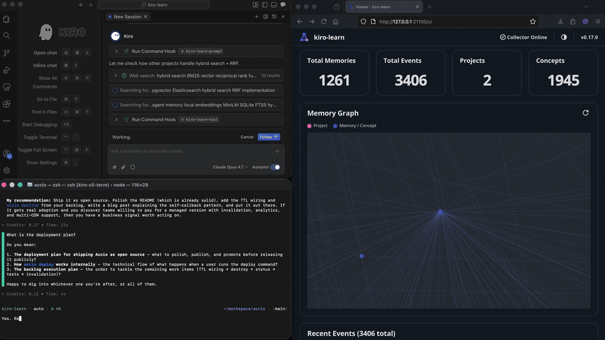

<p align="center">
  <a href="https://github.com/brendangeck/kiro-learn">
    <picture>
      <source media="(prefers-color-scheme: dark)" srcset="https://raw.githubusercontent.com/brendangeck/kiro-learn/main/docs/logo/dark.svg">
      <source media="(prefers-color-scheme: light)" srcset="https://raw.githubusercontent.com/brendangeck/kiro-learn/main/docs/logo/light.svg">
      
    </picture>
  </a>
</p>

# kiro-learn

> Continuous learning for [Kiro](https://kiro.dev) agents.

<p align="center">
  <a href="https://www.npmjs.com/package/kiro-learn"></a>
  <a href="./LICENSE"></a>
  <a href="https://nodejs.org/"></a>
  <a href="https://www.npmjs.com/package/kiro-learn"></a>
</p>

<p align="center">
  
</p>

## What is kiro-learn?

kiro-learn is a local-first agent memory system for [Kiro](https://kiro.dev) that passively captures session context, extracts structured knowledge via [AWS Bedrock](https://aws.amazon.com/bedrock/), and injects it into future sessions through [MCP](https://modelcontextprotocol.io/) tools — no manual bookkeeping required.

Every new agent session starts from zero. You explain the project layout again, point at the same files, and watch the agent rediscover the same gotchas it found yesterday. kiro-learn fixes this by passively capturing prompts, tool uses, and session summaries as they happen, extracting structured memory records in the background, and injecting relevant context into future sessions automatically.

No manual bookkeeping. No `CLAUDE.md` to maintain. Your agent picks up your preferences, coding style, and repo conventions over time — across sessions, across restarts, across days.

## Quick start

```bash
npm install -g kiro-learn
cd your-project
kiro-learn init
```

Then open a Kiro session and work normally. Memories accumulate in the background and surface in future sessions when relevant.

## Documentation

Full docs at **[kiro-learn.mintlify.app](https://kiro-learn.mintlify.app/)**.

**Getting started**
- [Introduction](https://kiro-learn.mintlify.app/getting-started/introduction) — what kiro-learn is and why it exists
- [Install and quickstart](https://kiro-learn.mintlify.app/getting-started/install) — install, initialize, and see your first memory

**Concepts**
- [Projects](https://kiro-learn.mintlify.app/concepts/projects) — how memory is isolated per repository
- [Event types](https://kiro-learn.mintlify.app/concepts/event-types) — the four event kinds and their body shapes
- [Event buffer](https://kiro-learn.mintlify.app/concepts/event-buffer) — how events are staged before extraction
- [Privacy](https://kiro-learn.mintlify.app/concepts/privacy) — what lives on your machine and what leaves

**Architecture**
- [Overview](https://kiro-learn.mintlify.app/architecture/overview) — system diagram and data flow
- [Kiro CLI shim](https://kiro-learn.mintlify.app/architecture/kiro-cli-shim) — CLI hook adapter
- [Kiro IDE shim](https://kiro-learn.mintlify.app/architecture/kiro-ide-shim) — IDE hook adapter
- [Collector](https://kiro-learn.mintlify.app/architecture/collector) — HTTP daemon, cleaning pipeline, buffer
- [Extraction](https://kiro-learn.mintlify.app/architecture/extraction) — ACP client, XML framing, circuit breaker
- [Compaction](https://kiro-learn.mintlify.app/architecture/compaction) — LLM summarization, deterministic eviction
- [Summarization](https://kiro-learn.mintlify.app/architecture/summarization) — turn summaries via hook and MCP paths
- [Retrieval](https://kiro-learn.mintlify.app/architecture/retrieval) — FTS5 search, latency budget, context assembly
- [Database](https://kiro-learn.mintlify.app/architecture/database) — SQLite schema, migrations, FTS5 config
- [Viewer](https://kiro-learn.mintlify.app/architecture/viewer) — the embedded memory dashboard

## Alternatives

| Tool | What it is |
|------|-----------|
| **[mem0](https://github.com/mem0ai/mem0)** | Hosted memory layer for generic LLM agents. Cloud-first, multi-tenant. |
| **[Graphiti](https://github.com/getzep/graphiti)** | Temporal knowledge graphs for agents. Requires Neo4j. |
| **[Letta](https://github.com/letta-ai/letta)** | Full stateful-agent runtime — replaces your framework, not just memory. |
| **[claude-mem](https://github.com/thedotmack/claude-mem)** | Same shape as kiro-learn (passive capture → extraction → retrieval) but Claude-specific. |

kiro-learn is **Kiro-native** (hooks into Kiro CLI and Kiro IDE directly), **passive** (no manual save steps, no docs to maintain), **local-by-default** (SQLite on your machine, nothing leaves without your credentials), and **project-scoped** (each repo gets isolated memory).

## FAQ

### Does kiro-learn send my code to the cloud?

Only during extraction, which uses your own AWS credentials to call [Amazon Bedrock](https://aws.amazon.com/bedrock/) via [kiro-cli](https://kiro.dev). Raw events and memory records stay on your machine in SQLite. You can run without extraction entirely by not configuring kiro-cli.

### Does it work with Claude or only Kiro?

kiro-learn is built for [Kiro](https://kiro.dev) (CLI and IDE). The extraction pipeline uses Amazon Bedrock via kiro-cli. It doesn't support Claude Code, Cursor, or other agents directly, though the MCP server could theoretically be pointed at by any MCP-compatible client.

### How is this different from CLAUDE.md or AGENTS.md?

CLAUDE.md and AGENTS.md are static files you maintain by hand. kiro-learn captures context passively during sessions and extracts structured memory records automatically. No manual upkeep — your agent learns from what it actually does.

### Is there a hosted version?

No. kiro-learn is local-first by design. Everything runs on your machine. A cloud sync path ([Aurora](https://aws.amazon.com/rds/aurora/)/pgvector or [Bedrock AgentCore Memory](https://docs.aws.amazon.com/bedrock-agentcore/latest/devguide/memory.html)) is on the roadmap but not available yet.

## License

[Apache-2.0](./LICENSE)
