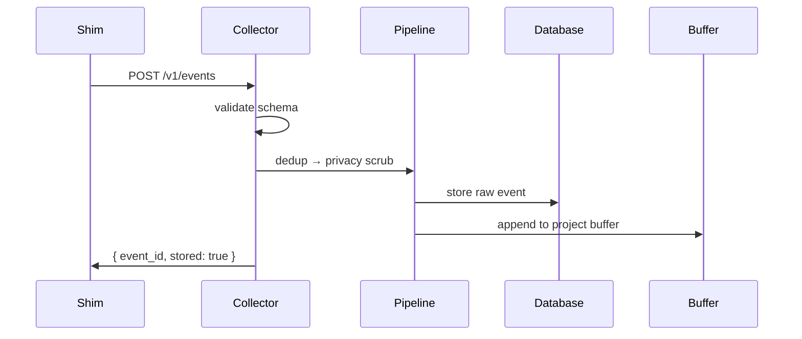
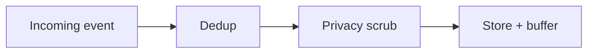
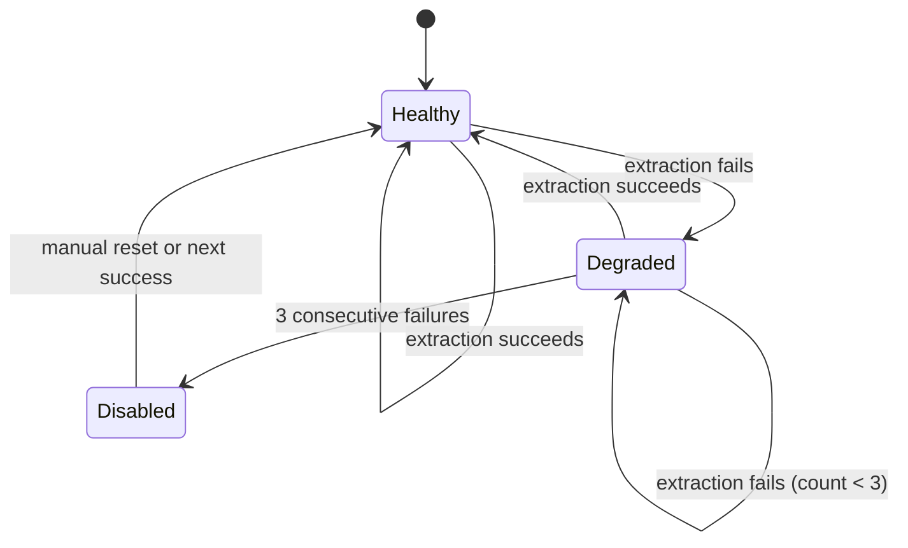

The collector is the central daemon in kiro-learn. It receives events from both shims via HTTP, runs them through a cleaning pipeline, stores the raw events in the database, and appends lightweight projections to per-project buffers for later extraction. It also serves the retrieval API and hosts the viewer UI.

The collector binds to `127.0.0.1:21100` — local only, no network exposure.

## HTTP API

The collector exposes a small set of endpoints. Shims interact with two of them during normal operation:

### Ingest: `POST /v1/events`

The primary endpoint. Both the CLI and IDE shims POST structured events here. The collector validates the event against the schema (Zod), runs it through the cleaning pipeline, and returns a response indicating whether the event was stored.

When the shim appends `?retrieve=true` (on prompt submit), the collector also performs a full-text search and returns matching memories as a formatted context string in the response body.

### Search: `GET /v1/memories/search`

The retrieval path used internally by the collector when `?retrieve=true` is set. Accepts `namespace`, `query`, and `limit` parameters. Performs FTS5 full-text search against stored memory records and returns matching results ranked by relevance.

### Read API

The collector also serves read endpoints for the viewer UI and external consumers:

| Endpoint | What it returns |
|----------|----------------|
| `GET /healthz` | Daemon status and version |
| `GET /v1/stats` | Aggregate counts (events, memories, projects, concepts) |
| `GET /v1/events` | Recent events (newest first, paginated) |
| `GET /v1/memories` | Memory records (newest first, paginated) |
| `POST /v1/memories` | Direct memory record ingest (used by MCP server) |

All responses are JSON. Request bodies are capped at 2 MiB — anything larger gets a 413 response.

## Cleaning pipeline

Every event passes through two stages before storage:

### Dedup

An in-memory LRU set (default capacity: 10,000 event IDs) rejects events the collector has already seen. If an event ID is already in the set, the pipeline halts immediately and returns `{ stored: false }`. This handles retries from shims without creating duplicate records.

The set uses insertion-order eviction — when full, the oldest entry is dropped to make room. If a downstream stage fails after dedup passes, the event ID is rolled back so a retry won't be falsely rejected.

### Privacy scrub

Strips `<private>...</private>` tags from event bodies and replaces them with `[REDACTED]`. This is the single point where privacy redaction happens — the shim doesn't scrub, the buffer doesn't scrub, and storage doesn't scrub. Centralizing it here means every downstream consumer (buffer, extraction, database) only ever sees clean data.

The scrub handles:

- **Nested tags** — outermost pair wins, inner tags are consumed.
- **Unclosed tags** — the span extends to the end of the string.
- **All body types** — text bodies scrub `content`, message bodies scrub each turn, JSON bodies recursively walk all string values.

The scrub produces a new event object — the original is never mutated.

## Buffer

After cleaning and storage, events are appended to a per-project buffer. The buffer decouples event ingestion from extraction latency — the shim gets a fast response while extraction happens asynchronously in the background.

### Per-project isolation

Each project gets its own buffer file at `~/.kiro-learn/buffers/<project_id>/buffer.ndjson`. Events are projected to lightweight `BufferEntry` structs before appending — fields like `schema_version`, `content_hash`, and the full `source` block are dropped to keep buffer files compact.

### Append-only NDJSON

Each entry is a single JSON line appended to the file. This format is crash-safe — a partial write from a crash only corrupts the last line, which is skipped on the next read. The buffer store uses `appendFileSync` for atomic line writes.

### Flock-based locking

When the compaction worker needs to atomically replace buffer contents, it acquires a POSIX exclusive file lock (`flock`). This prevents concurrent appends from interleaving with the replace operation. The lock is held only for the brief read-write-rename window.

### Hard size ceiling

Buffers have a hard ceiling (default: 4 MiB). When a buffer would exceed this limit, the append is skipped — the event is still stored in the database, but it won't be buffered for extraction. This prevents runaway disk usage if extraction falls behind.

## Buffer watcher

The buffer watcher monitors per-project buffer state and fires triggers when thresholds are crossed. It tracks accumulated bytes, manages idle timers, and drives the circuit breaker.

### Extraction triggers

Two conditions fire extraction:

| Trigger | Default threshold | What happens |
|---------|-------------------|--------------|
| **Size threshold** | 256 KiB accumulated | Extraction fires immediately |
| **Idle timer** | 5 seconds of inactivity | Extraction fires after the quiet period |

The idle timer resets on every append. This means a burst of events accumulates in the buffer until either the size threshold is crossed or the burst ends and the idle timer expires.

### Compaction trigger

When accumulated bytes exceed the compaction threshold (default: 1 MiB), the watcher fires a compaction trigger independently of extraction. The [compaction worker](/architecture/compaction) then summarizes existing memory records and replaces the buffer with compacted content.

### Circuit breaker

If extraction fails three consecutive times for a project, the circuit breaker trips and disables extraction for that buffer. This prevents a broken LLM connection from burning resources on repeated failures. The breaker resets on the next successful extraction.

When the circuit breaker is tripped, events continue to be stored in the database — only buffer-based extraction is paused.

## Viewer UI

The collector serves an embedded dashboard at `/ui/*`. It's a single-page app built with Cloudscape Design System that polls the read API every 10 seconds.

The dashboard shows:

- **Health indicator** — whether the daemon is running and responsive
- **Metric cards** — total memories, events, projects, and concepts
- **Event tail** — a live feed of recent events
- **Memory graph** — an interactive visualization of memory records, concepts, and projects

Access it at [http://localhost:21100/ui/](http://localhost:21100/ui/) when the daemon is running.

Static assets are served with path-traversal protection and content-hash-aware caching (immutable headers for hashed assets, no-cache otherwise). Extensionless paths fall back to `index.html` for SPA routing.

## Key design decisions

**No framework.** The receiver uses raw `node:http` — no Express, Fastify, or other framework. The API surface is small enough that a framework would add dependency weight without meaningful benefit.

**Pipeline stages are composable.** Each stage (dedup, privacy scrub) implements a `PipelineProcessor` interface with a single `process()` method. Stages can be tested independently with mock dependencies and composed in any order.

**Buffer is optional.** The pipeline supports both buffer mode (events go to per-project NDJSON files for batch extraction) and legacy mode (events are extracted individually). Buffer mode is the default in v1.

**Retrieval is inline.** When a shim requests context with `?retrieve=true`, the collector performs the search and returns results in the same HTTP response. This keeps the shim simple — one request, one response — and avoids a separate retrieval round-trip.

**Errors don't lose events.** If buffer append fails, the event is still in the database. If extraction fails, the event is still in the database. The buffer and extraction are best-effort layers on top of durable storage.

## Related pages

<CardGroup cols={2}>
  <Card title="Extraction" href="/architecture/extraction">
    How buffered events become memory records
  </Card>
  <Card title="Compaction" href="/architecture/compaction">
    What happens when buffers grow too large
  </Card>
  <Card title="Summarization" href="/architecture/summarization">
    How turn summaries are produced and stored
  </Card>
  <Card title="Retrieval" href="/architecture/retrieval">
    The inline search performed on prompt submit
  </Card>
  <Card title="Database" href="/architecture/database">
    Where events and memory records are persisted
  </Card>
  <Card title="Event buffer" href="/concepts/event-buffer">
    The per-project staging area between ingestion and extraction
  </Card>
</CardGroup>
