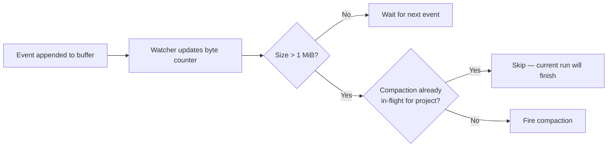
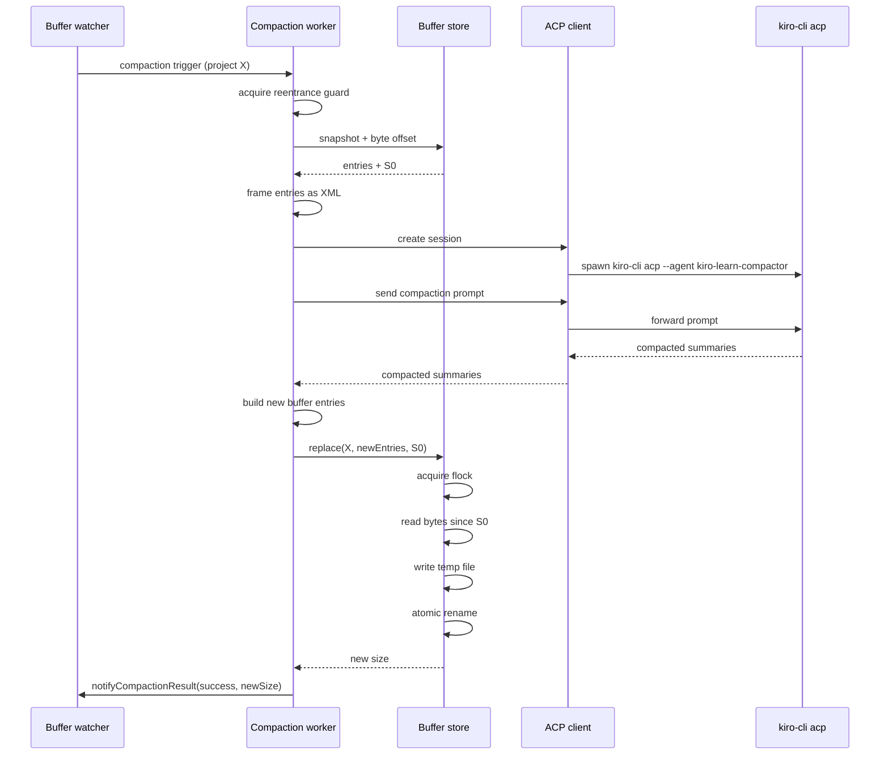
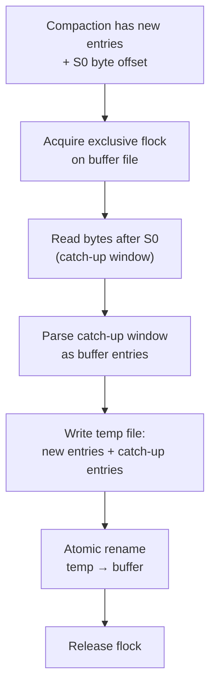
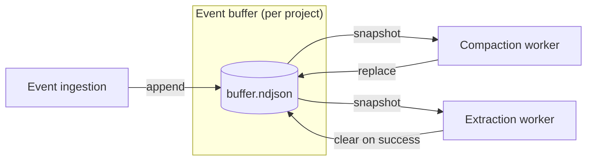
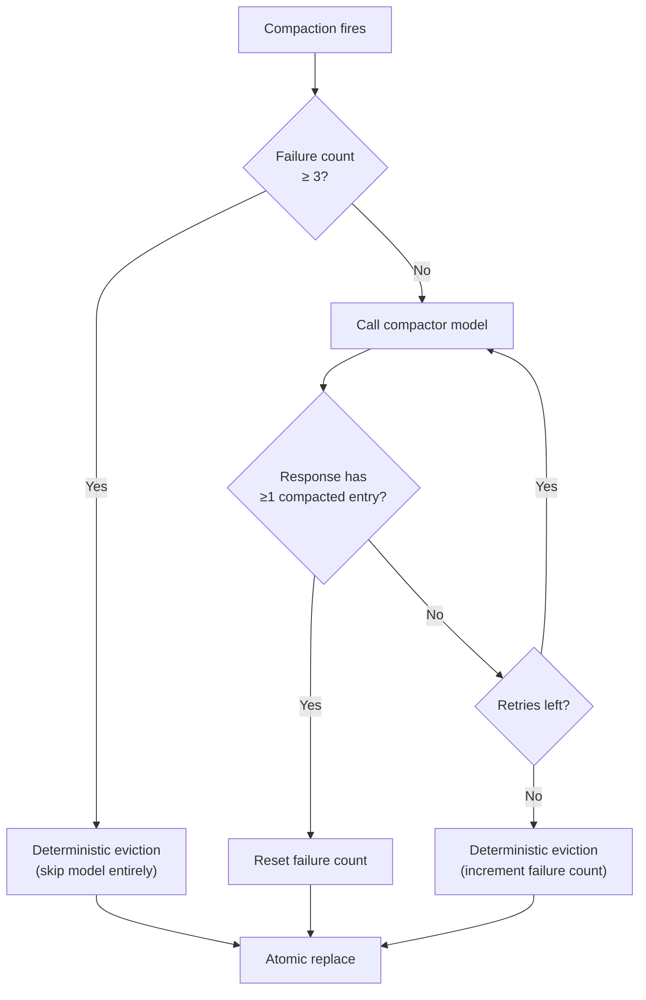

Compaction bounds the size of the [event buffer](/concepts/event-buffer) when events accumulate faster than [extraction](/architecture/extraction) removes them. It reads the buffer entries, summarizes them into fewer, denser entries via an LLM, and atomically replaces the buffer contents. The result is a smaller buffer that preserves the important signal from what came before.

Compaction is asynchronous and does not block event ingestion. It runs when the [buffer watcher](/architecture/collector#buffer-watcher) fires a compaction trigger.

## When it fires

The buffer watcher tracks accumulated bytes per project. When the buffer exceeds the **compaction size threshold** (default: 1 MiB), the watcher fires a compaction trigger.

Compaction triggers independently of extraction. A single append can cross the extraction threshold (256 KiB) and the compaction threshold (1 MiB) at the same moment. Both fire in parallel.

Three thresholds bound buffer size:

| Threshold | Default | Behavior |
|-----------|---------|----------|
| Extraction size | 256 KiB | Fires extraction. Buffer is cleared on success. |
| Compaction size | 1 MiB | Fires compaction. Buffer is summarized in-place and replaced. |
| Hard ceiling | 4 MiB | Appends are refused. Events are still persisted to the database. |

Under normal conditions compaction does not fire — extraction removes entries before the buffer reaches 1 MiB. Compaction runs only when extraction falls behind: a slow model, a disabled circuit breaker, or an ingestion burst that exceeds extraction throughput.

## How it works

### 1. Snapshot with byte offset

The worker reads the buffer entries and the current file size (S0) in a single atomic read. S0 marks the boundary between entries the worker will summarize and entries that may be appended during the model call. Capturing both values from the same read prevents appends from slipping between them.

### 2. LLM summarization

The worker serializes the buffer entries as XML — the same `<tool_observation>` format used by [extraction](/architecture/extraction#xml-framing) — and sends them to the `kiro-learn-compactor` agent via [ACP](/architecture/extraction#acp-client). The prompt instructs the model to:

- Summarize the entries into fewer, denser entries
- Preserve decisions, errors, patterns, and discoveries
- Merge related entries
- Drop redundant or low-value entries
- Emit each summary as a `<compacted_entry>` block

The worker parses every `<compacted_entry>` block from the response. Each becomes a new buffer entry with a synthetic ID (`compact_` + ULID) and `kind: session_summary`. Namespace and surface are inherited from the original entries. The timestamp is set to the latest timestamp across the batch so ordering is preserved.

### 3. Atomic replace with catch-up

Between snapshot time (S0) and now, new events may have been appended. The [buffer store's](/architecture/collector#buffer) `replace` operation handles this concurrency:

The exclusive file lock (POSIX `flock`) serializes the replace against concurrent appends. The lock is held only for the read-write-rename window. POSIX guarantees `rename` is atomic on the same filesystem, so a concurrent reader sees either the old file or the new file — never a partial state.

Events appended during compaction are preserved: they are read from the catch-up window during replace and appended to the new buffer file after the compacted entries.

## Feedback into the buffer

Compaction writes its output back to the same buffer file it read from. The result is not a separate artifact — it is a smaller buffer that [extraction](/architecture/extraction) will process on its next trigger.

After compaction, the buffer contains:

1. `session_summary` entries produced by the compactor model.
2. Catch-up entries — events appended during the compaction run, preserved intact.

Extraction processes both groups the same way it processes any other buffer content. Summary entries become memory records with condensed content; catch-up entries become memory records for events that arrived during the compaction window.

## Relationship to extraction

Extraction and compaction address different problems:

| Property | Extraction | Compaction |
|----------|------------|------------|
| Fires when | 256 KiB accumulated or 30s idle | 1 MiB accumulated |
| Input | Raw buffered events | Buffer entries (possibly including prior summaries) |
| Output | Memory records in the database | Summary entries back in the buffer |
| Clears buffer | Yes, on success | No — replaces in-place |
| Purpose | Normal memory formation | Bound buffer size when extraction is behind |

The two workers operate independently. Each project has its own byte counter and a separate reentrance guard for each operation. Extraction and compaction can run concurrently for the same project — the atomic replace with catch-up handles the overlap.

## Reliability

### Reentrance guard

Only one compaction runs at a time across all projects. A compaction trigger that fires while another is in-flight is rejected immediately. This bounds resource usage — each compaction spawns an LLM child process and holds a file lock.

The guard is released in a `finally` block. A crashed or failed compaction does not leave the worker blocked.

### Retries and deterministic fallback

LLM responses are not reliable. The worker has three layers of defense:

**Retry.** If the model returns no `<compacted_entry>` blocks, the worker creates a fresh ACP session and tries again, up to 2 attempts by default.

**Deterministic eviction.** If all retries fail, the worker sorts entries by timestamp descending and keeps the most recent half (rounded up). No model call is involved. Entries are kept by reference — nothing is fabricated.

**Circuit breaker.** Consecutive model failures are tracked per project. After 3 consecutive failures, the worker skips the model call and uses deterministic eviction directly. A single success resets the counter.

Deterministic eviction produces a worse result than LLM summarization — the older half of the buffer is dropped without condensation — but it is bounded, free, and always succeeds. The buffer size always decreases.

### Timeouts

Every model call has a 2-minute timeout by default. If the compactor does not complete within that window, the child process is killed and the call is recorded as a failure. Timeout failures feed into the retry and circuit breaker logic.

### Model selection

The compactor agent pins `model: "claude-haiku-4.5"`. Summarizing buffer entries is a bounded XML-in / XML-out job with zero tools — letting `kiro-cli`'s `"auto"` default pick a pricier model would make background compaction needlessly expensive.

### Disabled by default

Compaction is off by default and must be enabled via configuration. The compactor model is expensive to run, and not every deployment needs LLM-driven summarization. When disabled, the watcher still tracks buffer size and the hard ceiling still prevents unbounded growth; the compaction trigger is ignored.

## What gets preserved

Compaction is lossy at the individual-event level but retains the important signal. The prompt instructs the model to preserve:

- **Decisions** — architectural choices, tradeoffs, selected approaches
- **Errors** — failures, misconfigurations, incorrect paths
- **Patterns** — repeated behaviors, recurring themes
- **Discoveries** — new facts learned about the codebase

And to drop:

- **Redundant entries** — near-identical tool calls
- **Low-value entries** — routine reads that did not change understanding

Because compacted entries feed back into [extraction](/architecture/extraction), signal that survives compaction also survives into the memory records in the [database](/architecture/database).

## Key design decisions

**In-place replacement.** Compacted output is written back to the same buffer file. Extraction has no knowledge of compaction — it reads a smaller buffer on the next trigger. The two workers remain decoupled.

**Catch-up window instead of a global lock.** Holding a lock across the entire model call would block ingestion for up to 2 minutes. Instead, the byte offset S0 is captured at snapshot time, appends continue during the model call, and the replace operation reads the catch-up window under a short-duration lock. Ingestion is never blocked by compaction.

**Deterministic fallback.** When the model fails, dropping the oldest half of the buffer is a worse outcome than a good summary, but it is better than leaving the buffer oversized. Compaction must make progress because the alternative is the hard ceiling, which refuses new events.

**Shared infrastructure with extraction.** Compaction uses the same [ACP client](/architecture/extraction#acp-client), [XML framing](/architecture/extraction#xml-framing), and child-process lifecycle as extraction. Only the agent name (`kiro-learn-compactor` vs `kiro-learn-compressor`) and the prompt differ.

**No event loss on failure.** If compaction fails — reentrance rejection, model timeout, replace error — the buffer is left untouched. Events remain in the buffer and in the database. The next trigger retries.

## Related pages

<CardGroup cols={2}>
  <Card title="Summarization" href="/architecture/summarization">
    How turn summaries are produced and stored
  </Card>
  <Card title="Extraction" href="/architecture/extraction">
    The normal consumer of buffer entries
  </Card>
  <Card title="Retrieval" href="/architecture/retrieval">
    How surviving memory records are searched
  </Card>
  <Card title="Database" href="/architecture/database">
    Where memory records persist after extraction
  </Card>
  <Card title="Collector" href="/architecture/collector">
    The daemon hosting the buffer watcher and compaction trigger
  </Card>
  <Card title="Event buffer" href="/concepts/event-buffer">
    The per-project staging area compaction operates on
  </Card>
</CardGroup>
