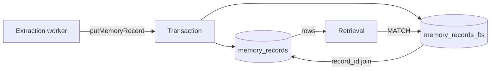
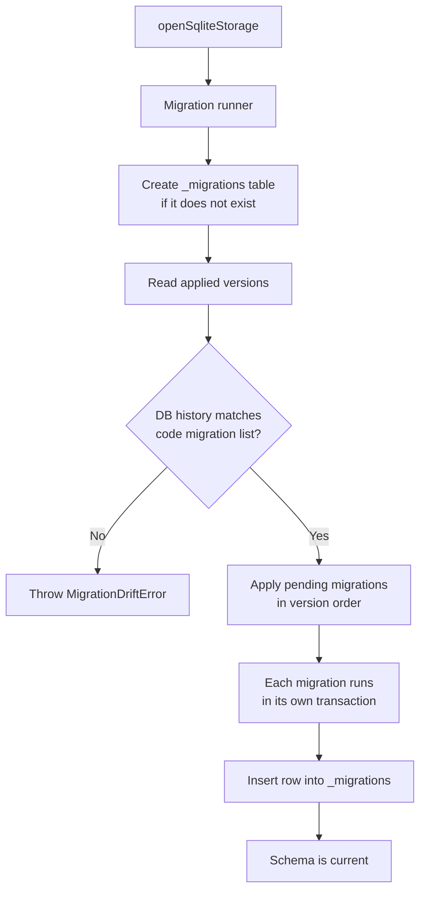

The database is the persistence layer for kiro-learn. Every event the [Collector](/architecture/collector) ingests and every memory record [Extraction](/architecture/extraction) produces ends up here. It is a single [SQLite](https://www.sqlite.org/) file on disk, accessed through a small, well-defined interface. Nothing ever leaves your machine from this layer.

The database file lives at:

```text
~/.kiro-learn/kiro-learn.db
```

No server, no sidecar process, no network port. SQLite runs in-process inside the collector daemon and writes to a single file (plus its WAL and SHM siblings).

## What it stores

Two things, in two tables:

| Table | What it stores | Written by |
|-------|----------------|------------|
| `events` | Raw events exactly as the shims posted them (after cleaning) | Ingestion pipeline |
| `memory_records` | Structured memories extracted from batches of events | Extraction worker |

Plus two internal tables that support them:

| Table | What it stores |
|-------|----------------|
| `memory_records_fts` | Full-text search index over memory record titles, summaries, and facts |
| `_migrations` | One row per applied schema migration — the bookkeeping the runner uses to detect drift |

### The `events` table

Every incoming event lands here as one row. The schema mirrors the wire format — event ID, session ID, actor ID, namespace, kind, body, timestamps — with the body and source block stored as JSON blobs. The primary key is `event_id` (a ULID), so duplicate POSTs from a retrying shim are a no-op instead of an error.

The table is indexed for the two common access patterns: listing events for a project in reverse chronological order, and looking up an event by its session or parent.

Two timestamp columns track different notions of "when":

- **`valid_time`** — when the event actually happened (set by the shim).
- **`transaction_time`** — when the database recorded it (stamped on insert).

These almost always agree, but the split exists so future versions can support [bi-temporal](https://martinfowler.com/articles/bitemporal-history.html) queries — "what did memory look like as of last Tuesday?" — without a schema change.

### The `memory_records` table

Each row is one memory record: a title, a summary, a list of facts, a list of concepts, a list of files touched, an observation type, and the IDs of the source events that produced it. The `source_event_ids` field links every memory back to the raw events it came from, so you can always trace a memory to its provenance.

The primary key is `record_id` (`mr_` + ULID). Unlike events, memory records are never supposed to collide — a duplicate record ID is an upstream bug, so the database rejects the insert loudly instead of silently ignoring it.

### `STRICT` tables

Both user-facing tables are declared `STRICT`. This is SQLite's opt-in type-safety mode. In a non-strict table, inserting a string into an `INTEGER` column silently succeeds and stores the string. In a strict table, the same insert fails loudly.

For a persistence layer that serializes wire data validated by Zod on the way in, silent type coercion is a liability, not a feature. `STRICT` closes that gap — if a code change accidentally passes a number where a string is expected, the database catches it at insert time instead of letting a malformed row drift into storage.

## Full-text search

Memory records need to be searchable by content. [Retrieval](/architecture/retrieval) pulls relevant memories into the agent's prompt, and the match quality directly shapes how useful the feature is.

kiro-learn uses SQLite's built-in [FTS5](https://www.sqlite.org/fts5.html) full-text search extension. When a memory record is inserted into `memory_records`, a companion row is also inserted into the `memory_records_fts` virtual table. Both inserts happen inside a single transaction — either both rows land or neither does.



The FTS row indexes three fields:

- `title`
- `summary`
- `facts_text` — the record's facts joined into a single searchable blob

The `record_id` and `namespace` are carried as `UNINDEXED` columns so the search path can join back to the primary table and filter results by project without a separate lookup.

### Tokenizer

The FTS5 index uses a three-stage tokenizer: `porter unicode61 remove_diacritics 2`. Each stage does one thing:

| Stage | What it does |
|-------|--------------|
| `porter` | Stems tokens to their root form — "migrating", "migrates", "migration" all collapse to "migrat" |
| `unicode61` | Unicode-aware word segmentation and case folding |
| `remove_diacritics 2` | Strips diacritical marks so "café" matches "cafe" |

The combination means a search for "migrations" hits memories that mention "migrate", "migrating", or "migration" — behavior closer to what a developer types into a code search box than strict substring match.

### Availability over ranking

[Retrieval](/architecture/retrieval#fallback-path-substring-search) builds a sanitized FTS5 query by tokenizing the prompt and emitting an `OR` of quoted phrases. If FTS5 rejects the query anyway — its grammar has corners that are hard to fully account for — the storage layer catches the error and falls back to a `LIKE '%query%'` search against the original string. The LIKE path is slower and unranked (results come back by creation date), but it always works. The explicit tradeoff is **availability over ranking quality**: a worse-ordered result set is better than an error.

## Migrations

The schema evolves over time. New features need new columns, new indexes, or new constraints. Rather than handwriting upgrade scripts, kiro-learn uses a small migration runner that applies code-embedded DDL in order and tracks what has been applied.



Rules the runner enforces:

1. **Append-only.** New migrations are added at the end with the next integer version. Released migrations are never reordered, renamed, or edited in place.
2. **Transactional.** Each migration runs inside a `BEGIN`/`COMMIT`. If the DDL throws, the transaction rolls back and `_migrations` is left untouched — the next run tries again from the same point.
3. **Idempotent.** Running the runner twice with the same list is a no-op. After every migration is applied, subsequent opens of the database do no DDL work.
4. **Drift-fatal.** If `_migrations` records a version whose name disagrees with the code, the runner throws `MigrationDriftError` and refuses to proceed. This catches the case where migrations were renamed or reordered after being applied.
5. **Forward-only.** There are no down-migrations. A broken migration is rolled back at the transaction level by SQLite itself; the developer fixes the DDL and re-runs.

### The migration history

The schema has evolved through four migrations so far:

| Version | Name | What it does |
|---------|------|--------------|
| 0001 | `init` | Creates `events`, `memory_records`, `memory_records_fts`, and `_migrations`, plus the initial indexes |
| 0002 | `xml_extraction_fields` | Adds `concepts_json`, `files_touched_json`, and `observation_type` columns to `memory_records` for the XML extraction pipeline |
| 0003 | `project_path` | Adds a nullable `project_path` column to `events` plus a compound index on `(namespace, project_path)` for project listing |
| 0004 | `session_summary_type` | Widens the `observation_type` CHECK constraint to include `'session_summary'` (needed because SQLite has no `ALTER CONSTRAINT`, so the table is rebuilt) |

New migrations appear at the end of the list. The four existing ones are frozen.

## Privacy

Everything in the database is local. There is no remote replica, no cloud sync, no background upload. The only path out of your machine is [extraction](/architecture/extraction), where batches of events are sent to [Amazon Bedrock](https://docs.aws.amazon.com/bedrock/latest/userguide/what-is-bedrock.html) via `kiro-cli` for LLM processing — and even that traffic goes out of your AWS account, using your credentials.

### `<private>` is stripped before it reaches the database

Users can wrap sensitive content in `<private>...</private>` tags, and those spans are replaced with `[REDACTED]` before storage. **The redaction happens in the collector's cleaning pipeline, not in the database.** By the time an event arrives at `putEvent`, the private spans are already gone.

This is a deliberate layering choice. Storage is a sink: if scrubbing lived here, a caller that forgot to scrub would still land scrubbed data in the database but would never see the private spans again and could build mistaken upstream assumptions ("storage protects us"). Centralizing the scrub in the pipeline puts the guarantee in one place and makes it visible. A guard test enforces that the storage layer never references `<private>` at all.

### File-system permissions

The installer creates `~/.kiro-learn/` with mode `0700` — owner-read/write/execute only. Other users on a shared machine cannot read your memory database. The storage layer does not widen these permissions; it inherits whatever the parent directory grants.

## The storage interface

Callers do not import from the SQLite module directly. The collector's pipeline code, retrieval code, and read API all see a single pluggable interface:

```ts
interface StorageBackend {
  putEvent(event: KiroMemEvent): Promise<void>;
  getEventById(eventId: string): Promise<KiroMemEvent | null>;
  putMemoryRecord(record: MemoryRecord): Promise<void>;
  searchMemoryRecords(params: SearchParams): Promise<MemoryRecord[]>;
  close(): Promise<void>;

  // Read API for the viewer UI
  getStats(namespace?: string): Promise<StatsResult>;
  listProjects(): Promise<ProjectInfo[]>;
  listMemoryRecords(params: { namespace?; limit; offset }): Promise<{ items; total }>;
  listEvents(params: { namespace?; limit }): Promise<{ items; total }>;
}
```

The SQLite implementation is one backend behind that interface. Only the collector's bootstrap code knows it exists — everything else (pipeline stages, retrieval assembler, read API handlers) receives a `StorageBackend` as a dependency and never asks which backend it is. A guard test enforces this: any file outside `src/collector/storage/sqlite/` that tries to import from that directory fails CI.

The point of this split is future-proofing without disruption. Later versions will ship alternative backends (Postgres with `pgvector`, [Bedrock AgentCore Memory](https://docs.aws.amazon.com/bedrock-agentcore/latest/devguide/memory.html)) and swapping them in becomes a matter of choosing a different opener at startup. The pipeline, retrieval, and UI code changes not at all.

### Method contracts

The interface is small because the contracts are strict. A few worth calling out:

- **`putEvent` is idempotent.** The insert uses `INSERT OR IGNORE` on the event ID primary key, so a retry from a confused shim is a silent no-op. The original `transaction_time` is preserved on collision — a second insert does not overwrite it.
- **`putMemoryRecord` rejects collisions.** Memory record IDs are generated fresh on every extraction. A collision is an upstream bug, so the database surfaces it as an error instead of silently dropping the write.
- **`getEventById` returns `null` for misses.** Not an exception. The caller decides whether a missing event is a problem.
- **`searchMemoryRecords` is availability-biased.** When FTS5 rejects a query, it falls back to LIKE instead of failing. The cost is worse ranking on the fallback path; the benefit is that retrieval never errors out on a weird prompt.
- **`close` is idempotent.** A second close is a silent no-op, not an error.

Every method is `async` even though [`better-sqlite3`](https://github.com/WiseLibs/better-sqlite3) is synchronous. The async surface keeps the interface compatible with future backends that genuinely are async (remote databases, HTTP APIs) without forcing callers to change shape.

### Prepared statements, parameterized queries

Every SQL statement is prepared once when the backend opens and reused for the life of the handle. Every user-controlled value — event body, FTS5 query string, namespace prefix — is bound positionally with `?` placeholders. SQL and data are never concatenated.

This is the primary defense against SQL injection. It also happens to be faster: preparing a statement once and binding values on every call avoids re-parsing and re-planning the query on each insert or search.

## Key design decisions

**SQLite first.** SQLite is the simplest thing that covers the v1 requirements: durable local storage, full-text search, multi-process safety (WAL mode), and zero operational overhead. No server to run, no credentials to manage, no port to expose. The trade-off is that it does not scale to multiple machines — which is fine, because kiro-learn is explicitly a local tool until a future version decides otherwise.

**One file.** Everything lives in `~/.kiro-learn/kiro-learn.db`. Backing up your memory is `cp`. Starting fresh is `rm`. There is no migration tool, no schema dump format, no cross-file consistency to worry about.

**`STRICT` tables everywhere.** SQLite's default laxity about types is convenient for scripting and hostile for a persistence layer. Opting in to `STRICT` catches type errors at the boundary instead of letting them propagate.

**FTS5 over building lexical search by hand.** FTS5 is production-tested, maintained by the SQLite project, and handles tokenization, stemming, and ranking in one extension. Rebuilding any of that would be wasted effort. A later version that wants semantic search can layer vector similarity alongside FTS5 scores — [Bedrock Knowledge Bases](https://docs.aws.amazon.com/bedrock/latest/userguide/knowledge-base.html) uses the same hybrid shape, so the algorithm will be portable.

**Migrations are code, not files.** Each migration's DDL is a string constant inside a TypeScript module, compiled into the package. There is nothing to read from disk at runtime and nothing extra to ship. The compiled `dist/` directory is self-contained.

**Interface-first.** The `StorageBackend` interface is the contract every backend satisfies. Writing the SQLite backend against the interface (rather than exposing it directly) forces the contract to stay small and backend-agnostic. Every capability that is hard to express in the interface is a capability a future backend would struggle to provide.

**Privacy is a pipeline property, not a storage property.** Storage stores what it is given. The pipeline is responsible for redaction. Putting the scrub in the right layer keeps the guarantee auditable and prevents a "defense in depth" that silently swallows bugs.

## Code pointers

- `src/collector/storage/index.ts` — the `StorageBackend` interface and method contracts
- `src/collector/storage/sqlite/index.ts` — the SQLite backend implementation
- `src/collector/storage/sqlite/statements.ts` — every prepared SQL statement in one file
- `src/collector/storage/sqlite/fts5.ts` — FTS5 query sanitization and LIKE escaping
- `src/collector/storage/sqlite/migrations/runner.ts` — migration runner with drift detection
- `src/collector/storage/sqlite/migrations/0001_init.ts` — initial schema
- `src/collector/storage/sqlite/migrations/0002_xml_extraction_fields.ts` — extraction fields
- `src/collector/storage/sqlite/migrations/0003_project_path.ts` — project path column
- `src/collector/storage/sqlite/migrations/0004_session_summary_type.ts` — widened observation type constraint

## Related pages

<CardGroup cols={2}>
  <Card title="Viewer" href="/architecture/viewer">
    The dashboard that reads from the database via the read API
  </Card>
  <Card title="Retrieval" href="/architecture/retrieval">
    How memory records are searched via FTS5
  </Card>
  <Card title="Extraction" href="/architecture/extraction">
    How memory records are produced and inserted
  </Card>
  <Card title="Compaction" href="/architecture/compaction">
    What happens when buffers grow faster than extraction drains them
  </Card>
  <Card title="Collector" href="/architecture/collector">
    The daemon that writes events to the database
  </Card>
</CardGroup>
