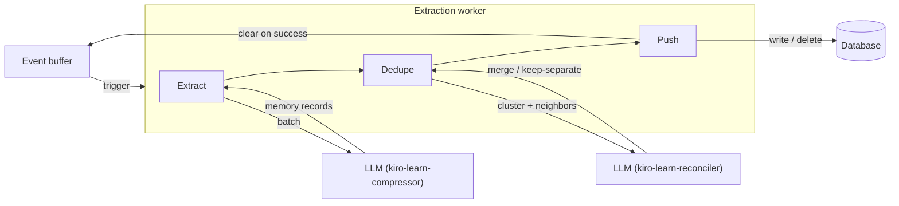

The extraction worker is a background [worker](/architecture/overview#workers) that drains the [event buffer](/concepts/event-buffer) into `memory_records`. It fires when the [buffer watcher](/architecture/collector#buffer-watcher) crosses a size or idle threshold, reads a buffer snapshot, and runs it through three phases:

1. **Extract.** Frame the batch for the `kiro-learn-compressor` LLM, parse its response into in-memory candidate memories, and compute an embedding for each.
2. **Dedupe.** Cluster candidates that describe the same thing, look up semantically-similar existing records in the namespace, and ask the `kiro-learn-reconciler` judge model whether the cluster plus its neighbors should merge.
3. **Push.** Commit each cluster in one transaction — either a single merged summary record (deleting the merged originals in the same transaction) or the candidate members as-is.

The worker is asynchronous. Event ingestion never waits for it. A shim's POST returns as soon as the event is stored and buffered; extraction happens later in the background.

## How it fits into the daemon

The worker holds one slot per project from a shared semaphore (default concurrency 2) for the full duration of a run. Extract, dedupe, and push all execute inside that slot. The buffer is cleared only after push completes successfully.

## Extract

The first phase turns raw buffered events into structured candidate memories.

Every buffered entry — whatever its [kind and body shape](/concepts/event-types) — is normalised into a structured prompt fragment and sent to the `kiro-learn-compressor` LLM as a batch. The compressor is a purpose-built agent (no tools, no user interaction) that reads the batch and returns zero or more memory-record fragments describing what happened. Each fragment carries a title, a summary, an observation type, and optional facts, concepts, and files touched.

Every fragment becomes a `CandidateMemory` — a `MemoryRecord`-shaped value that lives in memory until the push phase writes it. Candidates carry every field a final record has (`record_id`, `namespace`, `strategy`, `source_event_ids`, `title`, `summary`, `facts`, `concepts`, `files_touched`, `observation_type`) plus a transient `embedding` computed by the local ONNX embedder. The `record_id` is allocated at extract time (`mr_` + ULID) so the dedupe phase can refer to cluster members by id; `created_at` is not on the candidate — it is stamped at push time.

The LLM call runs through `kiro-cli`, which routes to [Amazon Bedrock](https://docs.aws.amazon.com/bedrock/latest/userguide/what-is-bedrock.html) for inference. Sessions are single-use: one prompt per session, destroyed in a `finally` block. No state leaks between extractions. When the compressor decides the batch contains nothing worth remembering it returns an empty response, which the worker treats as a successful zero-candidate run.

When the embedder is absent, not ready, or throws for a specific record, the candidate is emitted with `embedding: null`. The dedupe phase treats null-embedding candidates as singletons and commits them on the no-judge path. The [backfill worker](/architecture/collector#backfill-worker) fills in the embedding asynchronously by scanning for `embedding IS NULL` rows.

**The extract phase never writes.** It returns `CandidateMemory[]` and exits — no `putMemoryRecord`, no `putEmbedding`, no side effects on storage. This is pinned by a property test. It is what lets the buffer-clear discipline work: a crash between extract and push leaves the buffer intact, and the events are safely available for retry.

## Dedupe

The dedupe phase answers two questions: does this batch contain candidates that describe the same thing as each other, and does the batch contain candidates that describe the same thing as existing records in the graph? It runs intra-batch clustering first, then a per-cluster neighbor lookup, then a judge invocation when neighbors exist.

### Intra-batch clustering

The compressor often emits two candidates in one batch that describe the same fact with different phrasing. The clusterer catches those cases before the judge is involved.

The algorithm is a pure union-find over the candidate indices:

1. For every pair of candidates whose embeddings are both non-null, compute cosine similarity.
2. If the similarity meets or exceeds the intra-batch threshold (0.85 by default), union them.
3. Null-embedding candidates are never unioned — they land in their own singleton cluster.
4. Each cluster's **centroid** is the L2-normalised mean of the member embeddings when every member has a non-null embedding; otherwise the centroid is `null`.

The output partitions the input: every candidate belongs to exactly one cluster, and the cluster list is deterministic across runs. Clustering is pure — no I/O, no storage access — so it can be unit-tested directly over arbitrary `Float32Array` inputs.

### Neighbor lookup

For each cluster with a non-null centroid, the worker asks the [query layer](/architecture/retrieval#hybrid-search) for existing `memory_records` whose embedding is cosine-close to the centroid. The lookup is namespace-scoped, filtered by the neighbor-similarity threshold (0.80 by default), capped at 10 neighbors per cluster, and sorted descending by similarity.

The neighbor pool comes from the same per-namespace vector cache that [hybrid search](/architecture/retrieval#writes-keep-the-cache-in-sync) reads from. Rows deleted during a merge are gone from `memory_records`, so the cache's `listEmbeddings` feed naturally excludes them on the next rebuild.

When the centroid is null or the neighbor pool is empty, the cluster skips the judge entirely and commits on the keep-separate path.

### Judge invocation

When a cluster has at least one neighbor, the worker asks the **judge model** whether the cluster and some subset of its neighbors describe the same underlying thing. The judge is the `kiro-learn-reconciler` agent, installed alongside the compressor and compactor. The judge sees the cluster members, the neighbor pool with similarity scores, and returns either a merge decision (listing the record ids to fuse, plus a new title, summary, facts, concepts, files, and observation type) or a keep-separate decision.

Every judge call creates a fresh ACP session, sends one prompt, and destroys the session in a `finally` block — the same single-use pattern the compressor uses. No state leaks between judge invocations.

Each judge call is bounded by a 30-second timeout. Timeouts are terminal — retrying would double the already-burned budget. Non-XML or unparseable responses retry once with a fresh session, for a maximum of two attempts per cluster. On final failure the worker falls back to keep-separate for that cluster and records a failure on the [circuit breaker](#circuit-breaker-and-direct-commit-fallback).

## Push

Every cluster commits inside a single `StorageBackend` transaction. What the transaction writes depends on the dedupe outcome:

- **Merge.** One `putMemoryRecord(summary)` + one `deleteMemoryRecord(mergedIds)` + one `putEmbedding(summary.record_id, summaryEmbedding)` in one atomic transaction. The summary's embedding is computed before the transaction opens so the transaction body stays synchronous. The `deleteMemoryRecord` call cascades to both the embedding column and the FTS5 entry — see the [database docs](/architecture/database#merge-deletion-is-destructive) for the exact cascade semantics.
- **Keep-separate** (judge ruled keep-separate, or no neighbors, or null centroid). One `putMemoryRecord(member)` + one `putEmbedding(member.record_id, member.embedding)` per cluster member, all in one transaction. No deletes.

After the transaction commits, the worker calls `query.invalidateNamespace(namespace)` so the next search sees the new summary and no longer sees any deleted rows.

Summary records are stamped with:

- `strategy: 'llm-reconciled'` (distinct from the standard-commit `'llm-summary'`)
- A fresh `record_id` (`mr_` + ULID)
- `source_event_ids` = the first-seen-order deduplicated union of every merged entity's `source_event_ids` (cluster members + merged neighbors)
- `observation_type` = the judge's value, or the highest-similarity merged member's value when the judge omits it
- `created_at` = wall clock at commit time

**Per-cluster failure isolation.** A failure inside one cluster's transaction (storage error, embed failure, judge parse failure that exhausted the retry budget) is caught and logged with the cluster's member `record_id`s. The outer loop continues with the next cluster. A run where every cluster failed is reported to the buffer watcher as unsuccessful, so the buffer is retained and a retry happens on the next trigger.

<Warning>
  Merge commits are destructive. A merge decision deletes the merged rows outright — there is no soft delete, no tombstone, no history. The similarity thresholds are tuned conservatively by default so a lenient judge cannot silently collapse rows that should have stayed separate.
</Warning>

## Reliability

### Extract-level retries

The compressor is an LLM — sometimes it responds conversationally instead of producing a well-formed memory-record fragment. The worker detects this and retries the extract phase up to three attempts. Each retry creates a fresh ACP session (new child process) so state from a confused model does not leak across attempts. After three consecutive garbage responses, extract fails for that batch and the buffer is retained.

### Concurrency limits

The worker uses a semaphore to limit concurrent runs across all projects. The default limit is two concurrent sessions. Additional triggers queue in FIFO order until a slot becomes available.

This prevents resource exhaustion — each ACP session spawns a child process and holds a Bedrock connection. Unbounded concurrency would overwhelm both the local machine and the upstream service.

### Timeouts

Every compressor call has a 60-second timeout. Every judge call has a 30-second timeout. If either model does not complete within its window, the child process is killed and the call is recorded as a failure.

The timeout is raced against both the prompt completion and a "child failed" sentinel — if the `kiro-cli acp` process crashes mid-turn, the error surfaces immediately instead of waiting for the timeout to expire.

### Circuit breaker and direct-commit fallback

A buggy judge model should degrade gracefully, not stall extraction. The worker runs a **per-project reconciliation circuit breaker** that flips to a safe fallback path after three consecutive judge failures on the same project.

The breaker carries an independent state pair per project id: starts closed, opens on the third consecutive judge failure (timeout or non-XML after the retry budget), and re-closes after a run completes with zero judge failures — including the direct-commit case where the judge was never invoked.

The **direct-commit fallback** is the escape valve. When reconciliation is disabled or the circuit breaker is open at the start of a run, the worker skips the dedupe phase entirely: every candidate goes straight to `putMemoryRecord` + `putEmbedding` + `invalidateNamespace`. A property test pins the invariant that this path produces a deterministic write sequence for any given buffer snapshot and ULID seed.

Because the direct-commit path bypasses the judge entirely, it counts as "no judge failure" and closes a tripped breaker on its own. A project whose judge is sick uses direct-commit for exactly one run, then re-attempts the full pipeline on the next trigger.

The reconciliation circuit breaker is separate from the [buffer watcher's extraction circuit breaker](/architecture/collector#circuit-breaker), which governs extract-level failures and disables the worker entirely for a project after three consecutive failures. A broken judge does not disable event ingestion.

### Buffer-clear discipline

The worker's buffer-clear rules:

| Outcome | Buffer | Circuit breaker |
|---|---|---|
| Extract throws (ACP spawn, compressor timeout, garbage after retries) | Retained | Not touched — reconciliation-scoped only |
| Zero candidates produced (skip signal or empty output) | Cleared | Reset (trivial no-failure run) |
| At least one cluster commits | Cleared | Recorded per judge outcome; run-end reset if no judge failures |
| Every cluster fails to commit | Retained | Recorded per judge outcome |
| Direct-commit fallback (flag off or breaker open) | Cleared | Reset (no judge invoked) |

A cluster "commits" when it writes either a summary record (merge path) or at least one keep-separate member. Null-centroid clusters and empty-neighbor-pool clusters both commit on the keep-separate path — no judge, no delete, just the member writes.

## Key design decisions

**Extract never writes.** Making the extract phase a pure producer of in-memory values — never calling `putMemoryRecord` or `putEmbedding` — is what lets the buffer-clear discipline work. A crash between extract and push leaves the buffer intact; there is no half-written state to clean up.

**Dedupe runs at ingestion time, not at write time.** The compressor only sees the current batch, so it cannot know that a fact it is writing now was already captured by a different batch last week. Running a second pass at ingestion time, with the full graph available, catches the duplicates the compressor cannot.

**Merges are destructive.** There is no soft delete, no `deleted_at` column, no tombstone row. Merged originals are gone at push time — from `memory_records`, from the embedding column, and from `memory_records_fts`, all in one transaction. The [retrieval](/architecture/retrieval) layer does not need to filter merged rows; they are simply not there. The tradeoff is that tuning thresholds aggressively can silently collapse rows that should have been distinct, so the defaults lean conservative.

**Batch over per-event.** Events are extracted in batches rather than individually. This gives the LLM more context to identify patterns across related events and produces higher-quality memory records. It also reduces the number of Bedrock invocations.

**Single-use sessions.** Each compressor and judge call creates and destroys its own ACP session. Cleanup is deterministic — if something goes wrong, kill the process and start fresh.

**Async after ingest.** The worker runs after the collector has already responded to the shim. A slow or failed run never delays event ingestion. The worst case is a missing memory record — the raw event is always safe in the database.

**Per-cluster failure isolation.** A storage error or a malformed judge response on one cluster must not prevent sibling clusters from committing. The worker wraps each cluster's work in a try/catch and continues past any per-cluster failure.

**No direct Bedrock dependency.** The worker talks to `kiro-cli acp`, not to [Amazon Bedrock](https://docs.aws.amazon.com/bedrock/latest/userguide/what-is-bedrock.html) directly. This keeps credentials, authentication, and API versioning as `kiro-cli`'s responsibility. kiro-learn does not need AWS SDK dependencies.

**Model selection is pinned, not inherited.** The compressor and reconciler agents both set `model: "claude-haiku-4.5"` explicitly. These agents are pure XML-in / XML-out transformers with zero tools — cost and latency dominate quality concerns at this workload, so letting `kiro-cli`'s `"auto"` default pick a pricier model would be a silent regression on every extraction and every judge call.

## Related pages

<CardGroup cols={2}>
  <Card title="Event types" href="/concepts/event-types">
    The event kinds and body shapes that feed extraction
  </Card>
  <Card title="Compaction" href="/architecture/compaction">
    What happens when buffers grow too large
  </Card>
  <Card title="Summarization" href="/architecture/summarization">
    How turn summaries flow through extraction
  </Card>
  <Card title="Retrieval" href="/architecture/retrieval">
    How extracted memories are searched and injected
  </Card>
  <Card title="Database" href="/architecture/database">
    Where events and memory records are persisted
  </Card>
  <Card title="Collector" href="/architecture/collector">
    The daemon that triggers the worker
  </Card>
  <Card title="Event buffer" href="/concepts/event-buffer">
    How events are staged before extraction
  </Card>
</CardGroup>
