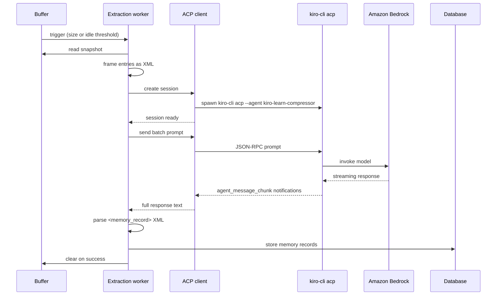
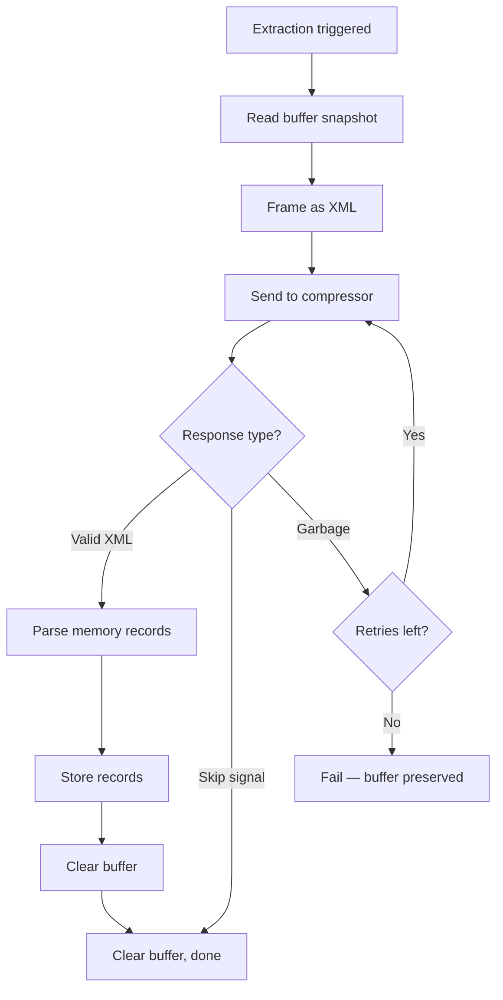

Extraction is the process that turns raw events into structured memory records. It takes a batch of [buffered events](/concepts/event-buffer), frames them as XML, sends them to an LLM via the [Agent Client Protocol (ACP)](https://agentclientprotocol.com), and parses the response back into memory records that get stored in the [database](/architecture/database).

Extraction is always asynchronous — it never blocks event ingestion. The shim gets a fast HTTP response from the [Collector](/architecture/collector), and extraction happens in the background when the [buffer watcher](/architecture/collector#buffer-watcher) fires a trigger.

## How it works



## The extraction worker

The extraction worker is the orchestrator. When the buffer watcher fires an extraction trigger for a project, the worker:

1. **Reads a buffer snapshot** — a point-in-time copy of all buffered entries for that project.
2. **Frames the batch as XML** — each entry becomes a `<tool_observation>` element.
3. **Sends the XML to the compressor agent** via ACP.
4. **Parses the response** — extracts `<memory_record>` blocks from the LLM output.
5. **Stores memory records** in the database with generated IDs and metadata.
6. **Clears the buffer** on success — entries that were successfully extracted are removed.

If any step fails, the buffer is left intact. Events are never lost — they remain in the database regardless of extraction outcome, and the buffer retains them for a future retry.

## ACP client

The ACP (Agent Client Protocol) client manages the lifecycle of a `kiro-cli acp` child process. It handles:

- **Spawning** the process (`kiro-cli acp --agent kiro-learn-compressor`)
- **Handshake** — the `initialize` → `newSession` protocol negotiation
- **Prompt delivery** — sending the batch XML and collecting the streamed response
- **Cleanup** — killing the child process when done (SIGTERM, then SIGKILL after 2 seconds)

The client uses the official [`@agentclientprotocol/sdk`](https://www.npmjs.com/package/@agentclientprotocol/sdk) for all JSON-RPC framing and request/response correlation. The kiro-learn code is a thin adapter that bridges Node.js child process stdio to the SDK's Web Streams interface.

Each extraction creates a fresh ACP session and destroys it when done. Sessions are single-use — one prompt per session.

### The compressor agent

The compressor agent (`kiro-learn-compressor`) is a purpose-built agent with:

- **No tools** — it cannot call external services or read files.
- **An XML extraction prompt** — it receives `<tool_observation>` XML and returns `<memory_record>` XML.
- **No user interaction** — it processes the batch and responds.

The compressor runs through `kiro-cli`, which routes to [Amazon Bedrock](https://docs.aws.amazon.com/bedrock/latest/userguide/what-is-bedrock.html) for inference. No other LLM provider is used.

## XML framing

Before sending events to the compressor, each buffered entry is framed as a `<tool_observation>` XML element:

```xml
<tool_observation>
  <tool_name>readFile</tool_name>
  <timestamp>2025-01-15T10:30:00-08:00</timestamp>
  <input>{"path": "src/index.ts"}</input>
  <output>{"content": "export function main() { ... }"}</output>
</tool_observation>
```

The framer handles all three body types:

| Body type | How it's framed |
|-----------|-----------------|
| `json` | Extracts `tool_name`, `tool_input`, and `tool_response` from the data object |
| `text` | Uses the text content as `<input>` |
| `message` | Concatenates turns as `role: content` lines in `<input>` |

All text content is XML-escaped (the five special characters: `&`, `<`, `>`, `"`, `'`) to prevent injection. A batch of entries produces a concatenated string of `<tool_observation>` elements separated by newlines.

## XML parsing

The compressor responds with zero or more `<memory_record>` blocks:

```xml
<memory_record type="discovery">
  <title>Project uses ESM with explicit .js extensions</title>
  <summary>The codebase is ESM-only with verbatimModuleSyntax enabled.
  All imports use explicit .js extensions for Node.js resolution.</summary>
  <concept>ESM modules</concept>
  <concept>TypeScript configuration</concept>
  <file>tsconfig.json</file>
  <file>src/index.ts</file>
  <fact>verbatimModuleSyntax is true in tsconfig</fact>
</memory_record>
```

The parser extracts:

| Field | Source | Constraints |
|-------|--------|-------------|
| `type` | `type` attribute | Must be a valid observation type (`tool_use`, `decision`, `error`, `discovery`, `pattern`, `session_summary`) |
| `title` | `<title>` element | Required, truncated to 200 chars |
| `summary` | `<summary>` element | Required, truncated to 4000 chars |
| `concepts` | `<concept>` elements | Zero or more |
| `files` | `<file>` elements | Zero or more |
| `facts` | `<fact>` elements | Zero or more |

Records with invalid types, missing titles, or missing summaries are silently skipped. All extracted text is XML-unescaped before storage.

### Skip signal

The compressor can decline to produce memory records by responding with `<skip/>` or an empty response. Both are valid — they mean the events didn't contain anything worth remembering. This is not an error.

## Reliability

### Circuit breaker (retry on garbage)

The compressor is an LLM — sometimes it responds conversationally instead of producing XML. The extraction worker detects this and retries:

1. **Garbage detection** — if the response is non-empty but contains no `<memory_record>` or `<skip` tags, it's classified as garbage.
2. **Retry** — the worker creates a new ACP session and tries again, up to 3 attempts.
3. **Failure** — after 3 consecutive garbage responses, the extraction fails for that batch.

Each retry creates a fresh ACP session (new child process). This avoids state contamination from a confused model.

### Concurrency limits

The extraction worker uses a semaphore to limit concurrent extractions across all projects. The default limit is 2 concurrent sessions. Additional extraction requests queue in FIFO order until a slot becomes available.

This prevents resource exhaustion — each ACP session spawns a child process and holds a Bedrock connection. Unbounded concurrency would overwhelm both the local machine and the upstream service.

### Timeouts

Every ACP prompt has a 60-second timeout. If the compressor doesn't complete its response within that window, the child process is killed and the extraction fails for that batch.

The timeout is raced against both the prompt completion and a "child failed" sentinel — if the `kiro-cli acp` process crashes mid-turn, the error surfaces immediately instead of waiting for the timeout to expire.

### Buffer preservation on failure

When extraction fails (after all retries), the [buffer](/concepts/event-buffer) is not cleared. The events remain buffered and will be retried on the next extraction trigger. Combined with the buffer watcher's [circuit breaker](/architecture/collector#circuit-breaker) (3 consecutive failures disables extraction for that project), this prevents both data loss and infinite retry loops.



## What a memory record contains

After extraction, each memory record is enriched with pipeline-managed fields before storage:

| Field | Source |
|-------|--------|
| `record_id` | Generated (`mr_` prefix + ULID) |
| `namespace` | Copied from the source events |
| `strategy` | Always `'llm-summary'` |
| `source_event_ids` | All event IDs from the batch |
| `title` | From the compressor's `<title>` element |
| `summary` | From the compressor's `<summary>` element |
| `concepts` | From the compressor's `<concept>` elements |
| `files_touched` | From the compressor's `<file>` elements |
| `observation_type` | From the compressor's `type` attribute |

The `source_event_ids` array links every memory record back to the raw events that produced it. This provides full traceability — you can always find which events contributed to a given memory.

Once stored, memory records become searchable via the [Retrieval](/architecture/retrieval) system's FTS5 full-text index.

## Key design decisions

**Batch over per-event.** Events are extracted in batches rather than individually. This gives the LLM more context to identify patterns across related events and produces higher-quality memory records. It also reduces the number of Bedrock invocations.

**Single-use sessions.** Each extraction creates and destroys its own ACP session. This avoids state leakage between extractions and makes cleanup deterministic — if something goes wrong, kill the process and start fresh.

**XML over JSON.** The compressor uses XML as its input/output format because LLMs handle structured XML extraction reliably. The fixed schema (`<tool_observation>` in, `<memory_record>` out) constrains the model's output space and makes parsing straightforward.

**Async after ingest.** Extraction runs after the collector has already responded to the shim. A slow or failed extraction never delays event ingestion. The worst case is a missing memory record — the raw event is always safe in the database.

**No direct Bedrock dependency.** The extraction pipeline talks to `kiro-cli acp`, not to [Amazon Bedrock](https://docs.aws.amazon.com/bedrock/latest/userguide/what-is-bedrock.html) directly. This keeps credentials, model selection, and API versioning as `kiro-cli`'s responsibility. kiro-learn doesn't need AWS SDK dependencies for extraction.

## Related pages

<CardGroup cols={2}>
  <Card title="Compaction" href="/architecture/compaction">
    What happens when buffers grow too large
  </Card>
  <Card title="Summarization" href="/architecture/summarization">
    How turn summaries flow through extraction
  </Card>
  <Card title="Retrieval" href="/architecture/retrieval">
    How extracted memories are searched and injected
  </Card>
  <Card title="Database" href="/architecture/database">
    Where events and memory records are persisted
  </Card>
  <Card title="Collector" href="/architecture/collector">
    The daemon that orchestrates the pipeline
  </Card>
  <Card title="Event buffer" href="/concepts/event-buffer">
    How events are staged before extraction
  </Card>
</CardGroup>
