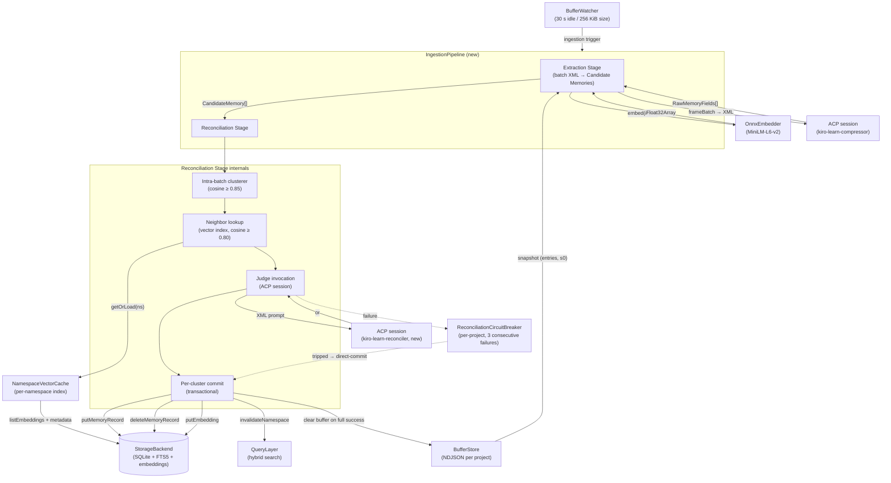
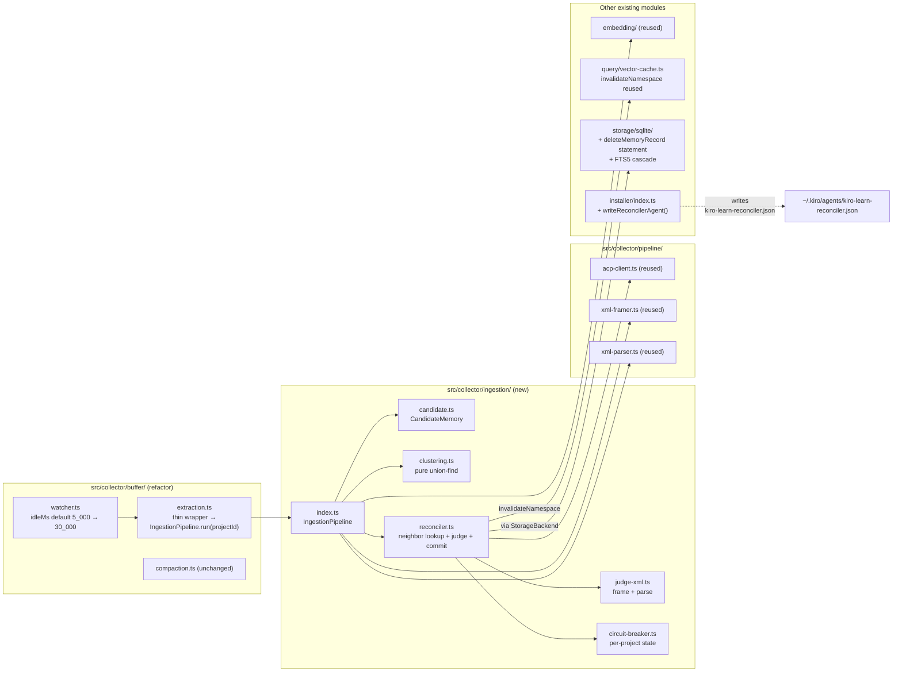

Ingestion is the path from a flushed [buffer snapshot](/concepts/event-buffer) to committed rows in `memory_records`. It replaces the single-stage `ExtractionWorker` with a two-stage pipeline: an **Extraction Stage** that emits in-memory [Candidate Memories](#candidate-memories) (never written directly), followed by a **Reconciliation Stage** that clusters intra-batch duplicates, looks up semantically-similar existing records, invokes a judge LLM to make the final same-or-different call, and either writes a single merged summary or commits the candidates as-is.

Both stages run inside one semaphore slot per project, so the pipeline's concurrency and buffer-clear semantics match the legacy extraction worker byte-for-byte. The buffer is only cleared once reconciliation has successfully committed.

## Why two stages

Today's memory graph is write-dominated: every `<memory_record>` the compressor emits becomes a new row. Because the compressor often re-describes the same fact across batches (and occasionally within a single batch), the graph accumulates near-duplicate nodes that share a topic, differ only in phrasing, and dilute [hybrid search](/architecture/retrieval#hybrid-search) results.

Reconciliation adds the missing deduplication pass. Rather than guarding against duplicates at write time (which the compressor cannot do — it only sees the current batch), the pipeline does it at ingestion time with the full graph available:

1. Extraction produces candidates. It is the same LLM call as before — same `<tool_observation>` framing, same `kiro-learn-compressor` agent — but its output is now typed as in-memory `CandidateMemory` values rather than rows.
2. Reconciliation clusters candidates that describe the same thing, finds existing records that are semantically close, asks a cheap judge model to rule on the cluster-plus-neighbors pool, and either writes one summary record (deleting the merged originals) or commits the candidates normally.

The critical design constraint is that **reconciliation merges are destructive**. A `<merge>` decision deletes the original rows — from `memory_records`, from the `embeddings` table, and from the `memory_records_fts` index — inside the same transaction as the summary insert. There is no history, no soft delete, no tombstone. The merged originals are gone.

## Architecture



Read the diagram top-down. The [buffer watcher](/concepts/event-buffer#what-triggers-extraction) triggers the pipeline the same way it triggered the legacy `ExtractionWorker`. The pipeline runs Extraction Stage (producing `CandidateMemory[]`), then — when reconciliation is enabled and the circuit breaker is closed — runs Reconciliation Stage. On full success the buffer is cleared; on any failure path the buffer is left intact. The query layer continues to read `memory_records` unchanged from today; the vector cache is invalidated per namespace whenever a commit changes that namespace's row set.

## Where the new code lives



The `ingestion/` folder is the only new source-code folder. Everything downstream (embedder, vector cache, storage, query, buffer watcher, receiver, MCP, installer) takes either a trivially additive patch or no patch at all.

## Candidate Memories

A `CandidateMemory` is a `MemoryRecord`-shaped value that the Extraction Stage emits but never persists. It carries every field a final record has — `record_id`, `namespace`, `strategy`, `source_event_ids`, `title`, `summary`, `facts`, `concepts`, `files_touched`, `observation_type` — plus a transient `embedding: Float32Array | null` computed at extraction time by the same ONNX embedder used on the write path today.

The candidate's `record_id` is allocated fresh at extraction time (`mr_` + ULID) so downstream reconciliation can refer to cluster members by id without waiting for a storage write. The `created_at` timestamp is stamped later, at commit time, by `toMemoryRecord(candidate)` — candidates do not carry a creation time because they are pre-commit values.

When the embedder is absent, not ready, or throws for a specific record, the candidate is emitted with `embedding: null`. The Reconciliation Stage treats null-embedding candidates as singleton clusters (never merged) and commits them as-is on the keep-separate path. The [backfill worker](/architecture/collector#backfill-worker) fills in the embedding later, the same way it does for pre-hybrid-search rows.

**The Extraction Stage never writes.** It never calls `storage.putMemoryRecord` or `storage.putEmbedding`. Its output is purely in-memory. This is an invariant pinned by a property test, and it is what makes the pipeline's buffer-clear discipline correct — a buffer snapshot is only cleared after reconciliation commits, so a crash between extraction and reconciliation leaves the buffer intact and the events safely available for retry.

## Reconciliation Stage

The Reconciliation Stage takes `CandidateMemory[]` from extraction and commits the results. It runs four phases per cluster: intra-batch clustering, neighbor lookup, judge invocation, commit.

### Intra-batch clustering

Candidates from the same batch often re-describe the same thing — the compressor saw related tool uses in close succession and wrote two memory records with different phrasings. The clusterer catches those cases before the judge is involved.

The algorithm is a pure union-find over the candidate indices:

1. For every pair of candidates whose embeddings are both non-null, compute cosine similarity.
2. If the similarity meets or exceeds `intraBatchSimilarityThreshold` (default `0.85`), union them.
3. Null-embedding candidates are never unioned — they land in their own singleton cluster.
4. Each cluster's **centroid** is `normalize(mean(members.map(m => m.embedding)))` when every member has a non-null embedding; otherwise the centroid is `null`.

The output partitions the input: every candidate belongs to exactly one cluster, and the cluster list is deterministic across runs. The implementation lives in `src/collector/ingestion/clustering.ts` — no I/O, no storage imports, pure functions over `Float32Array` vectors.

### Neighbor lookup

For each cluster with a non-null centroid, the reconciler asks the [query layer](/architecture/retrieval#hybrid-search) for existing `memory_records` whose embedding is cosine-close to the centroid. The lookup:

1. Scoped to the cluster's namespace. Cross-project neighbor lookup is impossible by construction.
2. Filters by `neighborSimilarityThreshold` (default `0.80`). Records below the floor are excluded.
3. Caps at `neighborPoolMaxSize` (default `10`). When more records exceed the threshold, the top-scoring ones win.
4. Returns results sorted by similarity descending.

The neighbor pool comes from the same per-namespace vector cache that [hybrid search](/architecture/retrieval#writes-keep-the-cache-in-sync) reads from. Merged rows are deleted from `memory_records` outright, so the cache's `listEmbeddings` feed naturally excludes them on the next rebuild.

When the centroid is null (cluster has a null-embedding member), neighbor lookup is skipped and the cluster commits on the no-judge keep-separate path. Same when the neighbor pool comes back empty — no neighbors means no same-or-different call to make.

### Judge invocation

When a cluster has at least one neighbor, the reconciler asks the **judge model** to decide whether the cluster and some subset of its neighbors describe the same underlying thing. The judge is a third ACP agent alongside the compressor and compactor, named `kiro-learn-reconciler`, installed by the same function that writes the other two agent configs.

The prompt framing is XML, parallel to the `<tool_observation>` / `<memory_record>` convention used elsewhere:

```xml
<reconciliation_request>
  <candidate_cluster>
    <candidate record_id="mr_...">
      <title>...</title>
      <summary>...</summary>
      <facts><fact>...</fact>...</facts>
      <concepts><concept>...</concept>...</concepts>
      <files><file>...</file>...</files>
      <observation_type>decision</observation_type>
    </candidate>
  </candidate_cluster>
  <neighbor_pool>
    <neighbor record_id="mr_..." similarity="0.87">
      <title>...</title>
      <summary>...</summary>
      <facts>...</facts>
    </neighbor>
  </neighbor_pool>
</reconciliation_request>
```

The judge responds with either a `<merge>` block listing the `record_id`s that describe the same thing (plus a new `title`, `summary`, `facts`, `concepts`, `files`, `observation_type`):

```xml
<merge>
  <merged_record_id>mr_...</merged_record_id>
  <merged_record_id>mr_...</merged_record_id>
  <title>Merged title</title>
  <summary>...</summary>
  <facts><fact>...</fact>...</facts>
  <concepts><concept>...</concept>...</concepts>
  <files><file>...</file>...</files>
  <observation_type>decision</observation_type>
</merge>
```

…or a single `<keep_separate/>` tag.

Every judge call creates a fresh ACP session, sends one prompt, and destroys the session in a `finally` block — the same single-use pattern [extraction](/architecture/extraction#acp-client) and [compaction](/architecture/compaction) use. No state leaks between judge invocations.

Each judge call has a per-call timeout of `judgeModelTimeoutMs` (default `30_000`). Timeouts are terminal — retrying would double the already-burned budget — but non-XML responses retry once with a fresh session, for a maximum of 2 attempts per cluster. On final failure the reconciler falls back to keep-separate for that cluster and records a failure on the [circuit breaker](#circuit-breaker-and-direct-commit-fallback).

### Commit

Every cluster commits inside a single `StorageBackend` transaction. The commit writes depend on the decision:

- **Merge.** One `putMemoryRecord(summary)` + one `deleteMemoryRecord(mergedIds)` + one `putEmbedding(summary.record_id, summaryEmbedding)` in one atomic transaction. The summary's embedding is computed before the transaction opens so the transaction body itself stays synchronous. The `deleteMemoryRecord` call cascades to both the embedding row and the FTS5 entry — see the [database docs](/architecture/database#merge-deletion-is-destructive) for the exact cascade semantics.
- **Keep-separate.** One `putMemoryRecord(member)` + one `putEmbedding(member.record_id, member.embedding)` per cluster member, all in one transaction. No deletes.

After the transaction commits, the reconciler calls `query.invalidateNamespace(namespace)` so the next search sees the new summary and no longer sees the deleted rows.

Summary records are stamped with:

- `strategy: 'llm-reconciled'` (distinct from the extraction path's `'llm-summary'`).
- A fresh `record_id` (`mr_` + ULID).
- `source_event_ids` = the first-seen-order deduplicated union of every merged entity's `source_event_ids` (cluster members + merged neighbors).
- `observation_type` = the judge's value, or the highest-similarity merged member's value when the judge omits it.
- `created_at` = wall clock at commit time.

**Per-cluster failure isolation.** A failure inside one cluster's transaction (storage error, embed failure, judge parse failure that exhausted the retry budget) is caught and logged with the cluster's member `record_id`s. The outer loop continues with the next cluster. A run where every cluster failed is reported to the buffer watcher as unsuccessful, so the buffer is retained and a retry happens on the next trigger.

## Configuration

The reconciliation config lives on `CollectorConfig` in `src/collector/index.ts`. All new fields are validated at `startCollector` — out-of-range values throw a descriptive error naming the field and the observed value before any storage handle is opened.

| Field | Default | Validated range | Purpose |
|---|---|---|---|
| `reconciliationEnabled` | `true` | boolean | Feature flag. When `false`, every run takes the [direct-commit fallback](#circuit-breaker-and-direct-commit-fallback). |
| `bufferIdleMs` | `30_000` | `[5_000, 300_000]` | Idle-flush interval the buffer watcher uses to trigger ingestion. See [Event buffer](/concepts/event-buffer#what-triggers-the-ingestion-pipeline). |
| `intraBatchSimilarityThreshold` | `0.85` | `[0, 1]` | Cosine floor for intra-batch clustering. Higher values cluster only near-identical candidates. |
| `neighborSimilarityThreshold` | `0.80` | `[0, 1]` | Cosine floor for neighbor lookup. Typically set slightly below the intra-batch threshold so the judge sees a broader neighborhood than the intra-batch pass would. |
| `neighborPoolMaxSize` | `10` | `[1, 100]` | Maximum neighbors admitted to a single cluster's pool. When more records exceed the threshold, the top-scoring `neighborPoolMaxSize` are kept. |
| `judgeModelTimeoutMs` | `30_000` | `[5_000, 300_000]` | Per-judge-call timeout. A timeout kills the session, records a failure on the circuit breaker, and falls back to keep-separate for that cluster. |

<Warning>
  Reconciliation merges are destructive. A `<merge>` decision deletes the merged rows outright — there is no soft delete, no tombstone, no history. Tune `intraBatchSimilarityThreshold` and `neighborSimilarityThreshold` conservatively: a low threshold paired with a lenient judge can silently collapse rows that should have stayed separate.
</Warning>

The `reconciliationDebug` flag (default `false`) emits a per-cluster `ingestion-cluster-debug` JSON-Lines record to stderr containing the cluster members, the neighbor pool with similarity scores, the judge request XML hash, and the raw judge response XML. Intended for threshold calibration and judge-model regression triage, not production use.

## Circuit breaker and direct-commit fallback

A buggy judge model should degrade gracefully, not stall memory ingestion. The pipeline runs a **per-project reconciliation circuit breaker** that flips to a safe fallback path after enough consecutive judge failures.

The breaker (in `src/collector/ingestion/circuit-breaker.ts`) carries an independent `{ consecutiveFailures, open }` pair per project id:

- Starts closed for every project.
- Each judge failure (timeout or non-XML after the retry budget) increments `consecutiveFailures`.
- When the counter reaches `3`, the breaker opens. The next ingestion run for that project takes the direct-commit path.
- A run that completes with zero judge failures — including the direct-commit case where the judge was never invoked — resets `consecutiveFailures` to `0` and closes the breaker.

The **direct-commit fallback** is the escape valve. When `reconciliationEnabled === false` OR the circuit breaker is open at the start of a run, the pipeline writes every candidate to storage directly — the same `putMemoryRecord` + `putEmbedding` + `invalidateNamespace` sequence the legacy `ExtractionWorker` produced, byte-for-byte. A property test (Property 4) pins the equivalence: for any buffer snapshot and any fixed ULID seed, the direct-commit path produces the same sequence of storage writes as pre-reconciliation extraction.

Because the direct-commit path bypasses the judge entirely, it counts as "no judge failure" and closes a tripped breaker on its own. A project whose judge is sick uses direct-commit for exactly one run, then re-attempts full reconciliation on the next trigger.

Extraction itself is unaffected by the reconciliation circuit breaker. The outer [buffer watcher's extraction circuit breaker](/architecture/collector#circuit-breaker) still governs extraction-level failures independently — a broken judge does not disable event ingestion.

## Failure modes and buffer-clear discipline

The pipeline's buffer-clear rules mirror the legacy extraction worker's, extended for the reconciliation stage:

| Failure | Buffer | Circuit breaker |
|---|---|---|
| Extraction throws (ACP spawn, compressor timeout, garbage after retries) | Retained | Not touched — reconciliation-scoped only |
| Zero candidates produced (skip signal or empty output) | Cleared | Reset (trivial no-failure run) |
| Reconciliation runs and at least one cluster commits | Cleared | Recorded per judge outcome; run-end reset if no judge failures |
| Reconciliation runs but every cluster fails to commit | Retained | Recorded per judge outcome |
| Direct-commit fallback (flag off or breaker open) | Cleared | Reset (no judge invoked) |

A cluster "commits" when it writes either a summary record (merge path) or at least one keep-separate member. Null-centroid clusters and empty-neighbor-pool clusters both commit on the keep-separate path — no judge, no delete, just the member writes.

## Key design decisions

**Extraction never writes.** Making the Extraction Stage a pure producer of in-memory values — never calling `putMemoryRecord` or `putEmbedding` — is what lets the buffer-clear discipline work cleanly. A crash between extraction and reconciliation leaves the buffer intact; there is no half-written state to clean up.

**Merges are destructive.** There is no soft delete, no `deleted_at` column, no tombstone row. The merged originals are gone at commit time — from `memory_records`, from `embeddings`, and from `memory_records_fts`, all in one transaction. The [retrieval](/architecture/retrieval) layer does not need to filter merged rows; they are simply not there. The tradeoff is that tuning thresholds aggressively can silently collapse rows that should have been distinct, so the defaults lean conservative.

**The judge runs through ACP, not a direct SDK.** Like the compressor and compactor, the reconciler agent is accessed through `kiro-cli acp --agent kiro-learn-reconciler`. No new LLM SDKs are pulled in. The agent config is a third hand-authored JSON alongside `kiro-learn-compressor.json` and `kiro-learn-compactor.json`, installed by the same function.

**No schema migration.** `memory_records` gains no columns for this feature. The two storage changes are: a new `deleteMemoryRecord(recordIds)` method on the backend interface (with the matching FTS5 + embeddings cascade described in [Database](/architecture/database#merge-deletion-is-destructive)), and a new `withTransaction` handle. Existing rows keep working — reconciliation only touches them when they come up as neighbors and the judge decides to merge them.

**Per-cluster failure isolation.** A storage error or a malformed judge response on one cluster must not prevent sibling clusters from committing. The reconciler wraps each cluster's work in a try/catch and continues past any per-cluster failure, logging the member `record_id`s so an operator can correlate the failure to the original candidates.

**One semaphore slot per project, per pipeline.** Extraction and reconciliation share a slot. Default concurrency is 2, reused verbatim from the legacy `ExtractionWorker`. The slot is held for the full pipeline duration, so a slow judge does not release a slot for a second run to start extraction on the same project mid-flight.

## Code pointers

- `src/collector/ingestion/index.ts` — `IngestionPipeline` orchestrator
- `src/collector/ingestion/candidate.ts` — `CandidateMemory`, `extractCandidates`, `toMemoryRecord`
- `src/collector/ingestion/clustering.ts` — pure intra-batch union-find
- `src/collector/ingestion/reconciler.ts` — neighbor lookup, judge invocation, commit
- `src/collector/ingestion/judge-xml.ts` — prompt framing + response parsing
- `src/collector/ingestion/circuit-breaker.ts` — per-project reconciliation circuit breaker
- `src/collector/index.ts` — `DEFAULT_COLLECTOR_CONFIG`, `validateCollectorConfig`
- `src/collector/buffer/extraction.ts` — thin wrapper that delegates to `IngestionPipeline.run`
- `src/installer/index.ts` — `writeReconcilerAgent`

## Related pages

<CardGroup cols={2}>
  <Card title="Extraction" href="/architecture/extraction">
    The first stage of the pipeline — emits Candidate Memories
  </Card>
  <Card title="Database" href="/architecture/database">
    Where the `deleteMemoryRecord` cascade lives
  </Card>
  <Card title="Retrieval" href="/architecture/retrieval">
    Reads the post-merge `memory_records` unchanged
  </Card>
  <Card title="Compaction" href="/architecture/compaction">
    Separate pressure valve on buffer size
  </Card>
  <Card title="Event buffer" href="/concepts/event-buffer">
    The per-project staging area that feeds ingestion
  </Card>
  <Card title="Collector" href="/architecture/collector">
    The daemon that wires the pipeline together
  </Card>
</CardGroup>
