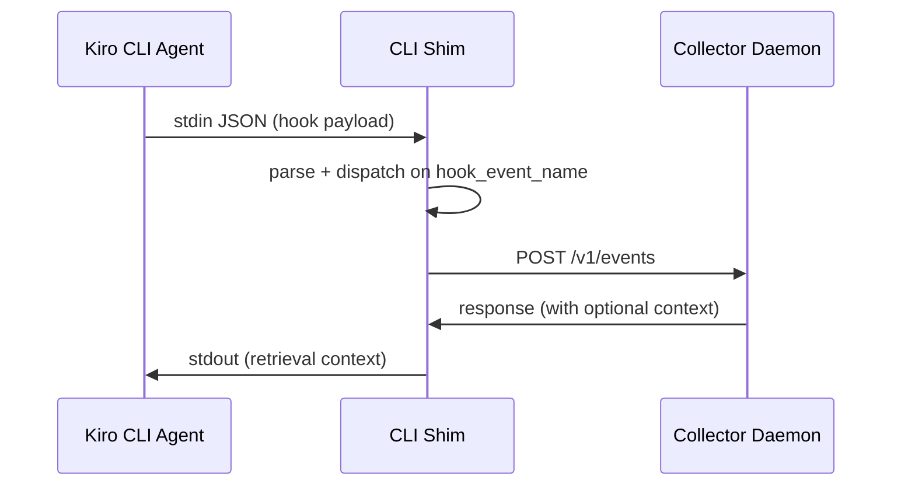
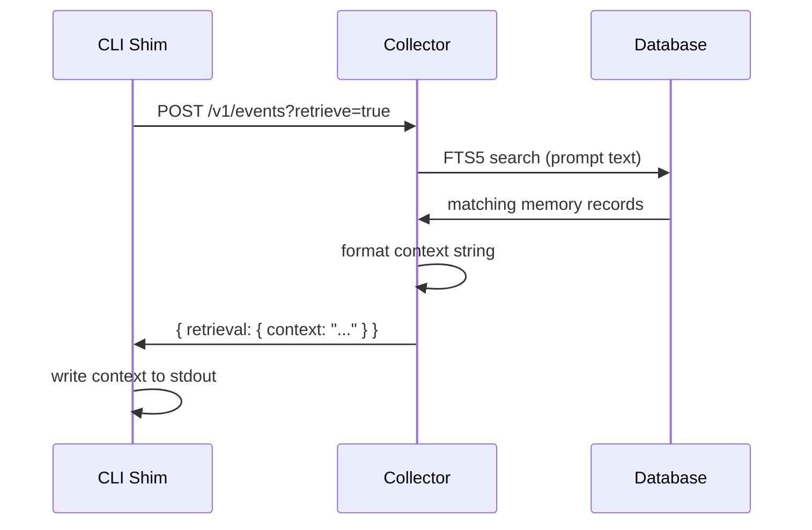

The Kiro CLI shim is the bridge between the Kiro CLI agent runtime and the kiro-learn daemon. It reads hook payloads from stdin, builds structured events, POSTs them to the collector, and — on prompt submit — writes retrieval context back to stdout so the agent can use prior memories in its next response.

Each event is tagged with the current [project](/concepts/projects), so all agents working in the same project contribute to a shared memory pool.

<Info>
This page describes how kiro-learn integrates with the Kiro CLI hook system. For general Kiro CLI documentation, see [Get started with Kiro CLI](https://kiro.dev/docs/cli/) and the [hooks reference](https://kiro.dev/docs/cli/hooks/).
</Info>

## How hooks reach the shim

When you run `kiro-learn init`, the installer creates a [custom agent](https://kiro.dev/docs/cli/custom-agents/configuration-reference) at `.kiro/agents/kiro-learn.json`. This agent config registers [hook commands](https://kiro.dev/docs/cli/hooks/) for each lifecycle event — so the [Kiro CLI](https://kiro.dev/docs/cli/) runtime automatically invokes the shim at the right moments without any manual setup.

Each hook fires a shell command with the hook payload piped to **stdin as JSON**. The shim reads stdin synchronously, parses the JSON, and dispatches based on the `hook_event_name` field.

Every hook payload includes at minimum:

- `hook_event_name` — which hook fired
- `cwd` — the working directory the agent was invoked from

See the [Kiro CLI hook event documentation](https://kiro.dev/docs/cli/hooks/#hook-event) for the full payload schema. The shim validates both fields before dispatching. If stdin is empty, unparseable, or missing `cwd`, the shim exits silently without error.

## The four hook events

The Kiro CLI defines [four hook types](https://kiro.dev/docs/cli/hooks/#hook-types) that fire at different points in the agent lifecycle. kiro-learn listens to all four:

### agentSpawn

Fires when the Kiro CLI starts a new agent process (see [AgentSpawn hook](https://kiro.dev/docs/cli/hooks/#agentspawn)). The shim builds a lightweight `note` event marking the spawn and POSTs it to the collector. This gives the event log a visible "start" marker but does not drive any extraction or retrieval on its own.

| Field | Value |
|-------|-------|
| Event kind | `note` |
| Retrieval | No |
| Stdout | Spawn marker |

### userPromptSubmit

Fires when the developer sends a prompt. The shim builds a `prompt` event containing the user's message, POSTs it with `?retrieve=true`, and writes any returned context to stdout. This is the moment memories flow back into the agent — the collector searches for relevant records and returns a formatted context string in the response.

| Field | Value |
|-------|-------|
| Event kind | `prompt` |
| Retrieval | Yes |
| Stdout | Memory context (if any) |

### postToolUse

Fires after the agent uses a tool. The shim builds a `tool_use` event containing the tool name, input, and response as a JSON body. No retrieval, no stdout output — tool observations are captured silently for later extraction.

| Field | Value |
|-------|-------|
| Event kind | `tool_use` |
| Retrieval | No |
| Stdout | None |

### stop

Fires when the agent finishes responding — at the end of each turn. A _turn_ is one hook-to-hook cycle: prompt submit, zero or more tool uses, then stop. The shim builds a `session_summary` event containing the assistant's final response. No retrieval, no stdout output — the summary is stored for extraction into a structured turn summary record.

| Field | Value |
|-------|-------|
| Event kind | `session_summary` |
| Retrieval | No |
| Stdout | None |

## Retrieval: context flows back via stdout

On `userPromptSubmit`, the shim POSTs with `?retrieve=true`. The collector performs a full-text search against stored memory records, assembles matching results into a context string, and returns it in the HTTP response. The shim writes this context directly to stdout, where the Kiro CLI runtime picks it up and injects it into the agent's prompt.

If the collector is unreachable, returns no results, or the context is empty, the shim writes nothing to stdout. The agent proceeds without memory context — retrieval is best-effort.

## Exit 0 always

The shim is designed to never block the agent. The Kiro CLI [hook output contract](https://kiro.dev/docs/cli/hooks/#hook-output) defines exit code semantics — kiro-learn always exits with code 0 (success). Every possible failure path — network errors, parse failures, missing config, filesystem issues — is caught and handled gracefully:

- Errors are logged to **stderr** with a `[kiro-learn]` prefix for observability.
- The process always exits with code **0**.
- HTTP requests have a hard **2-second timeout** enforced via `AbortController`.
- If the collector is down, the shim logs a warning and exits. The event is lost, but the agent is unaffected.

This contract means kiro-learn can never degrade the developer experience. Whether the daemon is down, a request times out, or a payload is malformed — the agent continues normally and the shim exits cleanly.

## Body truncation

Event bodies are capped at 512 KiB. When a payload exceeds this limit, the shim truncates intelligently based on body type:

- **Text** — trims content iteratively and appends `[truncated by kiro-learn]`.
- **JSON** — trims `tool_response.result` first (the largest field in practice), falling back to truncating the entire serialized payload.
- **Message** — trims turns from the end, starting with the last turn's content.

Truncation happens before the event is sent — the collector never receives an oversized payload.

## Related pages

<CardGroup cols={2}>
  <Card title="Kiro IDE shim" href="/architecture/kiro-ide-shim">
    The sibling shim for the Kiro IDE
  </Card>
  <Card title="Collector" href="/architecture/collector">
    Where shim events are received and cleaned
  </Card>
  <Card title="Retrieval" href="/architecture/retrieval">
    How context flows back through the HTTP response
  </Card>
  <Card title="Projects" href="/concepts/projects">
    How each event is tagged with a project scope
  </Card>
</CardGroup>
