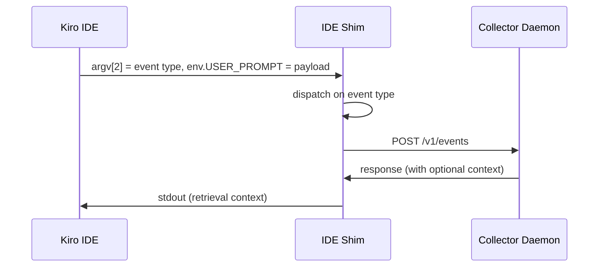
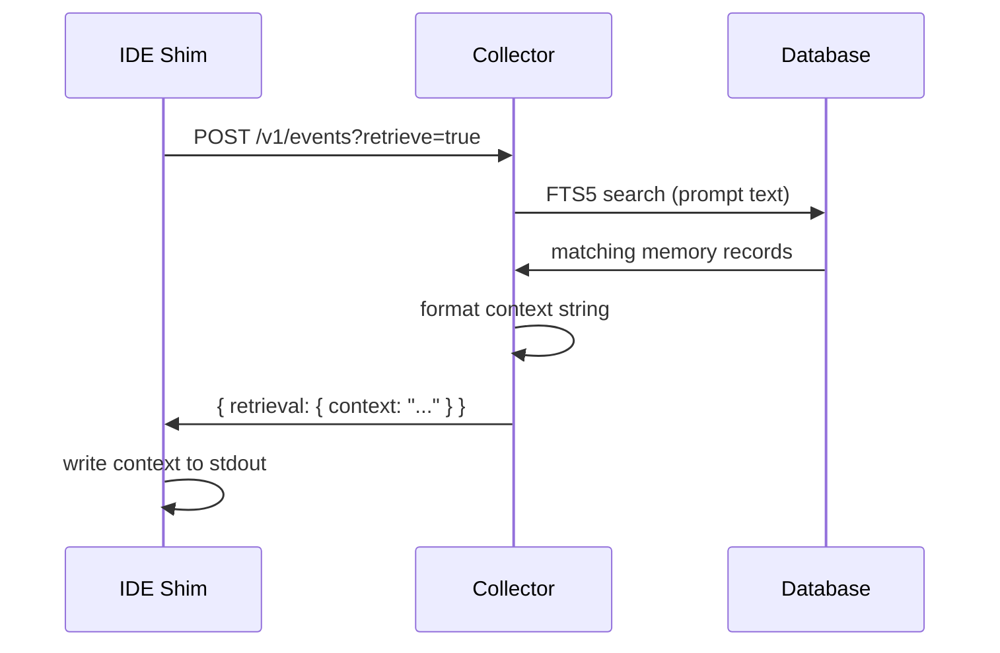

The Kiro IDE shim is the bridge between the Kiro IDE hook system and the kiro-learn daemon. It receives the event type as a command-line argument and the payload via the `USER_PROMPT` environment variable, builds a structured event, POSTs it to the collector, and — on prompt submit — writes retrieval context back to stdout so the IDE agent can use prior memories in its next response.

Like the [CLI shim](/architecture/kiro-cli-shim), each event is tagged with the current [project](/concepts/projects), so all agents working in the same project contribute to a shared memory pool.

<Info>
This page describes how kiro-learn integrates with the Kiro IDE hook system. For general Kiro IDE documentation, see [Kiro IDE hooks](https://kiro.dev/docs/ide/hooks/).
</Info>

## How hooks reach the shim

When you run `kiro-learn init`, the installer creates hook files in `.kiro/hooks/` — one file per lifecycle event. Each hook file (`.kiro.hook`) tells the Kiro IDE runtime to invoke the shim at the appropriate moment.

The IDE hook system passes data differently from the CLI:

- **Event type** — passed as the first positional argument (`argv[2]`)
- **Payload** — passed via the `USER_PROMPT` environment variable
- **Working directory** — the IDE's `process.cwd()` at invocation time



The shim validates the event type argument before dispatching. If `argv[2]` is missing, the shim logs a warning to stderr and exits. If the event type is unrecognized, it logs the unknown value and exits. In both cases, exit code is 0.

## The three hook events

The Kiro IDE defines three hook events that fire at different points in the agent lifecycle. kiro-learn listens to all three:

### promptSubmit

Fires when the developer sends a prompt. The shim reads the user's message from `USER_PROMPT` as plain text, builds a `prompt` event, POSTs it with `?retrieve=true`, and writes any returned context to stdout. This is the moment memories flow back into the agent.

| Field | Value |
|-------|-------|
| Event kind | `prompt` |
| Retrieval | Yes |
| Stdout | Memory context (if any) |

### postToolUse

Fires after the agent uses a tool. The shim reads `USER_PROMPT` as a **camelCase JSON** object containing tool execution details, maps the fields to kiro-learn's snake_case convention, and builds a `tool_use` event. No retrieval, no stdout output.

The expected JSON shape:

```json
{
  "toolName": "readFile",
  "toolArgs": { "path": "src/index.ts" },
  "toolResult": "file contents...",
  "toolSuccess": true
}
```

The shim maps these to the internal structure:

| Input field (camelCase) | Internal field (snake_case) |
|---|---|
| `toolName` | `tool_name` |
| `toolArgs` | `tool_input` |
| `toolResult` | `tool_response.result` |
| `toolSuccess` | `tool_response.success` |

If `USER_PROMPT` is not valid JSON, the shim logs a parse warning to stderr and still sends an event with `tool_name: "unknown"` and empty input/response objects. The event is never lost — only the detail level degrades.

| Field | Value |
|-------|-------|
| Event kind | `tool_use` |
| Retrieval | No |
| Stdout | None |

### agentStop

Fires when the agent finishes a turn. A _turn_ is one hook-to-hook cycle: prompt submit, zero or more tool uses, then stop. The shim reads `USER_PROMPT` as plain text (the agent's final message, treated as a turn summary), builds a `session_summary` event, and POSTs it. No retrieval, no stdout output.

<Note>
The Kiro IDE does not currently pass the agent's final message to `agentStop` hooks — `USER_PROMPT` arrives as an empty string, so the shim exits without creating a turn summary event. Memory quality is still strong without this: prompt capture and tool-use events provide rich signal for extraction. Turn summaries would add an extra layer of structured context. We've filed a [feature request with Kiro](https://github.com/kirodotdev/Kiro/issues/6258) to have the IDE populate the payload on stop — give it a +1 if you'd find this useful.
</Note>

| Field | Value |
|-------|-------|
| Event kind | `session_summary` |
| Retrieval | No |
| Stdout | None |

## All three hooks use runCommand

All three kiro-learn IDE hooks use `runCommand` as their action type. The shim is invoked as a shell command with the event type passed as a positional argument:

```json
{
  "when": { "type": "agentStop" },
  "then": {
    "type": "runCommand",
    "command": "\"~/.kiro-learn/bin/ide-shim\" agentStop || true"
  }
}
```

The `agentStop` hook fires when the agent finishes a turn. The IDE runtime passes any turn summary text via the `USER_PROMPT` environment variable. When the summary is non-empty, the shim captures it as a `session_summary` event. When the summary is empty — which is the common case — the shim exits without creating an event.

The `|| true` suffix on every command ensures the hook never returns a non-zero exit code, regardless of what happens inside the shim.

## Retrieval: context flows back via stdout

On `promptSubmit`, the shim POSTs with `?retrieve=true`. The collector searches stored memory records, assembles matching results into a context string, and returns it in the HTTP response. The shim writes this context directly to stdout, where the IDE runtime picks it up and injects it into the agent's prompt.



If the collector is unreachable, returns no results, or the context is empty, the shim writes nothing to stdout. The agent proceeds without memory context — retrieval is best-effort.

## Exit 0 always

Like the CLI shim, the IDE shim never blocks the agent. Every possible failure path — network errors, parse failures, missing config, filesystem issues — is caught and handled gracefully:

- Errors are logged to **stderr** with a `[kiro-learn]` prefix.
- The process always exits with code **0**.
- HTTP requests have a hard **2-second timeout**.
- If the collector is down, the shim logs a warning and exits. The event is lost, but the agent is unaffected.

## Body truncation

Event bodies are capped at 512 KiB. The same truncation logic applies as the CLI shim:

- **Text** — trims content iteratively and appends `[truncated by kiro-learn]`.
- **JSON** — trims `tool_response.result` first, falling back to truncating the entire serialized payload.

Truncation happens before the event is sent — the collector never receives an oversized payload.

## Related pages

<CardGroup cols={2}>
  <Card title="Collector" href="/architecture/collector">
    Where shim events are received and cleaned
  </Card>
  <Card title="Kiro CLI shim" href="/architecture/kiro-cli-shim">
    The sibling shim for the Kiro CLI
  </Card>
  <Card title="Retrieval" href="/architecture/retrieval">
    How context flows back through the HTTP response
  </Card>
  <Card title="Projects" href="/concepts/projects">
    How each event is tagged with a project scope
  </Card>
</CardGroup>
