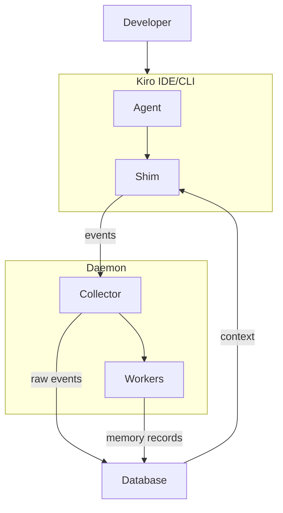
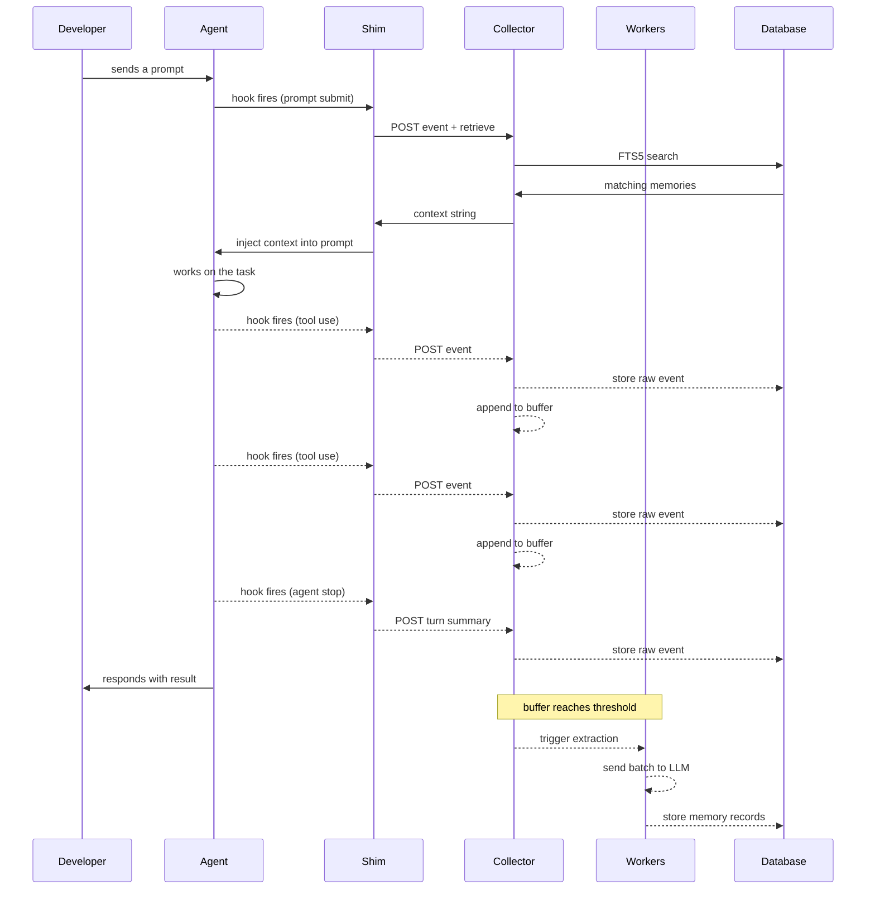

## System diagram

kiro-learn has four main components. Events flow from the developer's editor through the Kiro agent into the daemon, where they're cleaned, stored, and eventually extracted into structured memory records. On the next agent turn, relevant memories flow back as context.

## Data flow

Here's what happens during a typical agent turn:

1. **Hook fires** — the Kiro agent triggers a hook (prompt submit, tool use, agent stop).
2. **Shim builds event** — the shim reads the hook payload, constructs a structured event, and POSTs it to the collector.
3. **Collector cleans and stores** — deduplicates, strips `<private>` tags, stores the raw event, and appends to the project buffer.
4. **Workers extract** — when the buffer reaches a threshold, the extraction worker sends a batch to an LLM for structured memory extraction.
5. **Memory records stored** — extracted records (title, summary, concepts, files, observation type) are written to the database with full-text indexing.
6. **Context on next turn** — on the next prompt, the shim queries the collector. Relevant memories are found, formatted as context, and injected into the agent's prompt.

## Components

### Kiro IDE/CLI

The integration layer between the Kiro agent runtime and kiro-learn. Each Kiro product (IDE and CLI) has a **shim** — a lightweight adapter that translates hook events into structured events and POSTs them to the daemon. The shim also receives retrieval context in the HTTP response and writes it to stdout for prompt injection.

The agent also has access to an **MCP server** (`kiro-learn-memory`) that exposes `search_memory`, `save_observation`, and `save_session_summary` as tools for pull-based retrieval and explicit saves.

Both shims exit 0 always — a failure in kiro-learn never blocks the agent.

### Collector

The HTTP API that receives events from the shims. It runs a **cleaning pipeline** (dedup → privacy scrub) on each incoming event, then stores the raw event and appends a lightweight projection to a per-project buffer. It also serves the retrieval API — when a shim requests context, the collector queries the database and assembles a formatted context string within a latency budget.

The collector also serves the **viewer UI** — a dashboard showing metrics, recent events, and an interactive memory graph — at `/ui/*`.

### Workers

Background processes triggered by the buffer watcher when per-project buffers reach size or idle thresholds:

- **Extraction worker** — reads buffered events, sends them to an LLM (via `kiro-cli acp`) for structured extraction, and writes the resulting memory records to the database.
- **Compaction worker** — when buffers grow too large, summarizes existing memory records via LLM and replaces the buffer with compacted content.

### Database

A local SQLite database at `~/.kiro-learn/kiro-learn.db` with FTS5 full-text indexing. Stores raw events and extracted memory records. All data stays on your machine — nothing is sent to the cloud except during extraction (events are sent to Amazon Bedrock via `kiro-cli` for LLM processing).

## Related pages

<CardGroup cols={2}>
  <Card title="Kiro CLI shim" href="/architecture/kiro-cli-shim">
    stdin parsing, hook dispatch, event building
  </Card>
  <Card title="Kiro IDE shim" href="/architecture/kiro-ide-shim">
    argv/env parsing, event types, askAgent pattern
  </Card>
  <Card title="Collector" href="/architecture/collector">
    HTTP API, cleaning pipeline, buffer append
  </Card>
  <Card title="Extraction" href="/architecture/extraction">
    ACP client, XML framing, circuit breaker
  </Card>
  <Card title="Compaction" href="/architecture/compaction">
    LLM summarization, eviction, buffer replace
  </Card>
  <Card title="Summarization" href="/architecture/summarization">
    Turn summaries, pre-aggregated data
  </Card>
  <Card title="Retrieval" href="/architecture/retrieval">
    FTS5 search, query construction, context assembly
  </Card>
  <Card title="Database" href="/architecture/database">
    SQLite schema, migrations, FTS5 config
  </Card>
  <Card title="Viewer" href="/architecture/viewer">
    Dashboard, memory graph, event tail
  </Card>
</CardGroup>
