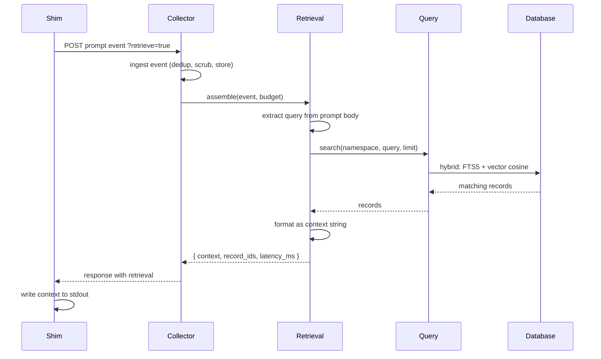
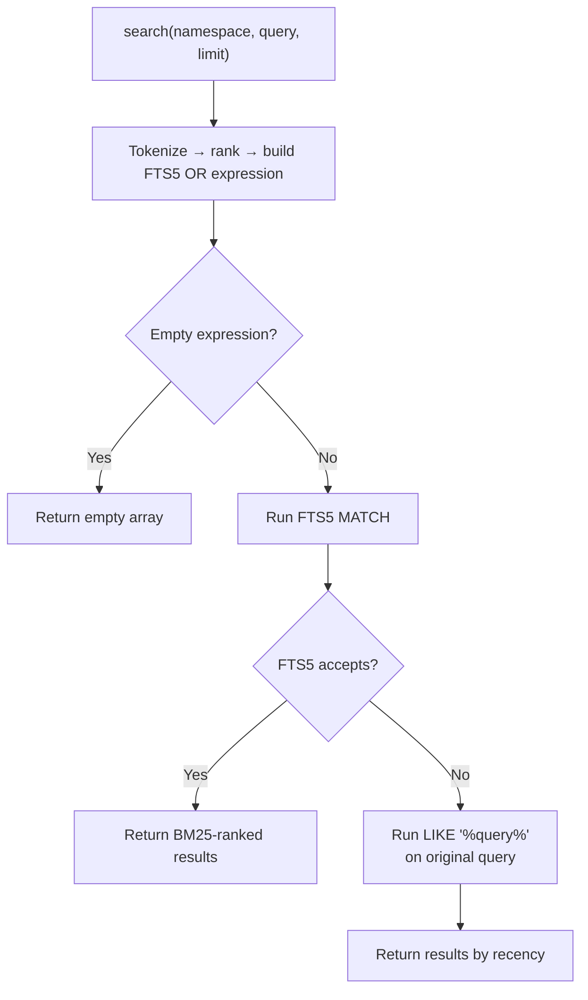
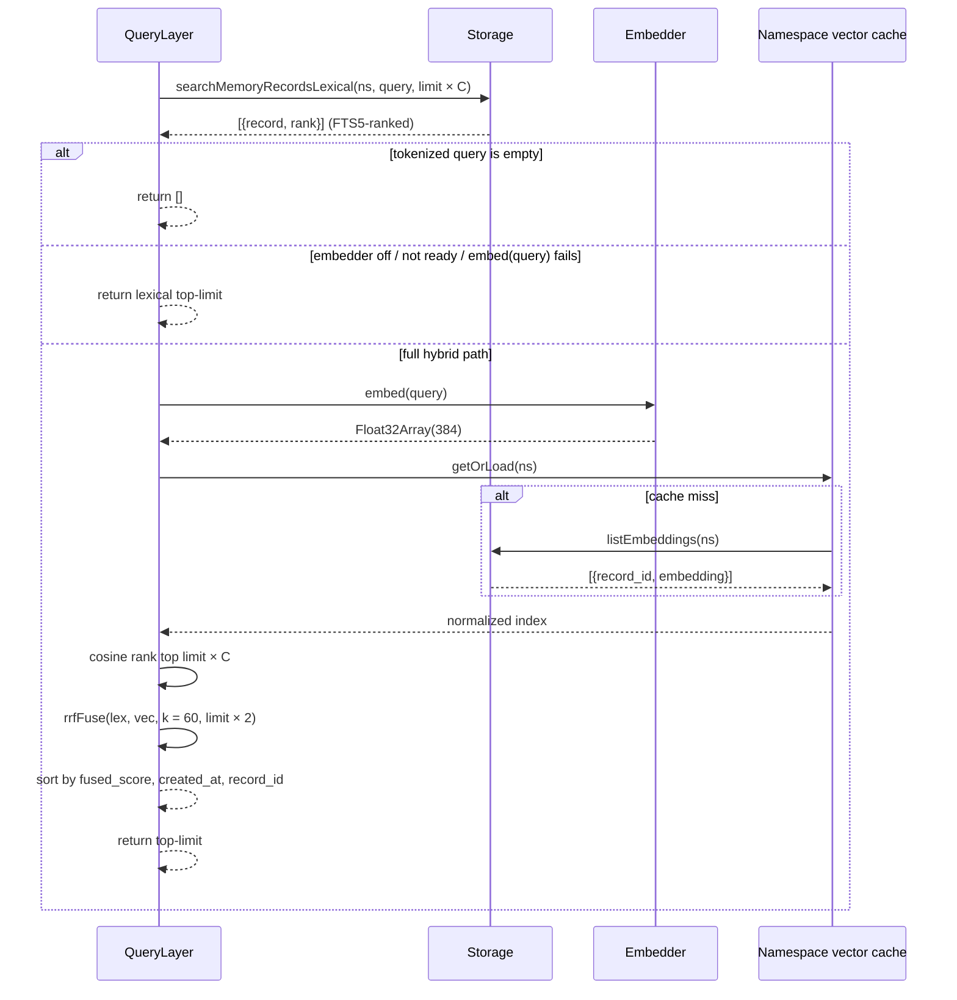
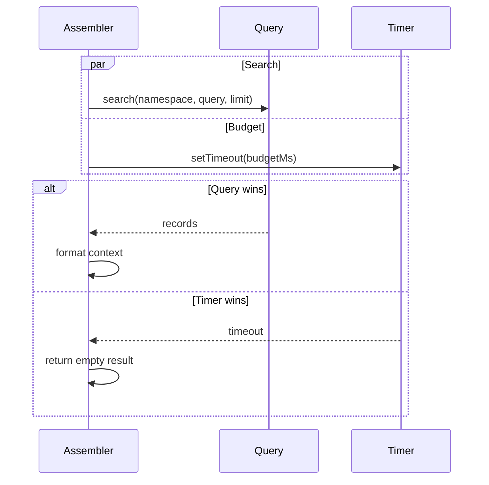

Retrieval is the path that turns the user's next prompt into a block of context the agent can read before responding. When a prompt event arrives, the [Collector](/architecture/collector) asks retrieval to find relevant memory records, format them, and hand back a string — all within a bounded time window so the agent is never kept waiting.

Retrieval is inline: it runs during the shim's POST and rides back in the same HTTP response. It is also best-effort: if the search fails or runs long, an empty context is returned and the prompt goes through unchanged. The agent proceeds either way.

## When it runs

Retrieval fires when two conditions are both true:

- The shim appends `?retrieve=true` to the POST.
- The event's `kind` is `prompt`.

Both conditions must hold. Tool-use events and session summaries never trigger retrieval, even if the shim requested it. This keeps retrieval concentrated at the one point in a turn where injected context is actually useful — the moment the agent is about to start work.



The rest of this page walks the stages in order: pulling a query out of the prompt, running the search, falling back when the search is unhappy, honoring the latency budget, and formatting the records into context.

## Extracting a query

The prompt event's body determines the search string. Bodies come in three shapes and each maps differently:

| Body type | What becomes the query |
|-----------|------------------------|
| `text` | The body's content verbatim |
| `message` | The content of the last turn |
| `json` | The body data serialized as JSON |

If the extracted query is empty — for example, a text body with no content — retrieval short-circuits and returns an empty result. There is nothing to search for.

## How search works

The query layer sits between retrieval and the [database](/architecture/database). It runs two rankings in parallel — FTS5 lexical search and vector cosine similarity — and fuses them with Reciprocal Rank Fusion into a single ordered list. When the embedder is off, unavailable, or fails for a given query, the fused path collapses cleanly to lexical-only, so search always returns whatever FTS5 would have returned.

Storage handles the lexical stage in two substages: a primary full-text path and a substring fallback.

### Primary path: full-text search

The primary path uses SQLite's [FTS5 full-text index](https://www.sqlite.org/fts5.html) on memory record titles and summaries. FTS5 gives real ranking (BM25) and respects stemming and diacritics, so a search for "migrations" will hit records that mention "migration" and "migrate".

The catch is that FTS5's match expression is a small query language — bare words, operators like `AND`/`OR`/`NOT`, special characters like `*` and `(`. Passing a raw user prompt into it is both unsafe and useless: typos can cause parse errors, and operator words get interpreted as operators instead of content. So the query is rewritten before it reaches the index.

The rewrite, in order:

1. **Tokenize.** Split the query on whitespace. Drop empty tokens. Deduplicate, preserving the order of first appearance.
2. **Rank and cap.** If the tokenized list exceeds 32 terms, rank tokens by [inverse document frequency](https://en.wikipedia.org/wiki/Tf%E2%80%93idf#Inverse_document_frequency) and keep the top 32. Rare terms are more discriminating, so they survive; common terms get dropped first. IDF is read from FTS5's own vocabulary table, so "rare" is defined relative to the actual memory corpus, not some external dictionary.
3. **Quote and join.** Wrap each retained token in double quotes (which makes it an FTS5 phrase with no operator semantics) and join with the `OR` keyword.

The result is a valid FTS5 expression that matches any of the user's terms and produces BM25-ranked results. A prompt like `migrate the user table to use uuid` becomes an `OR` of seven quoted phrases. A prompt like `what's the migration status?` survives the apostrophe, the question mark, and the word "what" without crashing the parser.

Namespace isolation is applied in the SQL itself — the statement joins against `mr.namespace LIKE ? || '%'` — so a project can only ever see its own memories, regardless of what the query looks like.

### Fallback path: substring search

The tokenizer aims to produce syntactically valid FTS5 expressions, but SQLite's FTS5 parser has enough corner cases that defending against all of them is not worth the effort. Instead, retrieval leans on a fallback:



If FTS5 refuses the sanitized query for any reason, the storage layer catches the error and runs a `LIKE '%query%'` search against the original user string instead. LIKE is slower and does no ranking — results come back ordered by creation date — but it always works, and it treats the query as a literal substring (the escape clause neutralizes `%` and `_` so a prompt containing those characters still means what it says).

The tradeoff is explicit: **availability over ranking quality**. A search that returns weaker results is better than one that errors out, because a failed search shows up to the agent as "no context at all" and that is worse than substring hits.

## Hybrid search

Lexical search matches the words the user typed. Semantic search matches the ideas they meant. Each catches cases the other misses — a prompt like "how do we handle stale auth tokens" lexically hits records that say "auth token" or "stale", but vector similarity also surfaces a record titled "refreshing expired credentials" that shares no keywords. kiro-learn runs both and fuses them.

### The two rankings

Every memory record has a dense vector alongside its FTS5 index row. The vectors are 384-dimensional `Float32Array`s produced by the [all-MiniLM-L6-v2](https://huggingface.co/sentence-transformers/all-MiniLM-L6-v2) sentence-transformer model, running locally on CPU via [`@huggingface/transformers`](https://huggingface.co/docs/transformers.js) and ONNX Runtime — no network call per embed. The model loads once at daemon startup from `~/.kiro-learn/models/` and is reused by every write and every query. See the [database page](/architecture/database#embeddings) for how vectors are stored.

At query time, both rankings run over the same namespace:

- **Lexical.** The sanitized FTS5 query described above, but the storage layer returns the top `limit × C` records along with each record's 1-based BM25 rank.
- **Vector.** The query string is embedded with the same model that embedded the records, then cosine similarity is computed against every non-null embedding in the namespace. The top `limit × C` records become the vector ranking.

`C` defaults to 4. The multiplier exists because RRF only fuses what you give it — a record that ranks 1st by cosine but 41st lexically would never enter the pool at `limit = 10` with `C = 1`, so the fused result would lose recall compared to an oracle. Fetching `C × limit` from each side gives fusion enough candidates that the final top-`limit` is stable. `C` is exposed as `CollectorConfig.hybridFetchDepthMultiplier`.

Vector similarity is computed in process, not in SQL. The per-namespace index is an in-memory array of pre-normalised `Float32Array`s, loaded lazily and cached for the life of the collector; a cosine call collapses to a dot product. No `sqlite-vec`, no HNSW, no ANN index — brute force is fine up to the spec's scale target of 50 000 records per namespace, and keeping the math in JS keeps the storage layer free of vector-specific SQL.

### Reciprocal Rank Fusion

The two rankings produce different score scales — FTS5 emits BM25 values, cosine emits `[-1, 1]` — so fusing them by raw score would require calibration that does not exist. [Reciprocal Rank Fusion](https://plg.uwaterloo.ca/~gvcormac/cormacksigir09-rrf.pdf) sidesteps the problem by fusing by rank instead:

```text
score(d) = Σᵢ 1 / (k + rankᵢ(d))
```

Each record's fused score sums one term per ranking it appears in. `k = 60` is the constant recommended in the RRF paper and it is the kiro-learn default. A record absent from a ranking contributes zero to that sum — so a record that only the vector side surfaced still gets a non-zero fused score, and vice versa.

After fusion, records are ordered by `(fused_score DESC, created_at DESC, record_id ASC)`. The tertiary sort on `record_id` makes the output deterministic across runs, which matters for tests and for not surprising the user when the same prompt returns a different order on a re-run.

### Sequence



### Lexical-only fallback

The search never degrades below the FTS5 baseline. Four situations short-circuit the vector path and return lexical-only results:

| Situation | What triggers it |
|-----------|------------------|
| Feature flag off | `CollectorConfig.embeddingEnabled` is `false`. Model is never loaded. |
| Embedder unavailable | `embedder.isReady()` returns `false` — model-load failure on daemon start, or the embedder was never constructed. |
| Query-embed failure | `embedder.embed(query)` rejects (timeout, internal error). One warning is logged with the error. |
| Namespace has no embeddings | All records in the namespace have a `NULL` embedding — typically on a fresh install before the backfill worker has caught up. Cosine ranking returns an empty list; fusion collapses to the lexical side only. |

In every case the function returns whatever the lexical path produced, truncated to `limit`. A record with a `NULL` embedding is not filtered out of results — it just cannot contribute to the vector ranking. The same record still participates in FTS5 matching normally.

The fallback is how the embedder's degraded-mode state is made invisible to the agent. Retrieval keeps working; quality may be lower until the model is restored, but the agent never sees an error or an empty result caused by the vector side alone. This is verified by Property 8 in the spec — for any corpus and any query, hybrid search with a dead embedder returns exactly the same ordered list as pure FTS5.

### Writes keep the cache in sync

The per-namespace vector index is a pure read-through cache. After every successful `putEmbedding` — whether from the extraction worker on a fresh record or the [backfill worker](/architecture/collector#backfill-worker) catching up on pre-existing records — the query layer's `invalidateNamespace(ns)` is called. The next search in that namespace reloads the index from storage. Invalidation is explicit rather than event-driven so the storage layer stays free of cache concerns.

## Latency budget

Retrieval runs on the shim's critical path. Every millisecond spent searching is a millisecond the developer spends staring at a blank prompt. So the assembler enforces a hard budget — default 500 ms — on the search step.

The mechanism is a race between two promises: the query and a timeout. Whichever resolves first wins.



If the timer wins, retrieval returns an empty context with the elapsed latency recorded. The search may still complete in the background; the storage layer is not cancelled. But nothing is injected into the prompt.

The assembler catches every error too. An unexpected exception inside the query, a storage outage, an unhandled rejection — all of them resolve to the same empty-result response. The only information that surfaces to the caller is the latency, which the collector records so the behavior is visible in logs and the viewer UI.

Why 500 ms? It is long enough that full-text search over a realistic memory corpus finishes comfortably, and short enough that the developer does not notice it. Prompts do not feel laggy. The budget is configurable per collector instance if a specific deployment wants different tuning.

## Context assembly

Once records come back, the assembler turns them into a markdown block the agent can read. The format is intentionally plain:

```markdown
## Prior observations from kiro-learn

### Title of the first memory record

Summary of the first memory record.

- A fact from this record
- Another fact

### Title of the second memory record

Summary of the second memory record.

- A fact from this record
```

A header introduces the block, then each record appears as a level-three heading plus its summary plus its facts as a bullet list. That is the whole format. No metadata, no record IDs, no timestamps, no concept lists — just the human-readable parts the agent can use as context.

If the search returned zero records, the context is an empty string. The collector still returns a retrieval object in the response (with `latency_ms` and an empty `records` array), but the context field is empty. The shim detects the empty string and does not write anything to stdout, so no header is injected if there is nothing to say.

The record IDs are returned separately in the `records` field. That field is for audit and debugging — the viewer UI shows which memories were retrieved on a given prompt — not for the agent's consumption. The agent sees only the context string.

## What comes back to the agent

The shim writes the context string to stdout. In Kiro CLI and Kiro IDE both, the agent runtime reads that stdout and prepends it to the prompt before invoking the model. From the model's perspective, the prompt now starts with a "Prior observations" section and then continues with whatever the user typed.

From the developer's perspective, retrieval is invisible. The prompt goes in, the response comes out. If kiro-learn has relevant prior context, the response reflects it. If not, the response is the same one the model would have produced anyway.

## Key design decisions

**Retrieval never throws.** The assembler returns a `RetrievalResult` under every condition: success, empty result, FTS5 error, storage error, timeout. There is no path where retrieval breaks an agent turn. The cost of this is quiet failures — if retrieval is consistently returning empty results, the symptom is "memory feels useless" rather than a visible error. The viewer UI's latency-per-retrieval metric is the counterweight.

**Availability over ranking.** The LIKE fallback exists so every reasonable query eventually produces results, even when the FTS5 sanitizer misses an edge case. Worse rankings are a better failure mode than no rankings at all.

**Never degrade below FTS5.** Hybrid search only ever adds signal — it cannot remove records that FTS5 would have surfaced. When the embedder is off, degraded, or fails on a specific query, the code path collapses to exactly the lexical ranking. This is a hard contract, pinned by a property test that compares hybrid-with-dead-embedder against pure-FTS5 for arbitrary corpora and queries.

**RRF over score calibration.** FTS5's BM25 and cosine similarity live on incompatible scales. Rather than tune a weighting function that depends on corpus statistics, kiro-learn fuses by rank using [Reciprocal Rank Fusion](https://plg.uwaterloo.ca/~gvcormac/cormacksigir09-rrf.pdf) with `k = 60`. The algorithm has no knobs that need tuning as the corpus grows.

**Budget enforced at assembly, not at storage.** The 500 ms budget wraps the entire search — lexical, vector, fusion, tie-break, everything. If a future storage backend is slower than the current brute-force cosine, the budget still applies. Storage does not need to know about it.

**Formatting is fixed.** The context format is not configurable. Every agent sees the same structure: a header, a list of records, summaries, facts. Keeping the format fixed means the model has one consistent shape to parse across every turn, and the project does not accumulate formatting flags the way a template engine would.

**Inline, not pull.** Retrieval runs on the prompt event's ingest path, not as a separate API call. The shim gets one HTTP round-trip per prompt — POST the event, get the context back. This is different from the [MCP server](/architecture/collector), which exposes a pull-based `search_memory` tool for agents that prefer to query explicitly. The inline path is the default; the MCP path is available when the agent wants more control.

## Related pages

<CardGroup cols={2}>
  <Card title="Database" href="/architecture/database">
    The FTS5 index and embedding column that back hybrid search
  </Card>
  <Card title="Viewer" href="/architecture/viewer">
    Where retrieved records surface in the dashboard
  </Card>
  <Card title="Extraction" href="/architecture/extraction">
    Where the memory records retrieval searches over come from
  </Card>
  <Card title="Summarization" href="/architecture/summarization">
    Turn summaries that surface through the same retrieval path
  </Card>
  <Card title="Collector" href="/architecture/collector">
    The daemon that invokes retrieval on prompt ingestion
  </Card>
  <Card title="Kiro CLI shim" href="/architecture/kiro-cli-shim">
    How the CLI shim requests retrieval and writes context to stdout
  </Card>
  <Card title="Kiro IDE shim" href="/architecture/kiro-ide-shim">
    How the IDE shim requests retrieval and writes context to stdout
  </Card>
</CardGroup>
