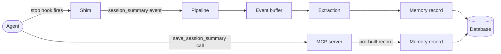
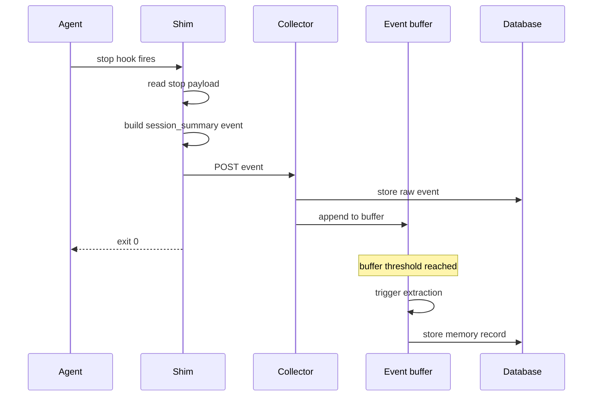
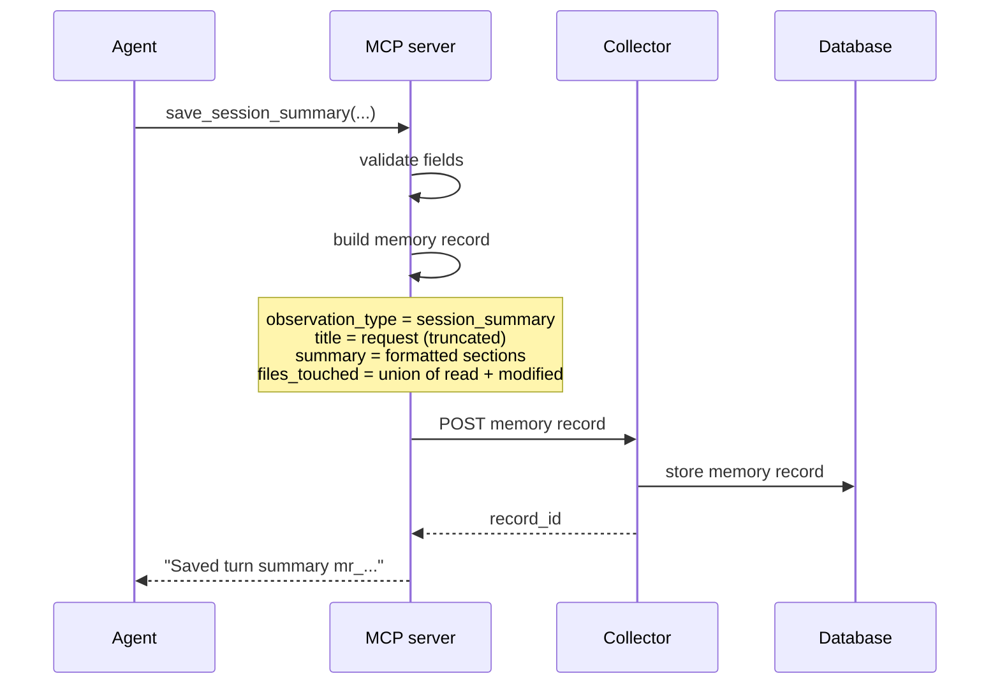

Summarization is how kiro-learn records what an agent turn was about — the request, what got investigated, what got learned, what got done, and what remains. It sits alongside per-event extraction: extraction distills individual tool uses into memory records, while summarization captures the arc of the full turn.

A _turn_ is one hook-to-hook cycle: prompt submit, zero or more tool uses, then stop. Turns are the natural unit of summarization because they bracket a coherent piece of work — one request from the developer, one response from the agent.

There are two paths to a turn summary. One is automatic: when the agent stops, a shim captures the stop payload and sends it through the normal pipeline. The other is explicit: the agent calls an MCP tool with a structured summary and it lands in memory directly.

## The hook path: automatic on stop

When a Kiro agent finishes a turn, it fires a stop hook. Both shims treat this hook as a turn summary signal:

- The [Kiro CLI shim](/architecture/kiro-cli-shim) handles the CLI `stop` hook and reads the `assistant_response` field from the hook's stdin JSON.
- The [Kiro IDE shim](/architecture/kiro-ide-shim) handles the IDE `agentStop` event and reads the payload from the `USER_PROMPT` environment variable.

In both cases, the shim wraps the text in an event with `kind: session_summary` and POSTs it to the [Collector](/architecture/collector).

From the collector's perspective, a `session_summary` event is no different from any other event. It goes through dedup, privacy scrubbing, database storage, and the buffer append — the same pipeline a `tool_use` or `prompt` event takes. When the buffer crosses its extraction threshold, the LLM processes the turn summary alongside the other events in the batch and produces memory records from it.

Two small differences between the two shims are worth noting:

- **Empty payload handling.** The IDE shim skips posting entirely when `USER_PROMPT` is empty — the IDE does not always populate it on `agentStop`. The CLI shim posts even an empty summary because the CLI's stop hook reliably provides the assistant's response.
- **Surface tag.** The IDE shim tags the event with `source.surface = 'kiro-ide'`; the CLI shim uses `'kiro-cli'`. This is the same distinction every event carries, not something specific to summaries.

Beyond that, the hook path is identical across both surfaces. The agent does not need to know summaries are being captured — the shim handles it passively.

## The MCP path: explicit and structured

The agent can also produce a turn summary deliberately by calling the `save_session_summary` tool exposed by the MCP server. This path is intended for moments when the agent wants to record a richer, structured recap than whatever the stop hook happens to carry — for example, at the end of a long investigation where the stop payload is a short acknowledgement but there is real signal worth preserving.

The tool takes seven required fields:

| Field | What it captures |
|-------|-----------------|
| `request` | What the user asked for |
| `investigated` | What the agent explored |
| `learned` | Key findings or discoveries |
| `completed` | What was delivered |
| `next_steps` | Suggested follow-ups |
| `files_read` | Files read during the turn |
| `files_modified` | Files modified during the turn |

The MCP server validates the fields, then builds a memory record directly and posts it to the collector's memory ingest endpoint. There is no event, no buffer append, no LLM summarization — the agent has already produced the structured output, so the pipeline has nothing to extract.

A few things happen inside the MCP server before the record is stored:

- **The title is derived from `request`**, truncated to the schema's 200-character limit.
- **The summary is assembled as a markdown block** with four sections — "What was investigated", "What was learned", "What was completed", "Next steps" — and truncated to 4000 characters if the concatenated sections exceed the cap. Sections are dropped from the bottom up if needed to stay under the limit.
- **`files_touched` is the deduplicated union** of `files_read` and `files_modified`. A file appears once even if the agent both read and modified it.
- **`observation_type` is `session_summary`** and the strategy is tagged `mcp_session_summary`, which distinguishes these records from hook-driven summaries that pass through extraction.

## What a turn summary record contains

Regardless of path, a turn summary lands as a memory record in the [database](/architecture/database). The record has all the usual fields — id, namespace, title, summary, concepts, files, timestamp — plus an `observation_type` of `session_summary` that marks it as a turn-level artifact rather than a per-event observation.

The two paths produce records that differ in a few ways:

| | Hook path | MCP path |
|--|-----------|----------|
| Produced by | The extraction LLM, from a `session_summary` event | The agent directly, formatted by the MCP server |
| Strategy field | `llm-summary` | `mcp_session_summary` |
| Content shape | Whatever the extraction prompt produces | Fixed four-section markdown |
| Concepts | Extracted from the content by the LLM | Empty by default |
| Files | Extracted from the content by the LLM | The deduplicated union of `files_read` and `files_modified` |
| Source events | The buffered events the batch included | A single synthetic source id |

Both are fully searchable through [retrieval](/architecture/retrieval) — the `observation_type` filter is available but not required. A search for "database migration" will surface both styles of summary if either matches, the same way it surfaces any other memory record.

## Why summaries exist alongside per-event extraction

Per-event extraction is good at turning individual tool uses into durable facts — "the package uses ESM with explicit `.js` extensions", "the storage layer rejects events with duplicate ids". Turn summaries capture a different level of detail: the arc of the work. What did the user want? What got tried? What was the outcome? That framing is hard to recover from individual tool-use events because it lives at the turn level, not at the tool level.

Having both paths to a summary is deliberate:

- **The hook path catches everything.** Every turn ends, every turn produces a summary, the agent does not need to opt in. The cost is that the quality of the summary depends on whatever the agent happened to say at stop — sometimes rich, sometimes a one-line acknowledgement.
- **The MCP path is opt-in and high-quality.** When the agent knows a turn was substantive and worth preserving, it can call `save_session_summary` and record exactly what mattered, in a structured form that skips the LLM roundtrip entirely.

Together they give two levers. If an agent never calls the MCP tool, the hook path still produces summaries for every turn. If an agent calls the MCP tool regularly, those structured summaries land alongside the hook-generated ones and both become retrievable context for future turns.

## Key design decisions

**Two paths, one storage model.** Both paths produce the same kind of memory record in the same table with the same `observation_type`. Retrieval does not care which path produced a summary. This keeps the downstream code simple — search, ranking, and context assembly work on memory records without branching on provenance.

**The hook path goes through the pipeline.** A `session_summary` event is just another event kind. It does not bypass dedup, privacy scrubbing, or the buffer. This reuses all the reliability work already invested in the ingestion path, and means a summary with a `<private>` tag gets redacted the same way a prompt or tool use would.

**The MCP path skips extraction.** When the agent hands the collector a well-formed summary, there is no reason to feed it through an LLM for extraction — the structure the agent produced is the structure we want to store. Going direct avoids a wasted model call and makes the save latency predictable.

**Empty summaries are treated differently.** The CLI shim posts empty summaries because the CLI's stop hook is well-behaved — an empty `assistant_response` is a genuine signal that nothing was said. The IDE shim drops empty summaries because the IDE does not always populate the stop payload, so an empty value is noise, not signal. This is a small accommodation for how the two runtimes actually behave.

**`session_summary` is a first-class observation type.** It is a distinct value in the schema, not a flag on another type. This makes it cheap to filter summaries in and out of retrieval if a future feature needs to — for example, prioritizing turn summaries when assembling context for a new turn on the same project.

## Related pages

<CardGroup cols={2}>
  <Card title="Retrieval" href="/architecture/retrieval">
    How turn summaries surface as context in future turns
  </Card>
  <Card title="Database" href="/architecture/database">
    Where turn summary records are persisted
  </Card>
  <Card title="Extraction" href="/architecture/extraction">
    How hook-driven summaries are distilled into memory records
  </Card>
  <Card title="Collector" href="/architecture/collector">
    The daemon that stores both hook-driven and MCP-driven summaries
  </Card>
  <Card title="Kiro CLI shim" href="/architecture/kiro-cli-shim">
    How the CLI stop hook becomes a turn summary event
  </Card>
  <Card title="Kiro IDE shim" href="/architecture/kiro-ide-shim">
    How the IDE agentStop hook becomes a turn summary event
  </Card>
</CardGroup>
