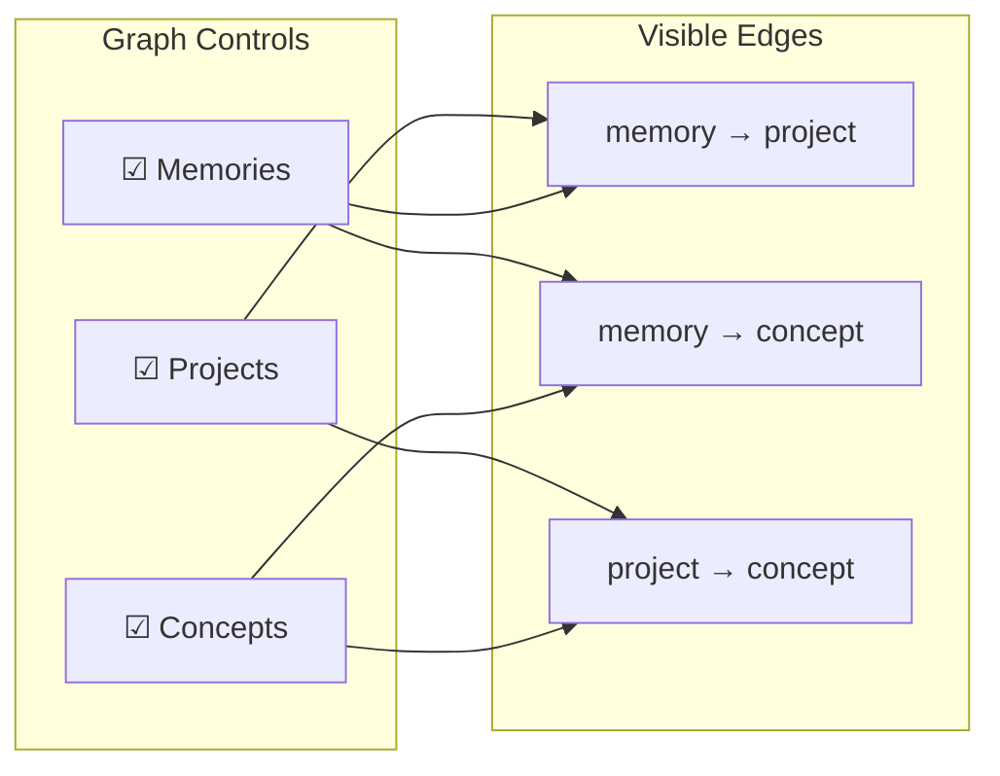

The viewer is a single-page app served by the collector at `/ui/*`. It gives you a live window into kiro-learn's memory state — what events have been captured, what memory records exist, and how concepts relate to each other across projects.

Access it at [http://127.0.0.1:21100/ui/](http://127.0.0.1:21100/ui/) when the daemon is running.

## What it shows

The dashboard is built with [Cloudscape Design System](https://cloudscape.design/) and React. It presents four sections in a single scrollable layout:

1. **Health indicator** — top navigation shows whether the collector is online, offline, or connecting. Also displays the current version and a dark mode toggle.
2. **Metric cards** — four cards showing total memories, total events, project count, and concept count.
3. **Memory graph** — an interactive force-directed graph visualizing relationships between projects, concepts, and memory records.
4. **Recent Events table** — a live feed of the last 50 events with time, kind, session, and body preview columns.

Clicking a memory or concept node in the graph opens a **detail panel** that slides in from the right, showing the full record (summary, observation type, facts, concepts, files touched, source event IDs) without navigating away from the graph.

## Polling

The viewer fetches data from the collector's read API on mount and every 10 seconds thereafter:

| Endpoint | What it provides |
|----------|-----------------|
| `GET /healthz` | Daemon status and version string |
| `GET /v1/stats` | Aggregate counts for metric cards + project metadata |
| `GET /v1/events?limit=50` | Recent events for the event tail |
| `GET /v1/memories?limit=500` | Memory records for the graph |

All four requests fire in parallel using `Promise.allSettled`. If one fails, the others still update — the UI degrades gracefully per section rather than blanking the whole page.

## Memory graph

The graph is the centerpiece of the dashboard. It uses [React Flow](https://reactflow.dev/) for rendering and a d3-force simulation for layout.

### Node types

Three node types appear in the graph, each with distinct colors:

| Node type | Color (light / dark) | What it represents |
|-----------|---------------------|-------------------|
| **Project hub** | Blue (`#3B82F6` / `#60A5FA`) | A namespace — one per project that has memory records |
| **Concept** | Green (`#10B981` / `#34D399`) | A unique concept string extracted from memories |
| **Memory** | Pink (`#F43F5E` / `#FB7185`) | A single memory record (title truncated to 40 chars) |

### Edges

Edges show relationships between nodes:

- **Memory → Project** — every memory belongs to a project
- **Memory → Concept** — every memory links to its extracted concepts
- **Project → Concept** — structural edge connecting a project to its concept cluster (shown when memory nodes are hidden)

Edges are animated and use directional handles (top/bottom/left/right) chosen based on relative node positions.

### Layout

The graph uses a d3-force simulation with four forces:

- **Link force** — edges act as springs pulling connected nodes together (distance: 100, strength: 0.5)
- **Charge force** — nodes repel each other (strength: −250)
- **Center force** — keeps the graph centered at the origin
- **Collision force** — prevents node overlap based on node dimensions

Initial positions are derived deterministically from node IDs using a hash function, so the layout converges to the same result on every 10-second refresh. Nodes don't jump around between polls.

### Filtering

Three checkboxes above the graph let you toggle visibility of each node type (Projects, Memories, Concepts). Edge visibility adapts automatically — only edges whose both endpoints are visible and whose link type is relevant to the active combination are shown.



## Detail panel

Clicking a memory node or concept node opens a slide-in panel on the right side of the screen (400px wide). The panel overlays the graph without navigating away.

**Memory detail** shows:
- Summary text
- Observation type (color-coded badge)
- Creation timestamp
- Facts (bulleted list)
- Concepts (badge list)
- Files touched (code-formatted list)
- Source event IDs

**Concept detail** shows:
- The concept name
- A list of all memory records that reference this concept

Click the backdrop or the close button to dismiss the panel.

## Dark mode

A toggle in the top navigation switches between light and dark themes. The preference is persisted to `localStorage` under the key `kiro-learn-dark-mode`. The toggle applies Cloudscape's global mode (`Mode.Dark` / `Mode.Light`) and propagates the `darkMode` flag to all graph nodes so their colors update immediately.

## Static asset serving

The collector serves the viewer's built assets from `~/.kiro-learn/ui/` (deployed by `kiro-learn init`). The static handler in `src/collector/receiver/static-handler.ts` enforces:

- **Null byte rejection** — requests containing `\x00` (raw or percent-encoded) get a 400.
- **Path normalization** — URL paths are decoded and resolved against the asset root. Any resolved path that escapes the root directory gets a 403.
- **Content-hash caching** — Vite-hashed filenames (e.g., `index-BxK4H1mN.js`) receive `Cache-Control: public, max-age=31536000, immutable`. Non-hashed files receive `no-cache`.
- **SPA fallback** — extensionless paths that don't match a file are served `index.html` so client-side routing works. Paths with an extension that don't match a file get a 404.

## Dev mode

For local UI development, run:

```bash
npm run dev:ui
```

This starts Vite on `127.0.0.1:5173` with a proxy that forwards `/healthz` and `/v1/*` requests to the collector at `:21100`. You get hot module replacement for the React components while hitting the real collector API.

The production build (`npm run build:ui`) outputs to `dist/ui/` with a `/ui/` base path so assets resolve correctly when served by the collector.

## Source files

| File | Role |
|------|------|
| `ui/src/App.tsx` | Root layout — health polling, metric cards, graph container, event tail |
| `ui/src/components/EventTail.tsx` | Recent Events table component |
| `ui/src/components/MemoryGraph.tsx` | React Flow wrapper with filtering and click handling |
| `ui/src/components/MemoryDetailPanel.tsx` | Slide-in detail panel for memories and concepts |
| `ui/src/graph/transform.ts` | Pure transform: memories + projects → React Flow nodes and edges |
| `ui/src/graph/layout.ts` | d3-force simulation for deterministic node positioning |
| `ui/src/graph/theme.ts` | Node and canvas color tokens for light/dark mode |
| `ui/src/graph/ProjectNode.tsx` | Custom React Flow node for project hubs |
| `ui/src/graph/ConceptNode.tsx` | Custom React Flow node for concepts |
| `ui/src/graph/MemoryNode.tsx` | Custom React Flow node for memory records |
| `ui/vite.config.ts` | Build config — output to `dist/ui/`, dev proxy to collector |
| `src/collector/receiver/static-handler.ts` | Path-traversal protection, MIME detection, SPA fallback |

## Key design decisions

**Polling over WebSocket.** The viewer polls every 10 seconds rather than maintaining a persistent connection. The data changes infrequently (only after extraction completes), and polling keeps the collector simple — no connection state, no upgrade handling, no heartbeats.

**Deterministic layout.** Node positions are derived from a hash of node IDs, not `Math.random()`. This means the graph settles into the same shape on every refresh, avoiding the disorienting "nodes jump around" problem common in force-directed graphs.

**Graceful degradation.** Each API call is independent. If `/v1/memories` fails but `/v1/stats` succeeds, the metric cards still update. Sections show their own loading and error states rather than blocking the whole page.

**No server-side rendering.** The viewer is a client-side SPA. The collector serves static files and JSON APIs — it never renders HTML dynamically. This keeps the collector focused on its core job (event processing) and lets the UI iterate independently.

## Related pages

<CardGroup cols={2}>
  <Card title="Collector" href="/architecture/collector">
    The daemon that hosts the viewer and serves its API
  </Card>
  <Card title="Database" href="/architecture/database">
    Where the events and memories displayed in the viewer are stored
  </Card>
  <Card title="Architecture overview" href="/architecture/overview">
    How the viewer fits into the full system
  </Card>
</CardGroup>
