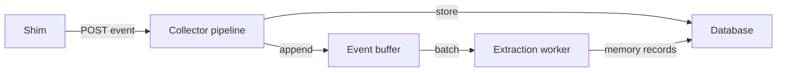
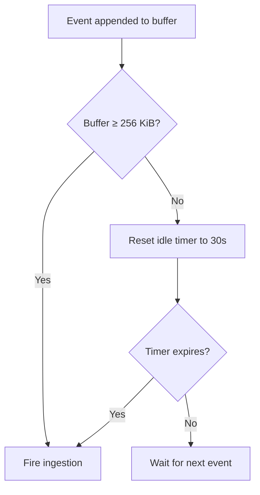

## What is the event buffer?

The event buffer is a per-project staging area that sits between event ingestion and memory extraction. When the [collector](/architecture/collector) receives an event from a shim, it stores the event in the [database](/architecture/database) immediately — but [extraction](/architecture/extraction) (the LLM-powered step that turns raw events into structured memory records) happens asynchronously, in batches.

The buffer holds events that are waiting to be extracted. It decouples the speed of ingestion from the latency of extraction, so the shim never blocks waiting for an LLM response.



## Why buffering exists

[Extraction](/architecture/extraction) is slow. Each batch of events is sent to an LLM (via kiro-cli → Amazon Bedrock), which takes seconds to respond. Meanwhile, events keep arriving — a single agent turn can produce dozens of tool-use events in rapid succession.

Without a buffer, the system would need to either:

- **Block ingestion** until extraction finishes (unacceptable — the shim must exit immediately), or
- **Extract one event at a time** (wasteful — batching is more efficient for LLM calls).

The buffer solves both problems. Events are appended instantly, and the extraction worker processes them in efficient batches when conditions are right.

## How events flow into the buffer

Events pass through the [collector pipeline](/architecture/collector) before reaching the buffer:

1. **Deduplication** — reject events already seen (by `event_id`).
2. **Privacy scrub** — strip `<private>...</private>` tags, replacing content with `[REDACTED]`.
3. **Storage** — persist the full event in the [database](/architecture/database).
4. **Buffer append** — project a lightweight entry and append it to the [project's](/concepts/projects) buffer file.

The buffer entry is a stripped-down version of the full event. It keeps only what the extraction worker needs: `event_id`, `namespace`, `kind`, `body`, `timestamp`, and `surface`. Fields like `schema_version`, `content_hash`, and the full `source` block are dropped to keep buffer files lean.

## Per-project isolation

Each [project](/concepts/projects) gets its own buffer file — an append-only NDJSON (newline-delimited JSON) file stored at:

```
~/.kiro-learn/buffers/<project_id>/buffer.ndjson
```

Each line in the file is a self-contained JSON object representing one buffer entry. This format is simple, crash-safe (a partial write only corrupts the last line), and easy to inspect manually.

Per-project isolation means:

- [Extraction](/architecture/extraction) processes each project independently — a slow extraction in one project doesn't block another.
- Buffer size thresholds are tracked per project.
- Clearing a buffer after successful extraction only affects one project.

See [Projects](/concepts/projects) for how project IDs are derived and how project detection works.

## What triggers the ingestion pipeline

The buffer watcher monitors each project's buffer and fires an [extraction trigger](/architecture/extraction) when either condition is met:

| Trigger | Default threshold | Configurable range | Why |
|---|---|---|---|
| **Size threshold** | 256 KiB | — | Enough events have accumulated to make a batch worthwhile. |
| **Idle timer** | 30 seconds | 5–300 seconds | No new events have arrived — ingest what's there rather than waiting indefinitely. |



The idle timer ensures that even a single event gets ingested eventually — you don't need to fill the buffer to trigger processing. The size threshold ensures that bursts of activity are batched efficiently rather than handled one-by-one.

The 30-second default sits in the middle of the configurable range. Shorter intervals make memory feel more responsive but give the [extraction worker](/architecture/extraction) fewer candidates to dedupe against each other. Longer intervals let more context accumulate per batch, which helps the dedupe pass find duplicates, at the cost of more latency between "something interesting happened" and "it's searchable". Tune via `bufferIdleMs` on `CollectorConfig` — values outside `[5_000, 300_000]` milliseconds are rejected at daemon startup.

If ingestion is already in-flight for a project, additional triggers are suppressed until the current run completes.

## What triggers compaction

[Compaction](/architecture/compaction) fires when a buffer grows beyond the **compaction threshold** (default: 1 MiB). This is a safety valve — if extraction can't keep up with ingestion (perhaps the LLM is slow or failing), the buffer would grow without bound.

When compaction fires:

1. The [compaction worker](/architecture/compaction) reads existing memory records for the project.
2. It sends them to an LLM for summarization — condensing many records into fewer, higher-level summaries.
3. The oldest records are evicted deterministically.
4. The buffer file is atomically replaced with the compacted content.

There's also a **hard ceiling** (default: 4 MiB) above which new appends are refused entirely. This prevents runaway disk usage if both extraction and compaction are failing.

## Relationship to the workers

The buffer connects two async workers:

| Worker | Triggered by | What it does |
|---|---|---|
| **[Extraction worker](/architecture/extraction)** | Size threshold or idle timer | Reads the buffer snapshot, frames entries as XML, sends to the LLM, stores resulting memory records, clears the buffer on success. |
| **[Compaction worker](/architecture/compaction)** | Compaction threshold | Summarizes existing memory records via LLM, evicts old records, atomically replaces the buffer with compacted content. |

Both workers operate asynchronously — they never block event ingestion. The [collector](/architecture/collector) returns a response to the shim immediately after appending to the buffer.

## How the buffer is cleared

After the [extraction worker](/architecture/extraction) successfully processes a batch:

1. The LLM returns structured memory records.
2. The records are stored in the [database](/architecture/database).
3. The buffer file is deleted (cleared).
4. The watcher resets its byte counter for the project.

If extraction fails, the buffer is left intact. Events aren't lost — they'll be retried on the next trigger. A circuit breaker disables extraction after 3 consecutive failures to avoid hammering a failing LLM, but the events remain safely in the buffer.

## Resilience

The buffer is designed to handle failures gracefully:

- **Crash recovery** — NDJSON format means a partial write only corrupts the last line. On the next read, corrupt lines are skipped with a warning.
- **Concurrent access** — the atomic replace operation uses POSIX file locking (`flock`) to prevent data loss when [compaction](/architecture/compaction) and ingestion happen simultaneously. Any events appended during compaction are captured in a "catch-up window" and replayed into the new buffer.
- **Circuit breaker** — after 3 consecutive extraction failures, the watcher disables extraction for that project and logs a warning. Events continue to buffer safely.

<Callout type="tip">
  You can inspect a project's buffer directly by reading the NDJSON file at `~/.kiro-learn/buffers/<project_id>/buffer.ndjson`. Each line is a JSON object you can pipe through `jq` for readability.
</Callout>

## Related pages

<CardGroup cols={2}>
  <Card title="Collector" href="/architecture/collector">
    The daemon that appends events to the buffer
  </Card>
  <Card title="Extraction" href="/architecture/extraction">
    The worker that reads buffer snapshots and creates memory records
  </Card>
  <Card title="Compaction" href="/architecture/compaction">
    The pressure valve when buffers grow too large
  </Card>
  <Card title="Projects" href="/concepts/projects">
    How per-project buffer isolation is defined
  </Card>
  <Card title="Database" href="/architecture/database">
    Where events and memory records are persisted
  </Card>
</CardGroup>
