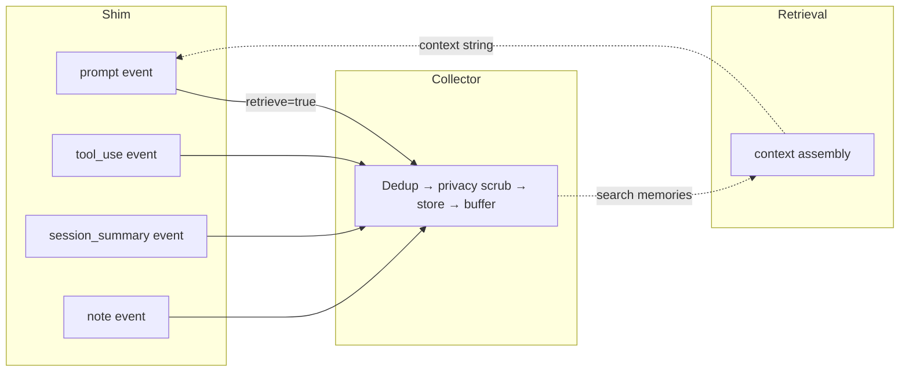

Everything kiro-learn learns from flows through a single wire format: the _event_. Every hook fired by a Kiro agent — a prompt submitted, a tool invoked, a turn completed — is normalized by a [shim](/architecture/kiro-cli-shim) into an event and POSTed to the [collector](/architecture/collector). Events are what the [event buffer](/concepts/event-buffer) holds, what the [extraction worker](/architecture/extraction) reads, and what ultimately becomes a memory record in the [database](/architecture/database).

This page is the reference for the four event kinds, the three body shapes they carry, and the fields every event includes regardless of kind.

## The four kinds

Every event has a `kind` field that classifies what happened. There are exactly four values:

| Kind | Fires when | Drives retrieval? | Typical body |
|------|-----------|-------------------|--------------|
| `prompt` | The developer submits a prompt to the agent | Yes — context is retrieved and injected | `text` or `message` |
| `tool_use` | The agent finishes invoking a tool | No | `json` |
| `session_summary` | The agent finishes a turn (hook-to-hook cycle) | No | `text` |
| `note` | Administrative or lifecycle marker (e.g. agent spawn) | No | `text` |

### prompt

A `prompt` event captures a message the developer sent to the agent. It is the only event kind that triggers retrieval — when the shim POSTs a prompt, it asks the collector to also search prior memories and return relevant context, which is then written to stdout for injection back into the agent's prompt.

- **CLI shim** — fires on `userPromptSubmit`, reads the prompt text from the hook's stdin JSON.
- **IDE shim** — fires on `promptSubmit`, reads the prompt text from the `USER_PROMPT` environment variable.

Prompt events feed [extraction](/architecture/extraction) so that important user requests ("refactor the storage layer to use SQLite WAL mode") are preserved as memory records and can inform future turns on the same project.

### tool_use

A `tool_use` event captures the outcome of a single tool invocation by the agent — reading a file, running a command, writing a diff, calling an MCP tool. It is the highest-volume event kind in practice; a single agent turn typically produces many.

- **CLI shim** — fires on `postToolUse`, reads tool name, input, and response from the hook's stdin JSON.
- **IDE shim** — fires on `postToolUse`, reads a camelCase JSON payload (`toolName`, `toolArgs`, `toolResult`, `toolSuccess`) from `USER_PROMPT` and maps it to the internal snake_case structure.

Tool uses are the raw material extraction draws on to produce durable, fact-level memory records ("migration 0003 added a nullable `project_path` column"). They do not drive retrieval directly — only prompt events do — but the memory records extracted from them are the records that surface on future prompts.

### session_summary

A `session_summary` event captures the arc of a turn: what the user asked, what the agent did, what changed. It fires at the end of every turn.

- **CLI shim** — fires on `stop`, reads `assistant_response` from the hook's stdin JSON. Posts even when the response is empty.
- **IDE shim** — fires on `agentStop`, reads the final message from `USER_PROMPT`. Skips posting when the payload is empty (the IDE does not always populate it).

Turn summaries are the input to the hook path in [Summarization](/architecture/summarization). Extraction treats them as just another event in the batch, but the resulting memory records carry an `observation_type` of `session_summary` to mark them as turn-level artifacts distinct from per-tool observations.

### note

A `note` event is a lightweight marker that does not correspond to developer activity. It is used sparingly — the CLI shim emits a `note` on `agentSpawn` to mark the start of an agent process, for example. Notes are stored and buffered the same as any other event, but they are typically filtered out by extraction because they carry no signal worth extracting.

Notes exist so the event log in the [viewer UI](/architecture/collector#viewer-ui) has visible start markers without polluting the extraction batch with content that does not belong in memory records.

## The three body shapes

Every event has a `body` field that carries the actual payload. The body is a discriminated union on `type` — one of `text`, `message`, or `json`. The choice of body shape depends on the event kind and the source content.

### text

A plain UTF-8 string. Used for simple content where structure is not needed.

```json
{
  "type": "text",
  "content": "refactor the storage layer to use SQLite WAL mode"
}
```

Used by: `prompt` (when the prompt is plain text), `session_summary` (always), `note` (always).

### message

An ordered list of role-tagged turns. Used when the agent's input is a structured conversation — for example, an IDE chat history with system, user, and assistant turns.

```json
{
  "type": "message",
  "turns": [
    { "role": "user", "content": "what does the extraction worker do?" },
    { "role": "assistant", "content": "it reads buffered events and sends them to an LLM..." }
  ]
}
```

At least one turn is required. Used by: `prompt` (when the source is a structured message list).

### json

An arbitrary structured payload. Used when the event's content is naturally hierarchical — most commonly tool invocations, where name, arguments, response, and success flag all need to be carried together.

```json
{
  "type": "json",
  "data": {
    "tool_name": "readFile",
    "tool_input": { "path": "src/index.ts" },
    "tool_response": {
      "success": true,
      "result": "file contents..."
    }
  }
}
```

Used by: `tool_use` (always).

### Size limits and truncation

Every body shape is subject to the same 1 MiB serialized cap — the collector rejects anything larger at schema validation. Before that cap is hit, the [shim](/architecture/kiro-cli-shim) applies intelligent truncation at 512 KiB:

- `text` — trims content and appends `[truncated by kiro-learn]`
- `json` — trims `tool_response.result` first (the field most likely to be oversized), falling back to truncating the entire serialized payload
- `message` — trims turns from the end, starting with the last turn's content

Truncation happens in the shim before the event leaves the agent's machine. The collector never sees an oversized payload in normal operation.

## Fields every event carries

Regardless of `kind` or `body` shape, every event includes a common set of envelope fields:

| Field | What it is |
|-------|-----------|
| `event_id` | A [ULID](https://github.com/ulid/spec) — unique, time-ordered, 26 characters |
| `kind` | One of `prompt`, `tool_use`, `session_summary`, `note` |
| `body` | The discriminated-union payload (`text`, `message`, or `json`) |
| `namespace` | The [project](/concepts/projects) scope — `/actor/<username>/project/<project_id>/` |
| `actor_id` | The OS username of the developer |
| `session_id` | An opaque identifier for the agent process lifetime |
| `valid_time` | ISO 8601 datetime with offset — when the event happened |
| `source.surface` | `kiro-cli` or `kiro-ide` — which shim produced the event |
| `source.version` | kiro-learn version of the emitting shim |
| `source.project_path` | Absolute filesystem path of the detected project root |
| `schema_version` | Literal `1` — the wire contract version |
| `content_hash` | Optional `sha256:<hex>` digest of the body for dedup |
| `parent_event_id` | Optional — links related events (e.g., a tool use to its prompt) |

The `namespace` field is how events get scoped to projects. Every event lives in exactly one namespace, and retrieval, buffering, and extraction all operate at that scope. See [Projects](/concepts/projects) for how namespaces are derived.

The `source.surface` field is the only place the origin of an event is recorded. After the shim tags it, downstream components (pipeline, buffer, extraction, retrieval) are surface-agnostic — they work on events, not on shims.

## How event kinds map to the pipeline

Different kinds have slightly different downstream behavior, even though they all travel the same path:



All four kinds go through the same cleaning pipeline (dedup, privacy scrub, store, buffer). The only kind that also triggers inline retrieval is `prompt` — when the shim POSTs it, it sets `?retrieve=true` and the collector searches the database for relevant memories, returning them in the HTTP response for the shim to inject into the agent's prompt.

All four kinds are stored in the `events` table in the [database](/architecture/database) and are visible in the event tail in the viewer UI. All four kinds are eligible for [extraction](/architecture/extraction) into memory records — though `note` events typically produce no records because they carry no extractable signal.

## Why four kinds and not one

It would be possible to collapse all events into a single opaque "event" type with an arbitrary `body`. Having four distinct kinds gives the pipeline leverage it would otherwise have to recover from the payload:

- **Retrieval only has to care about `prompt` events.** The collector does not need to guess which incoming event represents a user request — the kind field says so directly.
- **Extraction can treat kinds differently.** The extraction prompt can reason about the role of each event in the batch ("here is a prompt, here are the tool uses that followed, here is what the agent said at the end") because the kinds are explicit.
- **The event tail in the viewer UI can render each kind differently.** Prompts look like prompts, tool uses look like tool uses.
- **Filtering and analytics are cheap.** Counting turns in a project, seeing the most active tools, finding turns where a specific tool failed — all are one SQL predicate on `kind`.

The kind is also a _stable_ classification: the four values are part of the v1 wire contract and cannot change without a schema bump. This means tools built against the event log — the viewer UI, external analytics, the MCP server, future exporters to a remote knowledge base — can rely on the kind field being present and meaningful.

## Related pages

<CardGroup cols={2}>
  <Card title="Projects" href="/concepts/projects">
    How every event gets scoped to a project via `namespace`
  </Card>
  <Card title="Event buffer" href="/concepts/event-buffer">
    Where events wait before extraction
  </Card>
  <Card title="Kiro CLI shim" href="/architecture/kiro-cli-shim">
    How CLI hook payloads become events
  </Card>
  <Card title="Kiro IDE shim" href="/architecture/kiro-ide-shim">
    How IDE hook payloads become events
  </Card>
  <Card title="Extraction" href="/architecture/extraction">
    How events become memory records
  </Card>
  <Card title="Summarization" href="/architecture/summarization">
    How `session_summary` events capture turn-level arcs
  </Card>
</CardGroup>
