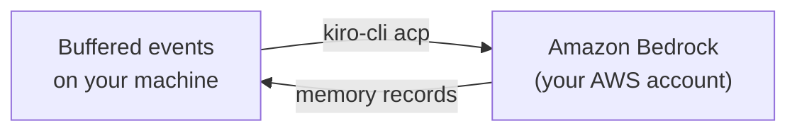

kiro-learn is designed to stay out of your way — and out of the cloud. This page explains exactly where your data lives, what (if anything) leaves your machine, and how to keep sensitive content out of memory records entirely.

## What lives on your machine

Everything kiro-learn captures and produces is stored locally by default:

| Data | Location | Format |
|------|----------|--------|
| Raw events | `~/.kiro-learn/kiro-learn.db` | SQLite table with FTS5 index |
| Memory records | `~/.kiro-learn/kiro-learn.db` | SQLite table with FTS5 index |
| Event buffers (pre-extraction) | `~/.kiro-learn/buffers/<project_id>/buffer.ndjson` | Newline-delimited JSON |
| Daemon config | `~/.kiro-learn/settings.json` | JSON |
| Viewer UI assets | `~/.kiro-learn/ui/` | Static HTML/JS/CSS |
| Session markers | `/tmp/kiro-learn-session-<hash>` | Plain text |

There is no hosted SaaS component. No account. No phone-home. No telemetry pings. The [collector](/architecture/collector) binds to `127.0.0.1:21100` — it does not listen on an external interface, so other machines on your network cannot reach it.

## What leaves your machine

One thing, and only one thing: **[extraction](/architecture/extraction)**.

When the [event buffer](/concepts/event-buffer) reaches its size or idle threshold, the extraction worker sends a batch of buffered events to an LLM for structured memory extraction. The LLM is Amazon Bedrock, reached through `kiro-cli acp` using **your own AWS credentials**.



What this means in practice:

- **No third party.** The traffic goes from your machine, through `kiro-cli`, to Amazon Bedrock in your AWS account. kiro-learn does not operate any server in this path.
- **Your credentials, your billing, your region.** Extraction runs against the Bedrock region your `kiro-cli` is configured for, billed to your AWS account.
- **No data retention beyond the model call.** Bedrock's data-handling posture applies — see [Amazon Bedrock data protection](https://docs.aws.amazon.com/bedrock/latest/userguide/data-protection.html) for the full policy.
- **The returned memory records come back to your local database.** They do not leave again.

If you never run extraction (for example, by running the collector without `kiro-cli` configured), no data leaves your machine at all. Events still get stored and buffered locally — you just won't have extracted memory records.

## The `<private>` tag

Sometimes you need to paste something sensitive into a prompt — a credential, a customer email, a proprietary identifier — and you don't want it ending up in the memory record that summarizes that turn.

Wrap it in `<private>...</private>` and kiro-learn strips it out before storage:

```text
Debug this error for me: <private>API_KEY=sk-live-abc123</private>
The credential was rejected by the auth service.
```

After the [privacy scrub stage](/architecture/collector) runs, what actually gets stored, buffered, and sent to the LLM is:

```text
Debug this error for me: [REDACTED]
The credential was rejected by the auth service.
```

The substitution happens in the [collector's](/architecture/collector) cleaning pipeline, before anything is written to disk or queued for extraction. This is a deliberate choice: the [shim](/architecture/kiro-cli-shim) does not scrub (so the full content never needs to be trusted in the shim process), and [storage](/architecture/database) does not scrub (so the invariant "nothing with `<private>` ever reaches storage" is maintained by a single component).

### What gets scrubbed

- **Paired tags.** The content between a `<private>` opening tag and its matching `</private>` closing tag is replaced with `[REDACTED]`.
- **Nested tags.** The outermost pair wins. Any `<private>` tags inside are part of the redacted content.
- **Unclosed tags.** If `<private>` is not closed, the redaction extends to the end of the body. Better to over-redact than leak.

### What does not get scrubbed

- **Text outside the tags** stays verbatim, including surrounding context.
- **Tags in tool names or file paths** are not treated as privacy markers — only content inside event bodies is scrubbed.
- **Output from past turns already stored** is not retroactively scrubbed. If you forgot to tag something last week, it's in the database now. See the escape hatch below.

## Escape hatches

### Deleting memory for a project

Every [project](/concepts/projects) gets its own `project_id`. If you want all memory for a project gone:

```bash
# Delete the SQLite rows
sqlite3 ~/.kiro-learn/kiro-learn.db \
  "DELETE FROM events WHERE namespace LIKE '/actor/%/project/<project_id>/';
   DELETE FROM memory_records WHERE namespace LIKE '/actor/%/project/<project_id>/';"

# Delete the buffer
rm -rf ~/.kiro-learn/buffers/<project_id>/
```

Your `project_id` is visible in the viewer UI (hover a project node in the memory graph) and in any event's `namespace` field.

### Uninstalling entirely

```bash
kiro-learn uninstall
```

This removes the daemon, the agent configs, and the hook files. The data in `~/.kiro-learn/` is preserved by default — pass `--keep-data=false` or delete `~/.kiro-learn/` manually to remove the database and buffers too.

### Running without extraction

If you want kiro-learn to capture events but never send anything to an LLM, simply don't install `kiro-cli` (or don't configure it for Bedrock). Extraction will fail gracefully — events still flow into the database and buffers — but no memory records will be produced and nothing will leave your machine.

## What gets stored per event

For completeness, here is what a single event looks like after the privacy scrub and before it lands in the database:

| Field | Content |
|-------|---------|
| `event_id` | ULID — random, time-ordered |
| `namespace` | `/actor/<username>/project/<project_id>/` — scoped to one project |
| `actor_id` | Your OS username (from `os.userInfo()`) |
| `session_id` | Opaque identifier for the agent process |
| `body` | The prompt, tool invocation, or turn summary (scrubbed) |
| `source.surface` | `kiro-cli` or `kiro-ide` |
| `source.project_path` | Absolute path to the project root |
| `valid_time` | When the event happened |

The `source.project_path` field is the one piece of data that is explicitly tied to a filesystem location on your machine. If you want to avoid capturing absolute paths, move your project inside a directory without a [project marker](/concepts/projects) — the shim will fall back to the global project and path detection will land on `$HOME`.

## Summary

- **Local-first by default.** The database, buffers, UI assets, and configs all live under `~/.kiro-learn/`.
- **One outbound path: extraction.** Goes through `kiro-cli` → Amazon Bedrock, using your own AWS credentials. No third-party hop.
- **`<private>...</private>` is the escape valve.** Wrap anything sensitive and it gets stripped before storage.
- **You own the data.** Delete a project's memory, uninstall, or skip extraction entirely — all first-class options.

## Related pages

<CardGroup cols={2}>
  <Card title="Collector" href="/architecture/collector">
    Where the privacy scrub stage lives in the pipeline
  </Card>
  <Card title="Extraction" href="/architecture/extraction">
    The one component that sends data off your machine
  </Card>
  <Card title="Database" href="/architecture/database">
    What gets stored and how
  </Card>
  <Card title="Projects" href="/concepts/projects">
    How project scoping isolates memory
  </Card>
</CardGroup>
