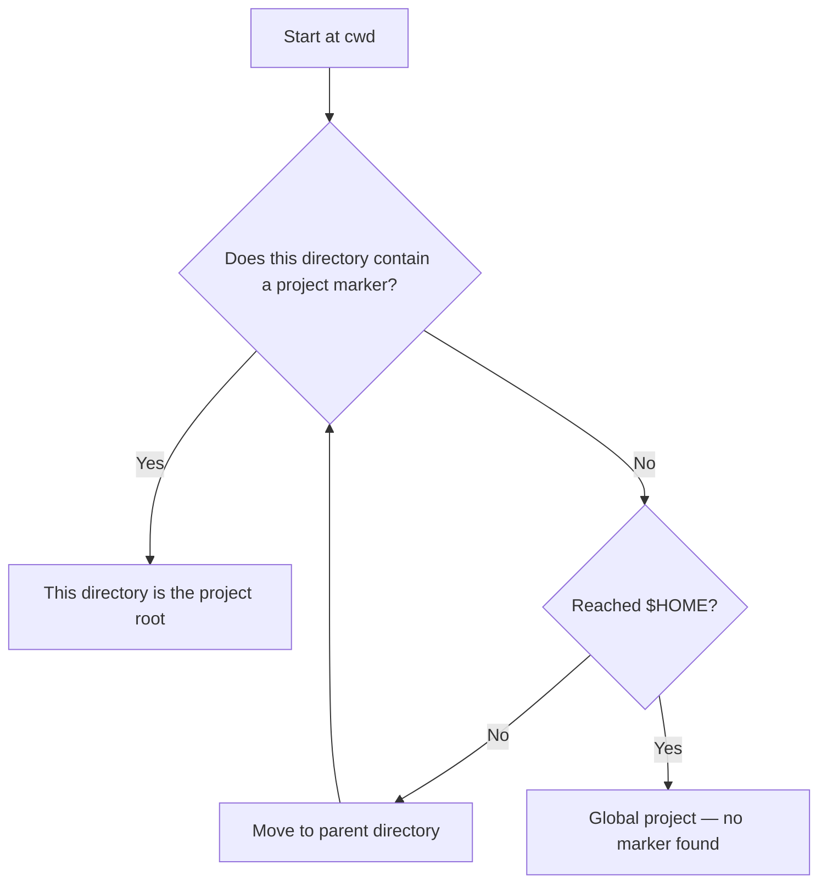

## What is a project?

A project is the unit of memory isolation in kiro-learn. Every event captured and every memory record extracted belongs to exactly one project. Buffers, retrieval, and storage all operate at the project level.

When you work in a repository, kiro-learn detects the project root automatically and assigns all activity to that project. When you switch to a different repository, you get a completely separate memory space — no cross-contamination between projects.

This means:

- **Buffers** are per-project NDJSON files, so extraction processes each project independently.
- **Retrieval** only returns memories from the current project.
- **Multiple agents** (CLI, IDE, parallel sessions) working in the same directory share the same project memory automatically.

## How project detection works

When a shim fires (on prompt submit, tool use, or agent stop), it needs to determine which project the event belongs to. It does this with an **upward marker walk** from the current working directory.

The algorithm:

1. Resolve the current working directory (following symlinks).
2. Resolve `$HOME` as the walk ceiling.
3. Starting at cwd, check if any of the project markers exist in the current directory.
4. If a marker is found, that directory is the project root. Done.
5. If not, move to the parent directory and repeat.
6. The walk never inspects `$HOME` itself — it stops just below it.
7. If no marker is found before reaching the ceiling, the event belongs to the **global project**.

The nearest directory wins. If your cwd is `/home/alice/work/my-app/src/utils/` and both `/home/alice/work/my-app/` (has `.git`) and `/home/alice/work/` (has `package.json`) contain markers, the walk finds `my-app/` first and stops there.

## Project markers

kiro-learn recognizes these markers, checked in order at each directory:

| Marker | Ecosystem |
|---|---|
| `.kiro` | Kiro IDE workspace |
| `.git` | Git repository |
| `package.json` | Node.js / JavaScript / TypeScript |
| `Cargo.toml` | Rust |
| `pyproject.toml` | Python (modern) |
| `setup.py` | Python (legacy) |
| `go.mod` | Go |
| `pom.xml` | Java (Maven) |
| `build.gradle` | Java / Kotlin (Gradle) |
| `build.gradle.kts` | Kotlin (Gradle KTS) |
| `Gemfile` | Ruby |
| `composer.json` | PHP |
| `mix.exs` | Elixir |
| `deno.json` | Deno |
| `deno.jsonc` | Deno (with comments) |

The order matters only when multiple markers exist in the same directory — the first match in the list wins. In practice this rarely matters because the walk stops at the nearest directory containing *any* marker.

These markers cover the most common project types. The list is intentionally conservative — adding a marker is easy, but removing one would change existing project IDs.

## The global project

When no marker is found before reaching `$HOME`, the event is assigned to the **global project**. The project root becomes `$HOME` itself, and `isGlobal` is set to `true`.

This means all non-project activity from one user collapses into a single shared bucket. If you run kiro-learn from your home directory or from a directory tree with no recognizable project markers, events land in the global bucket.

The global project still works — memories are captured, extracted, and retrieved. But the memories are shared across all non-project sessions, which makes retrieval less precise. For best results, run kiro-learn from inside a project directory.

<Callout type="tip">
  If you're working in a directory that isn't detected as a project, run `kiro-learn init` there. It creates a `.kiro` directory, which is the first marker in the list.
</Callout>

## Project init

Running `kiro-learn init` in a directory does two things for project detection:

1. **Creates the `.kiro` directory** — this is a project marker, so future sessions in this directory (or any subdirectory) will be detected as belonging to this project.
2. **Writes hook files and agent configs** — these wire up the shims so events are captured automatically.

The installer uses the same marker walk to detect scope. If it finds an existing project root, it installs hooks there. If not, the `.kiro` directory it creates *becomes* the project root.

## How the project ID is derived

Once the project root is detected, kiro-learn derives a deterministic **project ID**:

- **`project_id`** = hex SHA-256 hash of the resolved project root path.

This ID is stamped on every event and used to scope all queries. Two developers working in the same repository on the same machine get different project scopes (different OS usernames), so their memories are isolated.

The project root path is also stored verbatim on each event as `source.project_path` — the human-readable version of what got hashed into the project ID.

## Multiple agents sharing project memory

Because the project ID is derived deterministically from the filesystem path and username, all agents that run in the same project directory share the same memory:

- **Kiro CLI** sessions use the CLI shim, which detects the project root from stdin's working directory.
- **Kiro IDE** sessions use the IDE shim, which detects the project root from `process.cwd()`.
- **MCP tools** derive the project ID using the same algorithm.
- **Parallel sessions** in the same project all write to and read from the same memory pool.

This is by design. If you start a CLI session and an IDE session in the same project, both contribute to and benefit from the same memory.

## Related pages

<CardGroup cols={2}>
  <Card title="Event buffer" href="/concepts/event-buffer">
    How per-project buffers stage events for extraction
  </Card>
  <Card title="Kiro CLI shim" href="/architecture/kiro-cli-shim">
    How the CLI shim detects the project from stdin
  </Card>
  <Card title="Kiro IDE shim" href="/architecture/kiro-ide-shim">
    How the IDE shim detects the project from cwd
  </Card>
  <Card title="Collector" href="/architecture/collector">
    How events are scoped and stored per project
  </Card>
</CardGroup>
